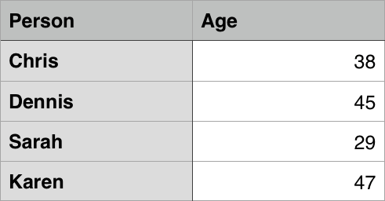

# JavaScript 艺术之旅

---


---

[TOC]

# 第二章 启程

------


## 千里之行，始于足下·Hello world

------

你可能曾有过学习编程语言的打算，但是最艰难的恐怕就是那关键的第一步吧——如何上手？要做什么，才能做好写下第一行代码的准备，又该怎样让它成为一个精巧的“程序”呢？事实上，当你读完本章后，你恐怕就不会再有这样的迷惑了。

因为，我们将要学习的是这种可以在**任何地方**运行的编程语言——JavaScript！从每一台桌面或移动设备的浏览器，到服务器和多媒体领域，甚至嵌入式和正逐步成为现实的物联网。事实上，JavaScript 是如此地容易上手和学习，因为踏出第一步便如此简单：如我所说，JavaScript 是一种可以在浏览器上运行的编程语言。你只需要准备一个好用的现代浏览器，诸如 Google Chrome ，Mozilla Firefox 或 Microsoft Edge 等。我们将会用非常多的时间与浏览器打交道，因此，选择一个适合的浏览器，将会使我们的学习之路变得得心应手且愉快顺利。

编写和运行 JavaScript 代码最简单的方式是在浏览器地址栏中。是的，就是那个用于输入网址以便你去到因特网的任何地方的地址栏。如图所示：


我所使用的是运行在 Microsoft Windows 10 上的 Google Chrome 浏览器，如果你的浏览器类型或版本与我不同，可能会呈现出不一样的外观。这是没关系的。当然，为了我们接下来的愉快旅程考虑——使用一些 Chrome 或 Firefox 之类的**流行**浏览器会得到更一致的操作体验，更好的兼容性（关于兼容性的问题我们会在第八章详细谈到）。最重要的是，我们所学习的 JavaScript 语言遵循一个2015年正式发布的国际标准：ECMAScript 6。如果您的浏览器版本较低或“*没有跟上时代的步伐*”，将不能很好地运行我们所写的代码。这非常令人不愉快。无论如何，**请不要使用 Internet Explorer**。

回到正题。我们在浏览器地址栏中这样一句代码： `javascript:alert("Hello world")`，接下来按下 Enter 键，会发生什么有趣的事情呢？

看！一个弹出来的窗口！上面写着 Hello world 。我们已经成功运行了第一个 JavaScript 程序。


Hello world 上方的“cn.bing.com”指我输入这行代码时页面所处的域名，你的应该会和我不一样。不必在意这个。

现在来分析一下这一行最简单的 JavaScript 代码：

```javascript
javascript:alert("Hello world")
```

前面的 ```javascript: ```标记是告诉浏览器把随后的文本当做 JavaScript 代码来执行，而不是一个网址或搜索内容。它只是一个说明性的标记，不是 JavaScript 语言所规定的。

其后的 ```alert``` 代表一个名为 ```alert``` 的函数。函数可以用来做一些事情，你只需要用它们的名字来召唤它。例如， ```alert``` 这个函数的作用是使浏览器弹出一个对话框，在上面显示一些信息。我们将会在第五章中详细讨论函数。

```(``` 和 ```)``` 两个括号表示使用 ```alert``` 这个函数，它们像一个大嘴巴，里面装着喂给函数的东西，这对小括号承担了*调用函数*的作用，因此称为*函数调用运算符*。其中包含的 ```"Hello world"``` 是一个*字符串*，它被函数调用运算符包住了，会被喂给 ```alert``` 函数。```alert``` 函数得到了 ```"Hello world"``` 这个字符串值，便会使浏览器弹出一个对话框，对话框的信息内容是我们传入的 ```"Hello world"``` 这个字符串。包裹```Hello world```的双引号是一对*字符串标记*，这个字符串的实际内容是双引号之间的内容。

输入之后，按一下 Enter，这行代码便被浏览器运行了。就是这样！

现在我们已经了解了这行最简单的 JavaScript 代码的结构与作用，现在我们可以做一点小练习，复习我们刚才所讨论的东西。

------

**练习 2.1**

1. 在浏览器地址栏中输入并运行以下代码：

   ```javascript
   javascript:alert(1 + 1 + 1 + 1)
   ```

2. 在浏览器地址栏中输入并运行以下代码：

   ```javascript
   javascript:alert("1" + "1" + "1" + "1")
   ```

3. 观察运行结果，试猜想为什么会这样。

------


显然，我们不可能一直呆在浏览器地址栏中。我们总不可能在浏览器地址栏中写出一个“愤怒的小鸟”游戏，也不可能写出一个 QQ 或者微信。有个地方可以让我们更加方便地编写和运行 JavaScript 代码，它的链接如下：

https://art-book.github.io/runner

在这个代码输入框里，你可以这样输入 Hello world 代码：

```javascript
alert("Hello world");
```

点击运行按钮，会得到与刚才相同的效果。


嘿，你注意到了吗：我们写的是 ```alert("Hello world");```，后面多了一个分号！

分号表示一个语句的结尾，刚才我们写下的 ```alert("Hello world");``` 是一个独立的语句，需要用分号来结束。

你已经了解了编写 JavaScript 代码的基本感觉，现在让我们来尝试一些简单有趣的代码片段，在这个 JavaScript 运行器中好好玩耍！

```javascript
alert("你的骰子点数是" + Math.ceil(Math.random() * 6));
```

1）这行代码每次运行都会得到一个位于 1 和 6 之间的不一样的骰子点数。

```javascript
alert(new Date());
```

2）这行代码会以 ISO 标准格式显示当前时间。

```javascript
alert(+prompt() % 2 ? "奇数" : "偶数");
```

3）这行代码会弹出一个输入框，并判断你所输入的数字是奇数还是偶数。它过于简单了，如果不是数字，它也会显示“偶数”。

```javascript
document.body.style.backgroundColor = "pink";
```

4）这行代码会把运行器页面背景调成粉色。

```javascript
document.getElementById("head").innerHTML = "Hello World";
```

5）这行代码会把标题栏的内容改成 “Hello World”。

```javascript
document.getElementById("run").onclick = () => alert("Hi");
```

6）这行代码会更改运行按钮的行为。当你再次点击运行按钮时，它不会再执行其它代码，而是弹出一个 “Hi” 的对话框。刷新浏览器页面即可恢复原来的样子。·

------

**练习 2.2**

1. 尝试将运行器的页面背景改为其他颜色。总共成功尝试了几种颜色？
2. 尝试把代码 1 进行扩展，把点数可能的范围扩大到1-30 。
3. 结合代码 3 和 代码 5，尝试把运行器按钮的背景颜色调成绿色。

------


## 辟自鸿蒙·表达式与值

------

从最初有理性的记忆里，我们便与表达式打交道。小时候我们在数学课上称为“算式”的东西，就是一种表达式。$$1 + 1 = 2$$ 这样的算式，与我们最初理解的现实世界的概念相伴而生，与物体的颜色、形状、名字一道，扎根在每个人最深层的理性思维中。有一个苹果，又得到了一个苹果，那么我们有两个苹果——这是我们对这种来自于现实而又超脱于一切现实事物的人类智慧的最初印象，从最简单的算术开始，一点一点窥见数学这一人类智慧的曙光。人们把这种纯粹、不掺杂一点杂念的智慧带进了计算机最根本的生命中。

人们问，$$1 + 1 = $$ ？，然后电子管和继电器所组成的巨大机器便开始轰鸣运作，渐渐就能解答人们越来越复杂的问题。人类有关数学的理想，在用晦涩的低级程序语言编写以前，是怎样表达的？是数学表达式。很多年以后，在 JavaScript 这样的高级编程语言中，人们可以直接写下数学表达式，刹那间便可以从计算机那里得到答案。

```javascript
alert(1 + 1);
```

我们知道了答案：$$2$$。不需要有任何等待，一切都在电光火石中进行着。

为了让计算机中所蕴含的人类智慧不被如此简单的问题小觑，我们可以来个更难的：

$$(147 + 258) × 369 - (550 + 233) ÷ 29$$

在 JavaScript 中，这个数学表达式将以略微不同的方式被写下，然后用 `alert` 输出答案。

```javascript
alert((147 + 258) * 369 - (550 + 233) / 29);
```

答案是 $$149418$$。计算机不会让我们失望。

这个表达式被包裹在 `alert` 函数和一对小括号中。加号 `+`，减号 `-`，小括号 `( )` 都是本来的意思。`*` 负责在 JavaScript 中进行乘法运算，`/` 负责除法。这些标点符号被称为**运算符（Operator）**，负责执行各类算术运算。

------

Note：

为什么 JavaScript 的乘号和除号，与它们在日常生活中所使用的的形式不同？

一个简单的答案是因为你的键盘上没有所谓的乘号（$$\times$$）与除号（$$\div$$），而键盘布局的历史需要读者自行查阅资料。

几十年最初使用键盘进行编程的程序员们脑洞大开，将星号（`*`）作为乘号使用。而使用斜杠作为除号的原因还有一个：在数学中，除法还可以用分数的形式表示，所以这个斜杠其实就是横着写的分数线——左侧的被除数相当于分子，右侧的除数也就相当于分母。

------

常见的 JavaScript 数学运算符有以下几种。

| 符号  | 运算           |
| ----- | -------------- |
| `+`   | 加法           |
| `-`   | 减法或取相反数 |
| `*`   | 乘法           |
| `/`   | 除法           |
| `%`   | 求整除后的余数 |
| `**`  | 乘方           |
| `( )` | 改变优先级     |

如果没有 `alert` 函数来输出，计算仍然会进行，会算出一个结果，然后这个结果就被丢弃到了虚空中。为了让我们的眼睛能看见，`alert` 函数就担负了输出信息的作用，虽然它更常见的用途是输出一段警告信息。

我们可以编写并运行以下程序，重温小学数学课上的感觉。

```javascript
alert(18 + 14 * 5);
alert(24 - 112);
alert(1 / 3);
alert(-10 * 15);
alert(Math.PI);
alert(0xf + 1);
alert(20 % 8);
alert(20 ** 3);
```

其中，`Math.PI` 是一个预定义的值，它表示圆周率 $π$ 近似值；最后一行代码中的 `0xf` 是一个*十六进制数*，它的值就是 `16`，我们会在第三章讲到它。

人们说，计算机不但要拥有人类的理性，还要有人类的情感，于是人类文字就以某种精巧的方式就进入了计算机的生命。我们需要某种优雅的方式，向计算机吐露我们的心声，计算机的答案也要以更优雅、合乎我们思维的方式让我们知晓，于是一种叫**字符串**的东西诞生了，它是人类文字的载体，让人类以自己熟悉的方式写下话语并传达给计算机和未来的读者成为可能。

我们也可以用 `+` 符号来拼接两段文本，使它成为我们想要的形式。如：

```javascript
alert("Hello " + "world");
alert("我今年" + 120 + "岁了！");
alert("十六进制数 0xefef 的值是" + 0xefef);
```

另外，在 JavaScript 中，`alert(xxx)` 这样的*函数调用*也是表达式，像其它的一样，它也会得到一个值。`alert()` 得到的是 `undefined`，我们会在后面的章节中慢慢了解。

我们已经初步了解了 JavaScript 中的表达式，接下来的我们将学到给值命名的技巧，这样我们就可以把表达式的值存放起来，需要的时候再用。


## 请叫阮的名·命名的值

------

### 变量与常量

人类发明了各种各样的容器来盛放东西，而 JavaScript 的世界也有容器，用来存放表达式的值。这种容器，叫变量。

**变量**

在 JavaScript 中，我们可以使用*变量*来存放一个值，这个值随时可以被改变。变量的定义像下面这样：

```javascript
 let a;
 a = 10;
```

我们使用关键字 `let` 来表示一个变量声明的开始。`let a` 会产生一个名为 `a` 的变量，我们将这一步叫做**变量声明**，随后的 `a = 10;` 会把 10 这个值放进变量 `a` 中，这个过程叫**赋值**。

变量声明与赋值是两个过程，一个变量只能被声明一次，但是可以被多次赋值。正如它的名称所示，它的值是可以变的。第一次的声明与赋值可以被写到一行语句中：

```javascript
let a = 10;
```

我们可以像这样改变它的值：

```javascript
a = 100;
a = 12 * 3 + 20;
a = "Hello world";
```

为变量赋值之后，我们可以像通常的表达式那样使用它：

```javascript
let a = 10;
alert(a);
a = a + 1;
alert(a);
alert(a + 2);
```

显示的结果分别为 10,11 和 13。

假如我们使用了一个从未出现的变量，会产生一个错误：


如果我们已经给 `hahaha` 赋值，那么可以使用它，不会产生错误，但是我们非常不推荐这种做法，使用变量前一定要记得声明。


如果你早就已经接触了 JavaScript，你或许曾在别的地方见过另一种声明变量的方式：

```javascript
var a = 10;
```

`var` 关键字是 JavaScript 曾经使用的变量声明方式，但是这种方式存在一些缺陷，在2015年发布的新标准中被 `let` 所取代，一些细节我们会在后面谈到。我们理解它的含义即可，不建议使用它。

**常量**

顾名思义，*常量*与变量类似，但是它的值是不可改变的。也就是说，只能赋值一次，之后如果尝试改变它的值，会产生一个错误。


第一次调用 `alert` 会正常显示 `name` 的值 `"Jim"` 。随后的赋值语句会带来如图所示的错误，并中断代码的执行，因此最后一行语句不会被执行。

常量的使用场景一般是强制某些不应改变的值**不可改变**，可以避免失误造成原有值被覆盖的情况。为了带来明显的视觉效果以与通常的变量区分，我们一般会使用大写字母来书写常量名称，并使用下划线“_”来连接常量名中包含的单词。

```javascript
const MY_BIRTHDAY = "2005-2-6";
alert(MY_BIRTHDAY);
```

**标识符**

JavaScript 中的变量名或常量名必须是合法的*标识符*。一个合法的标识符应当以以下字符开头：

```
A B C D E F G H I J K L M N O P Q R S T U V W X Y Z
a b c d e f g h i j k l m n o p q r s t u v w x v z $ _
```

即二十六个英文大小写字母以及美元符号和下划线。

而其后跟随的字符可以是：

```
A B C D E F G H I J K L M N O P Q R S T U V W X Y Z
a b c d e f g h i j k l m n o p q r s t u v w x v z $ _
0 1 2 3 4 5 6 7 8 9
```

即二十六个英文大小写字母、美元符号、下划线和十个阿拉伯数字。

除此之外的字符原则上可以使用，但是容易造成难以预料的错误。我们不推荐使用。关于 JavaScript 中的字符，我们将在第三章详细了解。

一个合法的标识符不能与已有的保留字发生冲突。保留字一些 JavaScript 语言内预留的、具有特殊含义的单词，如果你使用它们作为标识符，会产生语法错误。

------

|            |             |              |             |                |
| :--------: | :---------: | :----------: | :---------: | :------------: |
| `abstract` | `arguments` |  `boolean`   |   `break`   |      byte      |
|   `case`   |   `catch`   |    `char`    |   `class`   |     const      |
| `continue` | `debugger`  |  `default`   |  `delete`   |      `do`      |
| ` double`  |   `else`    |    `enum`    |   `eval`    |    `export`    |
| `extends`  |   `false`   |   `final`    |  `finally`  |    `float`     |
|   `for`    | `function`  |    `goto`    |    `if`     |  `implements`  |
|  `import`  |    `in`     | `instanceof` |    `int`    |  `interface`   |
|   `let`    |   `long`    |   `native`   |    `new`    |     `null`     |
| `package`  |  `private`  | `protected`  |  `public`   |    `return`    |
|  `short`   |  `static`   |   `super`    |  `switch`   | `synchronized` |
|   `this`   |   `throw`   |   `throws`   | `transient` |     `true`     |
|   `try`    |  `typeof`   |    `var`     |   `void`    |   `volatile`   |
|  `while`   |   `with`    |   `yield`    |             |                |

除此之外，有一些 JavaScript 中预定义的函数、常量等也不应当被用作标识符，包括 `Object` `Ininity` `undefined` `isNaN` 等。


## 听风知雨·更进一步

------

### 输入与输出

提供输入与输出数据的功能，是任何一种编程语言的基本设施。试想一下，假如我们的程序无法使用输入输出的功能——确切地说，无法与外界进行数据交换，那么它能做什么呢？什么也做不了！它也许可以静静地计算一个表达式的值，可以执行一个循环与条件判断，但是我们将始终无从得知它的最终工作，这个程序也就不会有存在的意义。输入与输出非常重要，也充满灵活性。

JavaScript 的语言标准（即 ECMAScript）并没有规定用于输入与输出的方式。浏览器为我们提供了两个简单的函数：`alert` 和 `prompt` ，以便进行基本的信息输出和输入。


**`alert` 和 `prompt`**

`alert` 我们已经见过很多次了。当我们简单地想要输出一条信息，比如显示一条表达式的计算结果，或者干其他的什么事情，我们可以使用它。在实际应用中我们有更复杂和标准的信息输出方式，但是现在我们使用 `alert` 就足以满足我们需要了。

`prompt` 这个函数我们已经在前面的代码示例中见过了，它可以弹出一个对话框，要求用户输入一点内容，然后得到这个内容，它的使用形式如下：

`let xxx = prompt();`

变量 `xxx` 中存放的就是我们获取到的内容。

但是它弹出的对话框什么提示也没有，只有一个简单的输入框。试想一下，假如别人使用你的程序，突然就看到这么一个框，什么也没有提示，会觉得丈二和尚摸不着头脑，对吧？更有可能，我们想要一个表示年龄的数字，用户却稀里糊涂地输入了一个手机号码。

我们可以给 `prompt` 的对话框加一条简单的提示语，来表明我们要干的事情，像这样：

`let xxx = prompt("请输入你的年龄：");`

这是使用 `prompt` 函数的另一种形式，变量 `xxx` 即是我们获取到的内容。


我们可以用一些简单的示例来尝试我们刚刚了解到的东西：

```javascript
alert("我们将收集您的身高数据以计算您的标准体重。");
let height = parseFloat(prompt("请输入您的身高（单位：厘米）："));
let weight = (height - 100) * 0.9;
alert("您的标准体重是：" + weight);
```

其中 `parseFloat` 函数会从文本中获取一个数字，将在第三章讲到。

你可以自己试着测测你的标准体重哦！


这是另一个实用性的例子，更好地练习我们刚刚所学内容：

```javascript
// 计算圆的面积与周长。
let r = parseFloat(prompt("请输入圆的半径："));
alert("圆的面积是：" + r * r * Math.PI);
alert("圆的周长是：" + r * 2 * Math.PI);
```


### 注释

在编写 JavaScript 代码时，你可以在代码周围插入一些说明性的文字，它们被称为*注释*。

以下是一个在代码中应用注释的例子：

```javascript
let a = +prompt(); // 获取第一个数字
let b = +prompt(); // 获取第二个数字
alert(a + b) // 计算并展示 a + b 的值
```

在代码中， `//` 标记被用于说明一个*单行注释*的开始。它意味着之后的整一行代码都会被忽略掉，因此你可以在里面写上任何东西，当然更多情况下我们只是用于说明该行代码的功能。

假如我们需要写很多行东西来解释和说明我们的代码，或者是充当一个临时备忘录，我们可以相应地使用*多行注释*，如下所示：

```javascript
/* 交换两个变量的值。
作者：杨雨露
日期：2019-3-19
备注：无
*/
let a = prompt();
let b = prompt();
let temp = a;
a = b;
b = temp;
alert("a = " + a + ", b = " + b);
```

在一对 `/*` 与 `*/` 之间的所有东西都会被忽略掉，同样，你可以在里面写上任何东西。从第一个 `/*` 开始，一旦遇到一个 `*/` ，就意味着注释内容已经结束了，其后如果再出现单独的 `*/` ，就会被认为是一个语法错误。

如下所示：

```javascript
/* 第一行注释
第二行注释
/* 第三行注释（这行开头的 /* 同样会被忽略）
第四行注释
现在多行注释结束了： */ 

*/ // 嘿，多余的 */ 会被当成语法错误！
```

**` //` 注释用于一行里的注释，`/* */` 注释用于一段完整的注释。**


## 互联网的礼服·HTML

------

### 初识 HTML

我们已经初步接触了 JavaScript 中的表达式、值、变量、常量、输入输出等一系列最基本的内容，现在让我们把目光从运行器暂时移开，为将来的长远发展做打算。

如前文所说，JavaScript 是一种运行在浏览器中的编程语言。假如离开了这个运行器，它究竟是怎样运行的呢？我们该做些什么呢？

讨论这个之前，让我们先了解一下 HTML（HyperText Markup Language，超文本标记语言）的概念。

HTML 是你所看到的每一个 Web 页面的原始形式。浏览器将获得的 HTML 代码进行处理，就成了你上网时浏览到的每一行文字、每一张图片、每一个链接，每一个按钮、菜单、输入框。现在我们来编写一个最简单的 HTML 文档。

```html
<!DOCTYPE html>
<html>
    <head>
        <meta charset="utf-8" />
        <title>Hello world</title>
    </head>
    <body>
        <p>Hello world</p>
    </body>
</html>
```

我们将这个文档的内容保存一个文本文件里，可以叫它 `hello.html`，并尝试双击它，或者将它拖到浏览器窗口里。浏览器会显示以下画面：


看，来自我们的问候，被浏览器显示在了屏幕上。成功了！这个最简单的 HTML 的事情就是告诉浏览器：我们要将 `Hello world` 这行文本显示在屏幕上。就这么简单！那么我们刚刚写下的东西，与我们看到的问候之间，究竟有什么关系呢？不妨再来看看这个文档的内容。

首先，第一行 `<!DOCTYPE html>` 被称为 *DTD 标记*。它的作用是告诉浏览器：我们这个文档遵循最新的 HTML 5 标准，这样我们就可以享受一些便利。其后的 `<html>` 是一个*标签*，而最后一行的 `</html>` 则是一个*闭合标签*。相对地，`<html>` 被称为*开放标签*。`<html>` 和 `</html>` 是一个 HTML 文档的*根元素*，这对元素中包含了整个 HTML 文档的实际内容。

第三行的 `<head>` 与 `<html>` 标签类似，它也有一个闭合标签 `</head>`。`<head>` 被称为*头元素*，用于说明文档的一些基本信息。这个文档的头元素中包含了两行内容：

- `<meta charset="utf-8" />` ，它告诉浏览器这个文档应该根据 UTF-8 编码方式被解析。我们将在第三章了解编码方式的相关内容。它是一个*孤立标签*，因此我们把斜杠 `/` 写在它的后面。
- `<title>Hello world</title>` 将浏览器顶部的页面标题更改为 Hello world，这样我们在浏览多个页面的时候，就会知道每个标签页是什么内容。

`<head>` 标签后的 `<body>` 标签包含了我们实际看见的页面内容，在这里写下的任何东西，都会以某种方式被浏览器呈现出来。我们不需要显示其他什么东西，因此我们就添加了一个*段落*，内容是 Hello world，用一对 `<p>` 标签包裹起来。


------

Story：

1980年，物理学家蒂姆·伯纳斯-李在欧洲核子研究中心（CERN）在承包工程期间，为使 CERN 的研究人员使用并共享文档，他提出并创建原型系统 ENQUIRE。1989年，伯纳斯-李在一份备忘录中提出一个基于互联网的超文本系统。他规定HTML 并在 1990 年底写出浏览器和服务器软件。同年，伯纳斯-李与 CERN 的数据系统工程师罗伯特·卡里奥联合为项目申请资助，但未被 CERN 正式批准。在他的个人笔记中，伯纳斯-李列举“一些使用超文本的领域”，并把网络百科全书列为首位。

HTML 的首个公开描述出现于一个名为“HTML 标签”的文件中，由蒂姆·伯纳斯-李于 1991 年底提及。它描述 18 个元素，包括 HTML 初始的、相对简单的设计。除了超链接标签外，其他设计都深受 CERN 内部一个以标准通用标记语言（SGML）为基础的文件格式 SGMLguid 的影响。这些元素在 HTML 4 中仍有 11 个存在。

伯纳斯-李认为 HTML 是 SGML 的一个应用。1993年中期互联网工程任务组（IETF）发布首个 HTML 规范的提案：“超文本标记语言（HTML）”互联网草案，由伯纳斯-李与丹·康纳利撰写。其中包括一个 SGML 文档类型定义来定义语法。草案于 6 个月后过期，但是它带来了由 Masaic 创造的在页面上显示图片的特性。同时，戴夫·拉格特在 1993 年末提出的与之竞争的互联网草案“HTML+（超文本标记格式）”，最终引入了诸如表格与填写表单的功能。

在 HTML 和 HTML+ 的草案于 1994 年初到期后，IETF 创建了一个 HTML 工作组，并在 1995 年完成“HTML 2.0”，这是第一个旨在成为对其后续实现标准的依据的 HTML 规范。

在 IETF 的主持下，HTML 标准的进一步发展因竞争利益而遭受停滞。自 1996 年起，HTML 规范一直由万维网联盟（W3C）维护，并由商业软件厂商出资支持。不过在 2000 年，HTML 也成为国际标准（ISO/ IEC 15445：2000）。HTML 4.01 于1 999 年末发布，进一步的勘误版本于 2001 年发布。2004 年，网页超文本应用技术工作小组（WHATWG）开始开发 HTML 5，并在 2008 年与 W3C 共同交付，2014 年 10 月 28 日完成标准化。

------


### 表格

表格是由行和列组成的*结构化数据集*，能够使我们简便迅捷地查找某个值的位置或是一组值的某种关系，例如姓名与年龄的对应关系、学校课程表、游泳池的时刻表等。



> 图片来源：https://mdn.mozillademos.org/files/14583/numbers-table.png，Mozilla Developer Network


> 图片来源：https://mdn.mozillademos.org/files/14587/swimming-timetable.png，Mozilla Developer Network

表格在人类社会中很常见，而且已经存在很长时间了，下面这张 1800 年美国的人口普查表就足以反映。


> 图片来源：https://mdn.mozillademos.org/files/14585/1800-census.jpg，Mozilla Developer Network

常见的文档处理程序，如 Microsoft Office Word 等，都提供了电子表格的支持，HTML 也拥有一套方法来处理和呈现 Web 上表格形式的数据。

表格的一大特点是**严格**，通过在行和列的标题之间进行*视觉关联*的方法，使大量信息得以被快速有效地解读与判断。我们观察如下表格，当我们要快速查询特定的单复数、人称、性别所对应的人称时，表格的结构化就提供了极大地便利。

<table>
<tbody>
  <tr>
   <th colspan="3"></th>
   <th scope="col">Subject</th>
   <th scope="col">Object</th>
  </tr>
  <tr>
   <th rowspan="5" scope="rowgroup">单数</th>
   <th colspan="2" scope="row">第一人称</th>
   <td>I</td>
   <td>me</td>
  </tr>
  <tr>
   <th colspan="2" scope="row">第二人称</th>
   <td>you</td>
   <td>you</td>
  </tr>
  <tr>
   <th rowspan="3" scope="rowgroup">第三人称</th>
   <th class="symbol" scope="row">♂</th>
   <td>he</td>
   <td>him</td>
  </tr>
  <tr>
   <th class="symbol" scope="row">♀</th>
   <td>she</td>
   <td>her</td>
  </tr>
  <tr>
   <th class="symbol" scope="row">other</th>
   <td>it</td>
   <td>it</td>
  </tr>
  <tr>
   <th rowspan="3" scope="rowgroup">复数</th>
   <th colspan="2" scope="row">第一人称</th>
   <td>we</td>
   <td>us</td>
  </tr>
  <tr>
   <th colspan="2" scope="row">第二人称</th>
   <td>you</td>
   <td>you</td>
  </tr>
  <tr>
   <th colspan="2" scope="row">第三人称</th>
   <td>they</td>
   <td>them</td>
  </tr>
</tbody>
</table>

表格在信息技术领域所承担的重要作用超越了本书的范围。除了文字处理程序提供的便捷的表格操作，在 HTML 里纯手工“画”一个表格也并非什么难事。下面，我们将动手创建一个可爱的 HTML 表格。

- 所有的表格都包含在 `<table></table>` 这对标签中，我们首先在 HTML 源代码里添加这些内容。

- 我们知道，表格是由一个个单元格构成的。一个单元格就是一对 `<td></td>` 标签，其中包含单元格将会呈现的内容。我们把下面的内容添加到 `<table>` 标签内。

  ```html
  <td>你好！我是第一个单元格~</td>
  ```

  如果我们想要一行四个单元格，我们需要把这组标签复制三次。

  ```html
  <td>你好！我是第一个单元格~</td>
  <td>我是第二个单元格</td>
  <td>我是第三个单元格</td>
  <td>我是第四个单元格</td>
  ```

  四个单元格呈现出这样的效果：

  

  你会看到, 单元格不会放置在彼此的下方, 而是自动与同一行上的其他单元格对齐. 每个 `<td>` 元素 创建一个单独单元格，它们共同组成了第一行。同时，表格并没有呈现出我们通常所见的分隔线。在后续的章节中，我们将了解到如何使用*样式*，来使表格看起来更像是“经典”的表格。

- 如果想停止在这一行添加单元格，并开启新的一行，我们需要使用 `<tr>` 元素。

  1. 把已经创建好的 4 个单元格放入 `<tr>` 标签， 就像这样：

     ```html
     <tr>
         <td>你好！我是第一个单元格~</td>
         <td>我是第二个单元格</td>
         <td>我是第三个单元格</td>
         <td>我是第四个单元格</td>
     </tr>
     ```

  2. 现在我们已经拥有了完整的一行，可以继续增加至两行、三行。每一行都需要包裹在专属的 `<tr>` 标签中，`<tr>` 标签内只能存放 `<td>` 单元格。

  3. 我们得到了一个类似这样的表格：

  | 你好！我是第一个单元格~ | 我是第二个单元格 | 我是第三个单元格 | 我是第四个单元格 |
  | ----------------------- | ---------------- | ---------------- | ---------------- |
  | 第二行第一个单元格      | 呜呜呜           | 好寂寞           | 谁来陪我鸭       |

   而实际呈现的效果大致是如下：

  

- 现在，让我们把注意力转向表格标题，表格中的标题是特殊的单元格，通常在行或列的开始处，定义行或列包含的数据类别。我们可以看一下这个例子（来自 Mozilla Developer Network）：

```html
<table>
  <tr>
    <td> </td>
    <td>Knocky</td>
    <td>Flor</td>
    <td>Ella</td>
    <td>Juan</td>
  </tr>
  <tr>
    <td>Breed</td>
    <td>Jack Russell</td>
    <td>Poodle</td>
    <td>Streetdog</td>
    <td>Cocker Spaniel</td>
  </tr>
  <tr>
    <td>Age</td>
    <td>16</td>
    <td>9</td>
    <td>10</td>
    <td>5</td>
  </tr>
  <tr>
    <td>Owner</td>
    <td>Mother-in-law</td>
    <td>Me</td>
    <td>Me</td>
    <td>Sister-in-law</td>
  </tr>
  <tr>
    <td>Eating Habits</td>
    <td>Eats everyone's leftovers</td>
    <td>Nibbles at food</td>
    <td>Hearty eater</td>
    <td>Will eat till he explodes</td>
  </tr>
</table>
```

以上源代码大致呈现出这样的效果：

|               | Knocky                    | Flor            | Ella         | Juan                      |
| ------------- | ------------------------- | --------------- | ------------ | ------------------------- |
| Breed         | Jack Russell              | Poodle          | Streetdog    | Cocker Spaniel            |
| Age           | 16                        | 9               | 10           | 5                         |
| Owner         | Mother-in-law             | Me              | Me           | Sister-in-law             |
| Eating Habits | Eats everyone's leftovers | Nibbles at food | Hearty eater | Will eat till he explodes |

我们也可以使用专门的 `<th>` 标签来定义表格标题。

------

Note：

`<table>`、`<td>`、`<tr>`、`<th>` 这些标签都是什么意思？

`table` 在英语中除了有桌子的含义，也用于指代表格。

`td` 是*表格数据*（table data）的缩写。

`tr` 是*表格行*（table raw）的缩写。

`th` 是*表格标题*（table header）的缩写。

------


# 第三章 数据

------


## 逻辑

------

### 布尔值

小的时候，我们认为一张白纸只有两面，一个人只有好人坏人的区别，这个世界只有黑白两种颜色，说的话只有真假之分。现在，我们也可以说：逻辑——所有的逻辑，本质上都是一个靠真与假驱动的世界。真，则一往直前；假，则回归起点。JavaScript 提供了 `true` 来表示所有的“真”，`false` 来表示所有的“假”。他们便是一个真与假的二元世界。`true` 和 `false` 被称为布尔值，用以纪念 19 世纪为逻辑学做出杰出贡献的 George Boole。

在 JavaScript 中，布尔值属于 `boolean` 类型。我们可以直接使用它们来明确地表示真假、是非，也时常会隐藏在一串逻辑表达式中，作为它背后的力量。

```javascript
alert(true);  // true
alert(false); // false
```


### undefined 和 null

先来看四个句子：

杨雨露有个姐姐，她叫杨雨晴。

杨雨露没有姐姐。

杨雨露不知道自己有没有姐姐。

杨雨露有姐姐，但是不知道姐姐在哪。


 JavaScript 为第二种情况提供了 `null`，为第三、四种情况提供了 `undefined`。


`null` 和 `undefined` 是 JavaScript 定义的两个特殊值，分别表示

1. 一个空值。

   这个可能需要一个值，但是明确地知道”这是空的“，用 `null` 来表示空值。

2. 未发现需要的值。

   这个地方不知道有没有值，用 `undefined` 来表示”未定义“。

`null` 是 JavaScript 的*关键字*，如果对它进行声明或赋值操作会产生错误。

```javascript
let null; // SyntaxError: Unexpected token null
null = 1; // ReferenceError: Invalid left-hand side in assignment
```

`undefined` 不是一个明确定义的保留字，如果尝试对它赋值不会产生错误，但它的值也不会改变。

```javascript
alert(undefined); // undefined
undefined = 0;    // 不会产生错误
alert(undefined); // undefined
```

如果对它进行重复声明，则它会被视作一个变量，在声明前会产生一个“变量未定义”的错误，在声明后使用它则会发现它的值已经发生改变。这是一个语言缺陷。

```javascript
alert(undefined); // ReferenceError: undefined is not defined
let undefined = 0;
alert(undefined)； // 0
undefined = 3;
alert(undefined); // 3
```


我们可以使用表达式 `void 0` 来得到最“纯粹”的 `undefined` 值。并且我们也推荐这种方法——它写起来更简短！

```javascript
alert(void 0);    // undefined
undefined = 0;
alert(undefined); // 0
alert(void 0);    // undefined
```


如果我们声明了一个变量却没有给它赋予任何值，那么它的默认值就是 `undefined` ——即“未定义”。

```javascript
let a;
alert(a);  // undefined
```


------

练习 3.1.1

1. 举出生活中可以分别用 `null` 和 `undefined` 描述的例子。
2. 尝试了解在 JavaScript 的创造过程中，`null` 和 `undefined` 分别是怎样出现的。

------


### 逻辑运算

很多人觉得逻辑冰冷而机械死板，正是如此。因此，它才有用。人类易被感情左右，但计算机不同。正是因为冰冷且机械死板，计算机才会一直稳定运行，为我们所用。

逻辑的本质是真与假的组合。在 JavaScript 中，以下值都会被视为“假”：

`false NaN 0 "" '' null undefined`

除了以上的“假”值，其他自然都是“真”值。关于 0 、特殊数值 NaN、字符串的概念将在下文中讲到。

真值都可以被看做 `true`，假值都可以被看做 `false`。这两个布尔值是逻辑的基本组成部分，简单的逻辑自然也可以组合成更复杂的逻辑，这个组合的过程我们称为*逻辑运算*。与、或、非是三个基本的逻辑运算，JavaScript 提供了它们的运算符  `&&`  `||`  和 `！`。这三个运算得到的值与参与运算的值有关，但是得到的还是参与运算的值本身，而不一定是布尔值。


1. **&& （与）**

- 如果两个条件都为 `true`，那么得到 `true`，否则得到 `false`。

它和我们平时说话时“如果……并且……”是类似的，即判断两个条件是否都*成立*，

```javascript
alert(true && false);    // false
alert(true && true);     // true
alert(false && false);   // false
```

很容易理解，对吧！但事实上，`&&` 不一定会得到一个布尔值。它得到的值与用来运算的值有关，如果运算的值不是布尔值，它也不一定得到一个布尔值，而是根据值本身被看做“真”或被看做“假”来决定得到什么值。

它的具体运算方式如下：

- 如果第一个条件被视为 `true`，而第二个条件被视为 `false` ，那么得到第二个条件的值。
- 如果两个条件都被视为 `true`，那么得到第二个条件的值。
- 如果第一个条件被视为 `false`，那么得到第一个条件的值。

示例：

```javascript
alert(0 && true);        // 0
alert(true && 0);        // 0
alert(0 && false);       // 0
alert(false && 0);       // false
alert(100 && 0);         // 0
alert("Hello" && "")     // ""
alert(null && undefined) // null
alert(100 && NaN)        // NaN
```


2. **||（或）**

- 两个条件中只要有一个为 `true`，那么得到 `true`，否则为 `false`。

它和我们平时所说的“如果……或者……”是等价的。

```javascript
alert(true || false);    // true（第一个条件的值）
alert(true || true);     // true（第一个条件的值）
alert(false || false);   // false（第二个条件的值）
```

和 `&&` 类似，`||` 也不一定得到一个布尔值，而是根据它所运算的值被看做“真”还是看做“假”来得到值。

它的具体运算方式如下：

- 如果第一个条件被视为 `true`，那么直接得到第一个条件的值。
- 如果第一个条件被视为`false`，那么得到第二个条件的值。

示例：

```javascript
alert(0 || true);        // true
alert(true || 0);        // true
alert(0 || false);       // false
alert(false || 0);       // 0
alert(100 || 0);         // 100
alert("Hello" || "")     // "Hello"
alert(null || undefined) // undefined
alert(100 || NaN)        // 100
```

换句话说，如果第一个条件为“真”，那么就符合“或”的条件了，不必再判断下一个。如果第一个条件为假，就需要将第二个条件作为整个运算得到的值。


3. **!（非）**

- 如果值为 `true`，那么得到 `false`，否则得到 `true`。

它确实得到一个布尔值，具体运算方式如下：

- 如果条件被视为 `true`，那么得到 `false`。
- 如果条件被视为 `false`，那么得到 `true`。

示例：

```javascript
alert(!true);       // false
alert(!false);      // true
alert(!0);          // true
alert(!100);        // false
alert(!NaN);        // true
alert(!"");         // true
alert(!undefined);  // true
alert(!!0);         // false
alert(!!null);      // true
```

因此，!! 两个非运算重复进行，得到的值就是条件本身的布尔值描述形式，即被看做“真”还是“假”。


**运算符优先级**

当 `&&` `||` `!` 三个运算符同时在一个表达式中，运算过程遵循**操作符优先级**。! 操作符具有最高的优先级，即在一个表达式中它所属的式子总是被最先计算，其次是 `&&`，`||` 的优先级最低。

```javascript
alert(10 && !5);           // false
alert(!5 && 10);           // false
alert(!5 || 6 && 7);       // 7
alert(5 || 6 && 7 || 8);   // 5
alert(5 && 6 || 7 && 8);   // 6
alert(!5 || !6 || 7 && 8); // 8
```

在第三行代码中：

1. `!5` 由于具有最高的优先级，被最先计算。由于它是 `false`，且是 `||` 的第一个条件，因此会继续计算位于 `||` 右侧的第二个条件。
2. 由于 `&&` 的优先级大于 `||` ，因此会计算 `6 && 7`，结果为 `7`，那么 `||` 的第二个条件就是 `7`。
3. 因此整个逻辑表达式的结果就是 7。

在第四行代码中：

1. 5 被视作 `true`, 因此 || 运算符不会查看第二个条件。
2. 结果为 5。

在第五行代码中，首先从左往右运算，`5 && 6` 的值为 6，则 `||` 的第一个条件为 6，最后结果为 6。

在第六行代码中：

1. !5 为 `false`，`||` 运算符会查看第二个条件。
2. 由于 ! 具有最高的优先级，!6 会先得到计算，结果为 `false`。
3. 那么 `!5 || !6` 的值为 `false`。
4. 第二个 `||` 操作符会查看右边的条件。
5. 由于 `&&` 的优先级大于 `||` ，会先计算 `7 && 8` 的值，值为 `8`。
6. 那么右边的条件为 8。
7. `false || 8` 的值为 8。

在实际应用中，我们可以使用括号 `(` `)` 来更改默认的运算符优先级。使用了括号的示例如下：

```javascript
alert((5 || 6) && (7 || 8));   // 8
alert(5 && (6 || 7) && 8);     // 8
alert(5 && 6 && (7 && 8));     // 8
```


一个操作符后使用括号括起来的内容是一个整体，会先计算括号中表达式的值，这个值作为该操作符的条件进行下一步计算。因此，在第一行代码中：

1. `(5 || 6)` 作为一个整体会被计算，值为 6。
2. 6 成为了 `&&` 的第一个条件。`&&` 会查看第二个条件。
3. 第二个条件是 `(7 || 8)`，值为 8，所以第二个条件是 8。
4. `6 && 8` 结果为 8。

我们可以尝试演算另两行代码的运算过程。

------

练习 3.1.2

1. 计算如下代码的值：

   `(18 || 24) && (15 && 0) || 6 || !12`

2. 计算如下代码的值：

   `!(15 || 0) && !(12 && !12) `

3. 计算如下代码的值：

   `18 && (!(15 || 10) && (15 && 10))`

------


### 条件表达式

条件表达式是一种*三目运算符*，它需要三个操作数。格式如下：

`a ? b : c`

如果 `a` 被视作 `true`，则这个表达式的值为 `b` ，否则为 `c`。

示例：

```javascript
let a = 0;
alert(a ? "Hello" : "Hi"); // "Hi"
```

条件表达式的运算符具有最低的优先级。也就是说，如果 `a` `b` `c` 都是其它表达式，那么一定会先计算出 `a` `b` `c` 的值，再得到条件表达式的值。一般来说，如果 `a` `b` `c` 都是表达式，我们推荐给用括号进行包裹以避免混淆。

------

练习 3.1.3

1. 计算下列条件表达式的值：

   `(!(15 || 10) && (15 && 10))  ? "Hello" : "world"`

2. 计算下列条件表达式的值：

   `(15 || (true && NaN) || !Infinity && (!NaN || 12))) ? "Jim" : "Tom"`

------


## 数值

------

毫无疑问，在 JavaScript 中，数值是一类非常基本的值。关于它的意义我们无需多言，这里，我们将逐步探索 JavaScript 中有关数值和数值运算的各类细节。


### 数值的表示

JavaScript 中数值的十进制表示法与我们平时所使用的基本相同，如 121，-623，91902.34688，等等。

除了十进制以外，JavaScript 还支持处理二进制、八进制、十六进制数字。这里简要介绍一下进制的概念。

十六进制（Hexadecimal）指逢16进1位的表示方法（通常的十进制是逢10进1），在十个阿拉伯数字之外，它还拓展了 a b c d e f 六个符号。0 ~ f 分别对应十进制的 0 ~ 15，十六进制的 10 就相当于十进制的 16 。十进制与十六进制的关系类似下面这样：

| 十六进制 | 十进制 | 十六进制 | 十进制     |
| -------- | ------ | -------- | ---------- |
| 0        | 0      | b        | 11         |
| 1        | 1      | c        | 12         |
| 2        | 2      | d        | 13         |
| 3        | 3      | e        | 14         |
| 4        | 4      | f        | 15         |
| 5        | 5      | 10       | 16         |
| 6        | 6      | 1f       | 31         |
| 7        | 7      | ff       | 255        |
| 8        | 8      | abc      | 2748       |
| 9        | 9      | feff     | 65279      |
| a        | 10     | ffffffff | 4294967295 |

在 JavaScript 中使用十六进制数时，为了避免与标识符混淆，我们需要在数字前面加上前缀 `0x`，如：

0xff 0xfeff 0x1800 0xabcdef 0xffeeffee 0xcccccccc 0x5cf423

我们可以使用 `alert` 函数来显示它们对应的十进制形式。

八进制和二进制的原理与十六进制类似，所不同的是：

- 八进制数字前需加上前缀 `0` 或 `0o`
- 二进制数字前需加上前缀 `0b`


### 数值的精度

众所周知，计算机中任何数据都是以二进制形式被存储和识别，数值自然不例外。JavaScript 中的数值类型被称为 `number` ，它的实现遵循国际标准 IEEE 754，被称为*64位双精度浮点数*。

根据 IEEE 754 的规定，一个64位双精度浮点数的存储方式如下：


由上图可知，JavaScript 中任何数值类型都使用 64 个二进制位来存储和表示。其中左数第一位记录了这个数值的正负符号，其后 11 位代表了这个数值的*指数位*，其后 52 位为小数位。

64 位双精度浮点数可以提供一个相当大的可供使用的数字范围。这个范围的上限约是 1.7976931348623157E+308，若遇到大于这个值的数值会导致*溢出*，即超出了 64 位双精度浮点数的最大可表示范围，JavaScript 中使用一个特殊值 `Infinity` 来表示溢出了的值，即“无穷大”。可用数值范围的下限自然是 -1.7976931348623157E+308，小于这个值的溢出数字则会表示为 `-Infinity` 。`±Infinity` 与除 `NaN` 之外的任何数值进行运算，结果依然是 `±Infinity` 。在实际使用中，我们当然不用直接写出 ±1.7976931348623157E+308 这对极限值，JavaScript 提供了特殊的名称 `Number.MAX_VALUE` 来表示最大可表示的正数，`-Number.MAX_VALUE` 则是负数的下限。

JavaScript 提供了一个函数 `isFinite` 来判断给定值是否为 `Infinity` 。

```javascript
alert(isFinite(Infinity));         // true
alert(isFinite(Number.MAX_VALUE)); // false
alert(isFinite(123));              // false
```


同样地，JavaScript 中的数字不能极限逼近 0 。绝对值最小的可表示数值是 5E-324 ，它是能够表示的最接近 0 的数。JavaScript 提供了特殊名称 `Number.MIN_VALUE` 来保存这个极限值。如果进一步缩小这个值，会发生溢出，导致舍入为 0。

```javascript
alert(Infinity);                // Infinity
alert(Infinity + 1);            // Infinity
alert(-Infinity + 1);           // -Infinity

alert(Number.MAX_VALUE);        // 1.7976931348623157e+308
alert(Number.MAX_VALUE + 1);    // 1.7976931348623157e+308
alert(Number.MAX_VALUE * 1000); // Infinity
alert(Number.MAX_VALUE / 1000); // 1.7976931348623157e+305

alert(Number.MIN_VALUE);        // 5e-324
alert(Number.MIN_VALUE - 1);    // -1
alert(Number.MIN_VALUE * 1000); // 4.94e-321
alert(Number.MIN_VALUE / 1000); // 0
```


在 JavaScript 中，我们可以随意使用 2<sup>-53</sup>+1 到 2<sup>53</sup>-1 之间的所有整数，它们本身都是能够精确表示的。介于 2<sup>53</sup>+1 和 `Number.MAX_VALUE` 之间也可以使用科学计数法表示一些整数。越接近 `Number.MAX_VALUE` ，能够精确表示的数越稀疏，其它的则会被近似处理。2<sup>53</sup>-1 和 2-<sup>53</sup>+1 是可精确表示整数的上下限，JavaScript 提供了一对名称 `Number.MAX_SAFE_INTEGER` 和 `Number.MIN_SAFE_INTEGER` 来保存这对上下限，我们将处于这对上下限中的整数称为“安全整数”。一般情况下我们只与安全整数打交道。

除了安全整数以外的数字，我们将在下文中称为*浮点数*。浮点数包括小数和其他不属于安全整数范围内的数字（不包括 `NaN` 和 `±Infinity`。

```javascript
alert(Number.MAX_SAFE_INTEGER); // 9007199254740991
alert(Number.MIN_SAFE_INTEGER); // -9007199254740991

```


在可精确表示的数值中，小数点后的位数最多可保存 16 位，如果实际位数多于 16 位，则会被舍弃。

```javascript
alert(1 / 3); // 0.3333333333333333

```


由于64位双精度浮点数在运算方式上的一些特性，有些小数运算会出现一些看起来有些诡异的误差。

```javascript
alert(0.1 + 0.2); // 0.30000000000000004
alert(0.2 + 0.4); // 0.6000000000000001
alert(0.3 + 0.6); // 0.8999999999999999

```

这类误差的产生涉及到浮点数的内部处理机制，限于篇幅不展开解释。在使用浮点数的时候注意到这种坑就行了。JavaScript 提供了一个*非常小*的特殊数值来表示这类误差，名为 `Number.EPSILON` 。如果计算结果减去目标值所得的值（可能为误差）小于 `Number.EPSILON`，即可确定计算结果与目标值实际上相等。

```javascript
alert(Number.EPSILON);                   // 2.220446049250313e-16
alert(0.1 + 0.2 - 0.3 < Number.EPSILON); // true（表示确认）
alert(0.2 + 0.4 - 0.6 < Number.EPSILON); // true
alert(0.3 + 0.6 - 0.9 < Number.EPSILON); // true

```


### 基本运算

JavaScript 中提供了一批运算符以供进行常见的数值运算。

加法运算： `+`

减法运算：`-`

乘法运算：`*`

除法运算：`/`

求余运算：`%`

乘方运算：`**`

正、负号：`+` `-`

如果一个值使用运算符进行运算，我们称它为*运算数*。通过运算得到结果的过程称为*求值*。JavaScript 会对任何表达式进行求值。

```javascript
let a = 10, b = 5;
alert(a + b);  // 15
alert(a - b);  // 5
alert(a * b);  // 50
alert(a / b);  // 2
alert(a % b);  // 0
alert(a ** b); // 100000

```

在 JavaScript 中，数值除以 0 会得到 `Infinity`。

```javascript
alert(3 / 0);  // Infinity
alert(-3 / 0); // -Infinity

```

我们可以给一个数值自由地加上正负号，就像在草稿纸上做的那样。

我们可以在一个非数值的值前加上 `+`，将它转换为一个数值。如果转换失败，就会得到 `NaN`。`NaN` 将在下文解释。

```javascript
let a = "123";
alert(+a)   // 123
alert(+"3a"); // NaN

```


但是！有件事情请务必记住：在 JavaScript 中，**我们不能直接将负数当作乘方运算的底数**，否则会得到一个冗长的语法错误，这是为了避免*优先级冲突*，造成歧义。我们可以用括号将负数包裹起来。

```javascript
alert(-10 ** 6); // SyntaxError: Unary operator used immediately before exponentiation expression. Parenthesis must be used to disambiguate operator precedence

// 浏览器认为我们可能是想写出这样的表达式：-(10 ** 6)
alert((-10) ** 6); // 1000000
alert(-(10 ** 6)); // -1000000

```


JavaScript 提供了一批运算符来比较两个数值的关系。它们被称为*关系运算符*。

| 操作符 | 名称       |
| ------ | ---------- |
| ===    | 严格相等   |
| !==    | 严格不相等 |
| >      | 大于       |
| <      | 小于       |
| >=     | 大于等于   |
| <=     | 小于等于   |

这些操作会得到一个布尔值，用以决定下一步的逻辑。

```javascript
alert(10 === 20); // false
alert(10 !== 20); // true
alert(10 > 20);   // false
alert(10 < 20);   // true
alert(10 >= 20);  // false
alert(10 <= 20);  // true

```

有了关系运算符，结合条件表达式和逻辑运算，我们可以写出一些判断逻辑。

```javascript
// 判断两个输入数值的大小
const a = +prompt("请输入第一个值。");
const b = +prompt("请输入第二个值。");
let cond = a > b ? a : b;
alert(cond + "更大。");

```

```javascript
// 判断两个输入数值是否相差 20 以上。
const a = +prompt("请输入第一个值。");
const b = +prompt("请输入第二个值。");
let c = a - b;            // 求两数之差。
let sub = c < 0 ? -c : c; // 如果 c < 0，那么差为 c 的绝对值，否则为 c 。
let cond = c > 20;       // 判断差值是否大于 20。
alert(cond ? "相差 20 以上。" : "相差 20 以内。");

```

其中，计算 `c` 的绝对值这一操作，我们会在后面 Math 对象一节中了解到更好的方法。


------

Note: `===` 和 `!==` 为何会有“严格”二字？

是的，JavaScript 中除了这两个之外还有（非严格的）相等操作符`==`和不相等操作符 `!=`，它们在设计上存在缺陷，容易带来陷阱，甚至引起一些令人费解的比较结果。我们不推荐使用它们，当做 JavaScript 中的设计鸡肋即可。请使用严格相等操作符和严格不相等操作符。

------


假如我们要将一个变量的值进行运算，得到的结果还给这个变量，我们可以这么写：

```javascript
let a = 10;
a = a * 10;
alert(a); // 100
a = a - 10;
alert(a); // 0
a = a + 10;
alert(a); // 10
a = a / 10;
alert(a); // 1
a = 50;
a = a % 40;
alert(a); // 10

```

但是 JavaScript 提供了几个特殊的赋值操作符，来更方便地做这些事情：

`+=` `-=` `*=` `/=` `**=` 

它们可以用更简便的办法来完成上述代码的任务。

```javascript
let a = 10;
a *= 10;
alert(a); // 100
a -= 10;
alert(a); // 0
a += 10;
alert(a); // 10
a /= 10;
alert(a); // 1

```


JavaScript 中还提供了一些只有一个操作数的运算符，它们是*自增运算符*和*自减运算符*。如名称所描述的那样，它们可以改变变量本身的值，将其 +1 或者 -1。如果位于操作数前面，那么它会先改变操作数的值，然后得到这个新的值。如果位于操作数后面，我们会先得到这个操作数本来的值，然后操作数发生改变。

```javascript
let a = 10;
alert(a++); // 10，然后 a 变为 11
alert(++a); // 12
alert(a--); // 12，然后 a 变为 11
alert(--a); // 10

let b = 20;
alert(b++ + ++b); // 42
let c = 20;
alert(--c + c--); // 38
alert(c);         // 18

```

它们存在于 JavaScript 中是因为历史遗留问题。我们建议尽量不要使用它们，以避免不必要的混淆。使用上面提到的赋值运算符吧。


### NaN

在 JavaScript 中有一个特殊的“数值”——`NaN`，它表示“不是一个数值（Not a Number)”。当我们期望一个值应该是数值，可是却无法采取手段将它转换为数值时，就会得到这个值。`NaN` 也会在某些没有意义的运算中也会作为结果出现。

```javascript
let a = "123a";
alert(+a);           // NaN
alert(Number(a));    // NaN
alert(Infinity % 0); // NaN

```

- `NaN` 与任何值进行运算都是 `NaN`，包括 `Infinty`。
- `NaN` 不等于任何值，**甚至不等于它自身**。换句话说：

```javascript
alert(NaN === NaN); // false

```

我们可以用这一特性来判断一个值是否为 `NaN`（即，是否不等于它自己）。如果我们不仅仅是检查 `NaN` 这个值，而是要排除掉一切不是数字的值，可以使用 JavaScript 中提供的函数 `isNaN` 。如果检查的值就是数字或者可以被转换为数字，那么它会得到 `false` ，反之为 `true`。

```javascript
alert(isNaN(NaN));            // true
alert(isNaN("Hello"))         // true
alert(isNaN(true));           // false
alert(isNaN(""));             // false
alert(isNaN(100));            // false
alert(isNaN(Infinity));       // false
alert(isNaN(Infinity * 10));  // false
alert(isNaN(Infinity % 0));   // true
alert(isNaN(NaN + 10));       // true
alert(isNaN(+"10"));          // false
alert(isNaN(+"10a"));         // true

```


### parseInt 和 parseFloat

我们已经在前面了解了 `+` 可以直接对非数字值进行转换，但是如果无法进行转换，就会得到一个令人失望的 `NaN` 值。所幸 JavaScript 提供了两个函数以供更好、更安全地将字符串转换为数字。

`parseInt` 从左往右读取字符串，如果读取到的内容可以被解析为安全整数，那么它就会进行转换，否则就会停止读取，并得到转换后的数字。

- 如果读取到的数字是一个整数而不是浮点数，但是太大无法处理，会得到 `±Infinity`。
- 如果根本无法读取到整数，会得到 `NaN`;

```javascript
let str = "12345.6789abc";
let number = parseInt(str);
alert(number); // 12345

let str2 = "0xabcdefghi";
let number2 = parseInt(str2);
alert(number2); // 11297375

let str3 = "123E+456ab";
let number3 = parseInt(str3);
alert(number3); // 123

let str4 = "abcdef";
let number4 = parseInt(str4);
alert(number4); // NaN


```

- 在第一个示例中，`parseInt` 遇到了小数点，因此停止读取，将 `"12345"` 转换为了数字 12345。
- 在第二个示例中，`parseInt` 首先遇到了 `"0x"`，知道后面的是十六进制数，读取到 `"f"` ，由于 `"g"` 不是十六进制数字，因此停止读取，得到的数字是 `0xabcdef`，`alert` 用十进制方式显示就是 `11297375`。
- 在第三个示例中，由于需要使用 `E` （即科学计数法）表示的数不是安全整数，只会读取到 `"123"`。
- 在第四个示例中，由于无法读取到整数，得到 `NaN`。


`parseFloat` 从左往右读取字符串：

- 如果读取到的内容可以被解析为整数或浮点数，那么它就会进行转换，否则就会停止读取，并得到转换后的数字。
- 如果读取到的小数位数太多，就会进行四舍五入。
- 如果读取到的整数超出了安全整数的范围，那么会将其处理成浮点数。
- 如果太大或太小，会得到 `±Infinity`。
- 如果无法读取到一个数字，会得到 `NaN`。
- 注意：`parseFloat` 只能处理十进制数，如果在读取时遇到 `0x` `0b` `0o` 这些标记，它只会得到 `0`。

```javascript
let str = "12345.6789abc";
let number = parseFloat(str);
alert(number); // 12345.6489

let str2 = "0xabcdefghi";
let number2 = parseFloat(str2);
alert(number2); // 0

let str3 = "123E+456ab";
let number3 = parseFloat(str3);
alert(number3); // Infinity

let str4 = "abcdef";
let number4 = parseFloat(str4);
alert(number4); // NaN

```

- 在第一个示例中，`12345.6789` 是一个浮点数，因此得到它。
- 在第二个示例中，`parseFloat` 读取到 `0`，由于 `x` 不属于浮点数标记，停止读取，得到 `0`。
- 在第三个示例中，读取到的浮点数为 `123E+456`，但是它太大无法处理，得到 `Infinity`。
- 在第四个示例中，根本无法读取到数字，得到 `NaN`。


### 数学函数

如果我们要计算一道小学的数学应用题，那么 JavaScript 中所提供的数学运算符是完全够用的。但当我们需要进行更加复杂的数学运算（例如开平方根和三角函数等），就需要求助于 JavaScript 中提供的一系列**数学函数**。

这些数学函数的名称遵循一个统一的形式：

`Math.<函数名>`

其中 `Math` 是一个*全局对象*，我们将会在后文中介绍这一概念。我们只需要记住：当我们需要进行加减乘除以外的四则运算时，就要写出它，然后用一个点号 `.` 分隔，然后写出我们所需的具体函数名称。

常用的数学函数例如：

- `Math.floor` 得到一个数字向下取整后的结果（小于等于这个数的最大整数）

- `Math.ceil` 得到一个数字向上取整后的结果（大于等于这个数的最小整数）

- `Math.round` 得到一个数字四舍五入后的结果

- `Math.pow` 接受两个值：`a` 和 `n`，得到 a<sup>n</sup>（已被 `**` 运算符代替）

- `Math.sqrt` 求一个数的平方根

- `Math.sin`  `Math.cos` `Math.tan` 等都是三角函数。

  它们所进行的运算就像它们的名字所提示的那样。

- `Math.random` 得到一个介于 `0` 和 `1` 之间的*随机数*。

数学函数的使用方式大致如下：

```javascript
let number = 1234.5678;
alert(Math.floor(number)); // 1234
alert(Math.ceil(number)); // 1235
alert(Math.round(number)); // 1235
alert(Math.pow(10, 5)); // 100000
alert(Math.sqrt(3)); // 1.7320508075688772
alert(Math.random()); // 0.6451182481258273

```

除了数学函数外，`Math` 对象中还提供一些*数学常量*，例如 $$π$$，$e$ 等，它存放了这些数学常量能够在 JavaScript 中数字存储的近似值，使我们免于每次使用都需要手动输入它们的值。

```javascript
alert(Math.PI); // 3.141592653589793
alert(Math.E);  // 2.718281828459045

```


------

Note:

JavaScript 中的三角函数得到的是弧度值。可以通过除法（`Math.PI / 180`）把弧度转换为角度。

------


### 随机数

随机数在一些诸如幸运开奖，或者掷骰子等地方发挥着重要作用。JavaScript 中的 `Math.random` 函数会在每次使用时得到一个介于 `0` 和 `1` 之间的随机数，它有可能（但是概率非常小）得到 `0`，而不会出现 `1`。随机数的大致出现频率遵循*正态分布*。

```javascript
alert(Math.random()); // 0.7676430146750075
alert(Math.random()); // 0.14541252190516185
alert(Math.random()); // 0.5985808933645129
alert(Math.random()); // 0.20314278019751697
alert(Math.random()); // 0.26858695307604075
alert(Math.random()); // 0.7388373263409738
alert(Math.random()); // 0.3131427029040914
alert(Math.random()); // 0.3509369624385763

```

一个介于 `0` ~ `1` 的随机数能干什么呢？它的范围显然太小，无法满足我们的诸多需要。

我们可以将得到的原始随机数乘上一个值，使它可能存在的范围变大。

```javascript
let r = Math.random();
alert(r);      // 0.4994890897612041
alert(r * 2);  // 0.9989781795224082
alert(r * 10); // 4.994890897612041
alert(Math.random() * 100);  // 60.89928523091233
alert(Math.random() * 2000); // 528.3919941661499

```

我们设置了一个随机数生成的范围，但是得到的结果还有一个“又臭又长”的小数位。想想看，我们在掷骰子的时候，得到的随机结果会是一个模棱两可的小数吗？好在我们已经知道了 JavaScript 中的取整函数，可以直接运用到生成的随机数上：

```javascript
alert(Math.floor(Math.random() * 6)); // 4
alert(Math.floor(Math.random() * 6)); // 2
alert(Math.floor(Math.random() * 6)); // 5
alert(Math.floor(Math.random() * 6)); // 0

```

现在我们可以晃动这个随机数骰子，每次得到一个 `0` ~ `6` 之间的整数。

但是等等！如果我想微调一下这个范围，变为 `1` ~ `7` 呢？

并没有什么难的。想做什么，去做就行了。Go it now！

```javascript
alert(Math.floor(Math.random() * 6) + 1); // 5
alert(Math.floor(Math.random() * 6) + 1); // 1
alert(Math.floor(Math.random() * 6) + 1); // 3
alert(Math.floor(Math.random() * 6) + 1); // 7

```

如果我们所需的随机数范围不是 `0` ~ `n`，而需要我们自己来制定上限和下限 `m` ~ `n`，只需要稍微改变一下写法。

```javascript
let m = 10, n = 20;
alert(Math.random() * (n - m) + m);             // 14.453251269589478
alert(Math.floor(Math.random() * (n - m) + m)); // 16

```

事实上，我们也可以使用另两个取整函数：`Math.ceil` 和 `Math.round`，但是大量的实践表明，使用 `Math.floor` 对随机数进行取整可以得到*出现频率更平均的整数*。


## 字符串

------

### 字符串的概念

字符串即我们通常所说的*文本*。它来自计算机深处，却拥有人类可读的形式。它是在人机之间传递信息的使者，一座字符堆垒起来的桥梁。它的定义形式是一对引号 `""` 或 `''` ，引号中的内容就是它的全部。我们可以使用 `+` 号来拼接两个字符串，使用 `length` 属性来获得它的长度，使用下标 `[]` 来获得它在某个位置上的字符。

```javascript
const s = "Hello ";
alert(s.length);         // 6
alert(s + "world");      // "Hello world"
alert(s + 'JavaScript'); // "Hello JavaScript"

```

一个字符串中的每一个字符都具有一个编号，这个编号从 `0` 开始，最后一个字符的编号就是它的长度减去 `1`。如果指定编号超出了限度，则会得到一个 `undefined`。

```javascript
const s = "Hello world";
alert(s[0]);            // "H";
alert(s.length);        // 11
alert(s[s.length]);     // undefined
alert(s[s.length - 1]); // "d"
alert(s[-1]);           // undefined

```


像数值一样，你可以使用 `===` 和 `!==` 来比较两个字符串是否完全相等。

```javascript
let a = "aaa", b = "bbb";
alert(a === b);     // false
alert(a !== b);     // true
alert(a === "aaa"); // true

```


------

练习 3.1.1

1. 编写一个程序，使用 `prompt` 函数得到用户输入的的名字，用 `alert` 对这个名字打招呼。
2. 编写一个程序，从用户输入的字符串中获得一个随机位置上的字符。（备注：你可能需要复习“数值”一节。）

------


### 转义字符

有时我们需要在字符串中使用一些特殊的字符，这些字符无法用通常的方式输入，例如换行符。我们可以使用一类称为*转义字符*的标记来表示这些字符。它们的原理是，通过在普通的字符前加上符号 `\` ，来改变这个字符本来的含义或者作用。JavaScript 规定了一些转义字符，如下表。

| 转义字符 | 含义         |
| -------- | ------------ |
| \\\      | 反斜杠本身   |
| \n       | 换行符       |
| \r       | 回车符       |
| \t       | 水平制表符   |
| \v       | 垂直制表符   |
| \b       | 退格符       |
| \f       | 换页符       |
| \u       | Unicode 码点 |

以下是一些使用示例：

```javascript
alert("Hello\\world!"); // Hello\world!
alert("Hello\nworld!"); // Hello
                        // world!
alert("Hello\rworld!"); // Hello
                        // world!
alert("Hello\tworld!"); // Hello	world!
// \v \b \f 三个字符在一般的文本编辑器中无法显示
alert("Hello\vworld!"); // Hello□world!
alert("Hello\bworld!"); // Hello□world!
alert("Hello\fworld!"); // Helloworld!

```

一般情况下我们只需要使用 `\\` 来得到 `\` 字符本身，或者 `\n` 作为换行符即可。`\u` 表示一个 Unicode 码点，关于它的详细内容见下文。

**转义引号**

假如你的字符串里面需要包含单引号和双引号，但是又不能与表示字符串开头结尾的引号冲突，可以用*转义引号*的办法来规避。你可以在字符串中出现的引号前加 `\` 以进行转义，如果不会发生冲突，则不需要转义。

```javascript
const s1 = "He said: \"Hello world!\""; // He said: "Hello world!"
const s2 = "He said: "Hello world!"";   // SyntaxError: Unexpected identifier
const s3 = "He said: \'Hello world!\'"; // He said: 'Hello world!'
const s4 = "He said: 'Hello world!'";   // He said: 'Hello world!'

```


### Unicode

在深入探讨 JavaScript 中的字符串之前，我们首先要了解一下 **Unicode**。

Unicode 是世界上最为通用的字符集，它可以看做一切其他字符集（如 ASCII，GBK 等）的合体，涵盖了目前世界上几乎所有已知的现存书写系统，从欧洲的拉丁和西里尔字母，到远东的汉字、日文、韩文，再到东南亚圆润的字母文字、印第安人的奇特符号，甚至盲文、emoji ，都在 Unicode 这一字符集的涵盖范围内。它的开发与实现遵循 ISO 的国际标准，有许多具体的方式来处理遵循 Unicode 标准的文本内容，包括 UTF-8、UTF-16、UTF-32 等。JavaSciript 中的字符串使用 Unicode 作为处理依据，以便充分融入国际化的 Web 环境中。

> Unicode 源于一个很简单的想法：将全世界所有的字符包含在一个集合里，计算机只要支持这一个字符集，就能显示所有的字符，再也不会有乱码了。
>
> ——阮一峰（2014年）

Unicode 的核心概念是，从 0 开始，为每一个包含在这个字符集中的字符分配一个独一无二的数字编号，称为“码点（code point）”，并将相应的字形和意义与这个编号一一对应。如：`U+0000`，`U+0FE3`，`U+CFFF` 等。

前缀 `U+` 表示紧跟在后面的十六进制数是一个 Unicode 码点，我们一般习惯使用十六进制数来表达 Unicode 码点。

例如，中文“好”的码点是：`U+597D`。

Unicode 中不同的符号不是一次性全部定义的，而是分成多个区域，每个区域可以存放 2<sup>16</sup> （65536）个字符，称为一个平面。目前一共有 17 个平面，也就是说，整个 Unicode 字符集的大小现在是 2<sup>21</sup>。

最前面的 65536 个字符位，称为*基本多文种平面*（缩写为 BMP），它的码点范围是从 0 一直到 2<sup>16</sup>-1 ，写成 16 进制就是从`U+0000` 到 `U+FFFF`。所有最常见的字符都放在这个平面，这是 Unicode 最先定义和公布的一个平面。剩下的字符都放在辅助平面（缩写为 SMP），码点范围从 `U+010000` 一直到 `U+10FFFF`。

**1. UTF-32**

Unicode 只规定了每个字符的码点作为统一标准，而在实际应用中基于 Unicode 标准有多种具体实现方式，它们统称为*编码方法*。最直观的编码方法是，每个码点使用八个十六进制数（即四个字节）表示，字节内容完全对应码点。这种编码方法称为 **UTF-32** 。比如，码点 `U+0000` 就用四个字节的 0 表示，码点597D就在前面加两个字节的0。

使用 UTF-32 方式编码的“好”和 `U+0000`（空字符）如下：

`U+0000 => 0x0000 0000`

`U+597D => 0x0000 597D`

UTF-32 的优点在于：

1. 转换规则简单直观
2. 查找效率高。

缺点在于：**浪费空间**，同样一份英语文本，用它进行编码所占用的空间是原始的 ASCII 编码的四倍。这是致命的缺点，因此实际上没有人使用这种编码方法，目前的互联网页面标准（HTML 5）就明文规定，网页不能以 UTF-32 方式进行编码。

**2. UTF-8**

人们需要的是一种节省空间的编码方法，于是 **UTF-8** 应运而生。UTF-8 是一种*变长*的编码方法，一个字符的编码长度，从 1 个字节到 4 个字节不等。常用的字符编码较短，而最前面的 128 个字符，只使用 1 个字节表示，与 ASCII 的方式完全相同。

如下表：

| 编码范围            | 占用字节数 |
| ------------------- | ---------- |
| 0x0000 - 0x007F     | 1          |
| 0x0080 - 0x07FF     | 2          |
| 0x0800 - 0xFFFF     | 3          |
| 0x010000 - 0x10FFFF | 4          |

UTF-8 对存储空间的节省使得它成为互联网上最常用的编码方式。

**3. UTF-16**

**UTF-16** 编码方式介于 UTF-32 与 UTF-8 之间，同时结合了*定长*和*变长*两种编码方法的特点。

它的编码规则很简单：基本多文种平面的字符占用 2 个字节，其余的（不那么常用）的字符占用 4 个字节。也就是说，UTF-16 的编码长度要么是 2 个字节（`U+0000` 到 `U+FFFF`），要么是 4 个字节（`U+010000` 到 `U+10FFFF`）。根据字符的 Unicode 码点进行相应的 UTF-16 编码的时候，首先区分这是基本多文种平面的字符（码点 `U+FFFF` 以内），还是辅助平面字符。如果是前者，直接将码点转为对应的十六进制形式，长度为 2 字节。

如： `U+597D => 0x597D`

而辅助平面字符的编码则根据 Unicode 3.0 标准给出的公式，用 JavaScript 代码编写如下：

```javascript
// 假设 c 是待编码的字符码点
const H = Math.floor((c - 0x10000) / 0x400) + 0xD800;
const L = (c - 0x10000) % 0x400 + 0xDC00;

```


其中 `H` 就是最终编码的左 4 位十六进制数，`L` 就是右 4 位。用一个码点为 `U+1D306` 的字符演示：

```javascript
// const c = 0x1D306;
const H = Math.floor((0x1D306 - 0x10000) / 0x400) + 0xD800;
const L = (0x1D306 - 0x10000) % 0x400 + 0xDC00;
// H = 0xD834, L = 0xDF06
// U+1D306 的 UTF-16 编码即 0xD834 DF06

```


**4. UCS-2**

JavaScript 所采用的编码方式称为 *UCS-2*，它的出现是基于历史原因，可以看做 UTF-16 的子集。因此，JavaScript 中字符串的每一个字符都至少占用 2 字节空间，BMP 以外的字符则通过两个 2 字节的字符来表示这个字符的编码。这种实现方式称为*代理对*，相关细节可参见本书附录。

2015 年的 ECMAScript 6 标准提供了另一种更加方便的表示非 BMP 字符，可以使用一对大括号将字符码点包裹起来，写在 `\u` 前缀后面：

`alert("\u{1316c}");  // "𓅬"（古埃及象形文字“鹅”）`


在 JavaScript 的字符串中，你可以直接打出一个字符并放在字符串中，也可以使用 *Unicode 转义标记*来输入 Unicode 中的其它字符。转义标记写作 `\u` ，后接字符码点的十六进制表示。如数字表示方式一样，JavaScript 中的十六进制数字不区分大小写。注意：**你至少要写 4 位十六进制数字**，否则会得到一个错误。如下：

```javascript
alert("\u0041");                         // "A"
alert("\u41");                           // SyntaxError: Invalid Unicode escape sequence
alert("\u597D");                         // "好" 
alert("\u4f60\u597d");                   // "你好"
alert("\u3053\u3093\u306b\u3061\u306f"); // "こんにちは"
alert("\uc5b4\ub5bb\uac8c 지내니");       // "어떻게 지내니"
alert("\u2600");                         // "☀"
alert("\u2614");                         // "☔"
alert("\u3a3\u222b\u221e");              // "Σ∫∞"
alert("我是\u5c0f\u53ef\u7231！");        // "我是小可爱"

```


### 字符串操作

JavaScript 提供了一组实用的字符串操作函数，以便于完成诸多常见的文本操作需求。

**大小写转换**

`toUpperCase` 和 `toLowerCase` 两个方法用于转换一个字符串中的大小写，并返回转换后的结果。

```javascript
const s = "Hello world";
alert(s.toUpperCase());                 // "HELLO WORLD"
alert(s.toLowerCase());                 // "hello world"
alert("Madam, I'm Adam.".toUpperCase()) // "MADAM, I'M ADAM."

```


**替换**

`trim`、`trimLeft` 和 `trimRight` 方法分别去除字符串左右的空格、左边的空格、右边的空格。

```javascript
alert("     精  罗  震  怒   ".trim());      // "精  罗  震  怒"
alert("     精  罗  震  怒   ".trimLeft());  // "精  罗  震  怒   "
alert("     精  罗  震  怒   ".trimRight()); // "     精  罗  震  怒"

```

`replace` 方法用于在给定字符串中替换第一个匹配的文本。

```javascript
const s = "Hello world";
const s2 = s.replace("world", "JavaScript");
alert(s2);                  // "Hello JavaScript"
alert(s.replace("l", "k")); // "Heklo world"

```

`replace` 函数的第一个参数也可以是一个*正则表达式*，用于描述更加复杂的模式或者进行全局性的替换。关于正则表达式的概念和细节我们将在第八章讨论。


**字符串检测**

有三种简单的方法可以用于判断字符串中是否包含另一个字符串的内容。

- `includes()`：返回布尔值，表示是否包含参数的字符串。
- `startsWith()`：返回布尔值，表示参数字符串是否在原字符串的头部。
- `endsWith()`：返回布尔值，表示参数字符串是否在原字符串的尾部。

```javascript
const string = "Hello world";
alert(string.startsWith("Hello")); // true
alert(string.endsWith("rld"));     // true
alert(string.includes("o"));       // true

```

这三个方法也可以接受第二个参数，表示开始查找的位置。

```javascript
const string = "Hello world";    
alert(string.startsWith("world", 6)); // true
alert(string.endsWith("Hello", 5));   // true
alert(string.includes("Hello", 6));   // false

```

如果接受了第二个参数，`endsWith` 方法的行为与其它两个有所不同。它针对前 `n` 个字符，而其它两个方法则是从第 `n` 个字符开始，直到字符串结束。


**提取字符串**

`slice` 方法从字符串中提取一个片段，第一个参数指定从第几个字符开始提取，如果是负数，则该参数规定的是从字符串的尾部开始算起的位置。也就是说，-1 指字符串的最后一个字符，-2 指倒数第二个字符，以此类推。

而第二个参数是可选的，决定到什么位置结束。如果没有第二个参数，那么截取到字符串末尾。如果它是负数，那么它规定的是从字符串的尾部开始算起的位置。

```javascript
const string = "君不见黄河之水天上来，奔流到海不复回。"
alert(string.slice(8));      // "上来，奔流到海不复回。"
alert(string.slice(4, 19));  // "河之水天上来，奔流到海不复回。"
alert(string.slice(-4));     // "不复回。"
alert(string.slice(-9, -5)); // "，奔流到"

```

`substr` 方法从指定位置开始，提取字符串中指定数目的字符。它的参数规则与 `slice` 类似，只不过如果指定第二个参数，则必须为正整数。

```javascript
const string = "君不见黄河之水天上来，奔流到海不复回。";
alert(string.substr(5, 10)); // 之水天上来，奔流到海
alert(string.substr(0, 5));  // 君不见黄河
alert(string.substr(10));    // ，奔流到海不复回。

```

另一个截取字符串的方法是 `substring`。与 `slice` 不同，`substring` 一定以两个参数中较小一个作为起始位置，较大的参数作为结束位置。当参数是负数时，`slice` 会以较大的一个作为起始位置，而 `substring` 则将负参数都看做 `0`。

```javascript
const string = "君不见黄河之水天上来，奔流到海不复回。"
alert(string.slice(-3));        // 复回。
alert(string.substring(-3));    // 君不见黄河之水天上来，奔流到海不复回。
alert(string.slice(3, -4));     // 黄河之水天上来，奔流到海
alert(string.substring(3, -4)); // 君不见

```


**字符位置**

`charAt` 方法都可以得到指定位置的字符，而 `charCodeAt` 得到指定位置字符的 Unicode 码点。一些字符使用了代理对，它们以多个字符的形式存储，`charCodeAt` 只会单纯获取指定位置上的字符，它可能是一个代理字符，并不是我们想要的。因此 `codePointAt` 方法会将使用了代理对的字符视作一个整体，获取其码点。

```javascript
const string = "Hello world";
alert(string.charAt(0));      // "H"
alert(string.charCodeAt(0));  // "72"
alert(string.codePointAt(0)); // "72"

const string2 = "\u{1f511}\u{1f512}"; // 钥匙和锁的 Emoji 字符
alert(string2.charAt(0));             // 🔑
alert(string2.charCodeAt(0));         // 55357（代理字符的码点）
alert(string2.codePointAt(0));        // 128273（这个 Emoji 字符的实际码点）

```


**构造字符串**

`repeat` 方法返回一个新字符串，表示将源字符串重复 $$n$$ 次。

- 如果参数是小数，会被向下取整。
- 如果参数是负数、`±Infinty` 或者超过 JavaScript 中字符串的最大长度限制，会报错。

```javascript
"QwQ".repeat(2);                       // "QwQQwQQwQ"
"QwQ".repeat(0);                       // ""
"QwQ".repeat(2.9)                      // "QwQQwQ"
"QwQ".repeat(Number.MAX_SAFE_INTEGER); // RangeError: Invalid string length
"QwQ".repeat(-666);                    // RangeError: Invalid count value

```

ECMAScript 8 标准引入了字符串补全长度的功能。如果某个字符串的长度没有达到指定长度，会在头部或尾部补全。其中 `padStart`会将用于补全的字符串填充在源字符串头部，而 `padEnd` 则会在尾部填充。

- 如果原字符串的长度，等于或大于指定的最小长度，则返回原字符串。
- 如果省略第二个参数，默认使用空格补全长度。

```javascript
alert("奶茶".padStart(5, "哈嚯"));          // 哈嚯哈奶茶
alert("奶茶".padStart(4, "哈嚯"));          // 哈嚯奶茶
alert("奶茶".padEnd(5, "哈嚯"));            // 奶茶哈嚯哈
alert("奶茶".padEnd(4, "哈嚯"));            // 奶茶哈嚯
alert("奶茶奶茶奶茶".padStart(2, "哈嚯"));   // 奶茶奶茶奶茶
alert("奶茶奶茶奶茶".padEnd(2, "哈嚯"));     // 奶茶奶茶奶茶
alert("哈嚯嚯".padStart(10, "0123456789")); // 0123456哈嚯嚯
alert("奶茶".padStart(4));                  //   奶茶
alert("奶茶".padEnd(4));                    // 奶茶  

```

`padStart`的常见用途是为数值补全指定位数。

```javascript
"1".padStart(10, "0") // "0000000001"
"12".padStart(10, "0") // "0000000012"
"123456".padStart(10, "0") // "0000123456"

```

另一种用法是将数据填充进格式字符串里。

```javascript
"06".padStart(10, "YYYY-MM-DD");         // "YYYY-MM-06"
"02-06".padStart(10, "YYYY-MM-DD");      // "YYYY-02-06"
"2005-02-06".padStart(10, "YYYY-MM-DD"); // "2005-02-06"

```

JavaScript 的字符串方法中，有一些根据正则表达式，对文本进行处理，包括 `replace` 、`search`、`match` 等。正则表达式是一类非常强大也非常复杂的技术，可以使文本处理变得如虎添翼，关于正则表达式的概念和内容我们暂时不需要了解，只需知道它们是一类处理文本的辅助工具。此外，JavaScript 还提供了一些与*本地化*相关的字符串方法，它们为适用于不同地区、文化、语言习惯的应用程序提供帮助。关于正则表达式与本地化的细节我们会在后面的章节中了解到。


### 转换规则

- 数字和字符串相加，会将数字转换为十进制形式，与字符串拼接，得到拼接后的结果。

  ```javascript
  alert(1 + "1");                    // "11"
  alert("My number is " + 15 + "2"); // "My number is 152"
  alert("My number is " + 15 + 2);   // "My number is 152"
  
  ```

- 数字与字符串相减，会先尝试将字符串转换为数值，然后进行相减。

  ```javascript
  alert(100 - "10");   // 90
  alert("100" - 10);   // 90
  alert("100" - "10"); // 90
  
  ```

- 布尔值在参与数字运算的时候,  `true` 会被转换为 1，`false` 会被转换为 0，然后进行运算。

  ```javascript
  alert(1 + true);  // 2
  alert(1 + false); // 1
  
  ```

- 布尔值与字符串相加，会将布尔值直接转换为字符串。

  ```javascript
  alert("I think it is " + true); // "I think it is true"
  alert("Oh, it's " + false);     // "Oh, it's false"
  
  ```

- 布尔值与字符串相减，则会依据上述转换规则，将布尔值和字符串分别转换为数字，然后进行运算。

  ```javascript
  alert(true - "1");   // 0
  alert(false - "10"); // -10
  
  ```


### 模板字符串

假如我们需要在一个字符串里写长长的一段话：

```
Lorem ipsum dolor sit amet, consectetur adipiscing elit.
Sed eleifend vitae massa sed porttitor. Aliquam erat volutpat.
Maecenas feugiat, urna sit amet feugiat gravida,
felis ante lobortis tortor, vel dictum enim sem vitae eros.
Vivamus mi eros, feugiat ut ex laoreet,
commodo mattis nisi. Praesent mollis augue eu ligula scelerisque,
et accumsan mauris pretium. Cras efficitur vel elit eu varius.
Integer luctus facilisis dignissim.
Duis pretium lorem nec risus posuere euismod.
Quisque leo erat, suscipit eget metus vitae,
accumsan accumsan ex. Curabitur mattis non neque at hendrerit.
Praesent sollicitudin, nibh quis maximus vestibulum,
risus ipsum tempus leo, nec imperdiet quam purus eget sem.
Proin lectus nibh, viverra et vestibulum sed, lacinia ut ipsum.

```

这段话很长，中间夹杂着许多换行。而 JavaScript 中本来的字符串定义方式是不支持直接换行的，连成一段就失去了美感，该怎样解决呢？

一个最直观的办法是这样：

```javascript
const s = "Lorem ipsum dolor sit amet, consectetur adipiscing elit." +
"Sed eleifend vitae massa sed porttitor. Aliquam erat volutpat.\n" +
"Maecenas feugiat, urna sit amet feugiat gravida,\n" +
"felis ante lobortis tortor, vel dictum enim sem vitae eros.\n" +
"Vivamus mi eros, feugiat ut ex laoreet,\n" +
"commodo mattis nisi. Praesent mollis augue eu ligula scelerisque,\n" +
"et accumsan mauris pretium. Cras efficitur vel elit eu varius,\n" +
"Integer luctus facilisis dignissim.\n" +
"Duis pretium lorem nec risus posuere euismod.\n" +
"Quisque leo erat, suscipit eget metus vitae,\n" +
"accumsan accumsan ex. Curabitur mattis non neque at hendrerit.\n" +
"Praesent sollicitudin, nibh quis maximus vestibulum,\n" +
"risus ipsum tempus leo, nec imperdiet quam purus eget sem.\n" +
"Proin lectus nibh, viverra et vestibulum sed, lacinia ut ipsum.\n";

```

将字符串根据换行拆成许多小的字符串，每个字符串末尾使用 `\n` 标记换行，使用 `+` 一个一个进行拼接。很长时间里人们用的就是这种办法。

如果不考虑文本呈现出来的模样，只是在代码里美观一些，也有一种简便点的解决办法：

```javascript
const s = "Lorem ipsum dolor sit amet, consectetur adipiscing elit.\
Sed eleifend vitae massa sed porttitor. Aliquam erat volutpat.\
Maecenas feugiat, urna sit amet feugiat gravida,\
felis ante lobortis tortor, vel dictum enim sem vitae eros.\
Vivamus mi eros, feugiat ut ex laoreet,\
commodo mattis nisi. Praesent mollis augue eu ligula scelerisque,\
et accumsan mauris pretium. Cras efficitur vel elit eu varius.\
Integer luctus facilisis dignissim.\
Duis pretium lorem nec risus posuere euismod.\
Quisque leo erat, suscipit eget metus vitae,\
accumsan accumsan ex. Curabitur mattis non neque at hendrerit.\
Praesent sollicitudin, nibh quis maximus vestibulum,\
risus ipsum tempus leo, nec imperdiet quam purus eget sem.\
Proin lectus nibh, viverra et vestibulum sed, lacinia ut ipsum.";

```

通过在每一行末尾加上 `\` 来将换行*转义*，使其不被认为是语法上一行的截止，连成一整个字符串。

假如我们需要在字符串中插入其它一些运行时才确定的内容，比如一个表达式的运算结果，我们可以使用字符串拼接，将表达式的值拼接在两个字符串中，像这样：

```javascript
alert("1 + 13 - 32 + 11 + 53 - 29 的结果是" + (1 + 13 - 32 + 11 + 53 - 29) + "。");

```

如果要拼接的表达式不多还好，多了写起来可就麻烦了。同时考虑到多行字符串写起来的种种不便，在 ECMAScript 6 的标准中规定了一种新的字符串定义法——**模板字符串**。

模板字符串能够扫除已有的问题，它使用 ` （反引号）来标记字符串的开始和结束。一个模板字符串可以像这样使用：

```javascript
const s = `Lorem ipsum dolor sit amet, consectetur adipiscing elit.
Sed eleifend vitae massa sed porttitor. Aliquam erat volutpat.
Maecenas feugiat, urna sit amet feugiat gravida,
felis ante lobortis tortor, vel dictum enim sem vitae eros.
Vivamus mi eros, feugiat ut ex laoreet,
commodo mattis nisi. Praesent mollis augue eu ligula scelerisque,
et accumsan mauris pretium. Cras efficitur vel elit eu varius.
Integer luctus facilisis dignissim.
Duis pretium lorem nec risus posuere euismod.
Quisque leo erat, suscipit eget metus vitae,
accumsan accumsan ex. Curabitur mattis non neque at hendrerit.
Praesent sollicitudin, nibh quis maximus vestibulum,
risus ipsum tempus leo, nec imperdiet quam purus eget sem.
Proin lectus nibh, viverra et vestibulum sed, lacinia ut ipsum.`;

```

如果你将 `s` 显示出来，就会发现它完全记录了*原文*。不但字符串中间可以直接换行，换行还可以被直接记录下来，不需要再使用单独的 `\n` 来标记换行。

但是模板字符串的方便之处不仅仅止于此。请看：

```javascript
const a = 3, b = 2;
const s = `I had ${a} apples, and Lily gave me ${b} apples.
Now I have ${a + b} apples.`
alert(s); // I had 3 apples, and Lily gave me 2 apples.
          // Now I have 5 apples.

```

在模板字符串中，你可以使用 `${}` 标记来插入一个表达式，这个表达式的值可以直接被插入最终的字符串中，省去了反复拼接的麻烦。如果你在字符串中需要使用 `${}` 这三个字符本身，直接使用`\`进行转义即可：

```javascript
const a = 3, b = 2;
const s = `I had \${a} apples, and Lily gave me \${b} apples.
Now I have \${a + b} apples.`
alert(s); // I had ${a} apples, and Lily gave me ${b} apples.
          // Now I have ${a + b} apples.

```

一个模板字符串和普通字符串在意义和使用上是基本一致的。


**标签模板**

模板字符串的功能不止于此。它可以紧跟在一个函数名后面，该函数将被调用来处理这个模板字符串。这被称为 “ *标签模板* ” 功能（ tagged template ）。

```javascript
alert`123` // 123
//  等同于
alert(123) // 123

```


前面说过模板字符串和普通字符串在使用上基本一致，因此普通字符串中的转义字符在模板字符串中依然会被转义。如：

```javascript
alert`Hello\nworld`; // Hello
                     // world

```

我们可以使用 `String.raw` 函数，来使模板字符串真正“如实”记录我们写下的内容。

```javascript
alert(String.raw`Hello\nworld`); // Hello\nworld

```

`String.raw` 虽然是一个函数，但是不能使用括号进行调用，自然也不能用于普通字符串。

```javascript
alert(String.raw(`Hello\nworld`)); // TypeError: Cannot convert undefined or null to object
alert(String.raw("Hello\nworld")); // TypeError: Cannot convert undefined or null to object
alert(String.raw"Hello\nworld"); // SyntaxError: missing ) after argument list

```


## 对象

------

### 对象的概念

**构造器与字面量**

*字面量*是一种值的表示法。通过直接写出一个值所包含的内容，来创建这个值，这种**形式**被称为字面量。

如："Hello world" 就是一个字符串字面量，1234.5678 就是一个数字字面量。

字面量与*创建实例*相对。在 JavaScript 中，每种类型的值都有一个对应的*构造器*，原则上我们可以使用构造器来构造一个值，构造器写成函数调用的形式，可以接受一些值，作为创建新值的所需信息，这种创建值的形式称为*创建实例*。如：

```javascript
const a = new Number();  // a = 0
const b = new Number(10);  // b = 10
const c = new String();    // c = ""
const d = new String(100); // c = "100"

```

当然，JavaScript 中提供了方便的*字面量*方式来让我们创建值，我们不需要为值一个个创建实例。

除了我们已经了解过的布尔值、数值、字符串之外，有一大类值被称为*对象*。对象是一个包含了一些值的结构。

```javascript
const o = new Object();
o.name = "John";
o.age = 12;

```

现在我们创建了一个对象，并将它赋给常量 `o` 。我们为 `o` 提供了两个信息，分别是名称和年龄。这个信息被称作*属性*，我们可以通过属性来访问对象中所存放的具体的值。

```javascript
const cat = new Object();
cat.name = "Lily";
cat.age  = 3;
alert(cat.age); // 3

```

我们赋予了这个“猫对象”两个属性，一个是它的名字，一个是年龄。每个属性都对应一个值。当我们需要改变或得到某个属性的值时，我们只需要写下 `<对象名>.<属性名>` 即可。我们可以把它当做一个对象内部的变量。

如果访问了未设置值的属性，我们会得到值 `undefined` ，——因为“未定义”啊！

和基本的值一样，对象也可以用简便的字面量方式创建，这种形式被称为*对象字面量*。

它的特征是一对大括号，标志着这个对象字面量的起始与结束。在大括号中我们可以写下一个属性和一个值，二者用冒号分隔，值后面写一个逗号，表示这一项*成员*结束了。

```javascript
const dog = {name: "Peter", age: 4};
alert(dog.name); // "Peter"

```

现在我们拥有了一只小狗，并给它起了名字。我们可以利用合适的换行，让对象字面量看起来舒服一些：

```javascript
const dog = {
    name: "Peter",
    age: 4,
};
alert(dog.name); // "Peter"

```

最后一项成员的逗号是可选的，我们可以自由决定是否添加。

我们可以重复定义对象中的一个属性，最后一次定义的值会覆盖掉先前的值。但是我们没必要这样做，如果要改变一个属性的值，随时可以通过访问它的方式来改变。

```javascript
// 不要这样做
const object = {
    a: 1,
    a: 2
};
alert(object.a); // 2

// 我们可以像这样
const object2 = {
    a: 1
};
object2.a = 2;
alert(object2.a); // 2

```


对象字面量中所包含的信息构成了这个对象本身，自身也是值，因此我们可以在对象字面量中将一个属性的值设置为另一个对象字面量。当一个对象成为属性的值时，我们可以通过属性访问这个对象，进一步访问它的属性只需要在它后面接着写 `.<属性名>`即可。这种访问属性的方式被称为*点号访问法。*

```javascript
const person = {
    name: "Venn",
    age: 18,
    foods: {
        apple: 5,
        pear: 3
    }
};
alert(person.name); // Venn
alert(person.foods.apple); // 5

```

当然，我们不能直接查看一个对象，否则我们会得到一个看起来有些奇怪的字符串值：

```javascript
alert(person);       // "[object Object]"
alert(person.foods); // "[object Object]"

```


**属性名**

如前文所说，对象的属性名可以看做是一个变量名，一个合法的标识符也可以直接用做属性名。但事实上，我们可以用**任何字符**作为属性名，包括空格等。我们只需要用双引号或单引号将属性名括起：

```javascript
const person = {
    "first name": "John",
    "last name": "Doe",
};

```

然后，可以这样访问属性值：

```javascript
alert(person["first name"]); // John
alert(person["last name"]);  // Doe

```

这种方法被称为*方括号访问法*。如果属性名是合法的标识符，我们也可以写成完全等价的点号访问法的形式。

```javascript
const o = {
    "aaa": "bbb"
};
alert(o["aaa"]); // "bbb"
alert(o.aaa);    // "bbb"

```


------

练习 3.4.1

1. 编写一个程序，提示用户输入一些个人信息，并将它存储到一个对象里。
2. 在 3.4.1.1 的基础上，从对象中访问某个信息，并告诉用户某个它的值。

------


### 成员操作

JavaScript 提供了一些方式来操作对象中的属性和值。我们已经讨论了访问和修改成员值的方式，添加一个成员也很简单——就像修改它一样，直接赋值即可。

```javascript
const cat = {
    name: "Kitty",
    age: 4,
    kind: "unknown"
};

// 现在我知道它是波斯猫
cat.kind = "Persian cat";
alert(cat.kind); // "Persian cat"

```


我们也可以删除对象中的属性，JavaScript 提供了 `delete` 操作符。

```javascript
const cat = {
    name: "Kitty",
    age: 4,
    kind: "unknown"
};

// 现在我不需要关心它的品种
delete cat.kind;
alert(cat.kind); // undefined

```


这时候我们或许会有疑问：当一个属性被删除之后，再访问它就会得到 `undefined`。那么这跟直接把属性的值设为 `undefined` 有什么区别吗？

当然有！当属性值为 `undefined` 时，它只是一个值为 `undefined` 的属性，依然存在于对象中。但是，当我们用 `delete` 删除一个属性的时候，这个对象中就不存在这个属性了，只不过是访问了不存在的属性会得到 `undefined` 而已。

我们可以使用 `in` 操作符来查看对象中究竟是否存在某一个属性：

```javascript
const cat = {
    name: "Kitty",
    age: 4,
    kind: "unknown"
};

// 现在我不需要关心它的品种
delete cat.kind;
alert("kind" in cat); // false
alert("name" in cat); // true

```

为什么当我们查看某个属性是否存在时，这个属性名要写成字符串？这是因为在 JavaScript 的语法中，如果直接写成 `kind in cat` 这样，`kind` 会被理解为一个标识符，然而我们并没有定义这个标识符，因此会得到一个错误。

事实上，JavaScript 中的对象的属性名都是以字符串方式存储的，只不过在对象字面量中，如果是合法的标识符，就不需要写成字符串的形式，JavaScript 会理解它。如果是点号标记法，由于它**只能用于访问写成合法标识符的属性名称**，因此属性名也不需要写成字符串的形式。但是在中括号标记法中，就应该写成字符串的形式。因为 JavaScript 会**将中括号中的内容当做表达式进行求值**，如果是一个字符串，那么就是按这个字符串对应的属性名进行访问，而如果认为是一个标识符，就会查找这个标识符本身的值所对应的属性名。

下面用一个示例来说明。

```javascript
let a = "123";
const object = {
    a: 456,
    "123": 123
};
alert(object.a);    // 456
alert(object[a]);   // 123（标识符 a 的值是 "123"，那么访问了名为 "123" 的属性）
alert(object["a"]); // 456（访问名为"a"的属性）

```


------

练习 3.4.2

1. 在 3.4.1.1 的基础上，提示用户输入一个名称，告诉用户这个对象中是否能找到名称对应的值。

   （提示：使用前面学习的逻辑相关知识）

------


### 枚举

上文所提供的访问对象成员的方式，都是通过属性名进行的。假如我们不知道某个属性的名称，或者说想一次性访问到所有的值，JavaScript 也提供了一些方便的函数来进行这类操作。

第一个是 `Object.values` 函数。我们可以从它得到一个列表，列表中会依次存放它所有的值。由于我们可以直接显示数组中的内容，因此它的所有值也就一目了然。

```javascript
const cat = {
    name: "Kitty",
    age: 4,
    kind: "Cheshire Cat"
};

const values = Object.values(cat);
alert(values); // Kitty,4,Cheshire Cat

```


第二个是 `Object.keys` 函数，它得到一个对象中所有属性名称的列表。

```javascript
const cat = {
    name: "Kitty",
    age: 4,
    kind: "Cheshire Cat"
};

const keys = Object.keys(cat);
alert(keys); // name,age,kind

```


此外，我们还可以使用 `Object.entries` 函数，它同样是得到一个列表，列表中交替保存属性名和值。

```javascript
const cat = {
    name: "Kitty",
    age: 4,
    kind: "Cheshire Cat"
};

const entries = Object.entries(cat);
alert(entries); // name,Kitty,age,4,kind,Cheshire Cat

```


我们会在下一节中详细了解如何使用列表中的值。


### 全局对象

我们在这里需要明确一个之前没有提及的概念：

> 在 JavaScript 中，所有变量和常量都是一个*全局对象*的属性。

这个全局对象叫 `window` 。它在语义上指浏览器的窗口对象，同时也是 JavaScript 运行环境的一个“兜底”对象。当我们访问 `window` 对象的属性的时候，我们实际上是在访问这样一个变量/常量。

```javascript
let hello = "Hello world";
alert(window.hello);          // "Hello world"
alert(window.hello === hello); // true

```

由于 `window` 自身也是一个变量，因此它也是它自己的属性。

```javascript
alert(window === window.window);               // true
alert(window.window === window.window.window); // true

```

一般情况下我们不需要直接使用 `window` 对象，不过我们可以使用它来判断一个标识符是否存在于当前环境中——换句话说，只要知道 `window` 对象是否有这个 A 属性，就可以是否声明过一个叫 A 的标识符。

------

练习 3.4.3

1. 编写一个程序，判断当前环境中是否存在一个变量或常量。

2. 编写一个程序，在 3.4.3.1 的基础上判断某个标识符是否为变量或常量。

   （提示：`window` 对象的属性值可改变）

------


## 数组

------

### 初探数组

我们已经学习了 JavaScript 中的对象的概念。假如我们想表示教室里一排学生的座次，我们或许可以用对象字面量这样写：

```javascript
let seating = {
    "1": "Mason Mills",
    "2": "Rachel Griffiths",
    "3": "Melissa Duncan",
    "4": "Marley Hughes",
    "5": "Charlie Henderson",
    "6": "Brandon Sharp",
    "7": "Morgan Woods",
    "8": "Maddox Andrews",
    "9": "Lexie Jefferson",
    "10": "Estelle Bolton"    
};

alert(seating["5"]); // "Charlie Henderson"
alert(seating["9"]); // "Estelle Bolton"

```

然后，我们可以使用中括号访问法访问某个具体的序号上的学生姓名。但是这样显然非常不方便：

- 每增加一个学生，就要手动安排一个序号；
- 如果我们要将一个学生移到别的位置，将会非常糟糕：我们要把从这里到那里所有的学生重新排一遍序号。
- 我们不能方便地获取到已经加入到这个列表中的学生数量。

所幸，JavaScript 为我们提供了另外一种结构可以避免上面说的问题，它就是**数组**。

我们只需在数组中写下学生姓名，而无需被序号和获取学生数量等问题所困扰，数组为我们搞定了这一切。你可以这样构造一个数组：

```javascript
let seating = ["Mason Mills", "Rachel Griffiths", "Melissa Duncan", "Marley Hughes", "Charlie Henderson", "Brandon Sharp", "Morgan Woods", "Maddox Andrews", "Lexie Jefferson", "Estelle Bolton"]；

```

你猜对了！这种构造形式被称为*数组字面量*。一对中括号 `[]` 标志着数组字面量的开始与结束，中括号之间的每一项都是数组的一个*成员*，或者叫*元素*。这两种称呼是等价的，本书中会交替出现这两个名词。

我们依然可以通过中括号访问法访问数组元素，不同的是，这里不用写成字符串的形式，我们只需要使用数字来访问进行访问，这种访问方式称为*下标访问法*，每个元素的唯一序号称为*下标*。下标是从 `0` 开始的，换句话说，第一个元素下标为 `0`，第二个为 `1` ，第三个为 `2`……以此类推，第 n 个元素下标为 `n-1` 。如果数组中找不到指定下标的元素，就会得到一个 `undefined`。

```javascript
// 不要写成这样;
let student = seating["3"];
alert(student); // "Melissa Duncan"

// 只需要这样：
let student = seating[2];
alert(student); // "Melissa Duncan"

// 找不到指定下标的元素的例子：
alert(seating[100]); // undefined

```

如果要移动某个元素的位置，你只需要在构造时将它写在你需要的位置即可。你还可以使用 `length ` 属性来获取数组的长度（即所包含元素的数量）。由于第 `n` 个元素的下标是 `n-1`，因此数组中最后一个元素的下标是 `length` 值减一。

```javascript
// const seating = ["Mason Mills", "Rachel Griffiths", "Melissa Duncan", "Marley Hughes", "Charlie Henderson", "Brandon Sharp", "Morgan Woods", "Maddox Andrews", "Lexie Jefferson", "Estelle Bolton"]；
// Morgan Woods 上课会跟 Maddox Andrews 说话，把他挪到第二排吧！
let seating = ["Mason Mills", "Morgan Woods", "Rachel Griffiths", "Melissa Duncan", "Marley Hughes", "Charlie Henderson", "Brandon Sharp", "Maddox Andrews", "Lexie Jefferson", "Estelle Bolton"]；

alert(seating.length);              // 10
alert(seating[0]);                  // "Mason Mills"
alert(seating[1]);                  // "Morgan Woods"
alert(seating[seating.length - 1]); // "Estelle Bolton"
alert(seating[seating.length]);     // undefined （超出了数组边界）

```

就像我们更改一个对象的属性一样，我们也可以用类似的方式更改数组的元素值，只要知道它的下标即可：

```javascript
alert(seating[0]); // Mason Mills 被点名了
seating[0] = "Anchimolios"; // 这个位置坐了一个古希腊人！
alert(seating[0]); // 现在报上名字的是 Anchimolios

```

可怜的 Mason Mills！他的位置被一个我们都不认识的古希腊人给占了。不过我们不需要为他感到难过，我们会在下文学到如何在不剥夺任何一个学生座位的情况下安排新的学生进入这里。

现在，我们知道这一列有十个学生，但是今天很巧，坐在第四、第五位的 "Melissa Duncan、Marley Hughes 都没来上课，我们可以给他们留两个空位：

```javascript
let seating = ["Anchimolios", "Morgan Woods", "Rachel Griffiths", , , "Charlie Henderson", "Brandon Sharp", "Maddox Andrews", "Lexie Jefferson", "Estelle Bolton"]；

```

老师开始点人数了！坐在第一个的是 Anchimolios……咦，是谁坐在第四、第五个来着？老师没看到人，就想不起来他们的名字，只能用 `undefined` 来表示自己的无奈。

```javascript
alert(seating[2]); // "Rachel Griffiths"
alert(seating[3]); // undefined
alert(seating[4]); // undefined

```

几分钟后，Melissa Duncan 和 Marley Hughes 气喘吁吁地赶回了他们的座位上，老师终于想起了他们的名字。

```javascript
seating[3] = "Marley Hughes";
seating[4] = "Melissa Duncan";

```

等等……好像有点不对！这两人的位置是不是坐反了？我们记得 Melissa Duncan 明明坐在 Marley Hughes 的前面！老师发现了这个问题，现在要求他们互换座位。于是 Marley Hughes 先腾出了座位，等 Melissa Duncan 从原本属于他的位置上起来，好坐回去。

```javascript
let temp = seating[3];
seating[3] = seating[4];
seating[4] = temp;

```

Marley Hughes 站起来，站到了一个临时（temp）位置，于是 Melissa Duncan 一步到位，坐到了第四桌，Marley Hughes 终于也回到了他的位置上。但是，这两个小伙子不仅迟到，还搞出了这么些名堂，于是，**他们被老师记住了！**（默哀一秒钟）

现在终于开始正式上课了，同学们开始聚精会神地听讲，只见老师在黑板上写下了 “`Array` 构造器“几个大字，同学们似乎想起了什么……


------

note：还记得在上一节中提到的 `Object.values`、 `Object.keys` 和 `Object.entries` 吗？它们都会得到数组。如果不记得的话，可以回去看一看。

------


### Array 构造器

在 JavaScript 中，每种类型的值都具有一个*构造器*，数组也不例外。它是一类称为 `array`  的值。我们已经见到了 `number` 类型（数字）的构造器 `Number`，`string` 类型（字符串）的构造器 `String`，还有 `object` 类型（对象）的构造器 `Object`。那么数组——这类称为 `array` 类型的值，它的构造器自然叫 `Array`。虽然我们总是用字面量方式创建这些值，但是了解它们的构造器也是很有必要的。

我们可以创建一个构造器的**实例**，在前文中这种形式就叫做创建实例，但是现在我们要冠以一个更准确的术语：实例化。例如，当我们写下 `const o = new Object();` 的时候，我们实例化了 `Object` 构造器，得到了一个对象。我们也可以如法炮制，实例化 `Array` 构造器：

```javascript
let a = new Array();

```

它创建了一个*空数组*，与这种字面量形式是等价的：

```javascript
let a = [];

```

如果我们知道数组应该有多少元素（例如：我们知道有多少学生坐在同一列），可以在实例化 `Array` 构造器时附加一个数据，以表示创建一个包含这么多元素的数组：

```javascript
let a = new Array(10);
alert(a.length); // 10

// 相当于
let a = [ , , , , , , , , , ]; // 嘿，怎么搞的，今天一个人都没回来？

```

趁着老师发出怒吼之前，我们赶紧往下看！

我们也可以把需要包含的元素写在 `Array` 构造器的括号里，括号内的东西有个正式名称，叫*实参*。

```javascript
let a = new Array("Anchimolios", "Morgan Woods", "Rachel Griffiths", "Charlie Henderson");
alert(a.length); // 4

// 相当于
let a = ["Anchimolios", "Morgan Woods", "Rachel Griffiths", "Charlie Henderson" ]; // 好吧，至少回来了四个

```

这时有同学提问：

> 假如我们要用这种方式创建一个只包含一个数字成员的数组，不就会与创建“包含这个数量的数组”混淆了吗？

这是 JavaScript 设计时一个没考虑周到的地方，我们在使用时应当加以注意。当然，我们完全可以直接使用方便的数组字面量来创建数组，也可以使用另一种方式——利用字符串的 `split` 方法，将一段字符串按照特定分隔符，分解成数组。当我们需要构造比较长的字符串数组时，可以使用这种方式，它比完整的数组字面量更为简便。`split` 方法更多情况下适用于直接根据用户输入建立列表。

```javascript
const source = "Dark night gave me black eyes, but I use it to look for light";
const array = source.split(" ");  // 根据空格进行拆分
alert(array);                     // "Dark,night,gave,me,black,eyes,,but,I,use,it,to,look,for,light"
const source2 = "黑夜给了我黑色的眼睛，我却用它来寻找光明";
const array2 = source2.split(""); // 直接将每个字符都作为数组元素
alert(array2);                    // "黑,夜,给,了,我,黑,色,的,眼,睛,，,我,却,用,它,来,寻,找,光,明"

// 数组的 join 方法可以将数组元素以特定文本相连，组合成字符串
alert(array2.join("。"));         // "黑。夜。给。了。我。黑。色。的。眼。睛。，。我。却。用。它。来。寻。找。光。明"

```


### 插入与移除

我们的数组不会是一成不变的。如果我们有一列学生，我们有可能会在前面、后面或中间安插新学生的座位，如果有学生要离开这一列，我们也需要将他的座位移走。JavaScript 中提供了一些方便的操作，来在数组中实施以上现实中的需求。

JavaScript 提供了三个*数组方法*。方法是一些函数，它以属性的形式被访问，并按规定的方式使用。“方法”一词反映了它们的本质：通过一些固定方式来完成指定的需求。

`push` 方法用于在数组末尾加入一个元素，并得到数组的新长度。

```javascript
let list = ["red", "orange", "yellow", "green"];
alert(list.length); // 4
list.push("blue");  // 加入 "blue" 这个字符串
alert(list.length); // 5
alert(list);        // red,orange,yellow,green,blue

```

我们可以直接查看数组内部所包含的元素，如运行结果所显示的那样，`list` 数组末尾添加了 `"blue"` 这个字符串。我们也可以一次多添加几个元素：

```javascript
alert(list.push("purple", "pink")); // 添加两个元素并显示数组的新长度 7
alert(list.length);                 // 7
alert(list);                        // red,orange,yellow,green,blue,purple,pink

```

`unshift` 方法将一个或多个元素添加到数组的开头，并得到数组的新长度。

```javascript
let flowers = ["Calendula", "Chrysanthemum", "Cosmos", "Dianthus"];
alert(flowers.length);            // 4
alert(flowers.unshift("Dahlia")); // 把大丽花加进来，现在长度是 5
alert(flowers.length);            // 是的！就是5！

```

和 `push` 类似，它也可以一次添加多个元素。

此外还有一个 `concat` 方法，它用于将两个数组拼在一起，并得到合并后的新数组。

```javascript
// 现在有两支来自日本的观光团，他们要进行合并以统一行程。
let visitors_1 = ["Jissoji Goro", "Kagawa Nui", "Okamura Nariakira",
                  "Ehara Kiyumi", "Okita Miu", "Tanji Chigusa"];
let visitors_2 = ["Abo Akasuki", "Kirishima Kayoko", "Kuwahara Toichi",
                  "Amachi Hisato, Nakayama Norihisa"];
alert(visitors_1.length);                     // 现在第一支观光团有 6 人。
alert(visitors_2.length);                     // 第二支观光团有 4 人。
let visitors = visitors_1.concat(visitors_2); // 合并！
alert(visitors.length);                       // 现在新的观光团有十个人。
alert(visitors);                              // Jissoji Goro,Kagawa Nui,
                                              // Okamura Nariakira,Ehara Kiyumi,
                                              // Okita Miu,Tanji Chigusa,...

```

提供了加入元素的方法，自然也提供了移除元素的途径。

`pop` 方法与 `push` 相对，用于移除数组的最后一个元素，并得到这个移除的元素值。

```javascript
let list = [1, 2, 3, 4, 5];
alert(list.pop()); // 5
alert(list);       // 1,2,3,4

```

`shift` 方法与 `unshift` 方法相对，用于移除数组的第一个元素，并得到移除的元素值。

```javascript
let list = [1, 2, 3, 4, 5];
alert(list.shift()); // 1
alert(list);         // 2,3,4,5

```

如果操作的数组是什么元素也没有的空数组，那么执行方法时只能得到一个 `undefined` 值。

```javascript
let empty = [];
alert(empty.pop()); // undefined

```

我们可以利用刚刚了解到的几个数组方法来模拟一个排队的场景。

```javascript
let queue = []; // 现在还没人开始排队。
queue.push("Delphium  Vitulus");
queue.push("Palinurus  Catullus");
queue.push("Amatia  Laevinus");          // 到现在为止，队伍里有三个人。
alert("现在队伍情况：" + queue);
queue.push(prompt("请输入新来者的名字：")); // 新来者的名字由你决定
alert(queue.shift() + "离开了，大家向前一位。");
alert("又离开了一位：" + queue.shift());
queue.push("Talmudia  Zosimus");
queue.push(queue.shift()));                // 队伍第一位又重新开始排队
alert(queue.pop() + "等不住了，走了");
alert("现在队伍里共有" + queue.length + “人。"");

```

上述数组方法都是在起始或结束位置添加元素，约束性太强。我们经常需要从数组的任意位置删除元素。由于数组也是一类对象，也可以使用 `delete` 操作符，那么它会产生怎样的效果呢？

```javascript
const language = ["C++", "Java", "Python", "Ruby", "Swift"];
delete language[2];
// 咦，长度怎么没有改变？
alert(language.length); // 5
alert(language);        // "C++,Java,undefined,Ruby,Swift"

```

显然，这种删除数组元素的方法是无效的，它只是清除了某一位置上元素的值，但依然保留了元素所占的位置。数组仍然有五个元素，我们还要删除 `undefined`。

类似地，如果要在数组任意位置插入元素，应该怎么做呢？JavaScript 的所有数组都拥有 `splice` 方法。给出一个索引，`splice` 方法可以完成删除和插入元素的操作。

```javascript
const language = ["C++", "Java", "Python", "Ruby", "Swift"];
let removedItem = language.splice(2, 1); // 从第二个索引，也就是第三个元素开始，删除一个元素
                                         // splice 方法返回被删除的元素组成的数组
alert(removedItem);                      // "Python"
alert(removedItem.length);               // 1
// language 中不再有 "Python"，后面的元素自动向前移动
alert(language.length);                  // 现在只剩四个元素了

removedItem = language.splice(1, 2, "Haskell", "Erlang", "Perl");
                                         // 在 splice 方法中添加参数，可以实现在指定位置插入新元素
alert(removedItem.length);               // 3
alert(language.length);                  // 5
alert(language);                         // "C++,Haskell,Erlang,Perl,Swift"

```

在这个例子中，`splice` 至少需要两个参数，分别是起始索引和需要移除的元素个数。如果没有指定元素个数也可以工作，`splice` 会删除从起始索引开始直到末尾的所有元素。然后，`splice` 将所有删除掉的元素组合成一个新数组并返回。如果 `splice` 接收到了三个或更多参数，那么移除元素后，会将剩余的参数都作为数组元素，从起始索引开始插入数组。这里，`splice` 删除了 `"Java"` 和 `"Ruby"` 两个元素，然后从 `"Java"` 原来的位置开始插入 `"Haskell"`，接下来是 `"Erlang"` 和 `"Perl"`。插入完毕后，再调整被移除元素后面原来元素的位置。


### 排序与查找

在计算机科学中，对数据进行排序是一个常见需求。生活中也常有这样的例子，比如教科书的扉页上按照笔画顺序排列的编者姓名、按照分数排列的成绩单等。JavaScript 的数组作为存储数据的载体，提供了一个叫 `sort` 的方法用于数组排序。它会将数组中的元素按照字典顺序排列，如果遇到的元素不是字符串，就会将它转换为字符串来看待。

`sort` 方法直接对数组进行操作，同时返回修改后的数组，与下文中的 `reverse` 方法一致。

```javascript
let array = ["Since", "then", "no", "torch", "such", "as", "fire", "I", "will", "be", "the", "only", "light"]; // 鲁迅先生名言：此后如竟没有炬火，我便是那唯一的光
alert(array.sort()); // "I,Since,as,be,fire,light,no,only,such,the,then,torch,will"

// 大写字母总会被排列在小写字母前面，数字也是按照字典顺序排列
array = [1, 11, 21, 2, 0, "Apple", "apollo", "Beta"]; 
alert(array.sort()); // "0,1,11,2,21,Apple,Beta,apollo"

```

这样的排序规则比较简单，我们将会在第五章接触到更为高级和灵活的排序技巧。


------

Note：

数组的 `sort` 方法实际上是根据每项元素转换为字符串后的 Unicode 码点进行排列的。·

------


另一种可能遇到的排序需求是，将数组中所有元素的顺序反过来，也就是*数组倒序*（reverse），这时不会关心数组的具体内容，一把梭，敢教日月换新天！

```javascript
let array = ["Since", "then", "no", "torch", "such", "as", "fire", "I", "will", "be", "the", "only", "light"];
alert(array.reverse()); // "light,only,the,be,will,I,fire,as,such,torch,no,then,Since"

```

`reverse` 方法可以配合 `sort` 方法来使用：`sort` 将数组元素按照字典顺序排列，`reverse` 再进行倒序，也就是按照倒字典序（Z-A）进行排列。如果需要将字符串中每个字符的顺序翻转，也可以结合字符串的 `split` 方法。

```javascript
let array = ["Since", "then", "no", "torch", "such", "as", "fire", "I", "will", "be", "the", "only", "light"];
alert(array.sort().reverse()); // "will,torch,then,the,such,only,no,light,fire,be,as,Since,I"
let array2 = "鸿雁长飞光不度，鱼龙潜跃水成文".split(""); // 将每个字拆分成数组元素
alert(array2.reverse().join(""));                     // "文成水跃潜龙鱼，度不光飞长雁鸿"

```

计算机科学界的高峰、高德纳先生的著作《计算机程序设计艺术》中有一整卷书专门讲排序与查找两大数据处理方式，可见查找操作在数据处理领域占据着与排序相当的重要地位。我们在使用文本处理软件时，查找功能为我们带来了莫大方便。JavaScript 中的数组提供了 `indexOf` 和 `lastIndexOf` 两个方法，用于查找指定元素。

```javascript
const weather = ["sunshine", "rain", "snow", "dew", "rainbow", "wind"];
alert(weather.indexOf("rain"));     // 1
alert(weather.lastIndexOf("rain")); // 5

```

`indexOf` 方法接受要查找的元素作为参数，在数组中找到第一个匹配的元素，并返回索引。如果找不到，那么返回 `-1`。

```javascript
weather.indexOf("snow");    // 2
weather.indexOf("snowman"); // -1

```

而查找某个元素最后一次出现时的索引，可以用 `lastIndexOf`方法。

```javascript
weather.lastIndexOf("snow");    // 4
weather.lastIndexOf("snowman"); // -1

```

此外，还有一个简单的 `includes` 方法，用于确定一个元素是否在数组中存在，返回 `true` 或 `false`。

```javascript
weather.includes("snow");    // true
weather.includes("snowman"); // false

```

数组的查找方法可以应用在实际生活中。例如下面这个小程序模拟了文本处理软件的查找功能。

```javascript
// 查找小程序
const source = prompt("请输入一段英文文本，用空格分隔").split(" ");
const target = prompt("请输入要查找的词：");
let index = source.indexOf(target);
let lastIndex = source.lastIndexOf(target);
alert(`在给定文本中搜索“${target}”，结果如下：
    第一次出现的位置：${index}
    最后一次出现的位置：${lastIndex}`);

```

假设第一次输入“ Eating grapes spit grapes skins while not spit grapes skins while not eating grapes”，第二次输入“grapes”，那么会得到这样的搜索结果。


我们刚才已经了解了用于删除和替换元素的 `splice` 方法，那么也可以考虑将它应用到这里来，升级成替换功能：

```javascript
// 替换小程序
// 目前只能替换第一个（和最后一个）匹配的词
// 在后面我们将学到更高级的内容来完善这个程序
const source = prompt("请输入一段英文文本，用空格分隔").split(" ");
const target = prompt("要替换的词：");
const destination = prompt("替换成：");
let index = source.indexOf(target);
source.splice(index, 1, destination);
alert(`在给定文本中替换“${target}为“${destination}”，结果如下：
    ${source.join(" ")}`);

```

这次我们试试把“grape”替换成“banana”（有点奇怪），得到了这样的结果：


咦？我们不是要替换掉第一个出现的“grape”吗？怎么会这样？

关键的地方在于这里：

```javascript
let index = source.indexOf(target);
source.splice(index, 1, destination);

```

`indexOf` 方法只有在找到与 `target` 的内容完全一致的元素时才会返回索引，否则得到 `-1`。因为 `-1`不是一个合法的数组索引，它表示“未找到”。这里，我们用“grape”进行查找，但是数组中只有单独的`"grapes"`，而没有`"grape"`，因此`index` 会等于 `-1`。

但是 `splice` 并不知道这一点。根据 `splice` 的规则，如果第一个表示索引的参数是一个负数（$$-x$$），那么 `splice` 会理解为移除倒数第 $$x$$ 个元素，并在其位置上插入新元素（如果指定了的话）。因此，这里 `splice` 得到了 `index`，由于它是 `-1`，所以将 `source` 的倒数第一个匹配元素替换为 `destination`（也就是 `"banana"`），最终呈现为我们看到的结果。

为了解决这个问题，我们可以用 `includes` 方法判断一下 `source` 中是否包含指定的 `target`。当然，`includes` 方法需要重新查看整个数组，可能会造成效率问题，因此可以直接用 `index` 做简单判断，再决定是否进行替换。

```javascript
// 替换小程序
// 目前只能替换第一个（和最后一个）匹配的词
// 在后面我们将学到更高级的内容来完善这个程序
const source = prompt("请输入一段英文文本，用空格分隔").split(" ");
const target = prompt("要替换的词：");
const destination = prompt("替换成：");
let index = source.indexOf(target);
index !== -1 ? source.splice(index, 1, destination) : null;
alert(`在给定文本中替换“${target}”为“${destination}”，结果如下：
    ${source.join(" ")}`);

```

第八行代码使用了一个三目表达式来做选择，表达式的值会被丢弃，其作用体现在 `source` 上。现在再来测试一波代码，可以看到我们实现了预期结果。


## 数据类型

------

### JavaScript 中的数据类型

JavaScript 所有的值（数据）都有着自己的**数据类型**。目前 JavaScript 中共有以下的数据类型：

- `number`（数值）
- `bitInt` （任意精度整数）
- `string`（字符串）
- `object`（对象）
- `function`（函数）
- `undefined`
- `regexp`（正则表达式）
- `symbol`（符号）

我们已经接触了 `number` 用于数值计算，`string` 用于处理文本内容，`object` 作为存放其他数据的结构，还有 `undefined`，它自身也是一种独立的数据类型。我们可能会为看不见 `array` 而感到奇怪，事实上，数组是一种特殊的对象，它被精心设计以用于处理数据，但是我们仍需将它归类为 `object`。至于另外三种数据类型，我们会在后面逐渐接触到。

JavaScript 提供了 `typeof` 操作符来确定一个值的数据类型，它得到类型的字符串名称，即以上七种之一。

```javascript
alert(typeof 123);           // "number"
alert(typeof NaN);           // "number
alert(typeof Infinity);      // "number"
alert(typeof "Hello world"); // "string"
alert(typeof {});            // "object"
alert(typeof [1, 2, 3]);     // "object"
alert(typeof null);          // "object"
alert(typeof alert);         // "function"
alert(typeof undefined);     // "undefined"

```


------

Note: 为什么 `typeof null === "object"` ？

在 JavaScript 第一个版本的实现中，每个值在内部存储时都会用一个标记来记录它的数据类型。由于 `object` 是 JavaScript 中的“第一等类型”，它的类型标记为 `0`，而 `null` 表示为 *`NULL` 指针*，在大多数平台上， `NULL` 指针的实际值是 `0x00`，那么 `null` 的数据类型标记实际上与 `object` 相同。因此 `typeof` 运算符在获取 `null` 的类型标记的时候，得到的是 `0` ，便会将它判断为 `"object"`。

------


### 判断数据类型的技巧

`typeof` 的首要作用自然是判断数据类型，以便了解到的数据类型做出可能的操作。它具有明显的局限性：它对数据类型的判断仅限于以上七种；无法区分 `array` 和一般的 `object`；当我们明确地需要一个**对象**时它却会将 `null` 混为一谈。我们需要在 `typeof` 的判断的基础上使用一些辅助方法，以便在各类数据类型之间游刃有余。

**区分数组与对象**

`typeof` 会将数组判定为 `"object"`，没关系，JavaScript 提供了 `Array.isArray` 函数来判断一个值是不是数组。那么我们只需要：

```javascript
alert(Array.isArray([1, 2, 3]));   // true
alert(Array.isArray([]));          // true
alert(Array.isArray(new Array())); // true
alert(Array.isArray({}));          // false

```


**精确地判断对象**

我们在第一节（逻辑）中了解过，`null` 会被当做一个假值，因此对它进行非运算会得到 `true`。

我们可以采取这样的策略：

- 使用`typeof` 进行判断，如果它不是 `"object"`，得到 `false`。
- 如果它是 `"object"`，判断它是否为数组，若是，得到 `false`。
- 如果它是 `null`，得到 `false`，否则为 `true`。可以对它进行 `!!`操作，若为 `null` ，我们就会得到 `false`，否则我们就会得到 `true`。

示例：

```javascript
let value = "Hello world";
alert( // 对 "Hello" 进行判断
    typeof value !== "object" ? false :
        Array.isArray(value) ? false :
        !!value
); // false
// value = true -> false
// value = 123  -> false
// value = null -> false
// value = [1, 2, 3] -> false
// value = {a: 1, b: 2} -> true
// value = window -> true

```

**精确判断数字**

`NaN` 和 `±Infinity` 都属于 `number` 类型，但是我们在进行数学运算的时候并不希望将它们参与到运算中。我们只需要进行一些附加判断即可将它们与真正的数字区分开来。

```javascript
let n = 100;
alert(
    typeof n !== "number" ? false :
        isNaN(n) ? false : isFinite(n)
); // true
// n = "123" -> false
// n = NaN   -> false
// n = Infinity -> false
// n = Number.MAX_VALUE      -> true
// n = Number.MAX_VALUE * 10 -> false

```


## 解构赋值

------

JavaScript 提供了一类语法以简化赋值操作，可以根据一组数据，一次定义一组变量，像这样：

```javascript
let [a, b] = [1, 2];
alert(a); // 1
alert(b); // 2

```

等号右边是一个通常的对象/数组字面量，而等号左边就写成与右边相匹配的格式，即一个*模式*，以满足我们的需要。

它实际上是如下方式的替代：

```javascript
let arr = [1, 2];
let a = arr[0];
let b = arr[1];

```

这类语法被称为*解构赋值*，按字面意义上来理解，就是“解析一个结构，并进行赋值”。


### 数组解构

我们可以将一组变量在声明时同时进行赋值操作。

```js
let arr = ["one", "two", "three"];
let [one, two, three] = arr;
alert(one); // "one"
alert(two); // "two"
alert(three); // "three"

```

也可以将声明与赋值分离。

```javascript
let a, b;
[a, b] = [1, 2];
alert(a); // 1
alert(b); // 2

```

如果一个模式没有找到相匹配的值，相应的变量就会得到 `undefined`，因为不知道到该给它赋什么值，只能说明它是“未定义”的。

```javascript
let [a, b, c] = [1, 2];
alert(a); // 1
alert(b); // 2
alert(c); // undefined

```

为了避免发生这种情况，可以在模式中为变量设置一个默认值。如果找不到匹配值，就使用变量的默认值。

```javascript
let [a = 3, b = 4, c = 5] = [1, 2];
alert(a); // 1
alert(b); // 2
alert(c); // 5

```

在一个解构赋值的表达式中我们还可以交换两个已有变量的值，以避免使用*临时变量*。

```javascript
let a = 3, b = 5;
[a, b] = [b, a];
alert(a); // 5
alert(b); // 3

// 不使用解构赋值
let temp = a;
a = b;
b = temp;
alert(a); // 5
alert(b); // 3

```

我们也可以忽略我们不感兴趣的值：

```js
let [a, , b] = [1, 2, 3];
alert(a); // 1
alert(b); // 3

// 甚至忽略所有值，但是没必要这样
[, ,] = [1, 2, 3];

```

当解构一个数组时，可以使用*剩余模式*，将数组的“剩余部分”交给一个变量。

```js
let [a, ...b] = [1, 2, 3];
alert(a); // 1
alert(b); // [2, 3]

```

注意：如果剩余模式右侧有逗号，会得到一个语法错误，因为剩余元素必须是数组的最后一个元素。

```js
let [a, ...b,] = [1, 2, 3]; // SyntaxError: rest element may not have a trailing comma

```

同时，使用剩余模式赋值的变量不能被设置默认值。

```javascript
let [a, ...b = 2] = [3, 4] // SyntaxError: Invalid destructuring assignment target
alert("a = " + a);         // 不会执行
alert("b = " + b);         // 不会执行

```

用于实现剩余模式的三个点号称为*Spread 操作符*。


### 对象解构

除了数组以外，我们还可以对一个对象进行解构赋值。在数组解构中，变量被赋予的值取决于它的排列顺序，而在对象解构中，变量根据对象中对应的属性名被赋予值。

```js
let o = {p: 42, q: true};
let {p, q} = o;
alert(p); // 42
alert(q); // true

```

通过解构，无需声明即可赋值一个变量。

```js
let a, b;
({a, b} = {a: 1, b: 2});
alert(a); // 1
alert(b); // 2

```

赋值语句周围的 `( ... )` 是使用对象字面解构赋值时不需要声明的语法。`{a, b} = {a: 1, b: 2}` 不是有效的独立语法，因为左边的 `{a, b}` 被认为是一个**块语句**而不是对象字面量。然而，`({a, b} = {a: 1, b: 2})` 是有效的，相当于`let {a, b} = {a: 1, b: 2}`


------

Note：

我们的`( ... )` 表达式需要一个分号在它前面，否则它也许会被当成上一行中的函数来执行。

------


我们也可以根据属性，将值赋给我们需要的变量名，而不一定与属性名重名。

```js
let obj = {p: 42, q: true};
let {p: a, q: b} = obj; 
// 相当于
// a = obj.p;
// b = obj.q 
alert(a); // 42 
alert(b); // true

```

变量也可以先赋予默认值。当要提取的对象没有对应的属性，变量的值就是它的默认值。

```js
let {a = 10, b = 5} = {a: 3};
alert(a); // 3
alert(b); // 5

```

可以将上述方法结合起来。

```js
let {a: first = 10, b: second = 5} = {a: 3};
alert(first); // 3
alert(second); // 5

```

模式中可以像普通对象字面量那样使用计算属性名，来确定要从对象中匹配的属性值。

```js
let key = "name";
let { [key]: theName } = { name: "Pluto" };
alert(theName); // "Pluto"

```

事实上，我们还可以像数组解构那样，对对象解构应用剩余模式：

```js
let {a, b, ...others} = {a: 10, b: 20, c: 30, d: 40}
alert(a);        // 10 
alert(b);        // 20
// others = { c: 30, d: 40 }
alert(others.c); // 30
alert(others.d); // 40

```

显然，如果一个属性不能作为合法的标识符名称，就需要用一个等价的方式来代替。

```js
const obj = { "hello-world": "Oh!" };
const { "hello-world": helloWorld } = obj;

alert(helloWorld) // "Oh!"

```


# 第四章 语句

------


## 正义的准绳·if 语句

------

我们已经在第三章中了解了 JavaScript 中数据的使用，掌握到的预备知识是我们具备了随心所欲操控数据的能力，在这一章中我们将学习 JavaScript 中的*语句*，以编写出“真正的”程序，并逐步将我们头脑中的逻辑，转化为程序真切的运行过程。

在前面的运行示例中，我们接触到的都是顺序结构，即程序从第一条语句，逐行执行到结尾，而在这一章中我们将了解到*分支结构*和*循环结构*。

我们首先要学习的是 *`if` 语句*。它用于实现分支结构。

想象一下，当我们要去买芹菜的时候，我们会执行这样的过程：

1. 出门，找到菜市场
2. 挑选芹菜
3. 付钱，将菜带回家。

这就是我们所说的顺序结构。但实际上，我们买菜可能会经历这样的过程：

1. 出门，找到菜市场

2. 寻找卖芹菜的摊位

   如果有卖芹菜的

   1. 买一斤芹菜
   2. 称重，付款，回家

```
如果没有卖芹菜的
```

1. 看看有没有其他适合的蔬菜
2. 称重，付款，回家

以上过程的结构称为*分支结构*，我们可以用 `if` 语句来在程序中实现分支结构，它的*语法*是这样的：

```javascript
if (条件) {
    执行语句
}
```

一条 `if` 语句以关键字  `if` 开头，其后跟随一对括号，括号中是一个逻辑表达式，用于表示执行语句的条件。

例如：

```javascript
let a = 4;
if (a > 3) {
    alert("a 大于 3");
}
```

这段代码中的 `if` 语句的条件是 `a > 3`，所执行的语句是 `alert("a 大于 3");` 。显然，`a` 大于 `3`，因此条件成立（逻辑表达式得到 `true`），那么执行大括号中的语句——显示出 `"a 大于 3"` 这行内容。

`if` 语句只管理它大括号中的内容，其他部分不受条件影响。

倘若我们要考虑两种情况（如示例中的“有卖芹菜的摊位”与“没有卖芹菜的摊位”），那么我们可以使用 `if` 语句的另一种形式。

```javascript
if (条件) {
    语句1
} else {
    语句2 
}
```

这种形式的作用是：如果条件成立，那么执行代码1中的内容，否则，执行代码2。

`else` 关键字所*引导*的内容称为 *else 子句*，它用于说明“条件不成立”这一情况。

示例：

```javascript
let a = 4;
if (a > 5) {
    alert("a 大于 5");
} else {
    alert("a 小于等于 5");
}
```

在示例中，由于 `a` 的值为 `4`，`if` 语句的判断条件不成立（得到 `false`），所以不会显示 `"a 大于 5"`，而是执行 `else` 子句中的语句，显示 `"a 小于等于 5"`。如果 `a` 的值大于 `5`，符合判断条件的话，那么就会显示 `"a 大于 5"`。

我们似乎已经能够处理条件成立和不成立两种情况了。但现实生活比这复杂的多，我们可能会遇到许多其他情况，需要对每种情况一一加以判断并分别作出相应决定。在 JavaScript 中，我们可以使用 `if` 语句的高级形式，像这样：

```javascript
let score = 85;
if (score >= 90) {
    alert("优秀");
} else if (score >= 80) {
    alert("良好");
} else if (score >= 60) {
    alert("及格");
} else {
    alert("不及格");
}
```

上述代码模拟了一种常见情景：将成绩分为不同层次，并作出对应通知。

它的执行过程会先从第一个条件开始，如果条件成立，那么执行其后的语句；如果条件不成立，那么尝试判断第二个条件，若成立则执行相应语句，否则判断第三个条件……直到最后一条 `else` 子句，即当所有可能条件都不成立时，执行其中的语句。在上述代码中，分数大于等于 `80`，我们便得到了“良好”。

我们在第三章已经阐述过，JavaScript 会将一些值视为“真”，另一些视为“假”，以此进行逻辑运算，而不仅仅是局限于布尔值。同样，在 `if` 语句的条件并不要求得到一个布尔值，只要得到的值被视作“真”，就会执行相应语句。

因此，假如我们有如下代码：

```javascript
// 判断一个数字是奇数还是偶数。
// 如果它除以 2 的余数为 0，即能被 2 整除，那么是偶数。
// 否则为奇数。
let number = 100;
if (number % 2 === 0) {
    alert("偶数");
} else {
    alert("奇数")
}    
```

当条件的值为 0 时，它会被当做假，那么我们可以用更方便的形式书写条件：

```javascript
let number = 100;
if (number % 2) { // 余数不为 0，会当做“真”
    alert("奇数");
} else {          // 余数为 0，会当做“假”
    alert("偶数")
}    
```

`if` 语句是我们接触到的第一个 JavaScript 控制语句。我们可以用它来描述真实世界中的各类选择。

一条简洁明快的 `if` 语句，将一切分成了真假两个世界，中间隔着逻辑这条天河，它向何处流动，取决于你的思考。逻辑的伟力在于泾渭分明，逻辑的生命在于它所带来的不容逾越的秩序。


------

练习 4.1.1

1. 写一个幸运转盘的程序，每次根据一个随机数字的范围来决定颁发什么奖品。
2. 写一个程序，让用户输入出生年份，判断用户的生肖属相。如果不是一个合理的年份，就显示一个错误。

------


我们可以用 `if` 语句来处理一些生活中常见的、需要进行繁琐的分类讨论的问题，例如个人所得税的计算。

假设我们的父母（成年人也可以假设为自己）是工薪阶层，每个月都可能需要根据月收入缴纳一笔个人所得税，数额会被划分为不同的层级，面临的税率和所要缴纳的相应税款也不一样。根据中国法律规定，个人所得税的起征点是 3500 元。

> 在实际工作中，对于某些个人所得收入采用税后收入的概念，比如支付税后多少多少金额。这时，需要将税后的收入按一定公式换算为应税所得，然后再按照一般方法计算应交的税款。否则，将导致税款的少征。这里，在换算为应税所得过程中需要适用的税率及速算扣除数不能按照含税级距的税率表来套用，必须使用不含税级距的税率表。这就是不含税级距税率表产生的原因。这里的不含税级距指的是“税后收入”级距。

截止到 2011 年，中国的个人所得税税率如下表所示：

| 级数 | 含税级距                     | 不含税级距                   | 税率(%) | 速算扣除数 |
| ---- | ---------------------------- | ---------------------------- | ------- | ---------- |
| 1    | 不超过1500元                 | 不超过1455元的               | 3       | 0          |
| 2    | 超过1500元至4,500元的部分    | 超过1455元至4,155元的部分    | 10      | 105        |
| 3    | 超过4,500元至9,000元的部分   | 超过4,155元至7,755元的部分   | 20      | 555        |
| 4    | 超过9,000元至35,000元的部分  | 超过7,755元至27,255元的部分  | 25      | 1,005      |
| 5    | 超过35,000元至55,000元的部分 | 超过27,255元至41,255元的部分 | 30      | 2,755      |
| 6    | 超过55,000元至80,000元的部分 | 超过31,375元至45,375元的部分 | 35      | 5,505      |
| 7    | 超过80,000元的部分           | 超过57,505的部分             | 45      | 13,505     |

备注：

- 本表含税级距指以每月收入额减除费用 **3500 元**后的余额或者减除附加减除费用后的余额。
- 含税级距适用于由纳税人负担税款的工资、薪金所得。
- 不含税级距适用于由他人（单位）代付税款的工资、薪金所得。

我们可以根据税率的级数进行分类讨论，有点像中学数学课上学过的分段函数。

```javascript
let income = parseFloat(prompt("请输入原始收入"));

let basic = 3500;           // 个人所得税起征点
let gap   = income - basic; // 税前收入与起征点之差
let tax   = 0;              // 应付税额
if (gap <= 0) {
    tax = 0;
} else if (gap > 0 && gap <= 1500) {
    tax = gap * 0.03;        
} else if (gap > 1500 && gap <= 4500) {
    tax = gap * 0.1 - 105;
} else if (gap > 4500 && gap <= 9000) {
    tax = gap * 0.2 - 555;    
} else if (gap > 9000 && gap <= 35000) {
    tax = gap * 0.25 - 1005;
} else if (gap > 35000 && gap <= 55000) {
    tax = gap * 0.3 - 2775;
} else if (gap > 55000 && gap <= 80000) {
    tax = gap * 0.35 - 5505;
} else {
    tax = gap * 0.45 - 13505;
}

alert(Math.floor(tax));
```

这个例子具有相当的实用性，要不要考虑将自己或家人的收入通过这个程序计算一下，看看是否与实际情况吻合呢？


## 逐一排查·switch 语句

------

### 初识 switch 语句

在前文中，我们已经学习并尝试了**分支结构**。我们将在几个示例中进一步了解它的使用。

设想一下，我们有一个有奖猜数活动，参与者可以随机输入一个 1 和 3 之间的整数，我们告诉参与者是否猜中，或与答案相差多少。利用 `if` 语句，我们可以这样写：

```javascript
let number = +prompt("请输入 1 和 3 之间的整数");

if (number === 1) {
    alert("太小了！");
} else if (number === 2) {
    alert("刚刚好！");
} else if (number === 3) {
    alert("太大了！");
} else {
    alert("哦，数字超出范围！");
}
```

我们共需依次比较三种情况，根据每种情况作出相应回应。而不在我们考虑范围内的“其他情况”则放入 else 子句中处理。在需考虑的情况较少时，使用 `if` 语句以此判断尚可应付需求，但当我们需要考虑到情况变得多，使用 `if` 语句就会显得力不从心。此外，如果我们要用相同的方式分别处理不同的情况，使用 `if` 语句会相当麻烦。

为此，JavaScript 中提供了另一种实现分支结构的语句：*`switch` 语句*。

`switch` 语句的一般格式如下：

```javascript
switch (表达式) {
    case 情况1: 处理语句1; break;
    case 情况2: 处理语句2; break;
    case 情况3: 处理语句3; break;
    //...
    default: 默认处理语句;
}
```

`switch` 语句遵循这样的执行顺序：

- 每个 `case` 关键字都用于标明一个情况。
- JavaScript 依次查看每种情况，然后对表达式求值，查看表达式的值是否能够与这种情况匹配。
- 如果匹配（严格相等），就执行冒号后的处理语句。如果以 `break;` 结尾，那么终止 `switch` 语句。
- 否则，继续查看下一个情况，以此类推。
- 当所有列举的情况都查看完之后，如果有一个 `default` 标志，就执行它的处理语句，作为默认情况。

前面的例子可以使用 `switch` 语句改写如下：

```javascript
let number = +prompt("请输入 1 和 3 之间的整数");

switch (number) {
    case 1:
        alert("太小了！");
        break;
    case 2:
        alert("刚刚好！");
        break;
    case 3:
        alert("太大了！");
        break;
    default: alert("哦，数字超出范围！");
}
```


------

练习 4.2.1

1. 找到一个可以使用 switch 进行处理的生活中的例子，并编写程序实现它。

------


### 使用 break

让我们回忆一下 `if` 语句的机制：

> 对每个条件进行查看，如果成立，就执行相应处理语句，然后结束 `if` 语句。

当我们使用 `switch` 语句的时候，我们并不一定希望在找到匹配情况后，仍然继续匹配其余情况。但是，`switch` 语句有个特点：**当它匹配到一种情况之后，会继续执行之后其他情况的处理语句，**甚至包括 `default` 。

为了模仿 `if` 语句“干完事就走人”，不拖泥带水，我们需要在每一个 `case` 的处理语句后添加一行 `break;` 。

```javascript
let fruit = prompt("请输入一种水果的名字：");

switch (fruit) {
  case "橙子":
    alert("橙子卖 0.59 美元。");
    break;
  case "苹果":
    alert("苹果卖 0.32 美元。");
    break;
  case "香蕉":
    alert("香蕉卖 0.48 美元。");
    break;
  case "车厘子":
    alert("车厘子卖 3 美元");
    break;
  case "芒果":
  case "桑葚":
    alert("芒果和桑葚卖 2.79 美元。");
    break;
  default:
    alert("抱歉，本店没有水果" + fruit + "。");
}

```

`switch` 语句每当遇到匹配的情况，执行相应处理语句后，就会终止。

如果 `break;` 后面还有处理语句，那么它不会被执行，因为 `break;` 已经起到了终止 `switch` 语句的作用。

我们使用 `switch` 语句时一般都会添加 `break;` ，这是一种良好习惯。没有添加 `break;` 以至于所有 `case` 都会被查看一遍的 `switch` 语句被称为 *switch 穿越*，可能会引发一些问题，我们将在下文中看到 switch 穿越所展现出的效果。。


### 关联操作

这个例子阐述了利用 `switch` 语句进行的关联操作。如前文所述，当我们输入一个数字并匹配之后，它会执行其后，一直第一个到 `break;` 之前的所有处理语句。

```js
let value = 1;
let output = "输出： "
switch (value) {
  case 10:
    output += "所以";
  case 1:
    output += "你的";
    output += "名字";
  case 2:
    output += "是";
  case 3:
    output += "什么";
  case 4:
    output += "？";
    alert(output)
    break;
  case 5:
    output += "！";
    alert(output);
    break;
  default:
    alert("请选择一个 1 到 6 之间的数字！");
}
```

尝试改变 `value` 的值，相信你会对 switch 的机制有更深的体会。如果你不是特意为了制造出这种效果，请记得：务必在每种情况的相应处理语句末尾添加 `break;`。


------

练习 4.2.3

1. 使用 `switch` 语句的穿越特性，写一个程序，模拟一个会根据指令来问好的机器人。

------


### 分组

生活中有什么事情会像在 1 ~ 3 之间猜一个数字这样简单而乏味呢——让我们将目光投向更“实际”的问题。

现在我们摇身一变成了动物保护专家，向好奇的小朋友普及动物保护的知识，告诉他们哪些动物已经灭绝而湮没在历史中，哪些动物在悬崖边上苦苦挣扎，哪些动物暂时毫无危险。

```javascript
let animal = prompt("请输入一种动物的名字：");
switch (animal) {
    case "猫":
    case "金鱼":
    case "鸵鸟":
    case "企鹅":
    case "火鸡":
    case "马":
        alert(animal + "没有危险！");
        break;
    case "大象":
    case "熊猫":
    case "江豚":
        alert(animal + "处于危险之中，我们要一起保护它们。");
        break;
    case "渡渡鸟":
    case "恐龙":
    case "象鸟":
        alert(animal + "已经灭绝。");
        break;
    default:
        alert("我没听过这种动物的名字。");
}
```

我们对小朋友提出的问题进行了分类，只用一行处理代码，统一回应相同性质的提问。

------

练习 4.2.4

1. 思考生活中有哪些实际问题可以使用 `switch` 进行分组处理。

------


### 使用动态条件

我们用一个小示例来结束本节。

```js
let i = Math.floor(Math.random() * 7)
switch (i) {
    case ((i >= 0 && i <= 5) ? i : -1): // 如果 0 ≤ i ≤ 5，那么待匹配的值为 i ，否则为 -1。
        alert("0 ~ 5"); 
        break;
    case 6:
        alert("6");
        break;
}
```

如上所示，你可以在 `switch` 语句的 `case` 中进行一些运算，以此呈现出“动态”的匹配效果。


## 以车代步·while 和 do-while 语句

------

### 循环结构

我们将开始接触 JavaScript 中的**循环结构**。顾名思义，循环结构能够在一定条件下循环执行同一段代码，这个过程称之为*迭代*。我们可以使用 *`while` 语句*来实现循环结构。

`while` 语句看起来像这样：

```javascript
while (条件) {
    执行语句
}

```

像 if 语句的条件一样， `while` 语句的条件是一个表达式，称为*条件*，写在一对小括号中。大括号连同其中的执行语句被称为*循环体*。如果执行语句只有一行，也可以省略包裹它的大括号。

- 对条件进行求值。
- 如果得到的值被看做 `true`（条件成立），那么执行一次循环。否则不执行。
- 循环体执行完毕后，再次对条件进行求值，如果成立则再次循环执行，否则停止。

用一个简单的示例来演示 `while` 语句的用法：

```javascript
let n = 0;
let x = 0;

while (n < 3) {
  n += 1;
  x += n;
}

alert(n); // 3
alert(x); // 6

```

在每次循环中，`n` 都会自增 `1`，然后再把 `n` 加到 `x` 上。因此，在每轮循环结束后，`x` 和 `n` 的值分别是：

- 第一轮后：`n` = 1，`x` = 1
- 第二轮后：`n` = 2，`x` = 3
- 第三轮后：`n` = 3，`x` = 6

当完成第三轮循环后，条件 `n`< 3 的值不再为真，因此循环终止。

现在我们要考虑用 `while` 语句进行一些实际应用。我们首先回忆一下高斯小时候那个著名的故事——你一定耳熟能详，对吧？

> 高斯上小学时，有一天老师出了一道算术难题：计算 1＋2＋3＋……＋100 。这下可难倒了刚学数学的小朋友们，他们按照题目的要求，正把数字一个一个地相加．可这时，却传来了高斯的声音：“老师，我已经算好了！”老师很吃惊，高斯解释道：因为1＋100＝101，2＋99＝101，3＋98＝101，……，49＋52＝101，50＋51＝101，而像这样的等于101的组合一共有50组，所以答案很快就可以求出：101×50＝5050  

哦，我们不是高斯，所以我们可以使用 `while` 语句来进行循环计算，这样就解决了其他小朋友们的痛点。我们要干的事情就像任何一个不懂计算技巧的普通的小朋友那样：

1. 使用一个变量 `n`，存放初始值 `0` 。现在什么也没有，计算还没开始。
2. 使用另一个变量 i，用来计算每次应该被加上的值。`i` 每增加 `1`，`n`  就加上 `i`，直到 `i` 等于 `100`。
3. 现在 `n` 就包含了我们累加的值。

累加的过程使用 `while` 语句来处理，写成这样：

```javascript
let n = 0;
let i = 0;
while (i < 100) {
    i += 1;
    n += i;
}

alert(n); // 5050

```

上述代码演示了 `while` 语句的基本应用。使用循环结构，可以解决我们手工计算的一些常见痛点，避免带来冗余。

实际上，你也可以将这样简单有效的运算推广到更大的范围，例如从 `1` 加到 `10000`，或 `i` 增加的值换成其他。当然，计算量越大，等待计算完成的时间也就越长，如果数字大小超过了 `Number.MAX_VALUE`，就会溢出。（还记得第三章中的相关知识吗？:-D）

一个更常见的需求是*阶乘*。在数学上，`n` 的阶乘是指 1 × 2 × 3 × ... × n 这样的计算过程，其符号是 `n!` 。

我们已经有了从 1 累加到 100 的经验，而实现阶乘，看起来只是把加法运算改为乘法运算。

```javascript
let n = 1;
let i = 1;
while (i < 5) {
    i += 1;
    n *= i;
}

alert(n); // 120

```

这段代码实现了 5 的阶乘。`i` 作为*计数器*，依然是每次加上 1 ，而作为结果的 n 每次循环中乘以 i ，并作为新值。我们可以将它的步骤展开，以更清楚地观察运行过程：

1. n = 1, i = 1
2. i = 2, n = n * i  = 1 * 2 = 2
3. i = 3, n = n * i = 2 * 3 = 6
4. i = 4, n = n * i = 6 * 4 = 24
5. i = 5, n = n * i = 24 * 5 = 120

我们可以从用户那里得到一个数字，并求出它的阶乘值。

```javascript
let n = 1;
let i = 1;
let value = parseInt(prompt("请输入一个整数："));
while (i < value) {
    i += 1;
    n *= i;
}

if (!isFinite(n)) {
    alert("数字太大了！");
} else {
    alert(value + "的阶乘是：" + n);
}

```

我们可以输入一些数字来进行测试。如果我们输入的数字的阶乘值太大，超出了 JavaScript 的表示范围（得到 `Infinity`），那么我们会得到一个贴心的提示。或者，得到这个阶乘值（或其约数）。看起来一切正常。

但是！当我们输入负数呢？如果我们输入的内容无法解析为整数以至于得到 `NaN` 呢？我们会得出错误的结果。

```javascript
value = 0; // 1，正确
value = -1; // 1，错误
value = -2; // 1，错误
value = "Hello"; // 1，错误

```

关于“负数是否具有阶乘”等数学概念不在这里讨论范围内，我们应当设立明确的界限，对得到的值进行检查。如果它不符合要求，就通知用户，并不进行后续计算。

```javascript
let n = 1;
let i = 1;
let value = parseInt(prompt("请输入一个正整数："));

if (isNaN(value) || value < 0) {
    alert("无法进行计算！")
} else {
    
    while (i < value) {
        i += 1;
        n *= i;
    }

    if (!isFinite(n)) {
        alert("数字太大了！");
    } else {
        alert(value + "的阶乘是：" + n);
    }
}

```

这样，我们可以保证：只有当得到一个正确的值的时候，才会进行计算。

我们还可以开动脑筋，将这个程序赋予更多创意：

```javascript
let n = 1;
let i = 1;
let value = parseInt(prompt("请输入一个正整数："));

while (!isNaN(value) && value >= 0) {    
    while (i < value) {
        i += 1;
        n *= i;
    }

    if (!isFinite(n)) {
        alert("数字太大了！");
    } else {
        alert(value + "的阶乘是：" + n);
    }
    value = parseInt(prompt("请输入一个正整数："));
}

```

这个程序将我们已经学习的诸多概念融合在了一起，如果你一时没看明白这个程序究竟在做什么，可以多花点时间仔细看一看。这里解释一下这个程序所干的事情：

1. 得到一个用户输入的值（`value`）。
2. 如果这个值符合我们的要求，就开始执行后续过程。
3. 进行常规阶乘计算。
4. 通知用户关于阶乘计算的情况。
5. 再次要求用户输入一个值。
6. 回到步骤 2。

这个程序演示了 `while` 语句作为控制结构的一般应用。它控制了整个程序的运行流程，这类流程被称为*控制流*。我们将在本章后续了解到如何进一步完善控制流。在这个程序中，当你输入一个不符合要求的值时，控制流便会终止。当我们学习*异常处理*的概念之后，我们可以使用更加优雅的方式来处理异常和终止的情况。


### do-while 语句

`while` 语句有一种变体，称为 *`do-while` 语句*。它的形式如下：

```javascript
do {
    执行语句
} while (条件)

```

与通常的 `while` 语句不同的是，它的循环体写在了 `do` 关键字后面，而循环条件则放在了循环体的后面。

在第一次查看条件之前，`do-while` 语句无论如何都会先执行循环体，然后再查看条件，判断是否进行下一次循环。除此以外与通常的 `while` 语句是完全等价的。

```javascript
let n = 1;
let i = 1;
do {
    i += 1;
    n *= i;
} while (n < 5)

alert(n); // 120

```

`do-while` 语句适用于需要先执行一遍，再进行条件判断的情况。


## 以梦为马·for 语句

------

### 基本概念

while 和 do-while 语句可以用于实现循环结构，除此以外，JavaScript 中提供了另一种更加灵活快捷的方式来进行循环（或者叫迭代）：*`for` 语句*。

一个 `for` 语句看起来像这样：

```javascript
for (初始化表达式; 条件; 增量表达式) {
    执行语句
}

```

等等，`for` 语句的小括号中包含了三个东西！它们都是什么？

首先是*初始化表达式*。它用于说明哪些值会被用在循环中。例如，在上一节的阶乘示例中，我们在进行计算之前要先设置变量 `i` 和 `n` 的值为 `1`，这类操作就是*初始化*。你可以将初始化的操作直接放在 `for` 语句里，称为初始化表达式。

初始化表达式的分号后面是*条件*，它表示控制循环进行的条件，与 while 语句是一致的。

而*增量表达式*用于在每次循环后，改变控制循环的变量的值，以此达到控制循环次数的作用。

事不宜迟，用一个简单的示例来看一下 `for` 语句的使用：

```javascript
for (let i = 0; i < 5; i += 1) {
    alert(i);
}
// 0
// 1
// 2
// 3
// 4

```

1. 首先设置控制循环的变量 `i` 的值为 `0`。
2. 查看 `i` 的值是否满足条件。
3. 满足，那么执行循环体的语句，显示出 `i` 的值。
4. 循环体结束，根据增量表达式，改变 `i` 的值，为下一次循环做准备。
5. 回到步骤 2。

如果 `i` 的值一开始就不满足条件，那么循环体一次也不会被执行，像 while 语句一样。

上一节中的计算 1 + 2 + 3 + ... + 100 的示例，使用 `for` 语句可以改写如下：

```javascript
let n = 0;
for (let i = 1; i < 100; i += 1) {
    n += i;
}
alert(n); // 5050

```

我们使用 `i` 作为控制循环的变量，每次循环后它的值便会 +1 ，同时 `i` 也起到了从 1 增长到 100 ，用于使 `n` 进行累加的作用。

事实上，为了充分利用 `for` 语句，我们还可以更进一步：

```javascript
for (let i = 1, n = 0; i < 100; i += 1, n += i) {

}
alert(n); // 5050

```

我们可以在初始化表达式的位置上写几个用于进行初始化的表达式，只需使用逗号隔开。

同样，增量表达式也可以对不同的变量进行增量处理。它的求值顺序是从左到右的，也就是说，先计算了 `i += 1` ，然后再处理 `n += 1`。

如果我们的循环体没有语句，我们根本就不用写大括号，直接省略就好了！。

```javascript
for (let i = 1, n = 0; i < 100; i += 1, n += i)

alert(n);

```

但是运行这段代码，就会发现，`alert` 不会在循环结束后执行，而是每进行一次循环都会显示一次当前 `n` 的值。因此，你一共要点一百次“确认”，直到循环结束。

现在，刷新页面，一切恢复正常。

为什么会这样？因为 `for` 语句和 while 语句一样，如果没有写大括号，会将循环头部（即一对小括号包裹的内容）的后面遇到的第一个语句当做是循环体，因此 `alert(n)` 被循环执行了。解决这个问题的办法是在循环头部后面写一个分号 `;` ，用一个*空语句*来代替循环体。

```javascript
for (let i = 1, n = 0; i < 100; i += 1, n += i) ;
//  ; （更推荐写在第二行）
alert(n); // 5050

```


------

练习 4.4.1

1. 创建一个 1 ~ 100 的循环，当数字 `n` 是奇数时，打印 “ `n`是奇数”，否则打印“`n`是偶数”。

   提示：使用运行器提供的 `document.write` 函数来进行“打印”操作。

2. 显示一个九九乘法表，使用 `document.writeln` 函数来打印每一行。

   提示：你需要将一个 `for` 语句写在另一个内部，使用它们的控制变量来输出因数。


### 迭代算法

我们在这里第一次接触*算法*一词。Wikipedia 对此的定义如下：

> 在数学和计算机科学中，**算法**是一个明确的、关于如何解决一类问题的规范。算法可以执行计算，数据处理、自动推理和其他任务。算法可以在有限的空间和时间内表达。从初始状态和初始输入开始，描述了一系列计算，当执行时，通过有限个明确定义的连续状态，最终产生“输出” ，并终止于最终结束状态。

当我们要实现某种功能时，我们将会用精确的语言，描述我们所要实施的步骤。例如在上文中对于循环过程的描述就叫算法。迭代算法则是用迭代等方式实现的算法，通俗来讲，使用循环和条件控制来进行一系列运算，以得到我们需要的结果。上文中的累加和阶乘等运算就属于迭代算法。

我们将会在本节深入了解迭代算法，一个常见的实际应用就是检测一个数是否为质数。

如果你忘记了什么叫质数，我们可以先复习一下小学数学书上对于质数的描述：

> 如果一个大于 1 的整数只有 1 和它本身两个因数，那么它就是一个质数，否则就是合数。
>
> 2 是最小的质数，1 既不是质数也不是合数。

换句话说，一个整数如果大于 1，并且不能整除除 1 以外的所有比它小的整数，那么它就是一个质数。

我们很快就可以得到判断一个数 n 是否为质数的思路：

1. 如果这个数不大于 1 或不为整数，那么它必定不是质数。
2. 从 2 开始，列举从 2 到 n-1 的所有整数，用 n 除以列举的数。
3. 如果得到的余数为 0，说明 n 可以整除它，那么 n 不是质数。
4. 如果列举完后也没有找到一个数可以被 n 整除，那么 n 是质数。

我们可以根据这个思路尝试写出代码，列举数字的工作自然就交给 `for` 语句。

```javascript
let n = 100;
let isPrime = true; // 假设它是一个质数
for (let i = 2; i < n; i += 1) {
    if (n % i === 0) {
        isPrime = false;
    }
}
alert(isPrime ? "质数" : "合数"); // "合数"

```

通过列举它可能的因数，尝试进行整除，这种策略称为*试除法*。

这个代码可以正常工作，但我们很快就发现了它的问题：当我们发现 `n` 不是一个质数的时候，应该终止计算并告知结果。但是这里，即使我们发现了 `n` 是合数，`for` 语句也不会停下来，又白白将剩下的循环运行完。

因此，我们应当采取策略：当我们知道它不是一个质数的时候，我们就不再进行试除了，而是报告结果。

```javascript
let n = 100;
let isPrime = true; // 假设它是一个质数
`for` (let i = 2; i < n; i += 1) {
    if (n % i === 0) {
        isPrime = false;
        break;
    }
}
alert(isPrime ? "质数" : "合数"); // "合数"

```

这里再次出现了 `break;` 语句。它在这里的作用是**直接终止循环**。


我们知道，一个合数最大的因数不会超过它的平方根，例如 100 最大的因数就是 10 ，判断一个整数是否为质数，只需列举到它的平方根进行试除就足够了：

```javascript
let n = 100;
let isPrime = true; // 假设它是一个质数
for (let i = 2, last = Math.sqrt(n); i <= last; i += 1) {
    if (n % i === 0) {
        isPrime = false;
        break;
    }
}
alert(isPrime ? "质数" : "合数"); // "合数"

```

由于除了 2 以外的所有质数都是奇数，因此我们可以进行一个简单的判断：

- 如果输入的数字是 2 ，那么它是一个质数。
- 如果输入的数字不是 2，但能被 2 整除，那么它是一个合数。
- 从 3 开始列举它的因数，每次 +2，使列举的值始终是奇数。

```javascript
let n = 100;
let isPrime = (n === 2) || (n % 2 !== 0);
for (let i = 3, last = Math.sqrt(n); i <= last; i += 2) {
    if (n % i === 0) {
        isPrime = false;
        break;
    }
}
alert(isPrime ? "质数" : "合数"); // "合数"

```


我们的程序可以用于处理用户输入并得到结果了，不过务必记得进行输入检查。

```javascript
let n = parseInt(prompt("请输入一个大于 1 的正整数。"));
while (true) { // 循环接受输入。
    if (isNaN(n) || !isFinite(n) || n <= 1) {
        alert("输入不符合要求，程序停止");
        break; // 如果输入不符合要求，就停止循环接受输入。
    }
    
    let isPrime = (n === 2) || (n % 2 !== 0);
    for (let i = 3, last = Math.sqrt(n); i <= last; i += 2) {
        if (n % i === 0) {
            isPrime = false;
            break; // 这个 break 语句只退出当前所在的循环。
        }
    }
    alert(`${n}是一个${isPrime ? "质数" : "合数"}`); // 使用模板字符串来拼凑信息
    n = parseInt(prompt("请输入一个大于 1 的正整数。"));
}

```

我们的质数判断程序遵循的基本流程是“输入-处理-输出”。为了避免每次输出后都要重新运行才能开始新的流程，我们可以用一个循环将流程包进去。由于我们已经认识了 break 语句，因此可以自由决定 while 循环何时终止。循环头的条件用 `true` 来表示“条件始终成立”，表示它不再管条件判断，只需不断进行循环以重复相同的流程。这样的程序称为“Read-Eval-Print Loop”（输入-处理-输出循环），缩写为 **REPL**。


------

练习 4.4.2

1. 本节提供了一个完整的用于判断质数的 REPL 示例程序，请在此基础上对它进行修改：如果 `n` 是一个合数，那么同时显示发现的第一个因数。

2. 对本节的示例程序进行扩充，接受一个用户输入的整数 n，查找 2 ~ n 范围内的所有质数并显示。

   （提示：将找到的质数放在数组中）

------


### 数组遍历

假如我们有一列排列整齐的课桌，每张课桌上都写着使用它的学生的姓名，现在我们要依次浏览并记录每张课桌上的姓名，最直观的的办法显然是：从第一张课桌开始，记录课桌上的信息，然后走到下一个课桌，以此类推。

这个过程用精确的语言描述一下：

1. 走到第一张课桌的位置，记录信息
2. 走到下一张课桌的位置，如果这里确实还有课桌，就继续记录。
3. 如果没有课桌了，就停止这个过程。
4. 否则，回到步骤 2。

我们应该怎样用 JavaScript 来实现这个过程呢？相信答案已经呼之欲出了——循环！使用循环来解决这个问题。

```javascript
let queue = ["Sonam", "Susanna Kliment", "Unnr Radmila", "Davide", "Rebekah "];

for (let i = 0; i < queue.length; i += 1) {
    alert(`第${i}个学生的姓名是：${queue[i]}`);
}
// Sonam
// Susanna Kliment
// Unnr Radmila
// Davide
// Rebekah 

```

我们使用 `for` 语句依次访问了数组中的每一个元素，变量 `i` 表示数组元素的*索引*，它是一个约定俗成的名称。如果这个索引值小于数组长度，说明还没有到数组尽头，那么就继续进行处理，否则就停止循环。依次访问数组每一个元素的过程称为*遍历*。


## 见微知著·for-in 和 for-of 语句

------

JavaScript 提供了 for 语句的两种变体用于更加灵活地实现遍历，不但能遍历数组的索引和值，也能遍历对象的成员，并将得到的值赋给一个变量。

### 属性遍历

我们可以使用 *`for-in` 语句*来遍历一个对象中的所有属性名称。`for-in` 语句的形式如下：

```javascript
for (let 变量 in 对象) {
    处理语句
}

```

`for-in` 语句会依次访问对象中的每个属性的名称，并将得到的字符串存放在指定的变量中，这个过程会对每一个*可遍历*的属性都执行一次。

```javascript
const person = {
    name: "Jason",
    age:  30,
    sex: "male",
    job: "teacher"
};

for (let i in person) {
    alert(i);
}
// "name"
// "age"
// "sex"
// "job"

```

有了属性名，我们也就能同时得到它的值：

```javascript
for (let i in person) {
    alert(person[i]);
}
// "Jason"
// 30
// "male"
// "teacher"

```

于是，我们可以简单地打印出一个对象的内容：

```javascript
let s = "{\n";
for (let i in person) {
    s += `${i}: ${person[i]}\n`;
}
s += "}";
alert(s);

```

结果如图所示：


`for-in` 语句提供了对对象内容进行操作的快捷方式。在这个遍历的过程中，我们可以干许多事情。比如——给每个属性都重新起一个名字，抛弃原来的：

```javascript
for (let i in person) {
    person["属性-" + i] = person[i];
    delete person[i];
}

```

这时再用之前的方式查看对象内容，就会看到每个属性的名字都被改变了。

```
{
属性-name: Jason
属性-age: 30
属性-sex: male
属性-job: teacher
}

```

我们还可以更进一步：为每个属性都进行编号，毕竟， `for-in` 语句的本质还是循环，可以做一些适合循环做的事情。

```javascript
let count = 1;
for (let i in person) {
    person[`第${count}个属性-${i}`] = person[i];
    delete person[i];
    count += 1;
}
// {
// 第1个属性-name: Jason
// 第2个属性-age: 30
// 第3个属性-sex: male
// 第4个属性-job: teacher
// }

```

要知道 `for-in` 语句赋予了我们随意与属性和值打交道的权力——是的，我们甚至可以*交换*属性的名称与值的位置。**当然，如果原本的值就不是一个*基本类型*，我们还是不要这样做，否则会发生奇怪的事情。**

```javascript
const object = {
    name: "Andy",
    checked: true,
    anotherObj: {
        a: 1,
        b: 2
    }
};

for (let i in object) {
    let newName = object[i]; // 将原本的值存放起来
    if (typeof newName !== "object") { 
        // 它不是一个对象，目测是基本类型
        
        object[newName] = i;     // 值的内容来命名一个新的属性，它的值就是原本的属性名
        delete object[i];        // 原来的属性还在，但我们不需要它了
    }    
}
// 再用之前的方式查看一下对象里的情况
// {
// anotherObj: [object Object]
// Andy: name
// true: checked
// }

```

又是 `"[object Object]"` ！恐怕你已经猜测到了我们所要避免的问题所在了。这个奇怪的东西我们将会在第七章详细讨论到，现在我们只需简单了解这一情况。

使用 `for-in` 语句，我们可以自由地查看、操作一个对象的内容。它是否使我们与对象更亲近了？

------

Note：我们只能遍历一个*可迭代对象*中的*可枚举属性*，我们将在下文了解这些概念。

------


### 可迭代对象

不单单是对象，我们也可以使用 `for-in` 语句来遍历数组，它提供了比前一节所介绍的更为简便的方法。在第三章中我们已经知道，**数组也是一种特殊的对象，它的索引都是属性，元素就是属性的值**，我们可以使用类似的方式来遍历它。

```javascript
let array = ["aa", "bb", "cc", "dd", "ee", "ff"];
for (let i in array) {
    alert(`${i}: ${array[i]}`);
}
// 0: aa
// 1: bb
// 2: cc
// 3: dd
// 4: ee
// 5: ff

```

数组与我们通常所写的对象的本质区别在于，它是*可迭代的*，也就是说每个成员的排列方式都遵循固定的顺序，我们可以通过固定的方式来依次访问每个成员。还有什么东西也是这样的呢？字符串！

```javascript
let s = "Hello world";
for (let i in s) {
    alert(`第${i}个字符是 "${s[i]}"`);
}
// 第0个字符是 "H"
// 第1个字符是 "e"
// 第2个字符是 "l"
// 第3个字符是 "l"
// 第4个字符是 "o"
// 第5个字符是 " "
// 第6个字符是 "w"
// 第7个字符是 "o"
// 第8个字符是 "r"
// 第9个字符是 "l"
// 第10个字符是 "d"

```

字符串可以看做“字符的数组”，也就可以通过通常的方式遍历其中包含的每一个字符。


------

Note: 

每一个可迭代对象都包含一个**迭代器**。迭代器涉及 JavaScript 中一些非常高级的概念，我们将在第七章中详细了解。

------


for 语句的另一种变体—— *`for-of` 语句*更关注对值的操作，当我们只需要遍历一些值时，我们就可以使用它。

`for-of` 语句的形式与 `for-in` 语句类似：

```javascript
for (let 变量 in 对象) {
    执行操作
}

```

用 `for-of` 语句来遍历数组中的每个值会格外方便。

```javascript
const arr = ["aa", "bb", "cc", "dd", "ee", "ff"];
for (let i of arr) {
    alert(i);
}

// "aa"
// "bb"
// "cc"
// "dd"
// "ee"
// "ff"

```


与 `for-in` 语句的显著不同之处在于，`for-of` 语句只能对**可遍历对象**进行遍历。如果你对一个普通对象使用 `for-of` 语句，会得到一个错误。

```javascript
// person 对象就是先前的那个
for (let i of person) {
    alert(i);
} //  TypeError: person is not iterable

```

但是不必就此打住：还记得第三章中见到的 `Object.keys` `Object.values` `Object.entries` 三个函数吗？它们得到的是数组！换句话说，我们可以借助于它们来迭代普通对象！

```javascript
for (let [name, value] of Object.entries(person)) {
    alert(`${name}: ${value}`);
};
// name: Jason
// age: 30
// sex: male
// job: teacher

```

或者使用 `Object.values` 作为跳板，直接对值进行遍历。

```javascript
for (let value of Object.values(person)) {
    alert(value);
}
// "Jason"
// 30
// "male"
// "teacher"

```

假如我们有一个数组，里面的元素都是对象，利用前一章中了解到的解构赋值，我们可以根据对象的属性来进行处理。

```js
const peoples = [
  {
    name: 'Mike Smith',
    family: {
      mother: 'Jane Smith',
      father: 'Harry Smith',
      sister: 'Samantha Smith'
    },
    age: 35
  },
  {
    name: 'Tom Jones',
    family: {
      mother: 'Norah Jones',
      father: 'Richard Jones',
      brother: 'Howard Jones'
    },
    age: 25
  }
];

for (let {name: n, family: {father: f}} of peoples) {
  alert('Name: ' + n + ', Father: ' + f);
}
// "Name: Mike Smith, Father: Harry Smith"
// "Name: Tom Jones, Father: Richard Jones"

```


## 欲工先利器·语句优化

------

### 减少迭代的工作量

在迭代过程中，如果一次循环要耗费很长时间，又要进行大量的循环，那么所耗费的时间相当可观。我们的耐心不应该被浪费在无用功上面，一个好策略就是限制循环中耗时操作的数量。

当我们迭代一个数组`items`时，写出的代码会是以下三种之一：

```javascript
// 常用版本
for (let i = 0; i < items.length; i += 1) {
    doSomething(items[i]); // 对每一项进行一些操作
}

let j = 0;
while (j < items.length) {
    doSomething(items[i]);
}

let k = 0;
do {
    doSomething(items[i]);
} while (k < items.length);

```

在上面的循环中，每次执行循环体时，都会进行如下操作：

1. 在循环条件中求一次 `items.length` 的值。
2. 在循环条件中进行一次比较运算（`i < items.length`）。
3. 判断比较运算的值是否为 `true`（隐含）。
4. 把控制变量（如 `i`）加一。
5. 在数组 `items` 中查找第 `i` 项的值。
6. 对 `i` 执行具体操作（`doSomething()`）。

在这些简单的循环中，即使代码不多，每次迭代都有许多细节要处理。所有代码的运行速度主要取决于对 `items[i]` 的具体操作，即便如此，减少每次迭代中的操作总数，对于节省程序运行时间还是大大有益的。

我们所要做的第一步是减少对象和数组成员的查找次数。在我们的例子中，每次进行循环都要获得 `items.length` 的值，相对而言，访问属性值比直接访问变量或常量要更耗时。由于这个值在循环过程中是不会改变的，我们可以把不必要的求值操作尽可能减少。我们只需获取一次属性，并把它交给一个可靠的常量，然后就可以在循环条件中使用这个常量。

```javascript
for (let i = 0, length = items.length; i < length; i += 1) {
    doSomething(items[i]);
}

let j = 0,
    count = items.length;
while (j < count) {
    doSomething(items[i]);
}

let k = 0,
    last = items.length;
do {
    doSomething(items[i]);
} while (k < last);

```

这些重写后的循环，只在循环开始前进行一次访问 `length` 属性的操作，然后循环语句就可以直接使用现成的范围常量，所以速度更快。根据数组的长度，在大多数浏览器中可以节省大约 $25\%$ 的运行时间。


------

Tips：

当循环只有一层的时候，减少每次迭代的工作量对于节省时间最有效；而当循环里面还套了循环的时候，我们可以减少迭代的次数本身。

------


### 优化条件分支

优化条件分支的目标是：**最小化到达做正确分支前所需判断的条件数量。**

最简单的优化方法是把最可能出现的条件放在首位。

```javascript
if (score < 80) {
    // 做一些事情
} else if (score >= 80 && score < 90) {
    // 做另一些事情
} else {
    // 做另一些事情
}

```

这样以 `if` 语句的最常规用法编写的代码，只有当 `score` 值**总是**小于 5 时才是最优的。如果 `score` 大于等于 80 且小于 90，那么在每次到达正确的处理分支时，必须经过两次判断，最终增加了整个语句所消耗的平均时间。`if` 语句中的分支应该总按照条件成立的概率从大到小排列，以确保运行速度最快。

为了减少条件判断次数，我们还可以考虑将*平铺*的 `if` 语句改写为*嵌套*的 `if` 语句。平铺而冗长的 `if` 语句的运行速度相当缓慢，因为每个条件都可能需要判断一遍。

```javascript
if (score === 0) {
    return zero;
} else if (score === 1) {
    return one;
} else if (score === 2) {
    return two;
} else if (score === 3) {
    return three;
} else if (score === 4) {
    return four;
} else if (score === 5) {
    return five;
} else if (score === 6) {
    return six;
} else if (score === 7) {
    return seven;
} else if (score === 8) {
    return eight;
} else if (score === 9) {
    return nine;
} else {
    return ten;
}

```

在这里，条件语句最多需要进行十次判断，而且在这种情况下，根据条件成立概率来组织条件顺序难以起到明显作用，同时伤神费脑。为了尽可能减少进行判断的次数，我们可以把代码写成一系列嵌套的 `if` 语句。

```javascript
if (score < 6) {
    if (score < 3) {
        if (score === 0) {
            return zero;
        } else if (score === 1) {
            return one;
        } else {
            return two;
        }
    } else {
        if (score === 3) {
            return three;
        } else if (value === 4) {
            return four;
        } else {
            return five;
        }
    }
} else {
    if (score < 8) {
        if (score === 6) {
            return six;
        } else {
            return seven;
        }
    } else {
        if (score === 8) {
            return eight;
        } else if (score === 9) {
            return nine;
        } else {
            return ten;
        }
    }
}

```

重新设计后的 `if` 语句到达正确分支时最多只需四次判断。这种策略称为*二分法*，也就是把一个范围划分为一系列的区间（更小的范围），然后逐步缩小范围，直到可以直接比较 `score` 。当 `score` 的范围均匀分布在 0 \~ 10 之间时，代码运行的平均时间大约是前面例子的一半。这个方法非常适合有连续的值范围需要探测的时候。如果值不是连续的，用 `switch` 语句或下文中的*查询*更加合适。


### 用查询代替条件·

假设我们有一张包含了中国所有省级行政区及其行政中心的表，我们接受一个表示行政区名称的字符串，并返回这个行政区的行政中心名称。我们可以进行条件判断，看起来非常容易。

```javascript
const province = prompt("请输入省级行政区的完整名称");
let capital;
if (province === "北京市") {
    capital = "北京	";
} else if (province === "上海市") {
    capital = "上海";
} else if (province === "天津市") {
    capital = "天津";
} else if (province === "重庆市") {
    capital = "重庆";
} else if (province === "黑龙江省") {
    capital = "哈尔滨";
} else if (province === "吉林省") {
    capital = "长春";.
} else if (province === "辽宁省") {
    capital = "沈阳";
} else if (province === "内蒙古自治区") {
    capital = "呼和浩特";
} else if (province === "河北省") {
    capital = "石家庄";
} else if (province === "新疆维吾尔自治区") {
    capital = "乌鲁木齐";
} else if (province === "甘肃省") {
    capital = "兰州";
} else if (province === "青海省") {
    capital = "西宁";
} else if (province === "陕西省") {
    capital = "西安";
} else if (province === "宁夏回族自治区") {
    capital = "银川";
} else if (province === "河南省") {
    capital = "郑州";
} else if (province === "山东省") {
    capital = "济南";
} else if (province === "山西省") {
    capital = "太原";
} else if (province === "安徽省") {
    capital = "合肥";
} else if (province === "湖北省") {
    capital = "武汉";
} else if (province === "湖南省") {
    capital = "长沙";
} else if (province === "江苏省") {
    capital = "南京";
} else if (province === "四川省") {
    capital = "成都";
} else if (province === "贵州省") {
    capital = "贵阳";
} else if (province === "云南省") {
    capital = "昆明";
} else if (province === "广西壮族自治区") {
    capital = "南宁";
} else if (province === "西藏自治区") {
    capital = "拉萨";
} else if (province === "浙江省") {
    capital = "杭州";
} else if (province === "江西省") {
    capital = "南昌";
} else if (province === "广东省") {
    capital = "广州";
} else if (province === "福建省") {
    capital = "福州";
} else if (province === "台湾省") {
    capital = "台北";
} else if (province === "海南省") {
    capital = "海口";
} else if (province === "香港特别行政区") {
    capital = "香港";
} else if (province === "澳门特别行政区") {
    capital = "澳门";
} else {
    capital = "未知";
}

alert(capital);

```

一层又一层的 `if` 语句，看起来有十分冗长。由于所有的判断条件都是比较相等，我们想到了将 `if` 语句改写为 `switch` 语句，这样能省略所有重复的相等表达式。

```javascript
const province = prompt("请输入省级行政区的完整名称");
let capital;

switch (province) {
case "北京市":
    capital = "北京"; break;
case "上海市":
    capital = "上海"; break;
case "天津市":
    capital = "天津"; break;
case "重庆市":
    capital = "重庆"; break;
case "黑龙江省":
    capital = "哈尔滨"; break;
case "吉林省":
    capital = "长春"; break;
case "辽宁省":
    capital = "沈阳"; break;
case "内蒙古自治区":
    capital = "呼和浩特"; break;
case "河北省":
    capital = "石家庄"; break;
case "新疆维吾尔自治区":
    capital = "乌鲁木齐"; break;
case "甘肃省":
    capital = "兰州"; break;
case "青海省":
    capital = "西宁"; break;
case "陕西省":
    capital = "西安"; break;
case "宁夏回族自治区":
    capital = "银川"; break;
case "河南省":
    capital = "郑州"; break;
case "山东省":
    capital = "济南"; break;
case "山西省":
    capital = "太原"; break;
case "安徽省":
    capital = "合肥"; break;
case "湖北省":
    capital = "武汉"; break;
case "湖南省":
    capital = "长沙"; break;
case "江苏省":
    capital = "南京"; break;
case "四川省":
    capital = "成都"; break;
case "贵州省":
    capital = "贵阳"; break;
case "云南省":
    capital = "昆明"; break;
case "广西壮族自治区":
    capital = "南宁"; break;
case "西藏自治区":
    capital = "拉萨"; break;
case "浙江省":
    capital = "杭州"; break;
case "江西省":
    capital = "南昌"; break;
case "广东省":
    capital = "广州"; break;
case "福建省":
    capital = "福州"; break;
case "台湾省":
    capital = "台北"; break;
case "海南省":
    capital = "海口"; break;
case "香港":
    capital = "香港"; break;
case "澳门":
    capital = "澳门"; break;
default:
    capital = "未知";
}

alert(capital);

```

换成 `switch` 语句之后，代码行数看起来有所精简，相等比较操作也紧凑了许多。不过这并不是我们想要的，大量的`break` 依然十分臃肿。事实上，我们完全不需要参与控制流的关键字，可以更关注数据的比较本身。显然，第三章中的条件表达式可以取代 `switch` 语句。

```javascript
const province = prompt("请输入省级行政区的完整名称");
let capital = 
    "北京市" ? "北京":
    "上海市" ? "上海":
    "天津市" ? "天津":
    "重庆市" ? "重庆":
    "黑龙江省" ? "哈尔滨":
    "吉林省" ? "长春":
    "辽宁省" ? "沈阳":
    "内蒙古自治区" ? "呼和浩特":
    "河北省" ? "石家庄":
    "新疆维吾尔自治区" ? "乌鲁木齐":
    "甘肃省" ? "兰州":
    "青海省" ? "西宁":
    "陕西省" ? "西安":
    "宁夏回族自治区" ? "银川":
    "河南省" ? "郑州":
    "山东省" ? "济南":
    "山西省" ? "太原":
    "安徽省" ? "合肥":
    "湖北省" ? "武汉":
    "湖南省" ? "长沙":
    "江苏省" ? "南京":
    "四川省" ? "成都":
    "贵州省" ? "贵阳":
    "云南省" ? "昆明":
    "广西壮族自治区" ? "南宁":
    "西藏自治区" ? "拉萨":
    "浙江省" ? "杭州":
    "江西省" ? "南昌":
    "广东省" ? "广州":
    "福建省" ? "福州":
    "台湾省" ? "台北":
    "海南省" ? "海口":
    "香港" ? "香港":
    "澳门" ? "澳门" : "未知";

alert(capital);

```

这样看起来好多了！通过用条件表达式取代繁复的控制语句，代码更加精简了。不过，由于我们真正要关注的是数据之间的对应关系，那么代码中应该只保留数据。JavaScript 为我们准备了一种最佳方案——只需要用一个对象就可以了。

```javascript
const provinces = {
    "北京市": "北京",
    "上海市": "上海",
    "天津市": "天津",
    "重庆市": "重庆",
    "黑龙江省": "哈尔滨",
    "吉林省": "长春",
    "辽宁省": "沈阳",
    "内蒙古自治区": "呼和浩特",
    "河北省": "石家庄",
    "新疆维吾尔自治区": "乌鲁木齐",
    "甘肃省": "兰州",
    "青海省": "西宁",
    "陕西省": "西安",
    "宁夏回族自治区": "银川",
    "河南省": "郑州",
    "山东省": "济南",
    "山西省": "太原",
    "安徽省": "合肥",
    "湖北省": "武汉",
    "湖南省": "长沙",
    "江苏省": "南京",
    "四川省": "成都",
    "贵州省": "贵阳",
    "云南省": "昆明",
    "广西壮族自治区": "南宁",
    "西藏自治区": "拉萨",
    "浙江省": "杭州",
    "江西省": "南昌",
    "广东省": "广州",
    "福建省": "福州",
    "台湾省": "台北",
    "海南省": "海口",
    "香港特别行政区": "香港",
    "澳门特别行政区": "澳门"
};

```

现在，只需写出：

```javascript
alert(provinces[province]);

```


## 安全的保障·异常处理

------

无论我们多么精通编程，有时我们的程序仍会不可避免的遭遇到一些错误，可能单纯是我们的程序编写出错，或是接收到了与我们预期不符的用户输入，或者是其它什么原因。通常，一段代码会在出错的时候停止执行，如果只是一个用于练习的小程序可能及时排查出问题倒没什么，但如果实在一个监测生命健康，或是多人网络游戏中，程序一旦因为遇到异常而停止执行，会造成难以预料的不良后果。JavaScript 提供了一种*`try...catch` 语句*，它会在捕捉到异常的同时不会使代码停止执行，还能根据得到的异常信息做一些更为合理的操作。


### 语法

`try...catch` 结构由两部分组成：`try` 和 `catch`：

```javascript
try {
    // 代码...
} catch (e) {
    // 处理异常
}

```

它按照以下步骤执行：

- 首先，执行 `try` 子句中包含的代码。
- 如果执行过程中没有异常，那么忽略 `catch` 子句里面的代码，try 子句执行完之后离开这个 `try...catch` 语句去做其他事情。
- 如果执行过程中发生异常，控制流就转移到了 `catch` 子句的开头。变量` e`是一个包含了异常信息的对象，也可以取其它名称，但是 `e` 可以看做 `error`（错误）或`exception`（异常）的缩写。


> 图片来源：https://mmbiz.qpic.cn/

所以，发生在 `try`子句的异常不会使代码停止执行：我们可以在 `catch` 子句里处理异常。


### try...catch 语句的使用

让我们来看更多的例子。

没有异常的例子：

```javascript
try {
    alert("开始运行 try 子句");
    // ...这里没有异常
    alert("try 子句运行完毕");
} catch (err) {
    alert("没有任何异常，catch 子句被忽略了");
}
alert("现在继续执行");

```

包含异常的例子：

```javascript
try {
    alert("开始执行 try 子句");
    lalala; // 异常，变量未定义！
    alert("try 子句执行完了");  // (2)
} catch(err) {
    alert("捕捉一只异常！");
}
alert("现在继续执行");

```

要使得 `try...catch `能工作，代码必须是可执行的，换句话说，它必须是有效的 JavaScript 代码。

如果代码包含语法错误，那么` try...catch` 不能正常工作，例如含有未闭合的大括号：

```javascript
try {
    {{{{{{{{{{{{
} catch(e) {
    alert("这不是合法的代码，这段 catch 子句也不会被执行");
}

```

浏览器读取然后执行代码，发生在读取代码阶段的异常被称为*解析时错误*（parse-time），`try...catch` 也对它们无可奈何，因为这样的代码浏览器就读不懂，也就无法理解 `try...catch` 语句。`try...catch` 只能处理有效代码之中的异常。这类异常被称为*运行时错误*（runtime errors），有时候也称为 “`exceptions`”。

当一个异常发生之后，JavaScript 生成一个包含异常细节的对象。这个对象会作为一个参数传递给 `catch`：

```javascript
try {
    // ...
} catch(e) {
    // “异常对象”，可以用其他参数名代替
    // ...
}

```

对于所有内置的异常，`catch` 子句捕捉到的相应的异常的对象都有两个属性：

`name` ：异常名称，对于一个未定义的变量，名称是 “ReferenceError”

`message` ：关于异常的文字描述。

还有很多非标准的属性在绝大多数环境中可用。其中使用最广泛并且被广泛支持的是：

`stack` ：当前的调用栈。它是用于调试的，一个包含引发异常的嵌套调用序列的字符串。

例如：

```javascript
try {
    lalala; // 异常，变量未定义！
} catch(err) {
    alert(err.name);    // ReferenceError
    alert(err.message); // lalala 未定义
    alert(err.stack);   // 异常捕获过程的细节
    alert(err);         // ReferenceError: lalala 未定义
}

```


### 异常处理的应用

让我们一起探究一下真实使用场景中 `try...catch` 的使用。

在前面的章节中，我们了解过质数判断算法，并编写了一个循环接收用户输入并给出判断结果的程序。我们对用户输入进行了检查，如果符合要求，那么往后执行；否则的话，会给出一个错误信息并终止程序。由于是在一个 `while` 语句的循环体内，直接使用 `break` 语句就能达到终止程序的目的。但是`break`语句的本意是“停止循环“，而非“中止程序”，如果不是在循环内运行，就不能使用 `break` 语句，此外，在 `break` 语句之前还需要告知用户遇到的问题。

遇到不合法输入的问题本质是“处理异常”，而非“结束程序”，因此我们的程序应该拥有一个处理异常的机制，同时将“遇到异常，暂停程序”和“告知用户遇到的异常”优雅地结合在一起。前一个需求我们已经有了 `try...catch` 语句，而对于后一个，另一种语句可以做到：*`throw` 语句*。它可以*标记*一个异常信息，称为*抛出异常*。它的语法如下所示：

```javascript
throw 表达式;

```

当遇到 `throw` 语句的时候，程序暂停执行后面的内容，带着表达式的值一层一层地退出控制流，直到遇到外层的 `try` 子句。如果没有 `try` 子句包裹可能会抛出异常的语句，那么异常信息就会被直接告知浏览器，整个程序也就真正停止运行了。我们用一个示例来观察一下 `throw` 语句与 `try..catch` 语句的搭配使用。

```javascript
try {
    alert("一二三四五，上山打老虎");
    throw "老虎来了";
    alert("老虎没打到，打到小松鼠");
} catch (e) {
    alert(e);
}

```

这段代码在输出 `"一二三四五，上山打老虎"`之后，遇到了 `throw` 语句，就暂停执行后面的内容。程序带着 `"老虎来了"` 的信息逃离现场，遇到 `try` 子句，就相当于吃了一记定心丸，带着强大的武器去捕捉老虎，便开始执行 `catch` 语句，同时捕获了`"老虎来了"`的异常信息，并输出它。如果 `throw` 语句的处于其它语句内部，也会使程序执行到这里就带着异常信息撤退，倘若遇到了 `try` 语句，就说明这个异常被捕获了，异常信息作为异常对象被传递给 `catch` 子句的括号里绑定的变量。

有了 `throw` 语句和 `try...catch` 语句搭配使用，程序便有了强大的异常处理机制，即便遇到“未知的危险”也可临危不惧，异常已经被抓在了 `catch` 子句的手心里，正常执行程序时也不会因可能遇到的异常而手忙脚乱。利用异常处理机制，我们来改写一下前面的质数判断程序。

```javascript
let n = parseInt(prompt("请输入一个大于 1 的正整数。"));
while (true) { // 循环接受输入。
    try {
        if (isNaN(n) || !isFinite(n) || n <= 1) {
            throw "输入不符合要求，程序停止";
        }    
        let isPrime = (n === 2) || (n % 2 !== 0);
        for (let i = 3, last = Math.sqrt(n); i <= last; i += 2) {
            if (n % i === 0) {
                isPrime = false;
                break; // 这个 break 语句只退出当前所在的循环。
            }
        }
        alert(`${n}是一个${isPrime ? "质数" : "合数"}`); // 使用模板字符串来拼凑信息
        n = parseInt(prompt("请输入一个大于 1 的正整数。"));
    } catch (e) {
        alert(e);
    }
}

```

原先的版本中，程序一旦接受到了不符合要求的用户输入，就会退出循环，也就停止了程序；而这里用异常处理机制改写之后，即使遇到异常，程序只会跳过这一轮的正常处理，直接告知用户，程序依然保持运行，同时“抛出”——“捕获”异常的语义性也远比原先的“输出信息”“跳出循环”要清晰得多。充分利用异常处理机制，我们能够写出更加优雅和*健壮*的代码。对于不可预知的异常输入而仍然能保持正常运行，并将信息及时展现给用户，这种性质被称为程序的*鲁棒性*。


### 异常对象

技术上讲，我们可以使用任何东西来作为一个异常对象。甚至可以是基础类型，比如数字或者字符串。但是更好的方式是用对象，尤其是有 `name` 和 `message` 属性的对象（某种程度上和内置的异常有可比性）。

JavaScript 有很多内置的标准异常构造器，我们也可以用它们来构造标准的异常对象。

| JavaScript 标准异常构造器 | 描述                                                |
| ------------------------- | --------------------------------------------------- |
| `Error`                   | 默认的错误。                                        |
| `EvalError`               | 调用 `eval` 函数时出现错误。                        |
| `InternalError`           | JavaScript 引擎遇到的内部错误，如：“递归嵌套太多”。 |
| `RangeError`              | 数值变量或参数超出其有效范围。                      |
| `ReferenceError`          | 无效的引用、求值过程。                              |
| `SyntaxError`             | JavaScript 引擎在解析代码时遇到的语法错误。         |
| `TypeError`               | 变量或参数不属于有效类型。                          |
| `URIError`                | 给 `encodeURI` 或 `decodeURI` 传递的参数无效。      |

使用异常构造器的方式如下：

```javascript
let error = new Error(message);
// 或者
let error = new SyntaxError(message);
let error = new ReferenceError(message);
// ...

```

对于内置的异常对象（不是对于其他的对象，而是对于异常对象），`name` 属性刚好是构造器的名字。`message` 则来自于参数所提供的异常信息。例如：

```javascript
let error = new Error("不知道发生了什么 (O_o)??");
alert(error.name);    // "Error"
alert(error.message); // "不知道发生了什么 (O_o)??"

```

我们可以使用任何东西来作为一个异常对象。甚至可以是基础类型，比如数字或者字符串。但是更好的方式是用对象，尤其是有 `name` 和 `message` 属性的对象。而内置的异常构造器同时为我们设定好了异常所属的类型，因此尽量使用具体的异常构造器。如果异常不是特定的，那么可以直接用 `Error` 构造器。

异常构造器可以通过 `new` 运算符建立新的异常对象，包含下列属性：

- `message` —— 我们能阅读的异常提示信息。
- `name` —— 异常名称（异常对象的构造函数的名称）。
- `stack` —— 异常发生时的调用栈。


# 第五章-函数的艺术

---


## 化繁为简·函数初步

------

### 函数的声明与调用

函数是 JavaScript 语言的基本组成之一，函数本身的意义很简单：按照我们的想法干一些事情。为了达到我们的目的，我们可能会提供给它一些信息或者数据，以供处理，可能会得到一个值，用以表示得到的信息或者处理得到的数据。

我们在小学时就已经学过如何计算一个圆的周长与面积。这个过程很简单：只需要知道它的半径，就可以计算出结果，从数据“半径”得到数据“周长”或“面积”。

- 数据总会变化，因此我们只需要关注计算过程本身。
- 当过程确定后，我们便不需要再重复进行计算过程的细节，只需要关注需要计算的数据。
- 由于计算过程是**确定**的——一个公式，我们可以把确定的过程写进一个函数里，之后计算时就不需要进行重复工作。

首先是圆的周长。我们知道它是 $$C = 2\pi r$$。

那么我们可以写出对应的 JavaScript 函数：

```javascript
r => 2 * Math.PI * r;
```

这是一个非常简单的函数。它可以分成两部分，箭头 `=>` 前的称为*参数列表*，用于说明将要参与计算的值的名称，而箭头后的内容是*函数体*，我们在函数体中进行具体的计算过程。

其中 `r` 是一个*形式参数*，表示将要参与计算的半径值，而函数体 `2 * Math.PI * r` 就是周长公式的 JavaScript 表达式形式，即 $$2\pi r$$。计算完成后我们将会得到一个值，由于它是函数计算后，“返回”给我们的数据，因此称为*返回值*。

但是，这里有一个问题：我们把公式写成了函数，那么该如何使用这个函数呢？

首先我们要把这个函数赋给一个标识符，这样它就有了名字。在 JavaScript 中，函数也是一种值，它的类型就是 `function`。

```javascript
let circumference = r => 2 * Math.PI * r;

// 现在函数的名字是 circumference
alert(typeof circumference); // "function"
```

给我们的函数取一个清晰、明了的名字是很重要的，这里 `circumference` 一词就是“周长”的意思。接下来，我们可以使用这个函数来进行计算了，这个过程称为*调用*。

```javascript
let value = circumference(10);
alert(value); // 62.83185307179586
```

调用函数时要使用的值称为*参数*。在示例中， `r` 是一种“形式上”的参数（类似于未知数），用于定义一个函数，因此叫作*形式参数*，简称*形参*。而调用时给予函数的值是实际参与计算的，因此叫作*实际参数*，简称*实参*。如，在这里的示例中，`10` 就是一个实参，它是 `r` 的实际值，函数体中的 `2 * Math.PI * r`就会变成 `2 * Math.PI * 10` 并进行相应计算。这个过程相当于数学意义上的“把值代入公式”。

我们不会对函数调用感到陌生，在前面的示例中，我们已经接触了许多函数，它们的共同特点是：**将复杂的细节隐藏起来，我们只需要按照既定的规则调用它们**。

```javascript
let a = circumference();
alert(a); // NaN，将 undefined 参与数学运算会得到它
let b = circumference(1, 2);
alert(b); // 6.283185307179586
```

定义一个函数时，需要使用的形参写在参数列表中，如果只有一个形参，那么只需写出它的名称，但如果需要零个或多个形参，就需要用小括号 `(` `)` 把参数列表包裹起来。

```javascript
let circumference = r => 2 * Math.PI * r;          // 正确
let circumference = (r) => 2 * Math.PI * r;        // 也行
let circumference = (r, a) => 2 * Math.PI * r + a; // 正确
let circumference = r, a => 2 * Math.PI * r + a;   // 错误，SyntaxError: Unexpected token =>
let circumference = () => 2 * Math.PI * 10;        // 正确（没有形式参数）
let circumference = => 2 * Math.PI * r;            // 错误，SyntaxError: Unexpected token =>
```

如果调用函数时一个形参没有得到实参，那么它的值就会是 `undefined`，而多余的实际参数则会被忽略。如果不需要任何参数，你仍然需要写上小括号 `(` `)` 以调用函数。

我们可以手动为形式参数指定一个默认值，如果调用时没有得到相应的实际参数，就会使用默认值。

```javascript
let circumference = (r = 2) => 2 * Math.PI * r;
alert(circumference(10)); // 62.83185307179586
alert(circumference(2));  // 12.566370614359172
alert(circumference());   // 12.566370614359172
```

这是一个打招呼的示例，用于说明参数默认值可以*向前依赖*。

```javascript
let greet = (name, greeting, message = greeting + " " + name) => {
    alert(`[${name}, ${greeting}, ${message}]`);
}

greet("David", "Hi");                     // "[David, Hi, Hi David]"
greet("David", "Hi", "Happy Birthday!");  // "[David, Hi, Happy Birthday!]"
```


------

Note：

如果函数体用大括号包裹，又写在一对小括号里面的话，那么大括号及其中的内容，会被当作一个对象字面量，而函数的返回值就是这个对象字面量。

------


### return 语句

我们已经初步了解了如何定义函数。然而，如果我们要执行一组操作而非一个简单的计算，例如将一个质数判断算法放进函数里面，函数体就会包括多行代码。而先前的函数定义语法只允许直接对一个表达式求值，当我们要写出更复杂的函数——包括循环结构、条件分支时，就需要考虑新的办法。

例如，我们要判断一个整数是否为奇数，可以像这样写：

```javascript
let isOdd = (number) => {
    if (number % 2 === 0) {
        return false; // 是偶数
    } else {
        return true;  // 是奇数
    }
}
```

这个函数使用了一点我们尚未了解的语法。首先，它的函数体是多行的，为了划分出函数体与外部的界限，我们需要使用一堆大括号 `{` `}` 将函数体中的语句包裹起来，就像之前所认识的各类语句一样。

在函数体中，我们使用 *return 语句* 来确定函数的返回值。

```javascript
return a;
```

这行语句说明了函数的返回值就是 `a` 的值。当 return 语句被执行后，这个函数的执行过程就结束了，如果后面仍然有其他语句，那么不再会执行。return 语句后接一个表达式，表达式的值就会是函数的返回值。

你也可以使用单独的 return 语句而不返回任何值，或者干脆不使用 return 语句来终止函数体。这时，函数的返回值会是 `undefined`。**注意：return 语句只能在带大括号的函数体内使用。**

用几个示例来说明 return 语句的使用：

```javascript
let a = () => {
    return 3;
};
let b = () => {
    
};
let c = () => {
    return;
}
let d = () => {
    return 1;
    return 2;
}

a();       // 3
b();       // undefined
c();       // undefined
d();       // 1
return 10; // SyntaxError: Illegal return statement
```

函数可以返回你想要的任何值，一般来说，出于程序的*正确性*的考虑，我们建议函数的返回值都为同一种类型的数据。

下面的函数返回了一个布尔值来表明参数 `n` 是否为偶数：

```javascript
let isEven = (n) => n % 2 === 0;
```

一旦定义了这个函数，就可以在 if 语句中使用它：

```javascript
if (isEven(i)) // 进行操作
```

返回布尔值的函数一般用于决定某个条件是否成立，我们将这类函数称为*判定函数*。更加复杂的判定函数如质数判断函数：

```javascript
let isPrime = (n) => {
    if (n === 2) {
        return true;
    }
    if (n % 2 === 0 || n === 1) {
        return false;
    }
    for (let i = 3, last = Math.sqrt(n); i <= last; i += 2) {
        if (n % i === 0) {
            return false;
        }
    }
    return true;
}
```

我们可以发挥出函数带来的便利性，将原来的 REPL 逻辑写得更清晰。

```javascript
let number;
do {
    number = parseInt(prompt("请输入一个正整数，输入 0 则退出循环"));
    if (number < 0 || isNaN(number) || !isFinite(number)) {
        alert("无法处理这个数字！");
        break;
    }
    alert(isPrime(number) ? `${number}是质数` : `${number}不是质数`);
} while (number !== 0)
```


------

练习 5.1.1

1. 在公历纪年法中，一个年份如果不能被 4 整除，那么它不是闰年，能被100 整除而不能被 400 整除的年份也不是闰年，能被3200整除的也不是闰年。如 2008 年是闰年，1900 年是平年，2000 年是闰年，3200 年不是闰年。

   编写一个判定函数，用于判断一个年份 `year` 是否为闰年。

------


### 函数的意义

函数在程序设计语言中扮演着重要的角色。首先，定义函数让编程者可以讲一段完成特定任务的代码仅编写一次，然后多次使用。因此，将完成特定任务的一系列代码组织成一个函数，不仅可以显著减少所须编写的重复代码、降低程序规模，而且使程序更清晰、易于维护。如果你要对函数实现的操作进行修改，你会发现只出现一次的代码回比贯穿整个程序的相同代码更容易修改。

即使函数只在程序中使用了一次，定义这个函数也是值得的。函数最主要的作用就是将一个大型程序拆分成多个易于管理的小部分。这一过程称为*分解*。以往的经验告诉我们，将整个程序写成一个庞大的代码块必然会导致一场灾难。而你所需做的是将一个高层次问题细分为一系列低层次的函数，每一个函数有其自己独立的功能。然而，找到问题正确的细分方法有很大的挑战，需要不断练习、思考与尝试。一个好的、独特的细分方法，会使每一个函数都是一个聚合紧密的单元，使得问题整体更加易于理解。如果选择了一个不好的分解方法，它将成为我们解决问题的阻碍。世上并不存在准确而快速的法则让我们找到最正确的问题分解方法。编程是一门艺术，好的问题分解策略主要来源于实际经验。

我们可以将整个程序视为一个整体，并尝试从中分析并抓取出其主要部分，再将它们定义为一些相互独立的函数。由于某些函数可能本身依然复杂，因此，通常需要将它们再分解为更小的部分。我们可以不断重复这一分解过程，直到每个问题足够简单明了以便于解决，这种方法称为**自顶向下的程序设计**。


### 作用域

在函数内声明的标识符不能在函数之外的任何地方访问，因为这个标识符被限制在了函数体的范围内。相对应的，一个函数可以访问定义在其范围内的任何标识符。声明在全局作用域中的函数，可以访问所有声明在全局作用域中的标识符。当一个函数 `b` 的定义位于另一个函数 `a` 中，那么 `b` 是一个*局部函数*，`a` 是 `b` 的*父函数*，`b` 是*嵌套*在 `a` 中的。在另一个函数中定义的函数，也可以访问在其父函数中定义的所有标识符和父函数有权访问的任何其他标识符。函数体所产生的限制称为*函数作用域*。

如果你忘记了“声明”与“定义”的关系，可以在这里复习一下它：

声明就是使用 `let`/`const` 说明一个标识符的名称，而定义则是将它赋予值。

现在我们假设一个标识符 `local` 的声明位于函数 `scope` 的函数体内：

```javascript
let scope = () => {
    let local = 100;
    alert(local);
    local = 200;
    alert(local);
}

scope();      // 100 
              // 200
alert(local); // ReferenceError: local is not defined
```

一切正常，我们会依次得到 `100` 和 `200`，当我们回到全局作用域时，由于 `local` 是局部变量，因此无法访问它，得到一个“未定义”错误。

那么，当外部的作用域已经存在一个名为 `local` 的变量呢？

```javascript
let local = 300;

let scope = () => {
    let local = 100;
    alert(local);
    local = 200;
    alert(local);
}

scope();      // 100 
              // 200
alert(local); // 300
```

我们实际上在 `scope` 函数体内重新声明和定义了另一个名为 `local` 的局部变量，因此我们会优先访问它，这是一种*优先原则*。假如我们没有在函数体内重新声明，只是单纯的重新赋值，那么我们将会改变外部作用域中 `local` 的值。

```javascript
let local = 300;

let scope = () => {
    local = 100;
    alert(local);
    local = 200;
    alert(local);
}

scope();      // 100 
              // 200
alert(local); // 200

```

JavaScript 中作用域内的优先原则是：从当前的作用域开始，如果能找到在当前作用域声明的标识符名称，那么使用它的值，否则就逐渐扩大到父级作用域去寻找这个标识符，直到全局作用域。

下面是一个使用了嵌套函数的例子：

```javascript
// 下面的变量声明在全局作用域
let num1 = 20,
    num2 = 3,
    name = "Jupyter";

// 本函数声明在全局作用域
let multiply = () => num1 * num2;

alert(multiply()); // 60

// 嵌套函数的例子
let getScore = () => {
  let num1 = 2,
      num2 = 3;
  
  let add = () => name + " scored " + (num1 + num2);
  
  return add();
}

alert(getScore()); // 返回 "Jupyter scored 5"

```

函数的形参会被当作是已经声明的局部标识符，你不能对它们进行重复声明，但是可以对它进行重新赋值，更改后的值只适用于当前作用域。

```javascript
let f = (a, b) => {
    alert(a);
    let a = 10; //  Identifier 'a' has already been declared
}

let f2 = (a, b) => {
    a = 10;
}
let t = 100;
print(f2(t)); // 10
print(t);     // 100

```


注意：如果在一个作用域内声明了一个标识符，那么在声明语句之前的地方也是无法访问到这个标识符的。这种现象称为*暂时性死区*。

```javascript
alert(a); // ReferenceError: a is not defined
let a = 10;

```

在函数作用域内自然也是一样。

```javascript
let scope = () => {
    alert(local);
    let local = 10;
}
scope(); // ReferenceError: local is not defined

```

即使外部作用域中已经有一个名为 `local` 的变量，由于函数作用域内只会优先访问声明位于本作用域的标识符，而声明语句前又无法知道这个标识符“是否被声明”，就会引发错误。


------

Note：

薛定谔的暂时性死区：被声明与没有声明同时叠加。

------


这个令人困惑的特性到此而已，不会为你带来更多困扰。


### function 关键字

你可能会在别的地方看到 `function` 关键字。事实上，它是 JavaScript 中一种老式的函数定义方法。

```javascript
let f = function (x) {
    return x + 1;
}
alert(f(2)); // 3

```

可以看到这种定义法实际上与我们前面所了解到的等价，只不过它不能省略参数列表的括号，必须使用大括号包裹函数体。除此之外，前文中所介绍的性质对于它都是适用的。

```javascript
let f  = function x {}; // SyntaxError: Unexpected token {
let f2 = function (x) { x + 1 };
alert(f2(1));           // undefined，因为 f2 没有返回值。
let f3 = function (x) {
    alert(m); 
}

```

前文中所介绍的声明函数的方式都是*函数表达式*，即写出一个函数具体的定义，并当作值（表达式）赋给标识符。而`function` 关键字的另一种使用形式是*函数声明*。

```javascript
function test (a) {
    alert(a);
}
test(100); // 100

```

在 2015 年以前我们必须使用这二者形式之一，但是现在我们可以使用新的更简洁优雅的语法——就像前文中所介绍的那样。


### 参数解构

JavaScript 中的函数支持*剩余参数*和*参数解构*，它们是用于简化逻辑的技巧，类似于解构赋值。

剩余参数的语法是在形参前加上三个点号 `...`，这个参数的值会是一个数组，用于存放“剩余的所有参数”。

```javascript
let f = (a, b, ...c) => alert(a + " " + b + " " + c);

f(1, 2, 3);      // 1 2 3
f(1, 2, 3, 4, 5) // 1 2 3,4,5

```

因为剩余参数是一个数组，你可以用常规方式操作它。

```javascript
let f = (...args) => alert(theArgs.length);
 
f();        // 0, 因为theArgs没有元素
f(5);       // 1, 因为theArgs只有一个元素
f(5, 6, 7); // 3, 因为theArgs有三个元素
```

剩余参数习惯于使用 `args` 命名，它是 `arguments` 一词的缩写，意为“实参”。

有一点需要注意：剩余参数不能设置默认值。因此以下写法会得到一个错误。

```javascript
let f = (...args = [10]) => alert(b);
// SyntaxError: Rest parameter may not have a default initializer
```

第三章中的解构赋值的技巧也可以适用于函数参数的定义。

```javascript
let f = ([x, y] = [1, 2], {z: z} = {z: 3}) => { 
  return x + y + z; 
}

f(); // 6
```


## 手可摘星辰·函数和算法

------

### 算法的基础

函数不仅是一种管理程序复杂性的工具，更为算法的实现提供了基础性的保障。算法在人类历史长河的智慧中诞生，历史上最著名的一个数学算法是以希腊数学家欧几里德的名字命名的。在欧几里德的数学著作《几何原本》中，他描述了一个求两个整数 x 和 y *最大公约数*（greatest common divisor, gcd）的过程，即一个可以同时整除 x 和 y 的最大整数的算法。例如，49 和 35 的 gcd 是 7，6 和 18 的 gcd 是 6，32 和 33 的 gcd 是 1.欧几里德算法可以描述如下：

1. 用 x 除以 y 并计算余数 r。
2. 若 r 等于 0，则算法结束，最大公约数是 y。
3. 若 r 不等于 0，则令 x 的值为 y，y 的值为 r。
4. 回到步骤 1。

这个算法可以很容易地用 JavaScript 代码描述：

```javascript
let gcd = (x, y) => {
    let r = x % y;
    while (r != 0) {
        x = y;
        y = r;
        r = x % y;
    }
    return y;
}
```

这个算法实现起来相当简单，但相比你自己可能发现的任何计算策略显得更有效率。事实上，欧几里德算法至今在包括网络安全的加密协议实现等很多情况下都得到了广泛的应用。

同时，我们很难清晰明确地看出该算法为什么会得到正确的结果。它的正确性已经在《几何原本》第七章命题二中得到了证明。虽然并不是总有证据来证明算法对计算机应用的驱动作用，但这些证据能让你对程序的正确性更有信心。

除了计算最大公约数以外，生活中我们还会不可避免的遇到一些算法问题，它们往往代表了我们需要解决和思考的一些实际问题。例如，当我们有了收入之后，会有意识地对财产进行储蓄或投资。银行或理财机构对于存款或投资的收益都做了详细的规划。如果我们要手动计算这些问题，不仅非常繁琐，还要冒着可能出错的风险。作为人类，我们只需要思考解决问题的方式，而重复性的繁杂工作都应该交给计算机来处理，使它根据我们的指挥更好地为我们服务。

定期存款的本金与总利息之和的计算遵循下面的公式：
$$
本利和＝本金(1 + 利率(\frac{存期}{12}))^{(时长/存期)}
$$
我们可以根据这个公式直观地写出用于计算的函数：

```javascript
let sum = (principal, rate, savingperiod, lastperiod) => {
    let value = principal * (Math.pow(
        (1 + rate * (
            savingperiod / 12
        )), 
        Math.floor(lastperiod / savingperiod))); 
    return value.toFixed(2);
};
```

这个函数具有四个参数，反映了实际应用中的复杂性，而函数起到的作用就是隐藏复杂性。`sum` 函数隐藏公式的算法细节细节，向外提供一个统一的计算方式。在进行计算时，我们应当且只应当关注每次计算时的值，而不必将精力放在实际的计算过程中，就像计算器提供的方便的数学函数，我们只需将它当成和四则运算没有什么区别的简单运算，当需要用到的值发生改变时，就改变它的参数——函数的意义就是这样简单。

- `principal` ：本金
- `rate`：利率
- `savingperiod`：存期
- `lastperiod`：时长

它的核心实际上只有一行表达式，但是它有些复杂，因此我们将其拆分成多行，以便于阅读。计算完成后，我们将得到的值取两位小数，就是最后的结果。

使用一些值来测试这个函数：

```javascript
alert(sum(100, 0.06, 5, 16));    // 107.69
alert(sum(1000, 0.01, 12, 19));  // 1010.00
alert(sum(520, 0.5, 3, 17));     // 937.06
alert(sum(10, 0.1, 6, 24));      // 12.16
alert(sum(6622, 0.087, 9, 31));  // 8004.68
```

就像我们在中学时学到的数学函数一样，`sum` 这样的函数可以简单地看做是结果与一组值之间的映射。它单纯地进行一些计算并返回一个值。


------

Note：

*纯函数*可以理解为一种**相同参数必定有相同返回值**的函数，而不会产生任何可观察到的副作用（如改变状态）。

纯函数诸如：`Math.cos` `sum` `gcd`

而 `Math.random` `prompt` `alert` 则是非纯函数。

------


### 组合函数

想象一下，假如我们在玩一个掷骰子游戏，我们手中有两枚骰子，每次同时抛掷，那么它们的随机点数共有多少种组合呢？


上图显示了 6 + 4 这一点数组合，而实际上我们也可能会得到 2 + 3，4 + 1, 6 + 3……共有十五种可能组合。作为一个编程者，应该思考一个更加普遍的问题：给定一个含有 $$ n $$ 个元素的集合，可以从中得到多少个包含 $$ k $$ 元素的子集？可以通过如下的*组合函数*（combinations function） `C(n, k)` 来得到答案：
$$
C(n, k) = \frac{N!}{k \times (n - k)!}
$$
其中，感叹号代表了阶乘函数，表明为从 1 到所指定的值中所有整数的乘积。我们可能还想查看对于更大的 $$ n $$ 和 $$ k $$ 而言有多少种组合，因此可以写出这样的程序来方便地计算。


这个程序分别向用户请求 $$ n $$ 和 $$ k $$ 的值，然后显示函数 `C(n, k)` 的值，代码实现如下。

```javascript
let fact = (n) => {
  let result = 1;
  for (let i = 1; i <= n; i += 1) {
    result *= i;
  }
  return result;
}

let combinations = (n, k) => {
  return Math.floor(
      fact(n) / (fact(k) * fact(n - k))
  );
}

let n = +parseInt(prompt("请输入组合物体的总数："));
let k = +parseInt(prompt("请输入每次组合的个数："));
let c = combinations(n, k);
alert(`C(k, n) = ${c}`);
```

正如你所看到的， Combinations 程序划分为两个函数，借用第四章中定义的 `fact` 函数来计算所需要的阶乘结果，再利用 `combinations` 函数计算 `C(n, k)` 的值。


### 回文识别

*回文*（palindrome）是指其字母排列正序与倒序均一致的词语，例如单词“level”或“noon”，本节的目的是编写一个判断函数以检测一个字符串是否属于回文。调用 `isPalindrome("level")` 应该返回 `true`；调用 `isPalindrome("xyz")` 应返回 `false`。

和大多数编程问题一样，这里有解决该问题的几种合理策略。根据我们的经验，可能首先尝试的方法是使用一个 `for` 循环依次读取字符串前半部分每一个索引位置上的字符。在每个位置上，代码将检测该字符是否与出现在字符串末尾对应对称位置的字符匹配。采取这种策略的代码如下：

```javascript
let isPalindrome = (str) => {
    let n = str.length;
    for (let i = 0; i < n / 2; i += 1) {
        if (str[i] !== str[n - i - 1]) {
            return false;
        }
    }
    return true;
}
```

简单测试一下它是否与我们的预期一致：

```javascript
alert(isPalindrome("level")); // true
alert(isPalindrome("xyz"));   // false
alert(isPalindrome("noon"));  // true
alert(isPalindrome(""));      // true
alert(isPalindrome(123));     // true
```

只有一个字符的字符串和空串本身就是回文，但是为什么数字 `123` 也会被检测为回文？这是因为数字的 `length` 属性为 `undefined`（不存在），对它进行除以二的运算会得到 0，因此 `for` 循环不会执行，直接返回 `true`，便有了这个怪异的结果。毫无疑问，我们应该对输入的数据进行检查，以确认它一定是我们需要的数据，这是编写任何函数都很重要的一个环节。

```javascript
let isPalindrome = (str) => {
    if (typeof str !== "string") {
        return false;
    }
    
    let n = str.length;
    for (let i = 0; i < n / 2; i += 1) {
        if (str[i] !== str[n - i - 1]) {
            return false;
        }
    }
    return true;
}
```

这个函数看起来有些长，我们可以考虑使用第三章中遇到的字符串与数组方法，用下面更简捷的形式编写 `isPalindrome` 函数：

```javascript
let isPalindrome = (str) => {
    if (typeof str !== "string") {
        return false;
    }
    return str === str.reverse();
}
```

最后一行的字面意义就是：如果字符串与它的逆序形式完全相等，那么它就是一个回文。不过，JavaScript 并没有为字符串提供 `reverse` 方法，我们只好先将其拆分为数组，使用数组的逆序方法，再组合成字符串，这样得到的就是字符串的逆序形式。

```javascript
let isPalindrome = (str) => {
    if (typeof str !== "string") {
        return false;
    }
    return str === str.split("").reverse().join("");
}
```

现在我们来测试一下。

```javascript
alert(isPalindrome("level")); // true
alert(isPalindrome("xyz"));   // false
alert(isPalindrome("noon"));  // true
alert(isPalindrome(""));      // true
alert(isPalindrome(123));     // false
```

嗯！一切都好。

在上述两种实现方式中，第一个版本更为有效。第二个版本必须构造一个数组和新的字符串，且其中的字符与源字符串中的字符顺序是相反的。更糟糕的是，它通过一个一个字符地拆分字符串、一个一个地逆序排列再一个一个地组合起来，创建了两个临时字符串和一个临时数组。第一个版本不需要创建任何字符串。它通过选择和比较字符串中的字符完成功能，这被证明是一种低代价的运算。

除了二者在效率上的不同外，第二种编写方式也有许多优点，特别是对于编程新手而言，可将其作为参考范例。其主要优点为：一方面，它通过使用 `reverse` 方法重用了已有的代码；另一方面，第一个版本需要字符串中字符的索引位置，而第二个版本则隐藏了涉及这方面的编程复杂性。对于大部分初学者，至少要花费一分钟或两分钟弄明白为什么代码中要包含下标访问表达式 `str[n - i - 1]` ，或者为什么它要在 `for` 循环检验中使用 `<` 操作符而不是 `<=` 。相比之下以下这一行代码：

```javascript
return str === str.split("").reverse().join("");
```

读起来几乎就和英语一样流畅：如果一个字符串，和它拆分成的数组的逆序形式看起来一样，则它是一个回文。

尤其是当我们正在学习编程时，致力于程序的简洁性比关注其执行效率更为重要。鉴于现在计算机的速度，牺牲几个 CPU 周期来使程序更易于理解是值得的。


### 中文数字

本节将讨论一个面向文本处理的简单算法应用，用于将阿拉伯数字转换为其汉字形式。

根据《五经算术》的记载，黄帝将数字分为“十等三法”。

> 十等者，谓“亿、兆、京、垓、秭、穰、沟、涧、正、载”也。
>
> 三法者，谓“上、中、下”也。
>
> 下数者，十十变之。若言十万曰亿，**十亿曰兆**，十兆曰京也。
>
> 中数者，万万变之。若言万万曰亿，**万亿曰兆**，万兆曰京也。
>
> 上数者，数穷则变。若言万万曰亿，**亿亿曰兆**、兆兆曰京也。

也就是说，汉语的大数单位有三种递进法则。

其中上法为自乘系统:，万万为亿，亿亿为兆，兆兆为京，以此类推。这种方式，希腊的阿基米德也采用过，写成科学计数法即：10^4^ => 万，10^8^ => 亿，10^16^ => 兆，10^32^ => 京。

二是中法，为万进系统，以万递进：万万为亿，万亿为兆，万兆为京，以此类推。写成科学计数法就是：10^4^ => 万，10^8^ => 亿，10^12^ => 兆，10^16^ => 京。

三是下法，为十进系统，以十递进：十万为亿，十亿为兆，十兆为京，以此类推。写成科学计数法即：10^4^ = >万，10^5^ => 亿，10^6^ => 兆，10^7^ => 京。

本节将采用中法来作为数字单位递进准则。因此，一个中文数字可以通过以下方式由阿拉伯数字构造：

- 将阿拉伯数字每四位为一组，每组从低到高的单位分别为 “”（个位），“万”，“亿”，“兆”，以此类推。
- 每组内的转换方法是一样的，比如 1234，就是"一千二百三十四"，加上对应的单位，如“万”，就是“一千二百三十四万”。

那么要做的第一件事就是将单位和基本数字存起来，按需取用。

```javascript
const nums  = ["零", "一", "二", "三", "四", "五", "六", "七", "八", "九"];
const units = ["", "十", "百", "千"];
const sections = ["", "万", "亿", "兆", "京", "垓", "秭", "穰", "沟", "涧", "正", "载"];
```

其中我们要注意一些细节：

- 结尾的零都忽略，如 1200，就是“一千二百”。
- 中间的零，只需要用一个零表示，如 1004，是“一千零四”。
- 如果整组都是0，忽略其单位。
- 如果一组在 10 到 19 之间，则十位可以省略一，即不写成“一十”；否则，十位上的“一”都要添加。如 12 就是“十二”，312就是“三百一十二”。

一个要点是：如果一个数字除以递进基数的余数不为 0，那么这个余数就是递进位后的数字，例如 ` 12 % 10 === 2`，那么 12 的次位就为 2，相应地转为为汉字“二”。大数的单位递进基数是 10000，因此我们将它除以 10000 并取余数，如 `12345 % 10000 === 2345`，那么“两千三百四十五”就是递进位“万“后的数字。

下面简要说明一下大致转换流程：

1. 我们首先会判断它是否为 0，如为 0 则直接得到 0，显然并不是。
2. 因此我们将它除以 10000（一万）并得到余数，它不会大于 9999，因此将其视为一组。
3. 使用另一个转换函数对这一组进行专门转换：
   1. 如果它大于 0，取其整除余数，如果余数为 0 那么填充“零”，并用一个标记记录，如果前面已跟着“零”那么就不会填充。
   2. 根据余数判断其汉字形式，然后根据数位决定单位，依次累积。
4. 一组转换完毕后，回到步骤 2，直到剩下的数向下取整为 0。

这里给出算法的完整实现。

```javascript
const nums  = ["零", "一", "二", "三", "四", "五", "六", "七", "八", "九"];
const units = ["", "十", "百", "千"];
const sections = ["", "万", "亿", "兆", "京", "垓", "秭", "穰", "沟", "涧", "正", "载"];

// 将每一组四位数字单独进行转换
const sectionToChinse = (section) => {
  let ins = "", str = "";
  let unitPos = 0, zero = true;
  while (section > 0) {
    let v = section % 10;
    if (v === 0) {
      if (!zero) {
        zero = true;
        str = nums[v] + str;
      }
    } else {
      zero = false;
      ins = nums[v];
      ins += units[unitPos];
      str = ins + str;
    }
    unitPos += 1;
    section = Math.floor(section / 10);
  }
  return str;
}

// 将数字分组并进行转换
const numberToChinse = (number) => {
  let unitPos = 0;
  let ins = "", str = "";
  let needZero = false;
  if (number === 0) {
    return nums[0];
  }
  
  while (number > 0)  {
    let section = number % 10000;
    if (needZero) {
      str = nums[0] + str;
    }
    ins = sectionToChinse(section);
    ins += (section !== 0) ? sections[unitPos] : sections[0];
    str = ins + str;
    needZero = section < 1000 && section > 0;
    number = Math.floor(number / 10000);
    unitPos += 1;
  }
  return str;
}

// 测试代码
let num = +parseInt(prompt("请输入一个数字："));
alert(numberToChinese(num))；
```

注意：由于算法中使用了除法，而 JavaScript 的除法具有精度限制，因此当数字太大时会因溢出给出错误的结果。如果这个整数不大于 16 位，那么结果应当是准确的。如果你还记得第三章中的相关内容，你应该会知道为什么。

来吧，使用一些数字来验证我们的算法吧。这个程序目前不支持负数，但我们可以做一些小小的改进来使转换函数对于负数依然有效。这是一个小练习。


## 调兵遣将·方法

------

### 作为成员的函数

我们在上一节中已经了解过，JavaScript 中的函数也是一种值，它们可以被赋给其他标识符，自然，函数也可以成为对象属性的值。当一个函数成为一个对象的成员时，我们可以叫它*成员函数*，更常见一点的叫法是*方法*。

按照我们的理解，对象中的方法看起来应该是这样的：

```javascript
let person = {
    name: "Jason",
    say: () => alert("Hello world");
}
```

那么我们就可以调用这个方法：

```javascript
person.say(); // "Hello world"
```

我们也可以让方法的定义与这个对象的其他属性相关，例如，在打招呼时进行自我介绍。

```javascript
let person = {
    name: "Jason",
    say: (who) => alert(`Hello ${who}, my name is ${person.name}.`)
};

person.say("Eric"); // "Hello Eric, my name is Jason."
```

在 JavaScript 的语法中，我们可以使用更加简便的方式来定义一个方法，不必写出箭头与冒号，不过这时，大括号是必需的。

```javascript
let person = {
    name: "Jason",
    say (who) {
        alert(`Hello ${who}, my name is ${person.name}.`);
    }
};
person.say("Eric"); // "Hello Eric, my name is Jason."
```

当我们要使用 `person.name` 时，我们会写出它的完整形式，但是在对象的方法中，访问这个对象的其它成员，是否也有什么简便的方法呢？事实上，你只需要使用关键字 `this` 指代这个对象本身。这样就带来了很大的便利性：无论我们的对象叫什么名字，名字有多长，在它方法中遇到它自己都只需要用 `this` 表示。

```javascript
let person = {
    name: "Jason",
    say (who) {
        alert(`Hello ${who}, my name is ${this.name}.`);
    }
};
person.say("Eric"); // "Hello Eric, my name is Jason."
```


### 对外接口

作为“定义在特定对象中的函数”，方法与我们上一节中所接触到的通常的函数有什么不一样的意义呢？

对于对象而言，方法实际上是一个对外沟通的渠道，使对对象的操作便于管理与理解，并且隐藏一些细节。我们将通过一些实际的例子来说明对象中方法的作用和意义。

例如，我们有一辆车，并且知道一些关于它的基本信息，作为一个对象大概是这样子的：

```javascript
let car = {
    model: "Honda Civic",
    year:  2009,
    miles: 20000
};
```

现在，如果我们要得到一段文本，用于将车的信息片段连贯成一句话，自然可以这样做：

```javascript
let info = `${car.model} built in ${car.year}, it has done ${car.miles} miles`;
alert(info); // Honda Civic built in 2009, it has done 20000 miles
```

由于我们已经了解过了函数的使用，因此可以将拼接字符串的操作放在一个函数中，隐藏实现细节，同时使得我们也可以应用于其它的车对象：

```javascript
let toString = (car) => {
    // 形参的这个 car 可以指代任何车对象
    let info = `${car.model} built in ${car.year}, it has done ${car.miles} miles`;
    return info;
}
alert(toString(car)); // Honda Civic built in 2009, it has done 20000 miles
```

这样看起来似乎没问题，但是如果我们不单单有小汽车，还有轮船、飞机、火车……每种东西都需要一个自己的 `toString` 方法来输出专属于自身类型的信息，但是名为 `toString` 的函数只能有一个，我们找到了一个解决办法：将 `toString` 函数加上它所用于的对象名称，例如，用于车对象的 `toString` 可以写成 `toStringOfCar`。

```javascript
let toStringOfCar = (car) => {
    // 形参的这个 car 可以指代任何车对象
    let info = `${car.model} built in ${car.year}, it has done ${car.miles} miles`;
    return info;
}
alert(toStringOfCar(car)); // Honda Civic built in 2009, it has done 20000 miles

```

但我们很快就发现了新的问题：这样的命名方式繁琐啰嗦。一个对象使用怎样的描述信息，应该由它自己决定，这样我们就可以把 `toString` 写成 `car` 对象的方法，而其他的对象也可以有自己的 `toString` 方法，这样互不冲突，每个对象专属的 `toString` 方法实现时只需关注自身所属对象的需求。

```javascript
let car = {
    model: "Honda Civic",
    year:  2009,
    miles: 20000,
    toString () {
        let info = `${this.model} built in ${this.year}, it has done ${this.miles} miles`;
        return info;
    }
};
alert(car.toString()); // Honda Civic built in 2009, it has done 20000 miles

```

同时，我们可以把一些成员操作的细节隐藏在特定的方法里，这样我们可以使用统一而简洁的方式达到某些目的，不需要关心具体的实现过程，方法应该有怎样的细节，由对象自己负责，而使用时无需考虑，这种策略称为*封装*。例如，假如我们有一些书，每本书都有一个独一无二的数字编号，并且它应该是一个正整数，自然会想到：

创建一些 `book` 对象，每个对象都拥有一个名为 `no` 的数字属性用于记录编号。

```javascript
let book = {
    name: "Design Patterns",
    author: "Addy Osmani",
    no: 10
};
// 现在我们要修改数字编号
book.no = 20;

```

我们需要一个数字编号，但如果不小心用了一个 `undefined` 当做编号，抑或使用了非正数、浮点数，这与我们的要求不符。那么我们可以写一个方法，专门用来设置编号的值，并进行相应检查。

```javascript
let book = {
    name: "Design Patterns",
    author: "Addy Osmani",
    no: 10,
    setNo (n) {
        if (n === undefined || n < 1 || n % 2 !== 0) {
            return;
        }
        this.no = n;
    }
};

```

使用时只需要调用 `book.setNo` 来代替原本的赋值操作即可。

```javascript
book.setNo(5);  // OK
book.setNo(-1); // 不符合要求，book.no 没有被改变
book.setNo();   // 不符合要求，book.no 没有被改变
alert(book.no); // 5

```

使用这种策略的好处显而易见。我们可以按照需要对编号进行更多约束，也可以在设置值过程中顺便做其它的事情，还可以进行自动编号——只要稍微改变一下方法的细节。

```javascript
let book = {
    name: "Design Patterns",
    author: "Addy Osmani",
    no: 0,      // 编号的初始值
    setNo () {
        this.no++;
    }
};
book.setNo();
alert(book.no); // 1

```

`set` 开头的方法具有“设置（某属性）”的含义，与之相对，我们也可以为“获取（值）”这一操作封装一个 `get` 开头的方法：

```javascript
let book = {
    name: "Design Patterns",
    author: "Addy Osmani",
    no: 0,      // 编号的初始值
    setNo () {
        this.no++;
    },
    getNo () {
        return this.no;
    }
};
alert(book.getNo()); // 0
book.setNo();
alert(book.getNo()); // 1

```

在一个对象中，`get` 开头的方法一般与 `set` 成对出现，它们的作用也是相对的。关于方法的命名方式有许多具体的细节与习惯，我们将在下一小节了解到。

不同类型的对象可能会拥有不同的方法以完成相应的工作，例如设置和获取数据，这类方法实际上承担了一个信息传递渠道的作用，就像可插拔的 USB 接口，我们也可以将这些方法称为*接口*。在 JavaScript 中，对象间的通信通过信息发送和请求来实现，我们将传递的这些信息统称为*消息*。对象间的消息发送通常理解为一个对象调用属于另一个对象的方法，例如 `book.getNo()` 就是调用了 `book` 方法，即“接收了 `book.no` 这一信息”。

我们应该尽可能地用特定的方法去封装原始的操作细节，并进行充分的检查以规避可能出现的问题。

```javascript
let book = {
    name: "Design Patterns",
    author: "Addy Osmani",
    no: 0,      // 编号的初始值
    
    getName () {
        return this.name;
    },
    setName (name) {
        if (typeof name !== "string") {
            return;
        }
        this.name = name;
    },
    
    getAuthor () {
        return this.author;
    },
    
    setAuthor (author) {
        if (typeof author !== "string") {
            return;
        }
        this.author = author;
    },
    
    setNo () {
        this.no++;
    },
    getNo () {
        return this.no;
    }
};

alert(book.getName());   // "Design Patterns"
alert(book.getAuthor()); // "Addy Osmani"
book.setName("JavaScript Design Patterns");
alert(book.getName());   // "JavaScript Design Patterns"
book.setAuthor(null);
alert(book.getAuthor()); // "Addy Osmani"
book.setNo();
book.setNo();
alert(book.getNo());     // 2

```


有时，我们需要在一个对象中存放一组函数，这个对象承担的功能仅仅是一个“工具箱”，例如 `Math` 对象，专门用于提供各类数学函数。我们可以把这类本身属性不需要改变，专门用于提供单独操作的对象称为*模块*，一个模块意味着一组实用的功能，这些以方法形式提供的功能称为*库接口*。除了 `Math` 之外，JavaScript 还提供了其它一些模块，例如 `JSON` `Reflect` `Intl` 等，**它们都是一些用于特定操作的函数的集合**，我们将在后面的章节接触到它们。


### 命名约定

我们在 JavaScript 中定义方法时，一般会遵循一些特殊的命名法则，以便于理解和记忆，增强程序的*可读性*。

一个习惯是，当一个方法需要操作或访问对象的特定属性时，一般会写成一个动词 + 名词的形式，例如 `getName` 的意义就是“获取 `name` 属性的值。获取与访问一般是成对出现的，因此当我们需要用到 `getXXX` 时，我们还需要写一个相应的 `setXXX` 。同时，方法的拼写遵循*驼峰式大小写*，即首字母小写，其它单词的首字母大写。

当我们需要一个名字很长的方法，比如“如果下雨了就提醒哥哥回来”，用驼峰式大小写拼写，看起来是这样的：

`remindBrotherToBackWhenRains`

当然实际生活中我们不可能会写出这样冗长的方法名，这里只是说明驼峰式大小写的效果。为了保持方法名的简洁，我们应该尽量只使用动词 + 名词的形式，有特殊需要时在其后加上用于说明的修饰词。

我们已经见过了 `toString` 这一方法名，它的语义就是“转换为字符串”。这类用于将对象或对象的特定属性转换为所需要的形式的方法一般写作 `toAnything` 的形式，例如 `toString`、 `toNumber` 、`toArray` 等。


## 大道至简·高阶函数

------

### 一等公民

JavaScript 中的函数素来有“一等公民”的称呼，这来源于函数在 JavaScript 中的地位。它们都是值，也就是说，可以作为其它函数的参数或者返回值。它们也都是对象，称为“函数对象”，可以拥有自己的属性与方法。

对其他函数进行操作的函数称为*高阶函数*，**它接受其他函数作为参数或返回另一个函数本身**。高阶函数在许多地方发挥着重要作用，例如，当我们要遍历一个数组并对其中的数据进行自动处理，例如将每个元素转换为大写，我们可能会这样写：

```javascript
const arr = ["a", "b", "c", "d", "e", "f", "g"];
for (let i = 0, last = arr.length; i < last; i += 1) {
    arr[i] = arr[i].toUpperCase();
}
alert(arr); // A,B,C,D,E,F,G
```

应用高阶函数，我们可以用更优雅的方式实现：

```javascript
arr.forEach((el, i) => {
    arr[i] = el.toUpperCase()
});
alert(arr); // A,B,C,D,E,F,G
```

这里使用了数组的 `forEach` 方法，它接受一个函数作为参数，并遍历数组的每一项元素，将每次遍历的元素和索引，作为参数，来调用传入的函数。这样的写法可比使用 `forEach` 手动循环简单优雅得多。

另一种常见的应用是数组的 `sort` 方法。默认情况下，当我们直接调用 `sort` 方法时，会根据字典序对数组的每一项进行排序。但我们也可以自定义一个比较函数，来规定排序所使用的的规则，它将会得到两个参数，代表实际排序时每次比较的两个元素，并需要返回一个值，作为先后顺序的判断依据。

假设这个比较函数名为 `compare` ，并且 `a` 和 `b` 分别是两个相互比较的元素，那么：

- 如果 `compare(a, b)` 小于 0，那么 `a` 应该在 `b` 的前面 。
- 如果 `compare(a, b)` 等于 0，那么 `a` 和 `b` 的相对顺序不变。
- 如果 `compare(a, b)` 大于 0，那么 `b` 应该在 `a` 的后面。
- 对于两个不变的 `a` 和 `b` ， `compare` 函数应该返回相同的值，否则排序结果是无法预料的。

我们可以简单地写出 `compare` 函数。

```javascript
const compare = (a, b) => a - b;
```

使用这个 `compare` 函数，会使得数组中的数字依照大小顺序排列，而不是字典顺序。

```javascript
const numbers = [42, 7, 15, 6, 0, 20, 9, 83];

// 默认比较方式
alert(numbers.sort());        // 0,15,20,42,6,7,83,9

// 重新定义的比较方式
alert(numbers.sort(compare)); // 0,6,7,9,15,20,42,83
```

使用自定义的 `compare` 函数，我们还可以处理更加复杂的排序情况。例如，我们有一个数组，包含了一些名称和它们的对应值。我们既可以根据名称的字典顺序排列，也可以根据它们的对应值从小到大排列。

```js
const items = [
    { name: 'Edward', value: 21 },
    { name: 'Sharpe', value: 37 },
    { name: 'And', value: 45 },
    { name: 'The', value: -12 },
    { name: 'Magnetic', value: 13 },
    { name: 'Zeros', value: 37 }
];

// 根据 value 属性从小到大排列
items.sort((a, b) => a - b);

// 根据 name 属性依照字典顺序排列
items.sort((a, b) => {
    let nameA = a.name.toUpperCase(); // 忽略大小写
    let nameB = b.name.toUpperCase(); // 忽略大小写
    if (nameA < nameB) {
        return -1;
    }
    if (nameA > nameB) {
        return 1;
    }

    // 两个 name 相等
    return 0;
});
```


------

练习 5.5.1

1. 使用 `forEach` 方法，尝试显示出排序后的 `item` 每一项的内容。
2. 思考生活中有哪些更复杂的排序需求，并尝试写出相应的比较规则。

------


### 抽象化

在本章的开始部分，我们了解了这样一个事实：函数的一大作用是将重复的操作封装起来，这样我们就只需要关心处理的值本身，而不需要关心计算的细节。当我们完成操作时，可能会依赖某些特定的值。由于函数将操作的逻辑提取出来，使它减少了对特定的值的依赖，也就增强了应用程序的灵活性。

我们再次回顾一下这个使用函数来减少对特定值的依赖的过程。

```javascript
// 一开始的写法
let arr = [];
for (let i = 0; i <= 20; i += 1) {
    arr.push(i);
}
alert(arr); // 0,1,2,3,4,5,6,...20

// 使用函数后的写法
const repeatPush = n => {
    let arr = [];
    for (let i = 0; i <= n; i += 1) {
        arr.push(i);
    }
    return arr;
};

alert(repeatPush(20)); // 0,1,2,3,4,5,6,...20
```

我们将“记录$$N$$个值”这一操作作为一个单独的函数，换句话说，我们把“记录$$N$$个值”*抽象化*了。但是，如果我们想要做除了“记录$$N$$个值”以外的事情呢？由于一项操作可以表示为函数，而函数只是值，我们可以**把进行具体操作的函数传递给 `抽象化的函数**。

```javascript
const repeat = (n, action) => {
    for (let i = 0; i <= n; i += 1) {
        action(i);
    }
};

repeat(3, alert);
// 1 → 2 → 3
```

我们注意到 `repeat` 这个函数名称的变化——它不再依赖特定的操作，因此它的名称也就具有更大的抽象性。

我们不必先专门声明一个函数，再传给 `repeat`，临时定义要进行的操作也不失为好办法。

```javascript
let labels = [];
repeat(5, n => {
    labels.push(`${n}号小可爱`);
});
alert(labels);
// 0号小可爱,1号小可爱,2号小可爱,3号小可爱,4号小可爱,5号小可爱
```

高阶函数允许我们抽象操作，而不仅仅是值。它们有多种形式。例如，我们可以写出创建新函数的函数。

```javascript
const greaterThan = n => {
    m => m > n;
};
const greaterThan10 = greaterThan(10);
alert(greaterThan10(12)); // true
alert(greaterThan10(6));  // false

```

我们还可以定义改变其他函数的函数。

```javascript
const noisy = f => {
    return (...args) => {
        alert(`call with ${args}.`);
        let result = f(...args);
        alert(`call with ${args}, return ${result}.`);
        return result;
    };
};

noisy(Math.min)(8, 6, 3);
// call with [8, 6, 3].
// call with [8, 6, 3], return 1.

```

利用函数对操作流程的封装，我们甚至可以用自定义控制流。如下的 `unless` 函数是 `if` 语句的相反形式，而 `repert` 则对应于 `for`。

```javascript
const unless = (test, then) => {
    if (!test) {
        then();
    }
};
repeat(5, n => {
    unless(n % 2 === 1, () => alert(n + "是偶数"));
});
// 0 是偶数
// 2 是偶数
// 4 是偶数

```


### 数据集处理

JavaScript 的数组方法中包括三个高阶函数，它们提供了一套高效的接口，使程序员得以关注要处理的数据和逻辑本身，而不是将时间花费在处理过程中无关紧要的细节上。

**map**

`map` 的意思是*映射*，你也可以把它理解成 **Morph Array Piece-by-Piece（逐个改变数组）**。

`map` 方法会接受用户自定义的函数，这个函数称为*映射器*（mapper），并在内部遍历数组，将每一个元素作为参数交给映射器处理。映射器每次执行后的返回值（包括 `undefined`）会重新组合成一个新数组。

```javascript
[1, 2, 3].map((e) => alert(e));
// 1
// 2
// 3

```

它可以简化一些通常的迭代操作。例如，我们有一个数组，需要得到里面每个数值的平方，通常使用 `for` 语句的写法像这样：

```javascript
const arr1 = [1, 2, 3, 4, 5];
let   arr2 = [];
for (let i = 0; i < arr1.length; i += 1) {
    let n = arr1[i];
    arr2.push(n * n);
}
// arr2 = [1, 4, 9, 16, 25]

```

使用 `map` ，我们可以采取更清晰的方式：

```javascript
[1, 2, 3, 4, 5].map((n) => n * n);
// [1, 4, 9, 16, 25]

```

将数组的每一项转换为数值以进行下一步处理也是常见操作，我们可以写出如下的代码：

```javascript
['1', '2', '3', '4', '5'].map((a) => parseFloat(a));
// [1, 2, 3, 4, 5]

```

显然， `parseFloat` 本身就可以直接接受数组成员，因此代码可以简化如下：

```javascript
['1', '2', '3', '4', '5'].map(parseFloat);
// [1, 2, 3, 4, 5]

```

`map` 方法的意义非常简单，但这并不是全部：`map` 实际上会往用户自定义函数中传入三个参数。

```javascript
[1, 2, 3].map((element, index, arr) => {
  alert(`元素：${element} 位置：${index} 数组：[${arr}]`);
});
// 元素：1 位置：0 数组：[1,2,3]
// 元素：2 位置：1 数组：[1,2,3]
// 元素：3 位置：2 数组：[1,2,3]

```

如果传入一个只接受一个参数的函数，它就会忽略其他参数。但是有些函数有可选的第二个甚至第三个参数，例如与 `parseFloat` 作用相似但效果却截然不同的 `parseInt`。

```javascript
['1', '2', '3'].map(parseInt)
// [1, NaN, NaN]

```

这不起作用，因为 `parseInt` 可以接受两个参数：转换的字符串和指定数字基数。当我们在 `map` 中调用 `parseInt` 时，`parseInt` 会把当前元素位置当做数字基数并进行转换，自然得到了错误的结果。不好！我们需要一个只接受一个指定参数的 `parseInt` 。

我们可以写出 `['1', '2', '3'].map((s) => parseInt(s))`，或者考虑更加优雅的方式：用一个*一元组合子*来包裹 `parseInt` 函数，使它只接受期望的一个参数。

```javascript
const unary = (fn) => {
    if (fn.length === 1) {
        return fn;
    } else {
        return (something) => fn(something);
    }
};

```

现在我们可以写成：

```javascript
['1', '2', '3'].map(unary(parseInt))
// [1, 2, 3]

```

完成！


**filter**

filter 一词在英语中意为“过滤”，而 JavaScript 的数组所拥有的 `filter` 方法，便是根据指定规则过滤出所需要的数据。`filter` 接受一个函数作为参数，这个函数称为*过滤器*（filter）。

想象一下我们正在编写一段代码：有一个写满不同人信息的列表，而我们要过滤出所有成年人。

```javascript
// 我们的列表是这样哒
const people = [
    { name: "Harada Takahiro", age: 18 },
    { name: "Kubo Kaneie", age: 20 },
    { name: "Domen Kozakura", age: 16  },
    { name: "Kotake Benkei", age: 12 },
    { name: "Kirigaya Danno", age: 15 },
    { name: "Takeda Mori", age: 19 },
    { name: "Nashio Tomohiko", age: 13 },
    { name: "Sonoda Sawao", age: 18 },
    { name: "Kawabata Masaharu", age: 17 }
];

```

我们可以轻松写出完成任务的代码。

```javascript
const selectUnderagePeople = (list) => {
    const results = [];
    for (let i = 0; i < list.length; i += 1) {
        const person = list[i];
        if (person.age >= 18) {
            results.push(person.name);
        }
    }
    return results;
}

alert(selectUnderagePeople(people));
// Harada Takahiro,Kubo Kaneie,Takeda Mori,Sonoda Sawao

```

如果我们是要筛选 15~18 岁之间的人呢？

```javascript
const selectPeopleBetween15And18 = (list) => {
    const results = [];
    for (let i = 0; i < list.length; i += 1) {
        const person = list[i];
        if (person.age >= 15 && person.age <= 18) {
            results.push(person.name);
        }
    }
    return results;
}

alert(selectPeopleBetween15And18(people));
// Harada Takahiro,Domen Kozakura,Kirigaya Danno,Sonoda Sawao,Kawabata Masaharu

```

我们发现，两次不同任务所需的代码几乎是重复的，只是筛选数据的条件有所改动。利用数组的 `filter` 方法，筛选的条件可以单独抽取出来，作为过滤器，直接对每个数据进行判断。

```javascript
const selectUnderagePeople = (list) => {
    return list.filter((person) => person.age >= 18);
}

alert(selectUnderagePeople(people));
// Harada Takahiro,Kubo Kaneie,Takeda Mori,Sonoda Sawao

```

代码一下子就简洁得不可思议，我们只需要编写具体的筛选条件，其他的重复工作都交给 `filter` 完成。我们不在乎如何过滤数据，我们只希望符合这个条件的数据被过滤出来。换句话说，我们告诉计算机“做什么”，而不必啰啰嗦嗦地写出“如何做”的详细步骤，这种思想叫做*声明式编程*。与之相对，传统的、将每一步都罗列出来的编程思维叫*命令式编程*。


**reduce**

对于批量处理数据这类工作而言，`map` 和 `filter` 显得很酷。JavaScript 的数组还有个更酷的方法叫 `reduce`。与映射器和过滤器类似，`reduce` 也接受一个函数作为参数，这个函数叫 reducer，直译为中文是*归约器*。

让我们回到刚才的筛选人员的例子。这回我们的任务是算出年龄的平均数。我们先来看看用传统的命令式思维解决这个任务。

```javascript
const averageOfAge = (list) => {
    let sum = 0;
    // 这回我们实在不想用 for 循环了
    list.forEach((person) => sum += person.age);
    return sum / list.length;
}

alert(averageOfAge(people)); // 16.444444444444443
// 只保留两位小数，让数据更好看
alert(averageOfAge(people).toFixed(2)); // 16.44

```

接下来我们看看 `reduce` 为我们带来的声明式编程的优雅：

```javascript
const averageOfAge = (list) => {
    return list.reduce((sum, person) => sum + person.age);
};

alert((averageOfAge(people) / 2).toFixed(2)); // 16.44

```

`reduce` 所做的事情似乎不太好理解。总的来说，它会在内部设置一个累加器变量，然后遍历数组。每遍历一个数组元素时，`reduce` 将累加器的值和当前数组元素作为归约器的两个参数，执行归约器，得到的返回值会成为累加器的新值。如此循环往复。遍历结束后，`reduce` 返回累加器的值。

归约器还可以接受两个可选的参数，分别是当前元素位置和原数组本身。

`reduce` 方法本身也可以接受第二个参数，作为累加器的初始值。如果原始数组只有一个元素，那么 `reduce` 不会执行归约器，直接返回唯一的元素。如果原始数组是空的，并且 `reduce` 没有得到第二个参数作为累加器初始值，将会得到一个 `TypeError`。提供初始值通常更加安全。

```javascript
const max = (acc, value) => Math.max(acc.number, value.number);
const list = ;
alert([{ number: 10 }, { number: 20 }].reduce(max)); // 10
alert([{ number: 10 }].reduce(max));                 // [object Object]，即 { number: 10 }
alert([].reduce(max));
// TypeError: Reduce of empty array with no initial value

alert([].reduce(max, 10));                           // 10

```

`reduce` 主要起到一种类似于重复累加的作用，就像滚雪球一样，将每次迭代的值留给下次迭代使用，直到完成迭代。这个过程叫*归约*，英文单词 reduce 即是归约的意思。

无论是以上示例中的映射器、过滤器和归约器，还是用于 `forEach` 与 `sort` 方法的作为参数的函数，它们有一个共同的称呼：*谓词函数*。在语言学中，谓词是用来描述客体性质、特征或客体之间关系的语法元素。谓词函数，就是用于表达是什么（is）、做什么（do）、怎么样（how）等的函数。谓词函数是声明式编程的重要特征。


### 闭包

*闭包*是 JavaScript 中非常强大的特性。与离散数学中的同名概念不同，JavaScript 中的闭包是这样定义的：

> 闭包是指那些能够访问自由变量（既不是本地定义也不作为参数的那些变量）的函数。换句话说，这些函数可以“记住”它被创建的时候的环境。
>
> —— Mozilla Developer Network

闭包允许函数访问并操作函数外部的标识符。只要标识符存在于函数定义所在的作用域内，闭包就可以使函数能访问这些标识符。


------

Note：

这里的作用域指的是程序特定部分中标识符的可见性。

------


我们对闭包的探索将从一个简单示例开始。

```javascript
let outerValue = "窝窝头，两块钱四个";
let outerFunction = () => alert(outerValue);
outerFunction(); // "窝窝头，两块钱四个"

```

在这个示例中，我们在一个作用域中定义了变量 `outerValue` 和函数 `outerFunction`，在这里是全局作用域。然后，执行全局作用域的函数 `outerFunction`。这个函数可以“看见”、可以使用外部变量 `outerValue`。这样的代码看起来并没有什么特别之处，我们大概已经使用很多次了，但事实上我们已经创建了一个闭包！有些迷惑吗？并不奇怪。因为 `outerValue` 和 `outerFunction` 是在全局作用域中声明的，这个作用域始终存在。而 `outerFunction` 在这个作用域中是可见的，因此它可以访问到外部变量 `outerFunction`。

虽然我们已经在无意中用到了闭包，但此时闭包的优势还未展现出来。让我们再来看一个示例，结合注释思考一下闭包的角色。

```javascript
let outerFunction = "雨我无瓜";

// 声明一个空变量，稍后在后面的代码中使用
let later;
let outerFunction = () => {
    
    // 在函数内部声明一个标识符，这个标识符的作用域局限于函数内部，在外部不可访问。
    let innerValue = "有点上头";
    
    // 在函数中声明一个内部函数，这时 innerValue 处在内部函数的作用域内。
    let innerFunction = () => {
        alert(outerFunction);
        alert(innerFunction);
    }
    
    // 让外部变量 later 指向 innerFunction
    // 因为 later 处在全局作用域内，所以我们可以在外部调用这个函数
    later = innerFunction;
}

// 调用 outerFunction，这时创建了内部函数 innerFunction，
// 并让 later 的值为 innerFunction
outerFunction();
later();

```

在查看答案或亲自动手之前，我们先来预测一下会发生什么。

- 首先我们会得到一个 `"雨我无瓜"`，因为外部变量 `outerValue` 在全局作用域内，程序中处处可见。
- `outerFunction` 执行后，全局变量 `later` 指向内部函数 `innerFunction`，再调用 `later`。
- 当执行 `later`时，`outerFunction` 的作用域已经不存在也不可见了。
- 所以，`innerValue` 肯定是 `undefined`！所以我们会得到一个 `undefined`。

但实际的运行结果却是这样的：

```javascript
// "雨我无瓜"
// "有点上头"

```

也就是说，尽管 `innerValue` 看起来隐藏在一个函数的内部，但我们仍然能在外部检测到 `innerValue`。这是怎么回事呢？内部函数的作用于消失之后，为什么其内部变量还存在呢？

当在外部函数中声明内部函数时，我们不仅拥有了函数本身，还拥有了一个闭包。这个闭包不仅包含了函数的名称，还把包含了函数诞生时所处作用域中的所有标识符。当通过外部变量 `later` 调用内部函数 `innerFunction` 时，尽管其所处的作用域已经消失了，但是通过闭包，我们仍然能访问到原始的作用域。这个作用域总共包含以下标识符：

```javascript
outerFunction
later
innerFunction
innerValue
outerValue

```

只不过，因为 `innerFunction` 的名称确实已经不可见了，所以要通过 `later` “移花栽木”似地调用。

这就是闭包。闭包像一个时光胶囊，保存了函数被创建时所处作用域内的各种标识符，因此函数获得了执行时所需的内容。这个时光胶囊与函数同呼吸共命运，只要函数存在，它就一直会存在。

闭包的实际结构无法在代码中查看，我们只能通过了解其原理来使用闭包。每一个通过闭包访问外部标识符的函数都拥有一条*作用域链*，作用域链包含了闭包支持函数运行所需的全部信息。由于总是要存储外部标识符，使用闭包会对于程序运行的性能有轻微损耗。因此，虽然闭包是有用的，但是不能过度使用。使用闭包时，所有的标识符和它们的值都会存储在内存中，直到浏览器确保这些信息不再使用或是页面关闭时，才会清理这些信息。这个过程称为*垃圾回收*（ Garbage Collection，即 GC）。


### 组合子

*组合子*（combinator）是一类更进一步的高阶函数，其设计思想来自 $\lambda$ 演算。`map` `filter` 之类的高阶函数仍然是面向通常的数据工作，而组合子则是把函数本身作为数据，进行处理，得到一个增强的函数。组合子往往以纯粹的函数嵌套来实现流程控制，具有三大特点。

1. 本身是高阶函数。
2. 不改变原函数的最终意图。
3. 能增强原函数的行为。

组合子的参数称为*元*（arity），分为**一元**（unary）、**二元**（binary）、**三元**（ternary）、**多元**（polyadic）、**可变元**（variadic）。本节中 `map` 方法的示例所用到的 `unary` 函数即是一种*一元组合子*。

组合子的一大重要意义在于，它是纯粹的、抽象的，其定义不与任何具体的场景或需求有关，且可以灵活应用于不同场景进行辅助工作。

本节将会介绍一部分组合子。如果初次阅读时无法理解这些示例的含义，可以暂时略过，因为这里可能运用了一些魔法。


**B 组合子**

*B 组合子*是最基本的、用于组合其它函数的工具之一。例如，我们有两个函数，分别负责将参数加一和乘二（它们分别代表了一些生活中常见的小函数）。如果我们要编写一个“将参数加一然后乘二”的函数，基于代码复用的思想，我们或许会这样写：

```javascript
const addOne = (number) => number + 1;
const doubleOf = (number) => number * 2;
const doubleOfAddOne = (number) => doubleOf(addOne(number));
alert(doubleOfAddOne(5)); // 12

```

而 B 组合子这种工具可以将两个函数的功能有机组合起来：

```javascript
// compose 函数就是一个 B 组合子
const compose = (a, b) => (c) => a(b(c))；
const doubleOfAddOne = compose(doubleOf, addOne);
alert(doubleOfAddOne(5)); // 12

```


**三元 B 组合子**

如果我们想要实现一个能够组合三个函数的 B 组合子，我们可以写：

```javascript
const compose3 = (a, b, c) => (d) => a(b(c(d)));

```

或者可以结合它自身的意义，进行递归定义：

```javascript
const compose3 = (a, b, c) => compose(a, (compose(b, c)));

```

一旦我们到达`compose4`，我们就应当思考是否存在更好的方法。我们需要的是不限制参数数量的 `compose`，以获得最好的灵活性与便利性——我们可以随意写出 `compose(a, b)`，`compose(a, b, c)` 或 `compose(a, b, c, d)`。

我们可以用递归方式来实现可变元 `compose` 函数，首先，我们应从“只有一个参数”这一最简情况开始。

```javascript
const compose = (a) => a;

```

接下来可以使用可变参数函数进行扩展：

```javascript
const compose = (a, ...rest) => "尚未实现";

```

测试是否有最简情况：

```javascript
const compose = (a, ...rest) =>
  rest.length === 0
    ? a
    : "尚未实现";

```

如果不是最简的情况，我们需要将我们的解决方案与其他解决方案结合起来。换句话说，我们需要结合原函数使用`compose(...rest)`。那么，考虑一下`compose(a, b)`。我们知道 `compose(b)`是最简情况，这时返回值就是 `b`。同时，我们知道 `compose(a, b) `  相当于 `c => a(b(c))` 。

因此，让我们把 `compose(b)` 替换为为 `b` 本身：

```javascript
compose(a, compose(b)) === (c => a(compose(b)(c)))
// true

```

现在，把 `...rest` 替换为 `b` 本身：

```javascript
compose(a, compose(...rest)) === (c => a(compose(...rest)(c)))
// true

```

那么，我们要做的事情就是：

```javascript
const compose = (a, ...rest) =>
  rest.length === 0
    ? a
    : (c) => a(compose(...rest)(c));

```

如果递归的实现方式看起来令人迷惑不解，也可以考虑用迭代方式实现的版本：

```javascript
const compose = (...fns) =>
    (value) =>
        fns.reverse().reduce((acc, fn) => fn(acc), value);

```

两种 B 组合子的思想是相通的：组合一系列函数，创建一个新函数。

意义也是相同的：我们可以编写更好的单一用途函数，并以我们需要的方式将它们组合在一起。


**管道**

`compose`非常方便，它的缺点则是不能很好地处理函数之间的执行顺序。`compose` 之所以这样写，是因为它与语言中 `b(a(sth))` 这样显式组合函数的方式相匹配。

在处理数据的流程中，使用另一种组合函数的方式有时更符合我们的需求，如“值流经 a 然后通过 b。”这种组合方式被称为*管道*（pipeline），因为像提供了一个给值流过的“管道”而得名。我们可以定义并使用 `pipeline`函数：

```javascript
const pipeline = (...fns) =>
    (value) => 
        fns.reduce((acc, fn) => fn(acc), value);

const setter = pipeline(addOne, doubleOf);
alert(setter(5)); // 12

```

比较 `pipeline` 和 `compose` 两个函数。 `pipeline` 说，“把一个数加一，然后乘以二。” `compose` 说，“双倍一个数加一的结果。”它们都做同样的工作，却使用了不同的思考与沟通方式。


**柯里化**

*柯里化*是一种把多个形参的函数转化为一系列单个形参的函数并逐次调用的技术，它以数学家 Haskell Curry 命名。柯里化允许我们把函数与传递给它的实参结合，产生一个新的参数。用更精确的语言描述，柯里化就是通过降低函数的*通用性*，来增强函数的*适用性*（或说*专用性*）。让我们来看一个简单的示例：

```javascript
const multiply = (a, b, c) => a * b * c;
alert(multiply(1, 2, 3)); // 6

```

这个函数接受 3 个数字，将数字相乘并返回结果。我们创建一个被柯里化后的版本，然后在一系列的调用中逐渐增加参数，直到给予了 `multiply` 足够的参数，使其进行最终计算。

```javascript
const multiply = a => b => c => a * b * c;
alert(multiply(1)(2)(3)); // 6

```

我们已经将 `multiply(1, 2, 3)` 这样的单个函数调用，转换为 `multiply(1)(2)(3)` 这样的多个函数调用。一个独立的函数已经被转换为一系列函数。为了得到1, 2 和 3三个数字想成的结果，这些参数一个接一个传递，每个数字都预先传递给下一个函数以便在内部调用。我们可以拆分 `multiply(1)(2)(3)` 以便更好的理解它：

```javascript
const mul1 = multiply(1);
const mul2 = mul1(2);
const result = mul2(3);
alert(result);           // 6

```

让我们依次调用他们。我们传递了 `1` 给 `multiply`。

```javascript
const mul1 = multiply(1);
// 此时 mul1 的值是下面这个函数：
// b => c => 1 * b * c;

const mul2 = mul1(2);
// 此时 mul2 的值是下面这个函数：
// c => 1 * 2 * c;

const result = mul2(3);
// 代入求值

```

作为嵌套函数，`mul2` 可以访问外部函数的变量作用域，它是一个闭包。这就是 `mul2` 能够使用在已经退出的函数中定义的变量做加法运算的原因。由于使用了闭包，前一次函数调用中获得的参数值仍然可以在接下来的函数中使用，直到所有参数都被代入了值，这时就进行最终的计算。让我们看另一个示例：

```javascript
const volume = (l, w, h) => l * w * h;
alert(volume(100, 20,90));    // 180000

```

我们有一个函数 `volume` 来计算任何一个立方体的体积。被柯里化的版本将接受一个参数并且返回一个函数，这个新函数依然会接受一个参数并且返回一个新函数。这个过程会一直持续，直到最后一个参数到达并且返回最后一个函数，最后返回的函数会使用之前接受的参数和最后一个参数进行乘法运算。

```javascript
const volume = l => w => h => l * w * h;
alert(volume(100)(20)(90)) // 180000

```

像我们在函数 `multiply` 中所做的一样，最后一个函数只接受参数 `h`，但是会使用早已返回的其它作用域的变量来进行运算，闭包使得它可以工作。柯里化还可以用于避免频繁调用具有相同参数的函数。假设我们有一批立方体的体积需要计算，恰好所有立方体的高都是 100 米，我们会发现每次调用 `volume` 都要重复传入相同的高度值。

```javascript
alert(volume(200, 30, 100));    // 2003000
alert(volume(32, 45, 100));     // 144000
alert(volume(2322, 232, 100));  // 53870400

```

为了解决这个问题，需要柯里化这个计算体积的函数，像我们之前做的一样。然后就可以定义一个特定的函数，这个函数根据特定的圆柱体高度和不同的长宽计算体积。

```javascript
const volumeWith100m = volume(100);
alert(volumeWith100m(200)(30));    // 600,000
alert(volumeWith100m(2322)(232));   // 53,870,400

```

根据前人的经验，我们有一个通用的柯里化函数的定义。它能接受任何函数，并返回一个被柯里化的版本。

```javascript
const curry = (fn, ...args) => (..._args) => fn(...args, ..._args);

```

我们在这里做了什么呢？我们的柯里化函数接受一个我们希望被柯里化的函数 `fn`，还有一系列的参数 `...args`。扩展运算符在这里的作用是，接受一部分 `fn` 的参数，并放在数组 `args` 中。`curry` 返回一个函数，这个函数同样将剩余的参数收集到 `_args` 中，然后用 `_args` 保存的参数值列表来调用 `fn`。我们可以使用 `curry` 来批量创建新的被柯里化的函数。

```javascript
const volume = (l, h, w) => l * h * w;
const result = curry(volume, 100);
alert(result(200, 900);      // 18000000
alert(result(70, 60);        // 420000

```


**Id 组合子**

*Id 组合子*的概念相对抽象。id 函数是 Id 组合子的典型代表，它的定义非常简单，以至于让人有些摸不着头脑。

```javascript
const id = value => value;

```

如果两个组合子进行组合，其作用等价于 `id` 函数，那么我们说这两个组合子是*对称*的。`gather` （收缩）函数和 `spread` （展开）函数是常见的两个函数，其定义和作用如下所示。

```javascript
// gater 函数可以将一个多元函数收缩为一个一元函数
const gather = fn => argsArr => fn(...argsArr);

let max = gather(Math.max);
alert(max([1, 2, 3, 4, 5]));                          // 5

// spread 函数可以将一个一元函数“展开”为一个多元函数
const spread = fn => (...argsArr) => fn(argsArr);

// 这里需要使用上文实现的 curry 函数来保存参数并延迟执行
const joinWithLove = curry((ch, array) => array.join(ch), "♡");
const join = spread(joinWithLove);
alert(join("一生", "一世", 520, ", ", 1314, "勿相忘")); // 一生♡一世♡520♡, ♡1314♡勿相忘

// spread(gather) 或 gather(spread) 与 id 是等价的
alert(spread(gather(Math.max))(1, 2, 3, 4, 5));   // 5
alert(id(Math.max)(5, 4, 3, 2, 1));               // 5

```

`flip` 函数能够将参数颠倒，产生一个新函数。也就是说，如果有函数 `minus = (a, b) => a - b` ，那么 `flip(minus)` 会构造新函数 `(b, a) => a - b`。

```javascript
const flip = fn => (...argsArr) => fn(...argsArr.reverse());

// 上文中的 pipeline 和 compose 其实只是参数顺序相反
const pipeline = flip(compose);
const doubleOf = (number) => number * 2;
const addOne = (number) => number + 1;

let result = pipeline(
    parseInt,
    doubleOf,
    addOne,
    isPrime);
alert(result("100ahahahaha")); // false，即 100 * 2 + 1 不是质数

```

显然，`flip(flip)` 等价于 `id`，因此它与自身是对称的。


**Or 组合子**

*Or 组合子*描述一种类似 `if-else` 的逻辑，目的是实现**非此即彼**。

`alt` 函数是 Or 组合子的一种实现，它接受两个函数 `f1` 和 `f2`，得到一个新函数 `N`，接下来我们可以调用 `N`，`N` 在内部试着调用 `f1`，如果没有返回一个有效值，就调用 `f2`。

```javascript
const nothing = () => {};
const alt = (f1 = nothing, f2 = nothing) => value => f1(value) || f2(value);
```

另一种 Or 组合子是 `tryCatch` 函数，它模拟编程语言中常规的 `try...catch` 语句，它执行一个函数 `f1`，若出现异常，就执行 `f2`，这在 `alt` 函数的基础上更进一步。

```javascript
const tryCatch = (tryer, catcher) => value => {
    try {
        return tryer(value);
    } catch (e) {
        return catcher(value);
    }
};
```

最常见的 Or 组合子当属 `defaultTo` 了。它能辅助我们优雅地处理非预期值。

```javascript
const defaultTo = def => value => value || def;
const makeArray = defaultTo([]);

// array1 因为不是预期值，所会返回一个空的数组，防止该参数代入后续函数中后出现问题
let array1 = defaultLikeArray("");
let array2 = defaultLikeArray([1, 2, 3])
```

原始版本的 `defaultTo` 函数只能区分值是否可判定为 `true`，我们可以将它改造一下。

```javascript
// 使用 id 函数作为默认的检查函数
const defaultTo_2 = (def, check = id) => value => check(value) ? value : def;
const defaultPerson = {
    name: "John Doe",
    age: 18
};

// 检查一个对象是否符合要求
const checkPerson = person =>
        typeof person["name"] === "string" && typeof person["age"] === "string";

const recordPerson = defaultTo_2(defaultPerson, checkPerson);
let person1 = recordPerson({ name: "韩梅梅", age: 16 });
let person2 = recordPerson({});
let person3 = recordPerson("韩梅梅");
```


## 聚沙成塔·递归

------

### 递归的概念

大多数用于解决程序问题的算法策略都在计算领域之外有与之对应的事物。当你重复执行一个任务是，你就在使用迭代。当你做一个决定是，你正运用条件控制。由于这些都是人们熟悉的操作，大多数人在遇到相关的小问题时学会了使用 `for`、`while` 以及 `if` 这样的条件控制语句。

然而，在处理一些复杂的程序任务之前，必须学习一种强大的问题处理策略，它在现实世界中很少有直接对应的事物。这种策略被称为*递归*，它被定义为将大问题通过简化成*相同形式*的小问题来解决问题的一种技术。在递归定义中，“相同形式”这个词是最重要的，它的特殊之处在于：在解决方案中，子问题和原问题具有相同的形式。

当你第一次听到讲一个问题分解成相同形式的子问题的思想时，你可能会觉得它意义不大。不像重复或条件检验，递归不是日常生活中出现的一个概念。正因为它不常见，因此学习如何使用递归可能很困难。为此，你必须培养必要的直觉，这种直觉能够让递归看起来和其他所有的控制结构一样自然。对于刚开始学习编程的人来讲，理解递归需要大量的时间和练习。即便如此，努力学习使用递归无疑是值得的。**作为一种解决问题的工具，递归非常强大，以至于它有时看起来近乎神奇。使用递归使得用极其简洁的方式编写一个复杂的程序成为可能**。

为了更好地理解递归，想象一下：假如我们已经被任命为以各大慈善组织的资金协调员，这个组织有很多志愿者，但是缺乏资金。我们的工作就是筹集 1 000 000 人民币以满足组织的开支。

如果我们认识一些愿意捐献 1 000 000 人民币的人，我们的工作就很简单。但是，我们可能不会太幸运地拥有那些慷慨且为千万富翁的朋友。此时，我们必须一小笔一小笔地来筹集这 1 000 000 人民币。如果平均捐款为 100 人民币，我们可能会选择一个不同的行动方针：给 10 000 个朋友打电话，请求他们每人捐款 100 元。但话说回来，我们可能没有 10 000 个朋友，那么我们该怎么办呢？

最常见的情况时，当你面临一个超出你能力的任务，这个问题的答案就是将你的部分工作分派给其他人。我们的组织有相当多的志愿者。如果能够在这个国家的不同地区发现十个志愿者，然后任命他们为地区协调员，这 10 个人每人负责筹集 100 000 元。

筹集 100 000 元比筹集 1 000 00 元简单，但这也并非易事。我们任命的地区协调员应该做什么？如果他们采取相同的策略，他们进而将部分工作分派给其他人。如果他们每个人招募 10 名资金筹集志愿者，这些志愿者每人只需要筹集 10 000 人民币。这个分派任务的过程可以一直继续下去，直到志愿者能够自己筹集所分派的钱。由于平均捐款为 100 元，资金筹集志愿者可以从每个捐献者那里筹集 100 元，这就无需再分配任务。

这个筹集资金的策略大致可以归纳为以下结构：

```javascript
const collectContributions = n => {
    if (n <= 100) {
        从单个捐献者那里收集捐款
    } else {
        寻找十个志愿者
        指派每位志愿者筹集 n / 10 元
        将志愿者筹集到的钱收集起来
    }
}
```

其中最重要的是以下这行：

```javascript
指派每位志愿者筹集 n / 10 元
```

它只是简单地将原始问题的规模减小。任务的基本特征（筹集 n 元钱）问题依然和原来完全一样，唯一不同的是 n 的值变小了。此外，由于问题是相同的，我们可以调用原始的函数来求解它。因此，这里的思路可以写出下面的实际代码：

```javascript
collectContributions(n / 10);
```

如果平均捐款数大于 100 元，注意 `collectContributions` 函数调用自身的结束条件是非常重要的。在程序中**，一个函数直接或间接地调用自身**正是所定义的递归函数的重要特点。

`collectContributions` 函数的结构是典型的递归函数。通常，递归函数提都具有如下形式：

```javascript
if (测试是否满足条件) {
    停止使用递归，计算最简化的问题
} else {
    将问题分割为相同形式的小问题
    通过递归调用自身解决每个小问题
    将子问题解决方案重新组合成一个整体解决方案
}
```

这种结构提供了编写递归函数的模板，因此被称为*递归范型*。我们可以将这种技术运用到编程问题中，只要该问题符合以下条件：

1. 我们一定能够识别那些答案很容易就被确定的*简单情况*。
2. 我们一定能够确定一个*递归分解*，这个递归分解可以让我们将任何复杂问题分解成相同形式的更简单的问题。

`collectContributions` 这个例子说明了递归的强大。和任何递归技术一样，原始问题通过分解成更小的子问题来解决，子问题只是在规模上与原问题有差别。这里，原始问题是要筹集到 1 000 000 元。在第一级的分解中，每一个子问题是要筹集到 100 000 元。然后，这些问题进而被细分为更小的问题，直到问题足够简单，直至不需要再细分就能解决为止。由于该解决方法依赖于将复杂问题分解成相同形式的更简单的问题，因此，这种递归形式的解决方法通常被称为*分治*算法。


### 阶乘函数

尽管 `collectContributions` 这个例子说明了递归的思想，但是它并没有揭示递归在实际中是如何使用的，这大部分原因是组成解决方法的步骤，例如招募 10 名志愿者然后筹钱，都不能在 JavaScript 程序中简单地表示出来。为了得到对递归性质的一个实际理解，你需要思考那些更容易适用于编程领域的问题。

对于大多数人来说，理解递归最好的方法就是从简单的数学函数开始，其中，递归的结构直接伴随着问题的描述出现而很容易被理解。其中，最常见的是阶乘函数（数学上习惯表示为 $$n!$$ ），它被定义为在 1 到 n 之间的所有整数的乘积。在 JavaScript 中，使用 `for` 循环编写 `fact` 函数非常简单，正如以下实现代码所展示的：

```javascript
const fact = n => {
    let result = 1;
    for (let i = 1; i <= n; i += 1) {
        result *= 1;
    }
    return result;
};
```

该实现代码使用了一个 `for` 循环来循环遍历 1 到 n 之间的每个整数。而在递归实现中，并不存在这个循环，取而代之的是通过直接递归调用以产生相同的结果。然而，`fact` 的实现并没有利用阶乘的一个重要的数学性质。每一个数的阶乘都与下一个更小的整数的阶乘相关，如下所示：
$$
n! = n \times(n - 1)
$$
因此，$$4!$$ 是 $$4 \times 3!$$，$$3!$$ 是 $$3 \times 2!$$，以此类推。为了确保阶乘计算过程在某处终止，数学上定义了 $$0!$$ 为 $$1$$。因此，继承函数的传统数学定义如下：
$$
n! = 
\begin{equation}  
\left\{  
             \begin{array}{**lr**}  
             1 & 若 n = 0 \\
             n \times (n - 1)! & 其他
             \end{array}  
\right.  
\end{equation}  
$$
这个定义是递归的，因为它根据 $$n - 1$$ 的阶乘定义了 $$n$$ 的阶乘。新的问题（计算 $$n-1$$ 的阶乘）和原始的问题有同样的形式，这种形式是递归的基本特征。我们之后可以使用相同的过程根据 $$(n - 2)!$$ 来定义 $$(n -1)!$$ 。此外，我们可以一步一步地向前递推这个过程，直至解决方案被表达成 $$0!$$ ，根据定义 $$0!$$ 等于 $$1$$。

从程序员的观点来看，递归数学定义的实际影响是，它为其实现方法提供了一个模板，用 JavaScript 我们可以实现一个如下的计算其参数的阶乘函数 `fact` ：

```javascript
const fact = n => {
    if (n === 0) {
        return 1;
    } else {
        return n * fact(n - 1);
    }
};
```

如果 n 等于 0，`fact` 函数的结果为 1。如果 n 不等于 0，通过调用 `fact(n - 1)` ，然后将这个结果乘以 n 来计算结果。这个实现方式直接遵循了阶乘的数学定义，并且恰好具有递归结构。

当然，我们也可以用更简便的形式写出 `fact` 函数：

```javascript
const fact = n => {
    return n === 0 ? 1 : n * fact(n - 1);
};
```

简单测试一下 `fact` 函数，很显然，它像我们预期地那样计算出了正确结果。

```javascript
alert(fact(0));  // 1
alert(fact(1));  // 1
alert(fact(2));  // 2
alert(fact(5));  // 120
alert(fact(10)); // 3628800
alert(fact(50)); // 3.0414093201713376e+64
```

如果根据递归的数学定义，编写 `fact` 函数的实现无比简单，当我们第一次学习递归时，`fact` 的递归实现看起来遗漏了某些东西。即使它清楚地反映了数学定义，递归公式使我们难以确定实际的计算步骤。例如，当我们调用 `fact` 函数时，我们想要计算机给出答案，在这个递归实现中，我们能看到的只是一个公式，它将一个 `fact` 调用转化成另一个 `fact` 调用。由于计算步骤不明显，因此当计算机给出正确答案时，它看起来有点神奇。

现在，我们可以根据 `fact` 函数的实际计算步骤，将递归的过程演算一下。假设我们定义了 `fact` 函数，并写了一行 `alert("fact(4) = " + fact(4))`，那么接下来的演算如下所示：
$$
\begin{align}
 & fact(4) \\
 & = 4 \times fact(4 - 1) \\
 & = 4 \times fact(3) \\
 & = 4 \times (3 \times fact(3 - 1)) \\
 & = 4 \times (3 \times fact(2)) \\
 & = 4 \times (3 \times (2 \times fact(2 - 1))) \\
 & = 4 \times (3 \times (2 \times fact(1))) \\
 & = 4 \times (3 \times (2 \times (1 \times fact(0)))) \\
 & = 4 \times (3 \times (2 \times (1 \times 1))) \\
 & = 4 \times 3 \times 2 \times 1 \times 1 \\
 & = 24
\end{align}
$$
`fact(4)` 的返回值就是 24。由上面的演算过程可知：递归的计算过程实际上是将函数调用不断展开，直到参数符合某一终止条件（如 $$n = 0$$），这个返回值是确定的，那么这次调用所在的表达式的值就确定了，以此类推，最后进行的只是单纯的数字运算。

包含 `fact(4)` 计算的完整跟踪过程的意义使我们确信：计算机将递归函数与其他函数同等对待。当我们面对一个递归函数时，至少在理论上，我们可以模拟计算机的操作，并且弄明白它将做什么。通过一步步演算，我们可以复制出完整的操作并给出答案。然而，如果我们这样做，我们会经常发现其过程的复杂性会以计算过程无法跟踪而结束。

每当我们试图理解一个递归程序时，将基本细节隐藏，取而代之的是应集中于某个层次上的操作是非常有用的。在那个层次上，我们可以假设：只要那层调用的参数在某种意义上比原始的参数简单，所有的递归调用都能自动得到正确的答案。这种心理上的策略（即假设任何更简单的递归调用将正确地工作）被称为*递归的稳步跳跃*。在实际应用中使用递归时，学会运用这种策略是非常重要的。


### 斐波那契函数

在 1202 年出版的《算法之书》（*Liser Abbaci*）中的一个数学模型中，意大利数学加列奥纳多·斐波那契提出了一个在很多领域，包括计算机科学领域都具有重要影响的一个问题，这个问题作为人口生物学中的一个例子被首次提出。斐波那契的问题是关于兔子的总数是如何一代一代地增长的，如果兔子生育是根据以下公认的规则进行：

- 每一对成年的兔子每个月生产一对新的兔子。
- 兔子在生下来的两个月之后变成成年兔子。
- 老的兔子永远不会死亡。

假设在某年的一月有一对新出生的兔子，当这年结束时共有多少兔子？

通过在这一年每个月记录下兔子的总数目，我们可以简单地解决这个斐波那契问题。在一月初，没有兔子，由于这个月的某个时候第一对兔子刚被引进，这导致了二月一号只有一对兔子。由于初始的这对兔子是新出生的，它们在二月的时候还没有成年，这意味着三月一号依然只有原来的那对兔子。然而，在三月，这对兔子到了生产的年龄，这也就意味着一堆新的兔子出生了。在四月一号的时候，这对新出生的兔子增加了种群的数量（若用“对”来计算的话，则达到了两对）。在四月，原来的那对兔子继续生产，但是三月出生的那对兔子还太年轻。因此，在五月开始的时候，这里有三对兔子。从此，随着每个月有越来越多的兔子，兔子的总数开始增加得越来越快。

此时，将迄今为止的数字按月总数记录成一个数字序列是非常有用的，这个序列用下标 $$t_i$$ 表示， $$t_i$$ 表示从某年的一月一号的实验开始到第 $$i$$ 个月兔子的总对数。这个序列被称为*斐波那契数列*（Fibonacci sequence），且以下述项开始，它表示到目前为止的计算成果：
$$
\begin{array}
& t_0 & t_1 & t_2 & t_3 & t_4 \\
0 & 1 & 1 & 2 & 3
\end{array}
$$
我们可以通过仔细观察来简化这个数列中更多项的计算。由于问题中的兔子永远不会死亡，前一个月中所有的兔子在这个月中仍然存在。此外，每一对成年的兔子生产出一对新的兔子，能够繁殖的成年兔子的数量就是前一个月中所有兔子的数量。换句话说，序列中的每一项一定是前面两项之和。因此，斐波那契数列中接下来的几项看起来如下所示：
$$
\begin{array}
& t_0 & t_1 & t_2 & t_3 & t_4 & t_5 & t_6 & t_7 & t_8 & t_9 & t_{10} & t_{11} & t_{12} \\
0 & 1 & 1 & 2 & 3 & 5 & 8 & 13 & 21 & 34 & 55 & 89 & 144
\end{array}
$$
因此，这年结束时兔子的总对数是 144。

从编程的角度来看，它帮助我们使用下面更加数学化的形式来表达生成这一斐波那契数列新项的规则：
$$
t_n = t_{n - 1} + t_{n - 2}
$$
在这种类型的表达式中，一个序列的每个元素由其之前的元素确定，这被称为*递归关系*。为了应用这个公式，我们至少需要两个已知项，那么序列中开始的两项（$$t_0$$ 和 $$t_1$$ ）必须被明确地定义。因此，斐波那契数列完整的描述为：
$$
t_n = 
\begin{equation}  
\left\{  
             \begin{array} \\
             n & 若 n 是 0 或 1 \\  
             t_{n - 1} + t_{n - 2} & 其他
             \end{array}  
\right.  
\end{equation}
$$
这个数学公式对于函数 `fib(n)` 的递归实现是一个理想的模型，它的作用是计算斐波那契数列中的第 n 项。`fib(n)` 的递归实现方式展示在如下的代码中，它同时包含了一段测试代码，用于显示斐波那契数列中两个给定的项。

```javascript
const MIN_INDEX = 0;  // 序列的第 0 项
const MAX_INDEX = 20; // 序列的第 20 项

const fib = n => {
    if (n < 2) {
        return n;
    } else {
        return fib(n - 1) + fib(n - 2);
    }
};

alert("这个程序将会展示斐波那契数列的前二十项");
let info = "";
for (let i = MIN_INDEX; i <= MAX_INDEX; i += 1) {
    info += `fib(${i}) = ${fib(i)}\n`;
}
alert(info);
```

我们获得了这样的输出。


我们已经有了演算 `fact` 函数计算过程的经验，现在让我们再尝试一下 `fib` 函数。例如，考虑一下，当调用 `fib(5)` 时将会发生什么？由于这里没有出现 `if` 语句中列举的简单情况，因此将通过执行以下语句得出计算结果。

```javascript
return fib(n - 1) + fib(n - 2);
```

它等价于以下语句：

```javascript
return fib(4) + fib(3);
```

此时，计算机计算 `fib(4)` 的结果，再加上调用 `fib(3)` 的结果而得到最终结果，然后作为 `fib(5)` 的值返回求和结果。而在计算 `fib(4)` 和 `fib(3)` 的时候，显然也使用了完全相同的策略，直到达到最简单的情况为止。在这里， `fib(4)` 是 3，`fib(3)` 是 2。因此，调用 `fib(5)` 的结果就是 $$3 + 2$$，即 $$5$$。我们不需要了解所有的细节，一些细节最好交给计算机去处理。


### 递归的效率与优化

然而，如果我们检查关于计算 `fib(5)` 调用的细节，我们很快会发现这个计算的效率是非常低的。递归分解产生了很冗余的调用，其中，计算机在多次计算斐波那契数列中相同的项后终止。下图展示了计算 `fib(5)` 所需的所有递归调用。正如我们从图中所看到的，这个程序最终调用了一次 `fib(4)` 、两次 `fib(3)`、三次 `fib(2)`、五次 `fib(1)` 以及三次 `fib(0)`。假设斐波那契函数可以用迭代高效地实现，则递归实现所需的指数级增长的步骤就有些令人烦恼。

<此处保留一张图片的位置>

在发现上述的 `fib(n)` 的实现效率很低之后，很多人都忍不住将矛头指向递归。然而，斐波那契例子的问题与递归本身无关，相反的是与递归的使用方式有关。通过采用一种不同的策略，我们可以使 `fib` 函数的性能得到极大提升。

使用递归时，避免低效是常态，其关键在于采用一种更通用的方法以找到一种更高效的解决方案。斐波那契数列并不是唯一的由以下递归关系定义其项的序列：
$$
t_n = t_{n - 1} + t_{n - 2}
$$
根据我们选择头两项的方式，我们可以产生许多不同的序列。传统的斐波那契数列：
$$
0, 1, 1, 2, 3, 5, 8, 13, 21, 34, 55, 89, 144, ...
$$
由定义 $$t_0 = 0$$ 和 $$t_1 = 1$$ 得到。而如果定义了 $$t_0 = 3$$ 和 $$t_1 = 7$$ ，取而代之，我们会得到以下序列：
$$
3, 7, 10, 17, 27, 44, 71, 115, 186, 301, 487, 788, 1275,...
$$
类似地，若定义 $$t_0 = -1$$ 以及 $$t_1 = 2$$，将会产生以下序列：
$$
-1, 2, 1, 3, 4, 7, 11, 18, 29, 47, 76, 123, 199,...
$$
这些序列都是用了相同的递归关系，这个递归关系指出了每一个新项都是前两项之和。上述序列唯一不同之处在于其开始两项的选择不同。作为一种通用的形式，将遵循这种模式构造的序列称为*可加序列*（additive sequence）。

这种可加序列的概念能够将求斐波那契数列中的第 n 项的问题转化成更一般的问题，即找出初始两项为 $$t_0$$ 和 $$t_1$$ 的可加序列的第 n 项。这样的函数需要三个参数：

```javascript
const additiveSequence = (n, t0, t1) => {
    // 实现细节...
};
```

如果我们有这样一个函数，那么使用它来实现 `fib` 是很简单的。我们所要做的就是提供开始两项的正确值，如下所示：

```javascript
const fib = n => {
    return additiveSequence(n, 0, 1);
};
```

这个函数体仅仅包含了一行代码，它所做的只是调用另一个传递几个额外参数的函数。这类仅简单地返回另一个设置了特定参数函数的结果的函数被称为*包装器*函数，它在递归编程中非常普遍。包装器函数大多被用于为一个辅助函数提供额外的参数来解决一个更一般的问题（比如处理一个可加序列）。

由此，剩下的任务就是实现函数 `additiveSequence`。如果我们花费几分钟思考一下这个更一般的问题，我们会发现可加序列自身有一个很有趣的递归特性。递归的简单情况包括 $$t_0$$ 和 $$t_1$$ 两项，它们的值是序列定义的一部分。在 JavaScript 实现中，这些项的值作为参数被传递。例如，如果我们要计算 $$t_0$$，我们所需做的只是返回参数 $$t_0$$。

然而，如果我么要找出序列中更大的数呢？例如，假如我们想找出可加序列中的 $$t_6$$，其中，这个可加序列的初始两项是 3 和 7。通过查看下面这个序列项的列表：
$$
\begin{array}
& t_0 & t_1 & t_2 & t_3 & t_4 & t_5 & t_6 & t_7 & t_8 & t_9 \\
3 & 7 & 10 & 17 & 27 & 44 & 71 & 115 & 186 & 301
\end{array}
$$
我们可以看出正确的值是 71。然而，一个有趣的问题是我们如何使用递归来确定这个结果。

我们需要发现的关键点是任何可加序列的第 n 项是从可加序列开始一步一步推进到第 $$n - 1$$ 项的。例如，上例展示的序列中的 $$t_6$$ 仅是以 7 和 10 开始的，直至可加序列中的 $$t_5$$ 项之和：
$$
\begin{array}
& t_0 & t_1 & t_2 & t_3 & t_4 & t_5 & t_6 & t_7 & t_8 \\
7 & 10 & 17 & 27 & 44 & 71 & 115 & 186 & 301
\end{array}
$$
这样，我们就可以实现如下的 `additiveSequence` 函数：

```javascript
const additiveSequence = (n, t0, t1) => {
    if (n === 0) return t0;
    if (n === 1) return t1;
    return additiveSequence(n - 1, t1, t0 + t1);
};
```

如果我们跟踪采取这种技巧实现的 `fib(5)` 的计算步骤，会发现这个计算没有涉及困扰前面递归公式那样的冗杂计算。这些步骤直接解决问题，如下所示：
$$
\begin{align}
& fib(5) \\
& = additiveSequence(5, 0, 1) \\
& = additiveSequence(4, 1, 1) \\
& = additiveSequence(3, 2, 2) \\
& = additiveSequence(2, 2, 3) \\
& = additiveSequence(1, 3, 5) \\
& = 5
\end{align}
$$
即是新的实现是完全递归的，它和传统迭代版本的斐波那契函数相比更加高效。事实上，我们能够使用更复杂的数学方法编写一个 `fib(n)` 函数的完整递归实现，这种实现方法被认为比迭代策略更高效。我们将在后面的章节中更深入地探讨相关问题。


### 检测回文

阶乘和斐波那契函数是揭示递归效用的经典例子，它们本质上都属于数学范畴，因此，可能会给人一种递归只与数学问题有关的错觉。事实上，我们可以将递归运用到任何问题中，只要这个问题可以被分解成相同形式的更小问题。本节将用一个检测回文的例子，来说明递归非数学的特性。

我们在前面的章节中见到了检测回文的基本概念。回文的递归定义是：任何一个多于一个字符的回文字符串，内部一定包含了一个更短的回文。为了检测一个字符串是否是回文，我们需要做的就是

1. 检查其首字符和最后一个字符是否相同。如果只有一个字符，那就是回文。
2. 检查其首字符和最后一个字符之间的字符串是否是一个回文。

若以上条件始终满足，那这个字符串就是一个回文。

我们唯一需要考虑的问题是：其简单情况是什么？显然，任何由单个字符构成的字符串都是一个回文，因为颠倒这一字符串的排列顺序不会使字符串发生任何变化，不包含任何字符的字符串*空串*也是如此。

我们可以基于递归的思路和两种简单情况编写出如下的递归函数。

```javascript
const isPalindrome = (str) => {
    let length = str.length;
    if (length <= 1) {
        return true;
    } else {
        return str[0] == str[length - 1] && isPalindrome(str.substring(1, length - 1));
    }
};
```

这个函数首先检测参数字符串的长度是否小于 2。如果是，那么它一定是回文，否则截取字符串中间部分递归进行检测。遗憾的是，这个函数的效率很低。我们可以通过下面的改变来改进 `isPalindrome` 函数的性能。

- **只计算一次字符串的长度**。`isPalindrome` 的原始实现在每次递归处理时都重新计算了一次字符串的长度。我们应该只获取一次 `length` 属性，然后通过递归调用过程将长度信息不断传递反复使用。
- **不要在每次调用中都生成一个子字符串**。在上面的版本中，效率低下的一大原因是重复调用 `substring` 方法来生成去掉首尾字符的子字符串。我们可以通过在每次递归时跟踪预期的子字符串开始与结束的位置，从而避免调用 `substr`ing。

上面每一种改变都要求递归函数获取另外的参数，我们可以编写一个*包装器函数*，它通过调用  `isSubstringPalindrome` 来完成具体的工作。函数 `isSubstringPalindrome` 接受额外的参数 `p1` 和 `p2` 来确定它检查的子字符串的首尾位置。

```javascript
const isPalindrome = (str) => {
    return isSubstringPalindrome(str, 0, str.length - 1);
};

const isSubstringPalindrome = (str, p1, p2) => {
    if (p1 >= p2) {
        return true;
    } else {
        return str[p1] === str[p2] && isSubstringPalindrome(str, p1 + 1, p2 - 1);
    }
};
```


### 递归地思考