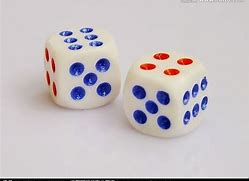

## 化繁为简·函数初步

------

### 函数的声明与调用

函数是 JavaScript 语言的基本组成之一，函数本身的意义很简单：按照我们的想法干一些事情。为了达到我们的目的，我们可能会提供给它一些信息或者数据，以供处理，可能会得到一个值，用以表示得到的信息或者处理得到的数据。

我们在小学时就已经学过如何计算一个圆的周长与面积。这个过程很简单：只需要知道它的半径，就可以计算出结果，从数据“半径”得到数据“周长”或“面积”。

- 数据总会变化，因此我们只需要关注计算过程本身。
- 当过程确定后，我们便不需要再重复进行计算过程的细节，只需要关注需要计算的数据。
- 由于计算过程是**确定**的——一个公式，我们可以把确定的过程写进一个函数里，之后计算时就不需要进行重复工作。

首先是圆的周长。我们知道它是 $$C = 2\pi r$$。

那么我们可以写出对应的 JavaScript 函数：

```javascript
r => 2 * Math.PI * r;
```

这是一个非常简单的函数。它可以分成两部分，箭头 `=>` 前的称为*参数列表*，用于说明将要参与计算的值的名称，而箭头后的内容是*函数体*，我们在函数体中进行具体的计算过程。

其中 `r` 是一个*形式参数*，表示将要参与计算的半径值，而函数体 `2 * Math.PI * r` 就是周长公式的 JavaScript 表达式形式，即 $$2\pi r$$。计算完成后我们将会得到一个值，由于它是函数计算后，“返回”给我们的数据，因此称为*返回值*。

但是，这里有一个问题：我们把公式写成了函数，那么该如何使用这个函数呢？

首先我们要把这个函数赋给一个标识符，这样它就有了名字。在 JavaScript 中，函数也是一种值，它的类型就是 `function`。

```javascript
let circumference = r => 2 * Math.PI * r;

// 现在函数的名字是 circumference
alert(typeof circumference); // "function"
```

给我们的函数取一个清晰、明了的名字是很重要的，这里 `circumference` 一词就是“周长”的意思。接下来，我们可以使用这个函数来进行计算了，这个过程称为*调用*。

```javascript
let value = circumference(10);
alert(value); // 62.83185307179586
```

调用函数时要使用的值称为*参数*。在示例中， `r` 是一种“形式上”的参数（类似于未知数），用于定义一个函数，因此叫作*形式参数*，简称*形参*。而调用时给予函数的值是实际参与计算的，因此叫作*实际参数*，简称*实参*。如，在这里的示例中，`10` 就是一个实参，它是 `r` 的实际值，函数体中的 `2 * Math.PI * r`就会变成 `2 * Math.PI * 10` 并进行相应计算。这个过程相当于数学意义上的“把值代入公式”。

我们不会对函数调用感到陌生，在前面的示例中，我们已经接触了许多函数，它们的共同特点是：**将复杂的细节隐藏起来，我们只需要按照既定的规则调用它们**。

```javascript
let a = circumference();
alert(a); // NaN，将 undefined 参与数学运算会得到它
let b = circumference(1, 2);
alert(b); // 6.283185307179586
```

定义一个函数时，需要使用的形参写在参数列表中，如果只有一个形参，那么只需写出它的名称，但如果需要零个或多个形参，就需要用小括号 `(` `)` 把参数列表包裹起来。

```javascript
let circumference = r => 2 * Math.PI * r;          // 正确
let circumference = (r) => 2 * Math.PI * r;        // 也行
let circumference = (r, a) => 2 * Math.PI * r + a; // 正确
let circumference = r, a => 2 * Math.PI * r + a;   // 错误，SyntaxError: Unexpected token =>
let circumference = () => 2 * Math.PI * 10;        // 正确（没有形式参数）
let circumference = => 2 * Math.PI * r;            // 错误，SyntaxError: Unexpected token =>
```

如果调用函数时一个形参没有得到实参，那么它的值就会是 `undefined`，而多余的实际参数则会被忽略。如果不需要任何参数，你仍然需要写上小括号 `(` `)` 以调用函数。

我们可以手动为形式参数指定一个默认值，如果调用时没有得到相应的实际参数，就会使用默认值。

```javascript
let circumference = (r = 2) => 2 * Math.PI * r;
alert(circumference(10)); // 62.83185307179586
alert(circumference(2));  // 12.566370614359172
alert(circumference());   // 12.566370614359172
```

这是一个打招呼的示例，用于说明参数默认值可以*向前依赖*。

```javascript
let greet = (name, greeting, message = greeting + " " + name) => {
    alert(`[${name}, ${greeting}, ${message}]`);
}

greet("David", "Hi");                     // "[David, Hi, Hi David]"
greet("David", "Hi", "Happy Birthday!");  // "[David, Hi, Happy Birthday!]"
```


------

Note：

如果函数体用大括号包裹，又写在一对小括号里面的话，那么大括号及其中的内容，会被当作一个对象字面量，而函数的返回值就是这个对象字面量。

------


### return 语句

我们已经初步了解了如何定义函数。然而，如果我们要执行一组操作而非一个简单的计算，例如将一个质数判断算法放进函数里面，函数体就会包括多行代码。而先前的函数定义语法只允许直接对一个表达式求值，当我们要写出更复杂的函数——包括循环结构、条件分支时，就需要考虑新的办法。

例如，我们要判断一个整数是否为奇数，可以像这样写：

```javascript
let isOdd = (number) => {
    if (number % 2 === 0) {
        return false; // 是偶数
    } else {
        return true;  // 是奇数
    }
}
```

这个函数使用了一点我们尚未了解的语法。首先，它的函数体是多行的，为了划分出函数体与外部的界限，我们需要使用一堆大括号 `{` `}` 将函数体中的语句包裹起来，就像之前所认识的各类语句一样。

在函数体中，我们使用 *return 语句* 来确定函数的返回值。

```javascript
return a;
```

这行语句说明了函数的返回值就是 `a` 的值。当 return 语句被执行后，这个函数的执行过程就结束了，如果后面仍然有其他语句，那么不再会执行。return 语句后接一个表达式，表达式的值就会是函数的返回值。

你也可以使用单独的 return 语句而不返回任何值，或者干脆不使用 return 语句来终止函数体。这时，函数的返回值会是 `undefined`。**注意：return 语句只能在带大括号的函数体内使用。**

用几个示例来说明 return 语句的使用：

```javascript
let a = () => {
    return 3;
};
let b = () => {
    
};
let c = () => {
    return;
}
let d = () => {
    return 1;
    return 2;
}

a();       // 3
b();       // undefined
c();       // undefined
d();       // 1
return 10; // SyntaxError: Illegal return statement
```

函数可以返回你想要的任何值，一般来说，出于程序的*正确性*的考虑，我们建议函数的返回值都为同一种类型的数据。

下面的函数返回了一个布尔值来表明参数 `n` 是否为偶数：

```javascript
let isEven = (n) => n % 2 === 0;
```

一旦定义了这个函数，就可以在 if 语句中使用它：

```javascript
if (isEven(i)) // 进行操作
```

返回布尔值的函数一般用于决定某个条件是否成立，我们将这类函数称为*判定函数*。更加复杂的判定函数如质数判断函数：

```javascript
let isPrime = (n) => {
    if (n === 2) {
        return true;
    }
    if (n % 2 === 0 || n === 1) {
        return false;
    }
    for (let i = 3, last = Math.sqrt(n); i <= last; i += 2) {
        if (n % i === 0) {
            return false;
        }
    }
    return true;
}
```

我们可以发挥出函数带来的便利性，将原来的 REPL 逻辑写得更清晰。

```javascript
let number;
do {
    number = parseInt(prompt("请输入一个正整数，输入 0 则退出循环"));
    if (number < 0 || isNaN(number) || !isFinite(number)) {
        alert("无法处理这个数字！");
        break;
    }
    alert(isPrime(number) ? `${number}是质数` : `${number}不是质数`);
} while (number !== 0)
```


------

练习 5.1.1

1. 在公历纪年法中，一个年份如果不能被 4 整除，那么它不是闰年，能被100 整除而不能被 400 整除的年份也不是闰年，能被3200整除的也不是闰年。如 2008 年是闰年，1900 年是平年，2000 年是闰年，3200 年不是闰年。

   编写一个判定函数，用于判断一个年份 `year` 是否为闰年。

------


### 函数的意义

函数在程序设计语言中扮演着重要的角色。首先，定义函数让编程者可以讲一段完成特定任务的代码仅编写一次，然后多次使用。因此，将完成特定任务的一系列代码组织成一个函数，不仅可以显著减少所须编写的重复代码、降低程序规模，而且使程序更清晰、易于维护。如果你要对函数实现的操作进行修改，你会发现只出现一次的代码回比贯穿整个程序的相同代码更容易修改。

即使函数只在程序中使用了一次，定义这个函数也是值得的。函数最主要的作用就是将一个大型程序拆分成多个易于管理的小部分。这一过程称为*分解*。以往的经验告诉我们，将整个程序写成一个庞大的代码块必然会导致一场灾难。而你所需做的是将一个高层次问题细分为一系列低层次的函数，每一个函数有其自己独立的功能。然而，找到问题正确的细分方法有很大的挑战，需要不断练习、思考与尝试。一个好的、独特的细分方法，会使每一个函数都是一个聚合紧密的单元，使得问题整体更加易于理解。如果选择了一个不好的分解方法，它将成为我们解决问题的阻碍。世上并不存在准确而快速的法则让我们找到最正确的问题分解方法。编程是一门艺术，好的问题分解策略主要来源于实际经验。

我们可以将整个程序视为一个整体，并尝试从中分析并抓取出其主要部分，再将它们定义为一些相互独立的函数。由于某些函数可能本身依然复杂，因此，通常需要将它们再分解为更小的部分。我们可以不断重复这一分解过程，直到每个问题足够简单明了以便于解决，这种方法称为**自顶向下的程序设计**。


### 作用域

在函数内声明的标识符不能在函数之外的任何地方访问，因为这个标识符被限制在了函数体的范围内。相对应的，一个函数可以访问定义在其范围内的任何标识符。声明在全局作用域中的函数，可以访问所有声明在全局作用域中的标识符。当一个函数 `b` 的定义位于另一个函数 `a` 中，那么 `b` 是一个*局部函数*，`a` 是 `b` 的*父函数*，`b` 是*嵌套*在 `a` 中的。在另一个函数中定义的函数，也可以访问在其父函数中定义的所有标识符和父函数有权访问的任何其他标识符。函数体所产生的限制称为*函数作用域*。

如果你忘记了“声明”与“定义”的关系，可以在这里复习一下它：

声明就是使用 `let`/`const` 说明一个标识符的名称，而定义则是将它赋予值。

现在我们假设一个标识符 `local` 的声明位于函数 `scope` 的函数体内：

```javascript
let scope = () => {
    let local = 100;
    alert(local);
    local = 200;
    alert(local);
}

scope();      // 100 
              // 200
alert(local); // ReferenceError: local is not defined
```

一切正常，我们会依次得到 `100` 和 `200`，当我们回到全局作用域时，由于 `local` 是局部变量，因此无法访问它，得到一个“未定义”错误。

那么，当外部的作用域已经存在一个名为 `local` 的变量呢？

```javascript
let local = 300;

let scope = () => {
    let local = 100;
    alert(local);
    local = 200;
    alert(local);
}

scope();      // 100 
              // 200
alert(local); // 300
```

我们实际上在 `scope` 函数体内重新声明和定义了另一个名为 `local` 的局部变量，因此我们会优先访问它，这是一种*优先原则*。假如我们没有在函数体内重新声明，只是单纯的重新赋值，那么我们将会改变外部作用域中 `local` 的值。

```javascript
let local = 300;

let scope = () => {
    local = 100;
    alert(local);
    local = 200;
    alert(local);
}

scope();      // 100 
              // 200
alert(local); // 200

```

JavaScript 中作用域内的优先原则是：从当前的作用域开始，如果能找到在当前作用域声明的标识符名称，那么使用它的值，否则就逐渐扩大到父级作用域去寻找这个标识符，直到全局作用域。

下面是一个使用了嵌套函数的例子：

```javascript
// 下面的变量声明在全局作用域
let num1 = 20,
    num2 = 3,
    name = "Jupyter";

// 本函数声明在全局作用域
let multiply = () => num1 * num2;

alert(multiply()); // 60

// 嵌套函数的例子
let getScore = () => {
  let num1 = 2,
      num2 = 3;
  
  let add = () => name + " scored " + (num1 + num2);
  
  return add();
}

alert(getScore()); // 返回 "Jupyter scored 5"

```

函数的形参会被当作是已经声明的局部标识符，你不能对它们进行重复声明，但是可以对它进行重新赋值，更改后的值只适用于当前作用域。

```javascript
let f = (a, b) => {
    alert(a);
    let a = 10; //  Identifier 'a' has already been declared
}

let f2 = (a, b) => {
    a = 10;
}
let t = 100;
print(f2(t)); // 10
print(t);     // 100

```


注意：如果在一个作用域内声明了一个标识符，那么在声明语句之前的地方也是无法访问到这个标识符的。这种现象称为*暂时性死区*。

```javascript
alert(a); // ReferenceError: a is not defined
let a = 10;

```

在函数作用域内自然也是一样。

```javascript
let scope = () => {
    alert(local);
    let local = 10;
}
scope(); // ReferenceError: local is not defined

```

即使外部作用域中已经有一个名为 `local` 的变量，由于函数作用域内只会优先访问声明位于本作用域的标识符，而声明语句前又无法知道这个标识符“是否被声明”，就会引发错误。


------

Note：

薛定谔的暂时性死区：被声明与没有声明同时叠加。

------


这个令人困惑的特性到此而已，不会为你带来更多困扰。


### function 关键字

你可能会在别的地方看到 `function` 关键字。事实上，它是 JavaScript 中一种老式的函数定义方法。

```javascript
let f = function (x) {
    return x + 1;
}
alert(f(2)); // 3

```

可以看到这种定义法实际上与我们前面所了解到的等价，只不过它不能省略参数列表的括号，必须使用大括号包裹函数体。除此之外，前文中所介绍的性质对于它都是适用的。

```javascript
let f  = function x {}; // SyntaxError: Unexpected token {
let f2 = function (x) { x + 1 };
alert(f2(1));           // undefined，因为 f2 没有返回值。
let f3 = function (x) {
    alert(m); 
}

```

前文中所介绍的声明函数的方式都是*函数表达式*，即写出一个函数具体的定义，并当作值（表达式）赋给标识符。而`function` 关键字的另一种使用形式是*函数声明*。

```javascript
function test (a) {
    alert(a);
}
test(100); // 100

```

在 2015 年以前我们必须使用这二者形式之一，但是现在我们可以使用新的更简洁优雅的语法——就像前文中所介绍的那样。


### 参数解构

JavaScript 中的函数支持*剩余参数*和*参数解构*，它们是用于简化逻辑的技巧，类似于解构赋值。

剩余参数的语法是在形参前加上三个点号 `...`，这个参数的值会是一个数组，用于存放“剩余的所有参数”。

```javascript
let f = (a, b, ...c) => alert(a + " " + b + " " + c);

f(1, 2, 3);      // 1 2 3
f(1, 2, 3, 4, 5) // 1 2 3,4,5

```

因为剩余参数是一个数组，你可以用常规方式操作它。

```javascript
let f = (...args) => alert(theArgs.length);
 
f();        // 0, 因为theArgs没有元素
f(5);       // 1, 因为theArgs只有一个元素
f(5, 6, 7); // 3, 因为theArgs有三个元素
```

剩余参数习惯于使用 `args` 命名，它是 `arguments` 一词的缩写，意为“实参”。

有一点需要注意：剩余参数不能设置默认值。因此以下写法会得到一个错误。

```javascript
let f = (...args = [10]) => alert(b);
// SyntaxError: Rest parameter may not have a default initializer
```

第三章中的解构赋值的技巧也可以适用于函数参数的定义。

```javascript
let f = ([x, y] = [1, 2], {z: z} = {z: 3}) => { 
  return x + y + z; 
}

f(); // 6
```


## 手可摘星辰·函数和算法

------

### 算法的基础

函数不仅是一种管理程序复杂性的工具，更为算法的实现提供了基础性的保障。算法在人类历史长河的智慧中诞生，历史上最著名的一个数学算法是以希腊数学家欧几里德的名字命名的。在欧几里德的数学著作《几何原本》中，他描述了一个求两个整数 x 和 y *最大公约数*（greatest common divisor, gcd）的过程，即一个可以同时整除 x 和 y 的最大整数的算法。例如，49 和 35 的 gcd 是 7，6 和 18 的 gcd 是 6，32 和 33 的 gcd 是 1.欧几里德算法可以描述如下：

1. 用 x 除以 y 并计算余数 r。
2. 若 r 等于 0，则算法结束，最大公约数是 y。
3. 若 r 不等于 0，则令 x 的值为 y，y 的值为 r。
4. 回到步骤 1。

这个算法可以很容易地用 JavaScript 代码描述：

```javascript
let gcd = (x, y) => {
    let r = x % y;
    while (r != 0) {
        x = y;
        y = r;
        r = x % y;
    }
    return y;
}
```

这个算法实现起来相当简单，但相比你自己可能发现的任何计算策略显得更有效率。事实上，欧几里德算法至今在包括网络安全的加密协议实现等很多情况下都得到了广泛的应用。

同时，我们很难清晰明确地看出该算法为什么会得到正确的结果。它的正确性已经在《几何原本》第七章命题二中得到了证明。虽然并不是总有证据来证明算法对计算机应用的驱动作用，但这些证据能让你对程序的正确性更有信心。

除了计算最大公约数以外，生活中我们还会不可避免的遇到一些算法问题，它们往往代表了我们需要解决和思考的一些实际问题。例如，当我们有了收入之后，会有意识地对财产进行储蓄或投资。银行或理财机构对于存款或投资的收益都做了详细的规划。如果我们要手动计算这些问题，不仅非常繁琐，还要冒着可能出错的风险。作为人类，我们只需要思考解决问题的方式，而重复性的繁杂工作都应该交给计算机来处理，使它根据我们的指挥更好地为我们服务。

定期存款的本金与总利息之和的计算遵循下面的公式：
$$
本利和＝本金(1 + 利率(\frac{存期}{12}))^{(时长/存期)}
$$
我们可以根据这个公式直观地写出用于计算的函数：

```javascript
let sum = (principal, rate, savingperiod, lastperiod) => {
    let value = principal * (Math.pow(
        (1 + rate * (
            savingperiod / 12
        )), 
        Math.floor(lastperiod / savingperiod))); 
    return value.toFixed(2);
};
```

这个函数具有四个参数，反映了实际应用中的复杂性，而函数起到的作用就是隐藏复杂性。`sum` 函数隐藏公式的算法细节细节，向外提供一个统一的计算方式。在进行计算时，我们应当且只应当关注每次计算时的值，而不必将精力放在实际的计算过程中，就像计算器提供的方便的数学函数，我们只需将它当成和四则运算没有什么区别的简单运算，当需要用到的值发生改变时，就改变它的参数——函数的意义就是这样简单。

- `principal` ：本金
- `rate`：利率
- `savingperiod`：存期
- `lastperiod`：时长

它的核心实际上只有一行表达式，但是它有些复杂，因此我们将其拆分成多行，以便于阅读。计算完成后，我们将得到的值取两位小数，就是最后的结果。

使用一些值来测试这个函数：

```javascript
alert(sum(100, 0.06, 5, 16));    // 107.69
alert(sum(1000, 0.01, 12, 19));  // 1010.00
alert(sum(520, 0.5, 3, 17));     // 937.06
alert(sum(10, 0.1, 6, 24));      // 12.16
alert(sum(6622, 0.087, 9, 31));  // 8004.68
```

就像我们在中学时学到的数学函数一样，`sum` 这样的函数可以简单地看做是结果与一组值之间的映射。它单纯地进行一些计算并返回一个值。


------

Note：

*纯函数*可以理解为一种**相同参数必定有相同返回值**的函数，而不会产生任何可观察到的副作用（如改变状态）。

纯函数诸如：`Math.cos` `sum` `gcd`

而 `Math.random` `prompt` `alert` 则是非纯函数。

------


### 组合函数

想象一下，假如我们在玩一个掷骰子游戏，我们手中有两枚骰子，每次同时抛掷，那么它们的随机点数共有多少种组合呢？



上图显示了 6 + 4 这一点数组合，而实际上我们也可能会得到 2 + 3，4 + 1, 6 + 3……共有十五种可能组合。作为一个编程者，应该思考一个更加普遍的问题：给定一个含有 $$ n $$ 个元素的集合，可以从中得到多少个包含 $$ k $$ 元素的子集？可以通过如下的*组合函数*（combinations function） `C(n, k)` 来得到答案：
$$
C(n, k) = \frac{N!}{k \times (n - k)!}
$$
其中，感叹号代表了阶乘函数，表明为从 1 到所指定的值中所有整数的乘积。我们可能还想查看对于更大的 $$ n $$ 和 $$ k $$ 而言有多少种组合，因此可以写出这样的程序来方便地计算。


这个程序分别向用户请求 $$ n $$ 和 $$ k $$ 的值，然后显示函数 `C(n, k)` 的值，代码实现如下。

```javascript
let fact = (n) => {
  let result = 1;
  for (let i = 1; i <= n; i += 1) {
    result *= i;
  }
  return result;
}

let combinations = (n, k) => {
  return Math.floor(
      fact(n) / (fact(k) * fact(n - k))
  );
}

let n = +parseInt(prompt("请输入组合物体的总数："));
let k = +parseInt(prompt("请输入每次组合的个数："));
let c = combinations(n, k);
alert(`C(k, n) = ${c}`);
```

正如你所看到的， Combinations 程序划分为两个函数，借用第四章中定义的 `fact` 函数来计算所需要的阶乘结果，再利用 `combinations` 函数计算 `C(n, k)` 的值。


### 回文识别

*回文*（palindrome）是指其字母排列正序与倒序均一致的词语，例如单词“level”或“noon”，本节的目的是编写一个判断函数以检测一个字符串是否属于回文。调用 `isPalindrome("level")` 应该返回 `true`；调用 `isPalindrome("xyz")` 应返回 `false`。

和大多数编程问题一样，这里有解决该问题的几种合理策略。根据我们的经验，可能首先尝试的方法是使用一个 `for` 循环依次读取字符串前半部分每一个索引位置上的字符。在每个位置上，代码将检测该字符是否与出现在字符串末尾对应对称位置的字符匹配。采取这种策略的代码如下：

```javascript
let isPalindrome = (str) => {
    let n = str.length;
    for (let i = 0; i < n / 2; i += 1) {
        if (str[i] !== str[n - i - 1]) {
            return false;
        }
    }
    return true;
}
```

简单测试一下它是否与我们的预期一致：

```javascript
alert(isPalindrome("level")); // true
alert(isPalindrome("xyz"));   // false
alert(isPalindrome("noon"));  // true
alert(isPalindrome(""));      // true
alert(isPalindrome(123));     // true
```

只有一个字符的字符串和空串本身就是回文，但是为什么数字 `123` 也会被检测为回文？这是因为数字的 `length` 属性为 `undefined`（不存在），对它进行除以二的运算会得到 0，因此 `for` 循环不会执行，直接返回 `true`，便有了这个怪异的结果。毫无疑问，我们应该对输入的数据进行检查，以确认它一定是我们需要的数据，这是编写任何函数都很重要的一个环节。

```javascript
let isPalindrome = (str) => {
    if (typeof str !== "string") {
        return false;
    }
    
    let n = str.length;
    for (let i = 0; i < n / 2; i += 1) {
        if (str[i] !== str[n - i - 1]) {
            return false;
        }
    }
    return true;
}
```

这个函数看起来有些长，我们可以考虑使用第三章中遇到的字符串与数组方法，用下面更简捷的形式编写 `isPalindrome` 函数：

```javascript
let isPalindrome = (str) => {
    if (typeof str !== "string") {
        return false;
    }
    return str === str.reverse();
}
```

最后一行的字面意义就是：如果字符串与它的逆序形式完全相等，那么它就是一个回文。不过，JavaScript 并没有为字符串提供 `reverse` 方法，我们只好先将其拆分为数组，使用数组的逆序方法，再组合成字符串，这样得到的就是字符串的逆序形式。

```javascript
let isPalindrome = (str) => {
    if (typeof str !== "string") {
        return false;
    }
    return str === str.split("").reverse().join("");
}
```

现在我们来测试一下。

```javascript
alert(isPalindrome("level")); // true
alert(isPalindrome("xyz"));   // false
alert(isPalindrome("noon"));  // true
alert(isPalindrome(""));      // true
alert(isPalindrome(123));     // false
```

嗯！一切都好。

在上述两种实现方式中，第一个版本更为有效。第二个版本必须构造一个数组和新的字符串，且其中的字符与源字符串中的字符顺序是相反的。更糟糕的是，它通过一个一个字符地拆分字符串、一个一个地逆序排列再一个一个地组合起来，创建了两个临时字符串和一个临时数组。第一个版本不需要创建任何字符串。它通过选择和比较字符串中的字符完成功能，这被证明是一种低代价的运算。

除了二者在效率上的不同外，第二种编写方式也有许多优点，特别是对于编程新手而言，可将其作为参考范例。其主要优点为：一方面，它通过使用 `reverse` 方法重用了已有的代码；另一方面，第一个版本需要字符串中字符的索引位置，而第二个版本则隐藏了涉及这方面的编程复杂性。对于大部分初学者，至少要花费一分钟或两分钟弄明白为什么代码中要包含下标访问表达式 `str[n - i - 1]` ，或者为什么它要在 `for` 循环检验中使用 `<` 操作符而不是 `<=` 。相比之下以下这一行代码：

```javascript
return str === str.split("").reverse().join("");
```

读起来几乎就和英语一样流畅：如果一个字符串，和它拆分成的数组的逆序形式看起来一样，则它是一个回文。

尤其是当我们正在学习编程时，致力于程序的简洁性比关注其执行效率更为重要。鉴于现在计算机的速度，牺牲几个 CPU 周期来使程序更易于理解是值得的。


### 中文数字

本节将讨论一个面向文本处理的简单算法应用，用于将阿拉伯数字转换为其汉字形式。

根据《五经算术》的记载，黄帝将数字分为“十等三法”。

> 十等者，谓“亿、兆、京、垓、秭、穰、沟、涧、正、载”也。
>
> 三法者，谓“上、中、下”也。
>
> 下数者，十十变之。若言十万曰亿，**十亿曰兆**，十兆曰京也。
>
> 中数者，万万变之。若言万万曰亿，**万亿曰兆**，万兆曰京也。
>
> 上数者，数穷则变。若言万万曰亿，**亿亿曰兆**、兆兆曰京也。

也就是说，汉语的大数单位有三种递进法则。

其中上法为自乘系统:，万万为亿，亿亿为兆，兆兆为京，以此类推。这种方式，希腊的阿基米德也采用过，写成科学计数法即：10^4^ => 万，10^8^ => 亿，10^16^ => 兆，10^32^ => 京。

二是中法，为万进系统，以万递进：万万为亿，万亿为兆，万兆为京，以此类推。写成科学计数法就是：10^4^ => 万，10^8^ => 亿，10^12^ => 兆，10^16^ => 京。

三是下法，为十进系统，以十递进：十万为亿，十亿为兆，十兆为京，以此类推。写成科学计数法即：10^4^ = >万，10^5^ => 亿，10^6^ => 兆，10^7^ => 京。

本节将采用中法来作为数字单位递进准则。因此，一个中文数字可以通过以下方式由阿拉伯数字构造：

- 将阿拉伯数字每四位为一组，每组从低到高的单位分别为 “”（个位），“万”，“亿”，“兆”，以此类推。
- 每组内的转换方法是一样的，比如 1234，就是"一千二百三十四"，加上对应的单位，如“万”，就是“一千二百三十四万”。

那么要做的第一件事就是将单位和基本数字存起来，按需取用。

```javascript
const nums  = ["零", "一", "二", "三", "四", "五", "六", "七", "八", "九"];
const units = ["", "十", "百", "千"];
const sections = ["", "万", "亿", "兆", "京", "垓", "秭", "穰", "沟", "涧", "正", "载"];
```

其中我们要注意一些细节：

- 结尾的零都忽略，如 1200，就是“一千二百”。
- 中间的零，只需要用一个零表示，如 1004，是“一千零四”。
- 如果整组都是0，忽略其单位。
- 如果一组在 10 到 19 之间，则十位可以省略一，即不写成“一十”；否则，十位上的“一”都要添加。如 12 就是“十二”，312就是“三百一十二”。

一个要点是：如果一个数字除以递进基数的余数不为 0，那么这个余数就是递进位后的数字，例如 ` 12 % 10 === 2`，那么 12 的次位就为 2，相应地转为为汉字“二”。大数的单位递进基数是 10000，因此我们将它除以 10000 并取余数，如 `12345 % 10000 === 2345`，那么“两千三百四十五”就是递进位“万“后的数字。

下面简要说明一下大致转换流程：

1. 我们首先会判断它是否为 0，如为 0 则直接得到 0，显然并不是。
2. 因此我们将它除以 10000（一万）并得到余数，它不会大于 9999，因此将其视为一组。
3. 使用另一个转换函数对这一组进行专门转换：
   1. 如果它大于 0，取其整除余数，如果余数为 0 那么填充“零”，并用一个标记记录，如果前面已跟着“零”那么就不会填充。
   2. 根据余数判断其汉字形式，然后根据数位决定单位，依次累积。
4. 一组转换完毕后，回到步骤 2，直到剩下的数向下取整为 0。

这里给出算法的完整实现。

```javascript
const nums  = ["零", "一", "二", "三", "四", "五", "六", "七", "八", "九"];
const units = ["", "十", "百", "千"];
const sections = ["", "万", "亿", "兆", "京", "垓", "秭", "穰", "沟", "涧", "正", "载"];

// 将每一组四位数字单独进行转换
const sectionToChinse = (section) => {
  let ins = "", str = "";
  let unitPos = 0, zero = true;
  while (section > 0) {
    let v = section % 10;
    if (v === 0) {
      if (!zero) {
        zero = true;
        str = nums[v] + str;
      }
    } else {
      zero = false;
      ins = nums[v];
      ins += units[unitPos];
      str = ins + str;
    }
    unitPos += 1;
    section = Math.floor(section / 10);
  }
  return str;
}

// 将数字分组并进行转换
const numberToChinse = (number) => {
  let unitPos = 0;
  let ins = "", str = "";
  let needZero = false;
  if (number === 0) {
    return nums[0];
  }
  
  while (number > 0)  {
    let section = number % 10000;
    if (needZero) {
      str = nums[0] + str;
    }
    ins = sectionToChinse(section);
    ins += (section !== 0) ? sections[unitPos] : sections[0];
    str = ins + str;
    needZero = section < 1000 && section > 0;
    number = Math.floor(number / 10000);
    unitPos += 1;
  }
  return str;
}

// 测试代码
let num = +parseInt(prompt("请输入一个数字："));
alert(numberToChinese(num))；
```

注意：由于算法中使用了除法，而 JavaScript 的除法具有精度限制，因此当数字太大时会因溢出给出错误的结果。如果这个整数不大于 16 位，那么结果应当是准确的。如果你还记得第三章中的相关内容，你应该会知道为什么。

来吧，使用一些数字来验证我们的算法吧。这个程序目前不支持负数，但我们可以做一些小小的改进来使转换函数对于负数依然有效。这是一个小练习。


## 调兵遣将·方法

------

### 作为成员的函数

我们在上一节中已经了解过，JavaScript 中的函数也是一种值，它们可以被赋给其他标识符，自然，函数也可以成为对象属性的值。当一个函数成为一个对象的成员时，我们可以叫它*成员函数*，更常见一点的叫法是*方法*。

按照我们的理解，对象中的方法看起来应该是这样的：

```javascript
let person = {
    name: "Jason",
    say: () => alert("Hello world");
}
```

那么我们就可以调用这个方法：

```javascript
person.say(); // "Hello world"
```

我们也可以让方法的定义与这个对象的其他属性相关，例如，在打招呼时进行自我介绍。

```javascript
let person = {
    name: "Jason",
    say: (who) => alert(`Hello ${who}, my name is ${person.name}.`)
};

person.say("Eric"); // "Hello Eric, my name is Jason."
```

在 JavaScript 的语法中，我们可以使用更加简便的方式来定义一个方法，不必写出箭头与冒号，不过这时，大括号是必需的。

```javascript
let person = {
    name: "Jason",
    say (who) {
        alert(`Hello ${who}, my name is ${person.name}.`);
    }
};
person.say("Eric"); // "Hello Eric, my name is Jason."
```

当我们要使用 `person.name` 时，我们会写出它的完整形式，但是在对象的方法中，访问这个对象的其它成员，是否也有什么简便的方法呢？事实上，你只需要使用关键字 `this` 指代这个对象本身。这样就带来了很大的便利性：无论我们的对象叫什么名字，名字有多长，在它方法中遇到它自己都只需要用 `this` 表示。

```javascript
let person = {
    name: "Jason",
    say (who) {
        alert(`Hello ${who}, my name is ${this.name}.`);
    }
};
person.say("Eric"); // "Hello Eric, my name is Jason."
```


### 对外接口

作为“定义在特定对象中的函数”，方法与我们上一节中所接触到的通常的函数有什么不一样的意义呢？

对于对象而言，方法实际上是一个对外沟通的渠道，使对对象的操作便于管理与理解，并且隐藏一些细节。我们将通过一些实际的例子来说明对象中方法的作用和意义。

例如，我们有一辆车，并且知道一些关于它的基本信息，作为一个对象大概是这样子的：

```javascript
let car = {
    model: "Honda Civic",
    year:  2009,
    miles: 20000
};
```

现在，如果我们要得到一段文本，用于将车的信息片段连贯成一句话，自然可以这样做：

```javascript
let info = `${car.model} built in ${car.year}, it has done ${car.miles} miles`;
alert(info); // Honda Civic built in 2009, it has done 20000 miles
```

由于我们已经了解过了函数的使用，因此可以将拼接字符串的操作放在一个函数中，隐藏实现细节，同时使得我们也可以应用于其它的车对象：

```javascript
let toString = (car) => {
    // 形参的这个 car 可以指代任何车对象
    let info = `${car.model} built in ${car.year}, it has done ${car.miles} miles`;
    return info;
}
alert(toString(car)); // Honda Civic built in 2009, it has done 20000 miles
```

这样看起来似乎没问题，但是如果我们不单单有小汽车，还有轮船、飞机、火车……每种东西都需要一个自己的 `toString` 方法来输出专属于自身类型的信息，但是名为 `toString` 的函数只能有一个，我们找到了一个解决办法：将 `toString` 函数加上它所用于的对象名称，例如，用于车对象的 `toString` 可以写成 `toStringOfCar`。

```javascript
let toStringOfCar = (car) => {
    // 形参的这个 car 可以指代任何车对象
    let info = `${car.model} built in ${car.year}, it has done ${car.miles} miles`;
    return info;
}
alert(toStringOfCar(car)); // Honda Civic built in 2009, it has done 20000 miles

```

但我们很快就发现了新的问题：这样的命名方式繁琐啰嗦。一个对象使用怎样的描述信息，应该由它自己决定，这样我们就可以把 `toString` 写成 `car` 对象的方法，而其他的对象也可以有自己的 `toString` 方法，这样互不冲突，每个对象专属的 `toString` 方法实现时只需关注自身所属对象的需求。

```javascript
let car = {
    model: "Honda Civic",
    year:  2009,
    miles: 20000,
    toString () {
        let info = `${this.model} built in ${this.year}, it has done ${this.miles} miles`;
        return info;
    }
};
alert(car.toString()); // Honda Civic built in 2009, it has done 20000 miles

```

同时，我们可以把一些成员操作的细节隐藏在特定的方法里，这样我们可以使用统一而简洁的方式达到某些目的，不需要关心具体的实现过程，方法应该有怎样的细节，由对象自己负责，而使用时无需考虑，这种策略称为*封装*。例如，假如我们有一些书，每本书都有一个独一无二的数字编号，并且它应该是一个正整数，自然会想到：

创建一些 `book` 对象，每个对象都拥有一个名为 `no` 的数字属性用于记录编号。

```javascript
let book = {
    name: "Design Patterns",
    author: "Addy Osmani",
    no: 10
};
// 现在我们要修改数字编号
book.no = 20;

```

我们需要一个数字编号，但如果不小心用了一个 `undefined` 当做编号，抑或使用了非正数、浮点数，这与我们的要求不符。那么我们可以写一个方法，专门用来设置编号的值，并进行相应检查。

```javascript
let book = {
    name: "Design Patterns",
    author: "Addy Osmani",
    no: 10,
    setNo (n) {
        if (n === undefined || n < 1 || n % 2 !== 0) {
            return;
        }
        this.no = n;
    }
};

```

使用时只需要调用 `book.setNo` 来代替原本的赋值操作即可。

```javascript
book.setNo(5);  // OK
book.setNo(-1); // 不符合要求，book.no 没有被改变
book.setNo();   // 不符合要求，book.no 没有被改变
alert(book.no); // 5

```

使用这种策略的好处显而易见。我们可以按照需要对编号进行更多约束，也可以在设置值过程中顺便做其它的事情，还可以进行自动编号——只要稍微改变一下方法的细节。

```javascript
let book = {
    name: "Design Patterns",
    author: "Addy Osmani",
    no: 0,      // 编号的初始值
    setNo () {
        this.no++;
    }
};
book.setNo();
alert(book.no); // 1

```

`set` 开头的方法具有“设置（某属性）”的含义，与之相对，我们也可以为“获取（值）”这一操作封装一个 `get` 开头的方法：

```javascript
let book = {
    name: "Design Patterns",
    author: "Addy Osmani",
    no: 0,      // 编号的初始值
    setNo () {
        this.no++;
    },
    getNo () {
        return this.no;
    }
};
alert(book.getNo()); // 0
book.setNo();
alert(book.getNo()); // 1

```

在一个对象中，`get` 开头的方法一般与 `set` 成对出现，它们的作用也是相对的。关于方法的命名方式有许多具体的细节与习惯，我们将在下一小节了解到。

不同类型的对象可能会拥有不同的方法以完成相应的工作，例如设置和获取数据，这类方法实际上承担了一个信息传递渠道的作用，就像可插拔的 USB 接口，我们也可以将这些方法称为*接口*。在 JavaScript 中，对象间的通信通过信息发送和请求来实现，我们将传递的这些信息统称为*消息*。对象间的消息发送通常理解为一个对象调用属于另一个对象的方法，例如 `book.getNo()` 就是调用了 `book` 方法，即“接收了 `book.no` 这一信息”。

我们应该尽可能地用特定的方法去封装原始的操作细节，并进行充分的检查以规避可能出现的问题。

```javascript
let book = {
    name: "Design Patterns",
    author: "Addy Osmani",
    no: 0,      // 编号的初始值
    
    getName () {
        return this.name;
    },
    setName (name) {
        if (typeof name !== "string") {
            return;
        }
        this.name = name;
    },
    
    getAuthor () {
        return this.author;
    },
    
    setAuthor (author) {
        if (typeof author !== "string") {
            return;
        }
        this.author = author;
    },
    
    setNo () {
        this.no++;
    },
    getNo () {
        return this.no;
    }
};

alert(book.getName());   // "Design Patterns"
alert(book.getAuthor()); // "Addy Osmani"
book.setName("JavaScript Design Patterns");
alert(book.getName());   // "JavaScript Design Patterns"
book.setAuthor(null);
alert(book.getAuthor()); // "Addy Osmani"
book.setNo();
book.setNo();
alert(book.getNo());     // 2

```


有时，我们需要在一个对象中存放一组函数，这个对象承担的功能仅仅是一个“工具箱”，例如 `Math` 对象，专门用于提供各类数学函数。我们可以把这类本身属性不需要改变，专门用于提供单独操作的对象称为*模块*，一个模块意味着一组实用的功能，这些以方法形式提供的功能称为*库接口*。除了 `Math` 之外，JavaScript 还提供了其它一些模块，例如 `JSON` `Reflect` `Intl` 等，**它们都是一些用于特定操作的函数的集合**，我们将在后面的章节接触到它们。


### 命名约定

我们在 JavaScript 中定义方法时，一般会遵循一些特殊的命名法则，以便于理解和记忆，增强程序的*可读性*。

一个习惯是，当一个方法需要操作或访问对象的特定属性时，一般会写成一个动词 + 名词的形式，例如 `getName` 的意义就是“获取 `name` 属性的值。获取与访问一般是成对出现的，因此当我们需要用到 `getXXX` 时，我们还需要写一个相应的 `setXXX` 。同时，方法的拼写遵循*驼峰式大小写*，即首字母小写，其它单词的首字母大写。

当我们需要一个名字很长的方法，比如“如果下雨了就提醒哥哥回来”，用驼峰式大小写拼写，看起来是这样的：

`remindBrotherToBackWhenRains`

当然实际生活中我们不可能会写出这样冗长的方法名，这里只是说明驼峰式大小写的效果。为了保持方法名的简洁，我们应该尽量只使用动词 + 名词的形式，有特殊需要时在其后加上用于说明的修饰词。

我们已经见过了 `toString` 这一方法名，它的语义就是“转换为字符串”。这类用于将对象或对象的特定属性转换为所需要的形式的方法一般写作 `toAnything` 的形式，例如 `toString`、 `toNumber` 、`toArray` 等。


## 大道至简·高阶函数

------

### 一等公民

JavaScript 中的函数素来有“一等公民”的称呼，这来源于函数在 JavaScript 中的地位。它们都是值，也就是说，可以作为其它函数的参数或者返回值。它们也都是对象，称为“函数对象”，可以拥有自己的属性与方法。

对其他函数进行操作的函数称为*高阶函数*，它接受其他函数作为参数或返回另一个函数本身。高阶函数在许多地方发挥着重要作用，例如，当我们要遍历一个数组并对其中的数据进行自动处理，例如将每个元素转换为大写，我们可能会这样写：

```javascript
const arr = ["a", "b", "c", "d", "e", "f", "g"];
for (let i = 0, last = arr.length; i < last; i += 1) {
    arr[i] = arr[i].toUpperCase();
}
alert(arr); // A,B,C,D,E,F,G
```

应用高阶函数，我们可以用更优雅的方式实现：

```javascript
arr.forEach((el, i) => {
    arr[i] = el.toUpperCase()
});
alert(arr); // A,B,C,D,E,F,G
```

这里使用了数组的 `forEach` 方法，它接受一个函数作为参数，并遍历数组的每一项元素，将每次遍历的元素和索引，作为参数，来调用传入的函数。这样的写法可比使用 `forEach` 手动循环简单优雅得多。

另一种常见的应用是数组的 `sort` 方法。默认情况下，当我们直接调用 `sort` 方法时，会根据字典序对数组的每一项进行排序。但我们也可以自定义一个比较函数，来规定排序所使用的的规则，它将会得到两个参数，代表实际排序时每次比较的两个元素，并需要返回一个值，作为先后顺序的判断依据。

假设这个比较函数名为 `compare` ，并且 `a` 和 `b` 分别是两个相互比较的元素，那么：

- 如果 `compare(a, b)` 小于 0，那么 `a` 应该在 `b` 的前面 。
- 如果 `compare(a, b)` 等于 0，那么 `a` 和 `b` 的相对顺序不变。
- 如果 `compare(a, b)` 大于 0，那么 `b` 应该在 `a` 的后面。
- 对于两个不变的 `a` 和 `b` ，那么 `compare` 函数应该返回相同的值，否则排序结果是无法预料的。

我们可以简单地写出 `compare` 函数。

```javascript
const compare = (a, b) => a - b;
```

使用这个 `compare` 函数，会使得数组中的数字依照大小顺序排列，而不是字典顺序。

```javascript
const numbers = [42, 7, 15, 6, 0, 20, 9, 83];

// 默认比较方式
alert(numbers.sort());        // 0,15,20,42,6,7,83,9

// 重新定义的比较方式
alert(numbers.sort(compare)); // 0,6,7,9,15,20,42,83
```

使用自定义的 `compare` 函数，我们还可以处理更加复杂的排序情况。例如，我们有一个数组，包含了一些名称和它们的对应值。我们既可以根据名称的字典顺序排列，也可以根据它们的对应值从小到大排列。

```js
const items = [
    { name: 'Edward', value: 21 },
    { name: 'Sharpe', value: 37 },
    { name: 'And', value: 45 },
    { name: 'The', value: -12 },
    { name: 'Magnetic', value: 13 },
    { name: 'Zeros', value: 37 }
];

// 根据 value 属性从小到大排列
items.sort((a, b) => a - b);

// 根据 name 属性依照字典顺序排列
items.sort((a, b) => {
    let nameA = a.name.toUpperCase(); // 忽略大小写
    let nameB = b.name.toUpperCase(); // 忽略大小写
    if (nameA < nameB) {
        return -1;
    }
    if (nameA > nameB) {
        return 1;
    }

    // 两个 name 相等
    return 0;
});
```


------

练习 5.5.1

1. 使用 `forEach` 方法，尝试显示出排序后的 `item` 每一项的内容。
2. 思考生活中有哪些更复杂的排序需求，并尝试写出相应的比较规则。

------


### 抽象化

在本章的开始部分，我们阐述过：函数的一大作用是将重复的操作封装起来，使我们只需要关心处理的值本身，而不需要关心计算的细节。当我们完成操作时，可能会依赖某些特定的值。由于函数将操作的逻辑提取出来，使它减少了对特定的值的依赖，也就增大了应用程序的灵活性。

我们再次温习一下这个使用函数来减少对特定值的依赖的过程。

```javascript
// 一开始的写法
let arr = [];
for (let i = 0; i <= 20; i += 1) {
    arr.push(i);
}
alert(arr); // 0,1,2,3,4,5,6,...20

// 使用函数后的写法
const repeatPush = n => {
    let arr = [];
    for (let i = 0; i <= n; i += 1) {
        arr.push(i);
    }
    return arr;
};

alert(repeatPush(20)); // 0,1,2,3,4,5,6,...20
```

我们将“记录$$N$$个值”这一操作提取出来作为一个单独的函数，换句话说，我们把“记录$$N$$个值”*抽象化*了。但是，如果我们想要做除了“记录$$N$$个值”以外的事情呢？由于“做某事”可以表示为函数，而函数只是值，我们可以将操作作为另一个函数值传递给 `f` 。

```javascript
const repeat = (n, action) => {
    for (let i = 0; i <= n; i += 1) {
        action(i);
    }
};

repeat(3, alert);
// 1 → 2 → 3
```

我们注意到 `repeat` 这个函数名称的变化——它不再依赖特定的操作，因此它的名称也就具有更大的抽象性。

我们不必将预定义好的函数传给 `repeat`，现场定义要进行的操作也不失为好办法。

```javascript
let labels = [];
repeat(5, n => {
    labels.push(`${n}号小可爱`);
});
alert(labels);
// 0号小可爱,1号小可爱,2号小可爱,3号小可爱,4号小可爱,5号小可爱
```

高阶函数允许我们抽象操作，而不仅仅是值。它们有多种形式。例如，我们可以写出创建新函数的函数。

```javascript
const greaterThan = n => {
    m => m > n;
};
const greaterThan10 = greaterThan(10);
alert(greaterThan10(12)); // true
alert(greaterThan10(6));  // false
```

我们还可以拥有改变其他函数的函数。

```javascript
const noisy = f => {
    return (...args) => {
        alert(`call with ${args}.`);
        let result = f(...args);
        alert(`call with ${args}, return ${result}.`);
        return result;
    };
};

noisy(Math.min)(8, 6, 3);
// call with [8, 6, 3].
// call with [8, 6, 3], return 1.
```

利用函数对操作流程的封装，我们甚至可以用自定义控制流。如下的 `unless` 函数是 `if` 语句的相反形式，而 `repert` 则对应于 `for`。

```javascript
const unless = (test, then) => {
    if (!test) {
        then();
    }
};
repeat(5, n => {
    unless(n % 2 === 1, () => alert(n + "是偶数"));
});
// 0 是偶数
// 2 是偶数
// 4 是偶数
```


### 数据集处理

JavaScript 的数组方法中包括三个高阶函数，它们提供了一套高效的接口，使程序员得以关注要处理的数据和逻辑本身，而不是将时间花费在处理过程中无关紧要的细节上。

**map**

`map` 方法会接受用户自定义的函数，并在内部遍历数组，将每一个元素作为参数传给函数并执行。自定义函数每次执行后的返回值（包括 `undefined`）会重新组合成一个新数组。它的基本用法非常清楚：

```javascript
[1, 2, 3].map((e) => alert(e));
// 1
// 2
// 3
```

它可以简化一些通常的迭代操作。例如，我们有一个数组，需要得到里面每个数值的平方，通常使用 `for` 语句的写法像这样：

```javascript
const arr1 = [1, 2, 3, 4, 5];
let   arr2 = [];
for (let i = 0; i < arr1.length; i += 1) {
    let n = arr1[i];
    arr2.push(n * n);
}
// arr2 = [1, 4, 9, 16, 25]
```

使用 `map` ，我们可以采取更清晰的方式：

```javascript
[1, 2, 3, 4, 5].map((n) => n * n);
// [1, 4, 9, 16, 25]
```

将数组的每一项转换为数值以进行下一步处理也是常见操作，我们可以写出如下的代码：

```javascript
['1', '2', '3', '4', '5'].map((a) => parseFloat(a));
// [1, 2, 3, 4, 5]
```

显然， `parseFloat` 本身就可以直接接受数组成员，因此代码可以简化如下：

```javascript
['1', '2', '3', '4', '5'].map(parseFloat);
// [1, 2, 3, 4, 5]
```

`map` 方法的意义非常简单，但这并不是全部：`map` 实际上会往用户自定义函数中传入三个参数。

```javascript
[1, 2, 3].map((element, index, arr) => {
  alert(`元素：${element} 位置：${index} 数组：[${arr}]`);
});
// 元素：1 位置：0 数组：[1,2,3]
// 元素：2 位置：1 数组：[1,2,3]
// 元素：3 位置：2 数组：[1,2,3]
```

如果传入一个只接受一个参数的函数，它就会忽略其他参数。但是有些函数有可选的第二个甚至第三个参数，例如与 `parseFloat` 作用相似但效果却截然不同的 `parseInt`。

```javascript
['1', '2', '3'].map(parseInt)
// [1, NaN, NaN]
```

这不起作用，因为 `parseInt` 可以接受两个参数：转换的字符串和指定数字基数。当我们在 `map` 中调用 `parseInt` 时，`parseInt` 会把当前元素位置当做数字基数并进行转换，自然得到了错误的结果。不好！我们需要一个只接受一个指定参数的 `parseInt` 。

我们可以写出 `['1', '2', '3'].map((s) => parseInt(s))`，或者考虑更加优雅的方式：用一个*函数装饰器*来包裹 `parseInt` 函数，使它只接受期望的一个参数。

```javascript
const unary = (fn) => {
    if (fn.length === 1) {
        return fn;
    } else {
        return (something) => fn.call(this, something);
    }
};
```

现在我们可以写成：

```javascript
['1', '2', '3'].map(unary(parseInt))
// [1, 2, 3]
```

完成！


**reduce**


**filter**


------

Note：

在 JavaScript 中，每个函数都会拥有两个方法：`apply` 和 `call`，在新标准发布以前，它们在一些地方发挥了重要作用。但现在我们已经不需要使用它们了，因此本章没有提及。了解一下这两个方法的作用与异同，并尝试阐述可以用什么方式取代这两个方法。

------


### 闭包

*闭包*是 JavaScript 中非常强大的特性。与离散数学中的同名概念不同，JavaScript 中的闭包是这样定义的：

> 闭包是指那些能够访问自由变量（既不是本地定义也不作为参数的那些变量）的函数。换句话说，这些函数可以“记住”它被创建的时候的环境。
>
> —— Mozilla Developer Network

闭包允许函数访问并操作函数外部的标识符。只要标识符存在于函数定义所在的作用域内，闭包就可以使函数能访问这些标识符。


------

Note：

这里的作用域指的是程序特定部分中标识符的可见性。

------


我们对闭包的探索将从一个简单示例开始。

```javascript
let outerValue = "窝窝头，两块钱四个";
let outerFunction = () => alert(outerValue);
outerFunction(); // "窝窝头，两块钱四个"
```

在这个示例中，我们在一个作用域中定义了变量 `outerValue` 和函数 `outerFunction`，在这里是全局作用域。然后，执行全局作用域的函数 `outerFunction`。这个函数可以“看见”、可以使用外部变量 `outerValue`。这样的代码看起来并没有什么特别之处，我们大概已经使用很多次了，但事实上我们已经创建了一个闭包！有些迷惑吗？并不奇怪。因为 `outerValue` 和 `outerFunction` 是在全局作用域中声明的，这个作用域始终存在。而 `outerFunction` 在这个作用域中是可见的，因此它可以访问到外部变量 `outerFunction`。

虽然我们已经在无意中用到了闭包，但此时闭包的优势还未展现出来。让我们再来看一个示例，结合注释思考一下闭包的角色。

```javascript
let outerFunction = "雨我无瓜";

// 声明一个空变量，稍后在后面的代码中使用
let later;
let outerFunction = () => {
    
    // 在函数内部声明一个标识符，这个标识符的作用域局限于函数内部，在外部不可访问。
    let innerValue = "有点上头";
    
    // 在函数中声明一个内部函数，这时 innerValue 处在内部函数的作用域内。
    let innerFunction = () => {
        alert(outerFunction);
        alert(innerFunction);
    }
    
    // 让外部变量 later 指向 innerFunction
    // 因为 later 处在全局作用域内，所以我们可以在外部调用这个函数
    later = innerFunction;
}

// 调用 outerFunction，这时创建了内部函数 innerFunction，
// 并让 later 的值为 innerFunction
outerFunction();
later();
```

在查看答案或亲自动手之前，我们先来预测一下会发生什么。

- 首先我们会得到一个 `"雨我无瓜"`，因为外部变量 `outerValue` 在全局作用域内，程序中处处可见。
- `outerFunction` 执行后，全局变量 `later` 指向内部函数 `innerFunction`，再调用 `later`。
- 当执行 `later`时，`outerFunction` 的作用域已经不存在也不可见了。
- 所以，`innerValue` 肯定是 `undefined`！所以我们会得到一个 `undefined`。

但实际的运行结果却是这样的：

```javascript
// "雨我无瓜"
// "有点上头"
```

也就是说，尽管 `innerValue` 看起来隐藏在一个函数的内部，但我们仍然能在外部检测到 `innerValue`。这是怎么回事呢？内部函数的作用于消失之后，为什么其内部变量还存在呢？

当在外部函数中声明内部函数时，我们不仅拥有了函数本身，还拥有了一个闭包。这个闭包不仅包含了函数的名称，还把哦哦喊了函数诞生时所处作用域中的所有标识符。当通过外部变量 `later` 调用内部函数 `innerFunction` 时，尽管其所处的作用域已经消失了，但是通过闭包，我们仍然能访问到原始的作用域。这个作用域总共包含以下标识符：

```javascript
outerFunction
later
innerFunction
innerValue
outerValue
```

只不过，因为 `innerFunction` 的名称确实已经不可见了，所以要通过 `later` “移花栽木”似地调用。

这就是闭包。闭包像一个时光胶囊，保存了函数被创建时所处作用域内的各种标识符，因此函数获得了执行时所需的内容。这个时光胶囊与函数同呼吸共命运，只要函数存在，它就一直会存在。

闭包的实际结构无法在代码中查看，我们只能通过了解其原理来使用闭包。每一个通过闭包访问外部标识符的函数都拥有一条*作用域链*，作用域链包含了闭包支持函数运行所需的全部信息。由于总是要存储外部标识符，使用闭包会对于程序运行的性能有轻微损耗。因此，虽然闭包是有用的，但是不能过度使用。使用闭包时，所有的标识符和它们的值都会存储在内存中，直到浏览器确保这些信息不再使用或是页面关闭时，才会清理这些信息。这个过程称为*垃圾回收*（ Garbage Collection，GC）。


### 组合的魔法

在本节中，我们将接触使用高阶函数实现的一些奇妙技巧，它们以函数装饰器的方式实现。如果初次阅读时无法理解这些示例的含义，可以暂时略过，因为这里运用了一些*魔法*，以供佐餐使用 :-D

> **组合子**是只使用函数应用或早先定义的组合子来定义从它们的参数得出的结果的高阶函数。
>
> ——Wikipedia


**B 组合子**

*B 组合子*是最基本的、用于组合其它函数的函数装饰器之一。例如，我们有两个函数，分别负责将参数加一和乘二（它们分别代表了一些生活中常见的小函数）。如果我们要编写一个“将参数加一然后乘二”的函数，基于“代码复用”的思想，我们或许会这样写：

```javascript
const addOne = (number) => number + 1;
const doubleOf = (number) => number * 2;
const doubleOfAddOne = (number) => doubleOf(addOne(number));
alert(doubleOfAddOne(5)); // 12
```

而 B 组合子这种工具可以将两个函数的功能有机组合起来：

```javascript
// compose 函数就是一个 B 组合子
const compose = (a, b) => (c) => a(b(c))；
const doubleOfAddOne = compose(doubleOf, addOne);
alert(doubleOfAddOne(5)); // 12
```

**升级的 B 组合子**

如果我们想要实现一个`compose3`，我们可以写：

```javascript
const compose3 = (a, b, c) => (d) => a(b(c(d)))
```

或者可以结合它自身的意义：

```javascript
const compose3 = (a, b, c) => compose(a, (compose(b, c)))
```

一旦我们到达`compose4`，我们就应当思考是否存在更好的方法。我们需要的是不限制参数数量的 `compose`，以获得最好的灵活性与便利性——我们可以随意写出 `compose(a, b)`，`compose(a, b, c)` 或 `compose(a, b, c, d)`。

我们可以用递归方式来对不确定参数数量的 `compose` 函数进行实现，首先，我们应从“只有一个参数”这一最简情况开始。

```javascript
const compose = (a) => a;
```

接下来可以使用可变参数函数进行扩展：

```javascript
const compose = (a, ...rest) => "尚未实现";
```

测试是否有最简情况：

```javascript
const compose = (a, ...rest) =>
  rest.length === 0
    ? a
    : "尚未实现";
```

如果不是最简的情况，我们需要将我们的解决方案与其他解决方案结合起来。换句话说，我们需要结合`fn`使用`compose(...rest)`。我们怎么做？好吧，考虑一下`compose(a, b)`。我们知道这`compose(b)`是最简情况，只会得到 `b`。同时，我们知道 `compose(a, b) `  相当于 `(c) => a(b(c))` 。

因此，让我们把 `compose(b)` 替换为为 `b` 本身：

```javascript
compose(a, compose(b)) === (c) => a(compose(b)(c))
// true
```

现在，把 `...rest` 替换为 `b` 本身：

```javascript
compose(a, compose(...rest)) === (c) => a(compose(...rest)(c))
// true
```

那么，我们要做的事情就是：

```javascript
const compose = (a, ...rest) =>
  rest.length === 0
    ? a
    : (c) => a(compose(...rest)(c));
```

如果递归的实现方式看起来令人迷惑不解，也可以考虑用迭代方式实现的版本：

```javascript
const compose = (...fns) =>
  (value) =>
    fns.reverse().reduce((acc, fn) => fn(acc), value);
```

两种 B 组合子的思想是相通的：组合一系列函数，创建一个新函数。

意义也是相同的：我们可以编写更好的单一用途函数，并以我们需要的方式将它们组合在一起。

**管道**

`compose`非常方便，它的缺点则是不能很好地处理函数之间的执行顺序。`compose` 之所以这样写，是因为它与语言中 `b(a(sth))` 这样显式组合函数的方式相匹配。

在处理数据的流程中，使用另一种组合函数的方式有时更符合我们的需求，如“值流经 a 然后通过 b。”这种组合方式被称为*管道*（pipeline），因为像提供了一个给值流过的“管道”而得名。我们可以定义并使用 `pipeline`函数：

```javascript
const pipeline = (...fns) =>
    (value) => 
        fns.reduce((acc, fn) => fn(acc), value);

const setter = pipeline(addOne, doubleOf);
alert(setter(5)); // 12
```

比较 `pipeline` 和 `compose` 两个函数。 `pipeline` 说，“把一个数加一，然后乘以二。” `compose` 说，“双倍一个数加一的结果。”它们都做同样的工作，却使用了不同的思考与沟通方式。

**柯里化**

*柯里化*是一种把多个形参的函数转化为一系列单个形参的函数并逐次调用的技术，它以数学家 Haskell Curry 命名。柯里化允许我们把函数与传递给它的实参结合，产生一个新的参数。用更精确的语言描述，柯里化就是通过降低函数的*通用性*，来增强函数的*适用性*（或说*专用性*）。让我们来看一个简单的示例：

```javascript
const multiply = (a, b, c) => a * b * c;
alert(multiply(1, 2, 3)); // 6
```

这个函数接受 3 个数字，将数字相乘并返回结果。我们创建一个被柯里化后的版本，然后在一系列的调用中逐渐增加参数，直到给予了 `multiply` 足够的参数，使其进行最终计算。

```javascript
const multiply = a => b => c => a * b * c;
alert(multiply(1)(2)(3)); // 6
```

我们已经将 `multiply(1, 2, 3)` 这样的单个函数调用，转换为 `multiply(1)(2)(3)` 这样的多个函数调用。一个独立的函数已经被转换为一系列函数。为了得到1, 2 和 3三个数字想成的结果，这些参数一个接一个传递，每个数字都预先传递给下一个函数以便在内部调用。我们可以拆分 `multiply(1)(2)(3)` 以便更好的理解它：

```javascript
const mul1 = multiply(1);
const mul2 = mul1(2);
const result = mul2(3);
alert(result);           // 6
```

让我们依次调用他们。我们传递了 `1` 给 `multiply`。

```javascript
const mul1 = multiply(1);
// 此时 mul1 的值是下面这个函数：
// b => c => 1 * b * c;

const mul2 = mul1(2);
// 此时 mul2 的值是下面这个函数：
// c => 1 * 2 * c;

const result = mul2(3);
// 代入求值
```

作为嵌套函数，`mul2` 可以访问外部函数的变量作用域，它是一个闭包。这就是 `mul2` 能够使用在已经退出的函数中定义的变量做加法运算的原因。由于使用了闭包，前一次函数调用中获得的参数值仍然可以在接下来的函数中使用，直到所有参数都被代入了值，这时就进行最终的计算。让我们看另一个示例：

```javascript
const volume = (l, w, h) => l * w * h;
alert(volume(100, 20,90));    // 180000
```

我们有一个函数 `volume` 来计算任何一个立方体的体积。被柯里化的版本将接受一个参数并且返回一个函数，这个新函数依然会接受一个参数并且返回一个新函数。这个过程会一直持续，直到最后一个参数到达并且返回最后一个函数，最后返回的函数会使用之前接受的参数和最后一个参数进行乘法运算。

```javascript
const volume = l => w => h => l * w * h;
alert(volume(100)(20)(90)) // 180000
```

像我们在函数 `multiply` 中所做的一样，最后一个函数只接受参数 `h`，但是会使用早已返回的其它作用域的变量来进行运算，闭包使得它可以工作。柯里化还可以用于避免频繁调用具有相同参数的函数。假设我们有一批立方体的体积需要计算，恰好所有立方体的高都是 100 米，我们会发现每次调用 `volume` 都要重复传入相同的高度值。

```javascript
alert(volume(200, 30, 100));    // 2003000
alert(volume(32, 45, 100));     // 144000
alert(volume(2322, 232, 100));  // 53870400
```

为了解决这个问题，需要柯里化这个计算体积的函数，像我们之前做的一样。然后就可以定义一个特定的函数，这个函数根据特定的圆柱体高度和不同的长宽计算体积。

```javascript
const volumeWith100m = volume(100);
alert(volumeWith100m(200)(30));    // 600,000l
alert(volumeWith100m(2322)(232);   // 53,870,400l
```

根据前人的经验，我们有一个通用的柯里化函数实现。它能接受任何函数，并返回一个被柯里化的版本。

```javascript
const curry = (fn, ...args) => (..._args) => fn(...args, ..._args);
```

我们在这里做了什么呢？我们的柯里化函数接受一个我们希望被柯里化的函数 `fn`，还有一系列的参数 `...args`。扩展运算符在这里的作用是，接受一部分 `fn` 的参数，并放在数组 `args` 中。`curry` 返回一个函数，这个函数同样将剩余的参数收集到 `_args` 中，然后用 `_args` 保存的参数值列表来调用 `fn`。我们可以使用 `curry` 来批量创建新的被柯里化的函数。

```javascript
const volume = (l,h,w) => l * h * w;
const result = curry(volume, 100);
alert(result(200, 900);      // 18000000
alert(result(70, 60);        // 420000
```


------

Note：

在 C++ 这类语言中存在一种机制，使得同一个函数，当输入的参数数量和类型不同时，分别调用不同的实现版本，称为*函数重载*。函数重载看起来大致是这样子的：

```javascript
// 重载的第一个版本：
let hello = (a, b) => alert("有两个参数：" + a + "和" + b);

// 重载的第二个版本：
hello = (a) => alert("有一个参数：" + a);

// 期望的工作方式：
hello(1, 2); // "有两个参数：1和2"
hello(3);    // "有一个参数：3"
```

JavaScript 并没有在语言层面上提供这种机制，因此后面定义的 `hello` 函数会覆盖前面的。但是 John Resig 提出了一种在 JavaScript 中实现函数重载的方式，这种方式要求重载的函数必须是某个类的方法。

```javascript
const addMethod = (object, name, fn) => {
  
	// 保存原有的函数，因为调用的时候可能不匹配传入的参数个数
	let old = object[name];
  
	// 创建一个新匿名函数作为新方法
	object[name] = (...args) => {
    
        // 如果该匿名函数的形参个数和实参个数匹配，就调用该函数
        if (fn.length === args.length) {
            return fn(...args);
            
        // 如果传入的参数不匹配，则调用原有的参数
        } else if (typeof old === 'function') {
            return old(...args);
        }
    }
}
```

我们可以像这样使用：

```javascript
let obj = {};
addMethod(obj, "hello",
          (a, b) => alert("有两个参数：" + a + "和" + b));
addMethod(obj, "hello",
          (a) => alert("有一个参数：" + a));
obj.hello(1, 2); // "有两个参数：1和2"
obj.hello(3);    // "有一个参数：3"
```

如果我们传入的对象是 `window` ，那么我们实际上可以重载全局函数。函数重载是一种称为*多态*的编程技术的简便实现方式，它在应用开发中承担着许多作用。

------


## 聚沙成塔·递归

------

### 递归的概念

大多数用于解决程序问题的算法策略都在计算领域之外有与之对应的事物。当你重复执行一个任务是，你就在使用迭代。当你做一个决定是，你正运用条件控制。由于这些都是人们熟悉的操作，大多数人在遇到相关的小问题时学会了使用 `for`、`while` 以及 `if` 这样的条件控制语句。

然而，在处理一些复杂的程序任务之前，必须学习一种强大的问题处理策略，它在现实世界中很少有直接对应的事物。这种策略被称为*递归*，它被定义为将大问题通过简化成*相同形式*的小问题来解决问题的一种技术。在递归定义中，“相同形式”这个词是最重要的，它的特殊之处在于：在解决方案中，子问题和原问题具有相同的形式。

当你第一次听到讲一个问题分解成相同形式的子问题的思想时，你可能会觉得它意义不大。不像重复或条件检验，递归不是日常生活中出现的一个概念。正因为它不常见，因此学习如何使用递归可能很困难。为此，你必须培养必要的直觉，这种直觉能够让递归看起来和其他所有的控制结构一样自然。对于刚开始学习编程的人来讲，理解递归需要大量的时间和练习。即便如此，努力学习使用递归无疑是值得的。**作为一种解决问题的工具，递归非常强大，以至于它有时看起来近乎神奇。使用递归使得用极其简洁的方式编写一个复杂的程序成为可能**。

为了更好地理解递归，想象一下：假如我们已经被任命为以各大慈善组织的资金协调员，这个组织有很多志愿者，但是缺乏资金。我们的工作就是筹集 1 000 000 人民币以满足组织的开支。

如果我们认识一些愿意捐献 1 000 000 人民币的人，我们的工作就很简单。但是，我们可能不会太幸运地拥有那些慷慨且为千万富翁的朋友。此时，我们必须一小笔一小笔地来筹集这 1 000 000 人民币。如果平均捐款为 100 人民币，我们可能会选择一个不同的行动方针：给 10 000 个朋友打电话，请求他们每人捐款 100 元。但话说回来，我们可能没有 10 000 个朋友，那么我们该怎么办呢？

最常见的情况时，当你面临一个超出你能力的任务，这个问题的答案就是将你的部分工作分派给其他人。我们的组织有相当多的志愿者。如果能够在这个国家的不同地区发现十个志愿者，然后任命他们为地区协调员，这 10 个人每人负责筹集 100 000 元。

筹集 100 000 元比筹集 1 000 00 元简单，但这也并非易事。我们任命的地区协调员应该做什么？如果他们采取相同的策略，他们进而将部分工作分派给其他人。如果他们每个人招募 10 名资金筹集志愿者，这些志愿者每人只需要筹集 10 000 人民币。这个分派任务的过程可以一直继续下去，直到志愿者能够自己筹集所分派的钱。由于平均捐款为 100 元，资金筹集志愿者可以从每个捐献者那里筹集 100 元，这就无需再分配任务。

这个筹集资金的策略大致可以归纳为以下结构：

```javascript
const collectContributions = n => {
    if (n <= 100) {
        从单个捐献者那里收集捐款
    } else {
        寻找十个志愿者
        指派每位志愿者筹集 n / 10 元
        将志愿者筹集到的钱收集起来
    }
}
```

其中最重要的是以下这行：

```javascript
指派每位志愿者筹集 n / 10 元
```

它只是简单地将原始问题的规模减小。任务的基本特征（筹集 n 元钱）问题依然和原来完全一样，唯一不同的是 n 的值变小了。此外，由于问题是相同的，我们可以调用原始的函数来求解它。因此，这里的思路可以写出下面的实际代码：

```javascript
collectContributions(n / 10);
```

如果平均捐款数大于 100 元，注意 `collectContributions` 函数调用自身的结束条件是非常重要的。在程序中**，一个函数直接或间接地调用自身**正是所定义的递归函数的重要特点。

`collectContributions` 函数的结构是典型的递归函数。通常，递归函数提都具有如下形式：

```javascript
if (测试是否满足条件) {
    停止使用递归，计算最简化的问题
} else {
    将问题分割为相同形式的小问题
    通过递归调用自身解决每个小问题
    将子问题解决方案重新组合成一个整体解决方案
}
```

这种结构提供了编写递归函数的模板，因此被称为*递归范型*。我们可以将这种技术运用到编程问题中，只要该问题符合以下条件：

1. 我们一定能够识别那些答案很容易就被确定的*简单情况*。
2. 我们一定能够确定一个*递归分解*，这个递归分解可以让我们将任何复杂问题分解成相同形式的更简单的问题。

`collectContributions` 这个例子说明了递归的强大。和任何递归技术一样，原始问题通过分解成更小的子问题来解决，子问题只是在规模上与原问题有差别。这里，原始问题是要筹集到 1 000 000 元。在第一级的分解中，每一个子问题是要筹集到 100 000 元。然后，这些问题进而被细分为更小的问题，直到问题足够简单，直至不需要再细分就能解决为止。由于该解决方法依赖于将复杂问题分解成相同形式的更简单的问题，因此，这种递归形式的解决方法通常被称为*分治*算法。


### 阶乘函数

尽管 `collectContributions` 这个例子说明了递归的思想，但是它并没有揭示递归在实际中是如何使用的，这大部分原因是组成解决方法的步骤，例如招募 10 名志愿者然后筹钱，都不能在 JavaScript 程序中简单地表示出来。为了得到对递归性质的一个实际理解，你需要思考那些更容易适用于编程领域的问题。

对于大多数人来说，理解递归最好的方法就是从简单的数学函数开始，其中，递归的结构直接伴随着问题的描述出现而很容易被理解。其中，最常见的是阶乘函数（数学上习惯表示为 $$n!$$ ），它被定义为在 1 到 n 之间的所有整数的乘积。在 JavaScript 中，使用 `for` 循环编写 `fact` 函数非常简单，正如以下实现代码所展示的：

```javascript
const fact = n => {
    let result = 1;
    for (let i = 1; i <= n; i += 1) {
        result *= 1;
    }
    return result;
};
```

该实现代码使用了一个 `for` 循环来循环遍历 1 到 n 之间的每个整数。而在递归实现中，并不存在这个循环，取而代之的是通过直接递归调用以产生相同的结果。然而，`fact` 的实现并没有利用阶乘的一个重要的数学性质。每一个数的阶乘都与下一个更小的整数的阶乘相关，如下所示：
$$
n! = n \times(n - 1)
$$
因此，$$4!$$ 是 $$4 \times 3!$$，$$3!$$ 是 $$3 \times 2!$$，以此类推。为了确保阶乘计算过程在某处终止，数学上定义了 $$0!$$ 为 $$1$$。因此，继承函数的传统数学定义如下：
$$
n! = 
\begin{equation}  
\left\{  
             \begin{array}{**lr**}  
             1 & 若 n = 0 \\
             n \times (n - 1)! & 其他
             \end{array}  
\right.  
\end{equation}  
$$
这个定义是递归的，因为它根据 $$n - 1$$ 的阶乘定义了 $$n$$ 的阶乘。新的问题（计算 $$n-1$$ 的阶乘）和原始的问题有同样的形式，这种形式是递归的基本特征。我们之后可以使用相同的过程根据 $$(n - 2)!$$ 来定义 $$(n -1)!$$ 。此外，我们可以一步一步地向前递推这个过程，直至解决方案被表达成 $$0!$$ ，根据定义 $$0!$$ 等于 $$1$$。

从程序员的观点来看，递归数学定义的实际影响是，它为其实现方法提供了一个模板，用 JavaScript 我们可以实现一个如下的计算其参数的阶乘函数 `fact` ：

```javascript
const fact = n => {
    if (n === 0) {
        return 1;
    } else {
        return n * fact(n - 1);
    }
};
```

如果 n 等于 0，`fact` 函数的结果为 1。如果 n 不等于 0，通过调用 `fact(n - 1)` ，然后将这个结果乘以 n 来计算结果。这个实现方式直接遵循了阶乘的数学定义，并且恰好具有递归结构。

当然，我们也可以用更简便的形式写出 `fact` 函数：

```javascript
const fact = n => {
    return n === 0 ? 1 : n * fact(n - 1);
};
```

简单测试一下 `fact` 函数，很显然，它像我们预期地那样计算出了正确结果。

```javascript
alert(fact(0));  // 1
alert(fact(1));  // 1
alert(fact(2));  // 2
alert(fact(5));  // 120
alert(fact(10)); // 3628800
alert(fact(50)); // 3.0414093201713376e+64
```

如果根据递归的数学定义，编写 `fact` 函数的实现无比简单，当我们第一次学习递归时，`fact` 的递归实现看起来遗漏了某些东西。即使它清楚地反映了数学定义，递归公式使我们难以确定实际的计算步骤。例如，当我们调用 `fact` 函数时，我们想要计算机给出答案，在这个递归实现中，我们能看到的只是一个公式，它将一个 `fact` 调用转化成另一个 `fact` 调用。由于计算步骤不明显，因此当计算机给出正确答案时，它看起来有点神奇。

现在，我们可以根据 `fact` 函数的实际计算步骤，将递归的过程演算一下。假设我们定义了 `fact` 函数，并写了一行 `alert("fact(4) = " + fact(4))`，那么接下来的演算如下所示：
$$
\begin{align}
 & fact(4) \\
 & = 4 \times fact(4 - 1) \\
 & = 4 \times fact(3) \\
 & = 4 \times (3 \times fact(3 - 1)) \\
 & = 4 \times (3 \times fact(2)) \\
 & = 4 \times (3 \times (2 \times fact(2 - 1))) \\
 & = 4 \times (3 \times (2 \times fact(1))) \\
 & = 4 \times (3 \times (2 \times (1 \times fact(0)))) \\
 & = 4 \times (3 \times (2 \times (1 \times 1))) \\
 & = 4 \times 3 \times 2 \times 1 \times 1 \\
 & = 24
\end{align}
$$
`fact(4)` 的返回值就是 24。由上面的演算过程可知：递归的计算过程实际上是将函数调用不断展开，直到参数符合某一终止条件（如 $$n = 0$$），这个返回值是确定的，那么这次调用所在的表达式的值就确定了，以此类推，最后进行的只是单纯的数字运算。

包含 `fact(4)` 计算的完整跟踪过程的意义使我们确信：计算机将递归函数与其他函数同等对待。当我们面对一个递归函数时，至少在理论上，我们可以模拟计算机的操作，并且弄明白它将做什么。通过一步步演算，我们可以复制出完整的操作并给出答案。然而，如果我们这样做，我们会经常发现其过程的复杂性会以计算过程无法跟踪而结束。

每当我们试图理解一个递归程序时，将基本细节隐藏，取而代之的是应集中于某个层次上的操作是非常有用的。在那个层次上，我们可以假设：只要那层调用的参数在某种意义上比原始的参数简单，所有的递归调用都能自动得到正确的答案。这种心理上的策略（即假设任何更简单的递归调用将正确地工作）被称为*递归的稳步跳跃*。在实际应用中使用递归时，学会运用这种策略是非常重要的。


### 斐波那契函数

在 1202 年出版的《算法之书》（*Liser Abbaci*）中的一个数学模型中，意大利数学加列奥纳多·斐波那契提出了一个在很多领域，包括计算机科学领域都具有重要影响的一个问题，这个问题作为人口生物学中的一个例子被首次提出。斐波那契的问题是关于兔子的总数是如何一代一代地增长的，如果兔子生育是根据以下公认的规则进行：

- 每一对成年的兔子每个月生产一对新的兔子。
- 兔子在生下来的两个月之后变成成年兔子。
- 老的兔子永远不会死亡。

假设在某年的一月有一对新出生的兔子，当这年结束时共有多少兔子？

通过在这一年每个月记录下兔子的总数目，我们可以简单地解决这个斐波那契问题。在一月初，没有兔子，由于这个月的某个时候第一对兔子刚被引进，这导致了二月一号只有一对兔子。由于初始的这对兔子是新出生的，它们在二月的时候还没有成年，这意味着三月一号依然只有原来的那对兔子。然而，在三月，这对兔子到了生产的年龄，这也就意味着一堆新的兔子出生了。在四月一号的时候，这对新出生的兔子增加了种群的数量（若用“对”来计算的话，则达到了两对）。在四月，原来的那对兔子继续生产，但是三月出生的那对兔子还太年轻。因此，在五月开始的时候，这里有三对兔子。从此，随着每个月有越来越多的兔子，兔子的总数开始增加得越来越快。

此时，将迄今为止的数字按月总数记录成一个数字序列是非常有用的，这个序列用下标 $$t_i$$ 表示， $$t_i$$ 表示从某年的一月一号的实验开始到第 $$i$$ 个月兔子的总对数。这个序列被称为*斐波那契数列*（Fibonacci sequence），且以下述项开始，它表示到目前为止的计算成果：
$$
\begin{array}
& t_0 & t_1 & t_2 & t_3 & t_4 \\
0 & 1 & 1 & 2 & 3
\end{array}
$$
我们可以通过仔细观察来简化这个数列中更多项的计算。由于问题中的兔子永远不会死亡，前一个月中所有的兔子在这个月中仍然存在。此外，每一对成年的兔子生产出一对新的兔子，能够繁殖的成年兔子的数量就是前一个月中所有兔子的数量。换句话说，序列中的每一项一定是前面两项之和。因此，斐波那契数列中接下来的几项看起来如下所示：
$$
\begin{array}
& t_0 & t_1 & t_2 & t_3 & t_4 & t_5 & t_6 & t_7 & t_8 & t_9 & t_{10} & t_{11} & t_{12} \\
0 & 1 & 1 & 2 & 3 & 5 & 8 & 13 & 21 & 34 & 55 & 89 & 144
\end{array}
$$
因此，这年结束时兔子的总对数是 144。

从编程的角度来看，它帮助我们使用下面更加数学化的形式来表达生成这一斐波那契数列新项的规则：
$$
t_n = t_{n - 1} + t_{n - 2}
$$
在这种类型的表达式中，一个序列的每个元素由其之前的元素确定，这被称为*递归关系*。为了应用这个公式，我们至少需要两个已知项，那么序列中开始的两项（$$t_0$$ 和 $$t_1$$ ）必须被明确地定义。因此，斐波那契数列完整的描述为：
$$
t_n = 
\begin{equation}  
\left\{  
             \begin{array} \\
             n & 若 n 是 0 或 1 \\  
             t_{n - 1} + t_{n - 2} & 其他
             \end{array}  
\right.  
\end{equation}
$$
这个数学公式对于函数 `fib(n)` 的递归实现是一个理想的模型，它的作用是计算斐波那契数列中的第 n 项。`fib(n)` 的递归实现方式展示在如下的代码中，它同时包含了一段测试代码，用于显示斐波那契数列中两个给定的项。

```javascript
const MIN_INDEX = 0;  // 序列的第 0 项
const MAX_INDEX = 20; // 序列的第 20 项

const fib = n => {
    if (n < 2) {
        return n;
    } else {
        return fib(n - 1) + fib(n - 2);
    }
};

alert("这个程序将会展示斐波那契数列的前二十项");
let info = "";
for (let i = MIN_INDEX; i <= MAX_INDEX; i += 1) {
    info += `fib(${i}) = ${fib(i)}\n`;
}
alert(info);
```

我们获得了这样的输出。


我们已经有了演算 `fact` 函数计算过程的经验，现在让我们再尝试一下 `fib` 函数。例如，考虑一下，当调用 `fib(5)` 时将会发生什么？由于这里没有出现 `if` 语句中列举的简单情况，因此将通过执行以下语句得出计算结果。

```javascript
return fib(n - 1) + fib(n - 2);
```

它等价于以下语句：

```javascript
return fib(4) + fib(3);
```

此时，计算机计算 `fib(4)` 的结果，再加上调用 `fib(3)` 的结果而得到最终结果，然后作为 `fib(5)` 的值返回求和结果。而在计算 `fib(4)` 和 `fib(3)` 的时候，显然也使用了完全相同的策略，直到达到最简单的情况为止。在这里， `fib(4)` 是 3，`fib(3)` 是 2。因此，调用 `fib(5)` 的结果就是 $$3 + 2$$，即 $$5$$。我们不需要了解所有的细节，一些细节最好交给计算机去处理。


### 递归的效率与优化

然而，如果我们检查关于计算 `fib(5)` 调用的细节，我们很快会发现这个计算的效率是非常低的。递归分解产生了很冗余的调用，其中，计算机在多次计算斐波那契数列中相同的项后终止。下图展示了计算 `fib(5)` 所需的所有递归调用。正如我们从图中所看到的，这个程序最终调用了一次 `fib(4)` 、两次 `fib(3)`、三次 `fib(2)`、五次 `fib(1)` 以及三次 `fib(0)`。假设斐波那契函数可以用迭代高效地实现，则递归实现所需的指数级增长的步骤就有些令人烦恼。

<此处保留一张图片的位置>

在发现上述的 `fib(n)` 的实现效率很低之后，很多人都忍不住将矛头指向递归。然而，斐波那契例子的问题与递归本身无关，相反的是与递归的使用方式有关。通过采用一种不同的策略，我们可以使 `fib` 函数的性能得到极大提升。

使用递归时，避免低效是常态，其关键在于采用一种更通用的方法以找到一种更高效的解决方案。斐波那契数列并不是唯一的由以下递归关系定义其项的序列：
$$
t_n = t_{n - 1} + t_{n - 2}
$$
根据我们选择头两项的方式，我们可以产生许多不同的序列。传统的斐波那契数列：
$$
0, 1, 1, 2, 3, 5, 8, 13, 21, 34, 55, 89, 144, ...
$$
由定义 $$t_0 = 0$$ 和 $$t_1 = 1$$ 得到。而如果定义了 $$t_0 = 3$$ 和 $$t_1 = 7$$ ，取而代之，我们会得到以下序列：
$$
3, 7, 10, 17, 27, 44, 71, 115, 186, 301, 487, 788, 1275,...
$$
类似地，若定义 $$t_0 = -1$$ 以及 $$t_1 = 2$$，将会产生以下序列：
$$
-1, 2, 1, 3, 4, 7, 11, 18, 29, 47, 76, 123, 199,...
$$
这些序列都是用了相同的递归关系，这个递归关系指出了每一个新项都是前两项之和。上述序列唯一不同之处在于其开始两项的选择不同。作为一种通用的形式，将遵循这种模式构造的序列称为*可加序列*（additive sequence）。

这种可加序列的概念能够将求斐波那契数列中的第 n 项的问题转化成更一般的问题，即找出初始两项为 $$t_0$$ 和 $$t_1$$ 的可加序列的第 n 项。这样的函数需要三个参数：

```javascript
const additiveSequence = (n, t0, t1) => {
    // 实现细节...
};
```

如果我们有这样一个函数，那么使用它来实现 `fib` 是很简单的。我们所要做的就是提供开始两项的正确值，如下所示：

```javascript
const fib = n => {
    return additiveSequence(n, 0, 1);
};
```

这个函数体仅仅包含了一行代码，它所做的只是调用另一个传递几个额外参数的函数。这类仅简单地返回另一个设置了特定参数函数的结果的函数被称为*包装器*函数，它在递归编程中非常普遍。包装器函数大多被用于为一个辅助函数提供额外的参数来解决一个更一般的问题（比如处理一个可加序列）。

由此，剩下的任务就是实现函数 `additiveSequence`。如果我们花费几分钟思考一下这个更一般的问题，我们会发现可加序列自身有一个很有趣的递归特性。递归的简单情况包括 $$t_0$$ 和 $$t_1$$ 两项，它们的值是序列定义的一部分。在 JavaScript 实现中，这些项的值作为参数被传递。例如，如果我们要计算 $$t_0$$，我们所需做的只是返回参数 $$t_0$$。

然而，如果我么要找出序列中更大的数呢？例如，假如我们想找出可加序列中的 $$t_6$$，其中，这个可加序列的初始两项是 3 和 7。通过查看下面这个序列项的列表：
$$
\begin{array}
& t_0 & t_1 & t_2 & t_3 & t_4 & t_5 & t_6 & t_7 & t_8 & t_9 \\
3 & 7 & 10 & 17 & 27 & 44 & 71 & 115 & 186 & 301
\end{array}
$$
我们可以看出正确的值是 71。然而，一个有趣的问题是我们如何使用递归来确定这个结果。

我们需要发现的关键点是任何可加序列的第 n 项是从可加序列开始一步一步推进到第 $$n - 1$$ 项的。例如，上例展示的序列中的 $$t_6$$ 仅是以 7 和 10 开始的，直至可加序列中的 $$t_5$$ 项之和：
$$
\begin{array}
& t_0 & t_1 & t_2 & t_3 & t_4 & t_5 & t_6 & t_7 & t_8 \\
7 & 10 & 17 & 27 & 44 & 71 & 115 & 186 & 301
\end{array}
$$
这样，我们就可以实现如下的 `additiveSequence` 函数：

```javascript
const additiveSequence = (n, t0, t1) => {
    if (n === 0) return t0;
    if (n === 1) return t1;
    return additiveSequence(n - 1, t1, t0 + t1);
};
```

如果我们跟踪采取这种技巧实现的 `fib(5)` 的计算步骤，会发现这个计算没有涉及困扰前面递归公式那样的冗杂计算。这些步骤直接解决问题，如下所示：
$$
\begin{align}
& fib(5) \\
& = additiveSequence(5, 0, 1) \\
& = additiveSequence(4, 1, 1) \\
& = additiveSequence(3, 2, 2) \\
& = additiveSequence(2, 2, 3) \\
& = additiveSequence(1, 3, 5) \\
& = 5
\end{align}
$$
即是新的实现是完全递归的，它和传统迭代版本的斐波那契函数相比更加高效。事实上，我们能够使用更复杂的数学方法编写一个 `fib(n)` 函数的完整递归实现，这种实现方法被认为比迭代策略更高效。我们将在后面的章节中更深入地探讨相关问题。


### 检测回文

阶乘和斐波那契函数是揭示递归效用的经典例子，它们本质上都属于数学范畴，因此，可能会给人一种递归只与数学问题有关的错觉。事实上，我们可以将递归运用到任何问题中，只要这个问题可以被分解成相同形式的更小问题。本节将用一个检测回文的例子，来说明递归非数学的特性。

我们在前面的章节中见到了检测回文的基本概念。回文的递归定义是：任何一个多于一个字符的回文字符串，内部一定包含了一个更短的回文。为了检测一个字符串是否是回文，我们需要做的就是

1. 检查其首字符和最后一个字符是否相同。如果只有一个字符，那就是回文。
2. 检查其首字符和最后一个字符之间的字符串是否是一个回文。

若以上条件始终满足，那这个字符串就是一个回文。

我们唯一需要考虑的问题是：其简单情况是什么？显然，任何由单个字符构成的字符串都是一个回文，因为颠倒这一字符串的排列顺序不会使字符串发生任何变化，不包含任何字符的字符串*空串*也是如此。

我们可以基于递归的思路和两种简单情况编写出如下的递归函数。

```javascript
const isPalindrome = (str) => {
    let length = str.length;
    if (length <= 1) {
        return true;
    } else {
        return str[0] == str[length - 1] && isPalindrome(str.substring(1, length - 1));
    }
};
```

这个函数首先检测参数字符串的长度是否小于 2。如果是，那么它一定是回文，否则截取字符串中间部分递归进行检测。遗憾的是，这个函数的效率很低。我们可以通过下面的改变来改进 `isPalindrome` 函数的性能。

- **只计算一次字符串的长度**。`isPalindrome` 的原始实现在每次递归处理时都重新计算了一次字符串的长度。我们应该只获取一次 `length` 属性，然后通过递归调用过程将长度信息不断传递反复使用。
- **不要在每次调用中都生成一个子字符串**。在上面的版本中，效率低下的一大原因是重复调用 `substring` 方法来生成去掉首尾字符的子字符串。我们可以通过在每次递归时跟踪预期的子字符串开始与结束的位置，从而避免调用 `substr`ing。

上面每一种改变都要求递归函数获取另外的参数，我们可以编写一个*包装器函数*，它通过调用  `isSubstringPalindrome` 来完成具体的工作。函数 `isSubstringPalindrome` 接受额外的参数 `p1` 和 `p2` 来确定它检查的子字符串的首尾位置。

```javascript
const isPalindrome = (str) => {
    return isSubstringPalindrome(str, 0, str.length - 1);
};

const isSubstringPalindrome = (str, p1, p2) => {
    if (p1 >= p2) {
        return true;
    } else {
        return str[p1] === str[p2] && isSubstringPalindrome(str, p1 + 1, p2 - 1);
    }
};
```


### 递归地思考


