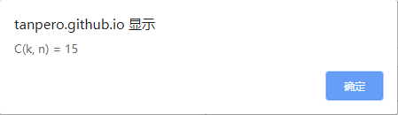

# 初探函数

---


## 化繁为简·函数的概念

------

### 函数的声明与调用

函数是 JavaScript 语言的基本组成之一，函数本身的意义很简单：按照我们的想法干一些事情。为了达到我们的目的，我们可能会提供给它一些信息或者数据，以供处理，可能会得到一个值，用以表示得到的信息或者处理得到的数据。

我们在小学时就已经学过如何计算一个圆的周长与面积。这个过程很简单：只需要知道它的半径，就可以计算出结果，从数据“半径”得到数据“周长”或“面积”。

- 数据总会变化，因此我们只需要关注计算过程本身。
- 当过程确定后，我们便不需要再重复进行计算过程的细节，只需要关注需要计算的数据。
- 由于计算过程是**确定**的——一个公式，我们可以把确定的过程写进一个函数里，之后计算时就不需要进行重复工作。

首先是圆的周长。我们知道它是 $$C = 2\pi r$$。

那么我们可以写出对应的 JavaScript 函数：

```javascript
r => 2 * Math.PI * r;
```

这是一个非常简单的函数。它可以分成两部分，箭头 `=>` 前的称为*参数列表*，用于说明将要参与计算的值的名称，而箭头后的内容是*函数体*，我们在函数体中进行具体的计算过程。

其中 `r` 是一个*形式参数*，表示将要参与计算的半径值，而函数体 `2 * Math.PI * r` 就是周长公式的 JavaScript 表达式形式，即 $$2\pi r$$。计算完成后我们将会得到一个值，由于它是函数计算后，“返回”给我们的数据，因此称为*返回值*。

但是，这里有一个问题：我们把公式写成了函数，那么该如何使用这个函数呢？

首先我们要把这个函数赋给一个标识符，这样它就有了名字。在 JavaScript 中，函数也是一种值，它的类型就是 `function`。

```javascript
let circumference = r => 2 * Math.PI * r;

// 现在函数的名字是 circumference
alert(typeof circumference); // "function"
```

给我们的函数取一个清晰、明了的名字是很重要的，这里 `circumference` 一词就是“周长”的意思。接下来，我们可以使用这个函数来进行计算了，这个过程称为*调用*。

```javascript
let value = circumference(10);
alert(value); // 62.83185307179586
```

调用函数时要使用的值称为*参数*。在示例中， `r` 是一种“形式上”的参数（类似于未知数），用于定义一个函数，因此叫作*形式参数*，简称*形参*。而调用时给予函数的值是实际参与计算的，因此叫作*实际参数*，简称*实参*。如，在这里的示例中，`10` 就是一个实参，它是 `r` 的实际值，函数体中的 `2 * Math.PI * r`就会变成 `2 * Math.PI * 10` 并进行相应计算。这个过程相当于数学意义上的“把值代入公式”。

我们不会对函数调用感到陌生，在前面的示例中，我们已经接触了许多函数，它们的共同特点是：**将复杂的细节隐藏起来，我们只需要按照既定的规则调用它们**。

```javascript
let a = circumference();
alert(a); // NaN，将 undefined 参与数学运算会得到它
let b = circumference(1, 2);
alert(b); // 6.283185307179586
```

定义一个函数时，需要使用的形参写在参数列表中，如果只有一个形参，那么只需写出它的名称，但如果需要零个或多个形参，就需要用小括号 `(` `)` 把参数列表包裹起来。

```javascript
let circumference = r => 2 * Math.PI * r;          // 正确
let circumference = (r) => 2 * Math.PI * r;        // 也行
let circumference = (r, a) => 2 * Math.PI * r + a; // 正确
let circumference = r, a => 2 * Math.PI * r + a;   // 错误，SyntaxError: Unexpected token =>
let circumference = () => 2 * Math.PI * 10;        // 正确（没有形式参数）
let circumference = => 2 * Math.PI * r;            // 错误，SyntaxError: Unexpected token =>
```

如果调用函数时一个形参没有得到实参，那么它的值就会是 `undefined`，而多余的实际参数则会被忽略。如果不需要任何参数，你仍然需要写上小括号 `(` `)` 以调用函数。

我们可以手动为形式参数指定一个默认值，如果调用时没有得到相应的实际参数，就会使用默认值。

```javascript
let circumference = (r = 2) => 2 * Math.PI * r;
alert(circumference(10)); // 62.83185307179586
alert(circumference(2));  // 12.566370614359172
alert(circumference());   // 12.566370614359172
```

这是一个打招呼的示例，用于说明参数默认值可以*向前依赖*。

```javascript
let greet = (name, greeting, message = greeting + " " + name) => {
    alert(`[${name}, ${greeting}, ${message}]`);
}

greet("David", "Hi");                     // "[David, Hi, Hi David]"
greet("David", "Hi", "Happy Birthday!");  // "[David, Hi, Happy Birthday!]"
```


------

Note：

如果函数体用大括号包裹，又写在一对小括号里面的话，那么大括号及其中的内容，会被当作一个对象字面量，而函数的返回值就是这个对象字面量。

------


### return 语句

我们已经初步了解了如何定义函数。然而，如果我们要执行一组操作而非一个简单的计算，例如将一个质数判断算法放进函数里面，函数体就会包括多行代码。而先前的函数定义语法只允许直接对一个表达式求值，当我们要写出更复杂的函数——包括循环结构、条件分支时，就需要考虑新的办法。

例如，我们要判断一个整数是否为奇数，可以像这样写：

```javascript
let isOdd = (number) => {
    if (number % 2 === 0) {
        return false; // 是偶数
    } else {
        return true;  // 是奇数
    }
}
```

这个函数使用了一点我们尚未了解的语法。首先，它的函数体是多行的，为了划分出函数体与外部的界限，我们需要使用一堆大括号 `{` `}` 将函数体中的语句包裹起来，就像之前所认识的各类语句一样。

在函数体中，我们使用 *return 语句* 来确定函数的返回值。

```javascript
return a;
```

这行语句说明了函数的返回值就是 `a` 的值。当 return 语句被执行后，这个函数的执行过程就结束了，如果后面仍然有其他语句，那么不再会执行。return 语句后接一个表达式，表达式的值就会是函数的返回值。

你也可以使用单独的 return 语句而不返回任何值，或者干脆不使用 return 语句来终止函数体。这时，函数的返回值会是 `undefined`。**注意：return 语句只能在带大括号的函数体内使用。**

用几个示例来说明 return 语句的使用：

```javascript
let a = () => {
    return 3;
};
let b = () => {
    
};
let c = () => {
    return;
}
let d = () => {
    return 1;
    return 2;
}

a();       // 3
b();       // undefined
c();       // undefined
d();       // 1
return 10; // SyntaxError: Illegal return statement
```

函数可以返回你想要的任何值，一般来说，出于程序的*正确性*的考虑，我们建议函数的返回值都为同一种类型的数据。

下面的函数返回了一个布尔值来表明参数 `n` 是否为偶数：

```javascript
let isEven = (n) => n % 2 === 0;
```

一旦定义了这个函数，就可以在 if 语句中使用它：

```javascript
if (isEven(i)) // 进行操作
```

返回布尔值的函数一般用于决定某个条件是否成立，我们将这类函数称为*判定函数*。更加复杂的判定函数如质数判断函数：

```javascript
let isPrime = (n) => {
    if (n === 2) {
        return true;
    }
    if (n % 2 === 0 || n === 1) {
        return false;
    }
    for (let i = 3, last = Math.sqrt(n); i <= last; i += 2) {
        if (n % i === 0) {
            return false;
        }
    }
    return true;
}
```

我们可以发挥出函数带来的便利性，将原来的 REPL 逻辑写得更清晰。

```javascript
let number;
do {
    number = parseInt(prompt("请输入一个正整数，输入 0 则退出循环"));
    if (number < 0 || isNaN(number) || !isFinite(number)) {
        alert("无法处理这个数字！");
        break;
    }
    alert(isPrime(number) ? `${number}是质数` : `${number}不是质数`);
} while (number !== 0)
```


------

练习 5.1.1

1. 在公历纪年法中，一个年份如果不能被 4 整除，那么它不是闰年，能被100 整除而不能被 400 整除的年份也不是闰年，能被3200整除的也不是闰年。如 2008 年是闰年，1900 年是平年，2000 年是闰年，3200 年不是闰年。

   编写一个判定函数，用于判断一个年份 `year` 是否为闰年。

------


### 函数的意义

函数在程序设计语言中扮演着重要的角色。首先，定义函数让编程者可以讲一段完成特定任务的代码仅编写一次，然后多次使用。因此，将完成特定任务的一系列代码组织成一个函数，不仅可以显著减少所须编写的重复代码、降低程序规模，而且使程序更清晰、易于维护。如果你要对函数实现的操作进行修改，你会发现只出现一次的代码回比贯穿整个程序的相同代码更容易修改。

即使函数只在程序中使用了一次，定义这个函数也是值得的。函数最主要的作用就是将一个大型程序拆分成多个易于管理的小部分。这一过程称为*分解*。以往的经验告诉我们，将整个程序写成一个庞大的代码块必然会导致一场灾难。而你所需做的是将一个高层次问题细分为一系列低层次的函数，每一个函数有其自己独立的功能。然而，找到问题正确的细分方法有很大的挑战，需要不断练习、思考与尝试。一个好的、独特的细分方法，会使每一个函数都是一个聚合紧密的单元，使得问题整体更加易于理解。如果选择了一个不好的分解方法，它将成为我们解决问题的阻碍。世上并不存在准确而快速的法则让我们找到最正确的问题分解方法。编程是一门艺术，好的问题分解策略主要来源于实际经验。

我们可以将整个程序视为一个整体，并尝试从中分析并抓取出其主要部分，再将它们定义为一些相互独立的函数。由于某些函数可能本身依然复杂，因此，通常需要将它们再分解为更小的部分。我们可以不断重复这一分解过程，直到每个问题足够简单明了以便于解决，这种方法称为**自顶向下的程序设计**。


### 作用域

在函数内声明的标识符不能在函数之外的任何地方访问，因为这个标识符被限制在了函数体的范围内。相对应的，一个函数可以访问定义在其范围内的任何标识符。声明在全局作用域中的函数，可以访问所有声明在全局作用域中的标识符。当一个函数 `b` 的定义位于另一个函数 `a` 中，那么 `b` 是一个*局部函数*，`a` 是 `b` 的*父函数*，`b` 是*嵌套*在 `a` 中的。在另一个函数中定义的函数，也可以访问在其父函数中定义的所有标识符和父函数有权访问的任何其他标识符。函数体所产生的限制称为*函数作用域*。

如果你忘记了“声明”与“定义”的关系，可以在这里复习一下它：

声明就是使用 `let`/`const` 说明一个标识符的名称，而定义则是将它赋予值。

现在我们假设一个标识符 `local` 的声明位于函数 `scope` 的函数体内：

```javascript
let scope = () => {
    let local = 100;
    alert(local);
    local = 200;
    alert(local);
}

scope();      // 100 
              // 200
alert(local); // ReferenceError: local is not defined
```

一切正常，我们会依次得到 `100` 和 `200`，当我们回到全局作用域时，由于 `local` 是局部变量，因此无法访问它，得到一个“未定义”错误。

那么，当外部的作用域已经存在一个名为 `local` 的变量呢？

```javascript
let local = 300;

let scope = () => {
    let local = 100;
    alert(local);
    local = 200;
    alert(local);
}

scope();      // 100 
              // 200
alert(local); // 300
```

我们实际上在 `scope` 函数体内重新声明和定义了另一个名为 `local` 的局部变量，因此我们会优先访问它，这是一种*优先原则*。假如我们没有在函数体内重新声明，只是单纯的重新赋值，那么我们将会改变外部作用域中 `local` 的值。

```javascript
let local = 300;

let scope = () => {
    local = 100;
    alert(local);
    local = 200;
    alert(local);
}

scope();      // 100 
              // 200
alert(local); // 200

```

JavaScript 中作用域内的优先原则是：从当前的作用域开始，如果能找到在当前作用域声明的标识符名称，那么使用它的值，否则就逐渐扩大到父级作用域去寻找这个标识符，直到全局作用域。

下面是一个使用了嵌套函数的例子：

```javascript
// 下面的变量声明在全局作用域
let num1 = 20,
    num2 = 3,
    name = "Jupyter";

// 本函数声明在全局作用域
let multiply = () => num1 * num2;

alert(multiply()); // 60

// 嵌套函数的例子
let getScore = () => {
  let num1 = 2,
      num2 = 3;
  
  let add = () => name + " scored " + (num1 + num2);
  
  return add();
}

alert(getScore()); // 返回 "Jupyter scored 5"

```

函数的形参会被当作是已经声明的局部标识符，你不能对它们进行重复声明，但是可以对它进行重新赋值，更改后的值只适用于当前作用域。

```javascript
let f = (a, b) => {
    alert(a);
    let a = 10; //  Identifier 'a' has already been declared
}

let f2 = (a, b) => {
    a = 10;
}
let t = 100;
print(f2(t)); // 10
print(t);     // 100

```


注意：如果在一个作用域内声明了一个标识符，那么在声明语句之前的地方也是无法访问到这个标识符的。这种现象称为*暂时性死区*。

```javascript
alert(a); // ReferenceError: a is not defined
let a = 10;

```

在函数作用域内自然也是一样。

```javascript
let scope = () => {
    alert(local);
    let local = 10;
}
scope(); // ReferenceError: local is not defined

```

即使外部作用域中已经有一个名为 `local` 的变量，由于函数作用域内只会优先访问声明位于本作用域的标识符，而声明语句前又无法知道这个标识符“是否被声明”，就会引发错误。


------

Note：

薛定谔的暂时性死区：被声明与没有声明同时叠加。

------


这个令人困惑的特性到此而已，不会为你带来更多困扰。


### function 关键字

你可能会在别的地方看到 `function` 关键字。事实上，它是 JavaScript 中一种老式的函数定义方法。

```javascript
let f = function (x) {
    return x + 1;
}
alert(f(2)); // 3

```

可以看到这种定义法实际上与我们前面所了解到的等价，只不过它不能省略参数列表的括号，必须使用大括号包裹函数体。除此之外，前文中所介绍的性质对于它都是适用的。

```javascript
let f  = function x {}; // SyntaxError: Unexpected token {
let f2 = function (x) { x + 1 };
alert(f2(1));           // undefined，因为 f2 没有返回值。
let f3 = function (x) {
    alert(m); 
}

```

前文中所介绍的声明函数的方式都是*函数表达式*，即写出一个函数具体的定义，并当作值（表达式）赋给标识符。而`function` 关键字的另一种使用形式是*函数声明*。

```javascript
function test (a) {
    alert(a);
}
test(100); // 100
```

在 2015 年以前我们必须使用这二者形式之一，但是现在我们可以使用新的更简洁优雅的语法——就像前文中所介绍的那样。


### 参数解构

JavaScript 中的函数支持*剩余参数*和*参数解构*，它们是用于简化逻辑的技巧，类似于解构赋值。

剩余参数的语法是在形参前加上三个点号 `...`，这个参数的值会是一个数组，用于存放“剩余的所有参数”。

```javascript
let f = (a, b, ...c) => alert(a + " " + b + " " + c);

f(1, 2, 3);      // 1 2 3
f(1, 2, 3, 4, 5) // 1 2 3,4,5
```

因为剩余参数是一个数组，你可以用常规方式操作它。

```javascript
let f = (...args) => alert(theArgs.length);
 
f();        // 0, 因为theArgs没有元素
f(5);       // 1, 因为theArgs只有一个元素
f(5, 6, 7); // 3, 因为theArgs有三个元素
```

剩余参数习惯于使用 `args` 命名，它是 `arguments` 一词的缩写，意为“实参”。

有一点需要注意：剩余参数不能设置默认值。因此以下写法会得到一个错误。

```javascript
let f = (...args = [10]) => alert(b);
// SyntaxError: Rest parameter may not have a default initializer
```

第三章中的解构赋值的技巧也可以适用于函数参数的定义。

```javascript
let f = ([x, y] = [1, 2], {z: z} = {z: 3}) => { 
  return x + y + z; 
}

f(); // 6
```


## 手可摘星辰·函数和算法

------

### 算法的基础

函数不仅是一种管理程序复杂性的工具，更为算法的实现提供了基础性的保障。算法在人类历史长河的智慧中诞生，历史上最著名的一个数学算法是以希腊数学家欧几里德的名字命名的。在欧几里德的数学著作《几何原本》中，他描述了一个求两个整数 x 和 y *最大公约数*（greatest common divisor, gcd）的过程，即一个可以同时整除 x 和 y 的最大整数的算法。例如，49 和 35 的 gcd 是 7，6 和 18 的 gcd 是 6，32 和 33 的 gcd 是 1.欧几里德算法可以描述如下：

1. 用 x 除以 y 并计算余数 r。
2. 若 r 等于 0，则算法结束，最大公约数是 y。
3. 若 r 不等于 0，则令 x 的值为 y，y 的值为 r。
4. 回到步骤 1。

这个算法可以很容易地用 JavaScript 代码描述：

```javascript
let gcd = (x, y) => {
    let r = x % y;
    while (r != 0) {
        x = y;
        y = r;
        r = x % y;
    }
    return y;
}
```

这个算法实现起来相当简单，但相比你自己可能发现的任何计算策略显得更有效率。事实上，欧几里德算法至今在包括网络安全的加密协议实现等很多情况下都得到了广泛的应用。

同时，我们很难清晰明确地看出该算法为什么会得到正确的结果。它的正确性已经在《几何原本》第七章命题二中得到了证明。虽然并不是总有证据来证明算法对计算机应用的驱动作用，但这些证据能让你对程序的正确性更有信心。

除了计算最大公约数以外，生活中我们还会不可避免的遇到一些算法问题，它们往往代表了我们需要解决和思考的一些实际问题。例如，当我们有了收入之后，会有意识地对财产进行储蓄或投资。银行或理财机构对于存款或投资的收益都做了详细的规划。如果我们要手动计算这些问题，不仅非常繁琐，还要冒着可能出错的风险。作为人类，我们只需要思考解决问题的方式，而重复性的繁杂工作都应该交给计算机来处理，使它根据我们的指挥更好地为我们服务。

定期存款的本金与总利息之和的计算遵循下面的公式：
$$
本利和＝本金(1 + 利率(\frac{存期}{12}))^{(时长/存期)}
$$
我们可以根据这个公式直观地写出用于计算的函数：

```javascript
let sum = (principal, rate, savingperiod, lastperiod) => {
    let value = principal * (Math.pow(
        (1 + rate * (
            savingperiod / 12
        )), 
        Math.floor(lastperiod / savingperiod))); 
    return value.toFixed(2);
};
```

这个函数具有四个参数，反映了实际应用中的复杂性，而函数起到的作用就是隐藏复杂性。`sum` 函数隐藏公式的算法细节细节，向外提供一个统一的计算方式。在进行计算时，我们应当且只应当关注每次计算时的值，而不必将精力放在实际的计算过程中，就像计算器提供的方便的数学函数，我们只需将它当成和四则运算没有什么区别的简单运算，当需要用到的值发生改变时，就改变它的参数——函数的意义就是这样简单。

- `principal` ：本金
- `rate`：利率
- `savingperiod`：存期
- `lastperiod`：时长

它的核心实际上只有一行表达式，但是它有些复杂，因此我们将其拆分成多行，以便于阅读。计算完成后，我们将得到的值取两位小数，就是最后的结果。

使用一些值来测试这个函数：

```javascript
alert(sum(100, 0.06, 5, 16));    // 107.69
alert(sum(1000, 0.01, 12, 19));  // 1010.00
alert(sum(520, 0.5, 3, 17));     // 937.06
alert(sum(10, 0.1, 6, 24));      // 12.16
alert(sum(6622, 0.087, 9, 31));  // 8004.68
```

就像我们在中学时学到的数学函数一样，`sum` 这样的函数可以简单地看做是结果与一组值之间的映射。它单纯地进行一些计算并返回一个值。


------

Note：

*纯函数*可以理解为一种**相同参数必定有相同返回值**的函数，而不会产生任何可观察到的副作用（如改变状态）。

纯函数诸如：`Math.cos` `sum` `gcd`

而 `Math.random` `prompt` `alert` 则是非纯函数。

------


### 组合函数

想象一下，假如我们在玩一个掷骰子游戏，我们手中有两枚骰子，每次同时抛掷，那么它们的随机点数共有多少种组合呢？


上图显示了 6 + 4 这一点数组合，而实际上我们也可能会得到 2 + 3，4 + 1, 6 + 3……共有十五种可能组合。作为一个编程者，应该思考一个更加普遍的问题：给定一个含有 $$ n $$ 个元素的集合，可以从中得到多少个包含 $$ k $$ 元素的子集？可以通过如下的*组合函数*（combinations function） `C(n, k)` 来得到答案：
$$
C(n, k) = \frac{N!}{k \times (n - k)!}
$$
其中，感叹号代表了阶乘函数，表明为从 1 到所指定的值中所有整数的乘积。我们可能还想查看对于更大的 $$ n $$ 和 $$ k $$ 而言有多少种组合，因此可以写出这样的程序来方便地计算。




这个程序分别向用户请求 $$ n $$ 和 $$ k $$ 的值，然后显示函数 `C(n, k)` 的值，代码实现如下。

```javascript
let fact = (n) => {
  let result = 1;
  for (let i = 1; i <= n; i += 1) {
    result *= i;
  }
  return result;
}

let combinations = (n, k) => {
  return Math.floor(
      fact(n) / (fact(k) * fact(n - k))
  );
}

let n = +parseInt(prompt("请输入组合物体的总数："));
let k = +parseInt(prompt("请输入每次组合的个数："));
let c = combinations(n, k);
alert(`C(k, n) = ${c}`);
```

正如你所看到的， Combinations 程序划分为两个函数，借用第四章中定义的 `fact` 函数来计算所需要的阶乘结果，再利用 `combinations` 函数计算 `C(n, k)` 的值。


### 回文识别

*回文*（palindrome）是指其字母排列正序与倒序均一致的词语，例如单词“level”或“noon”，本节的目的是编写一个判断函数以检测一个字符串是否属于回文。调用 `isPalindrome("level")` 应该返回 `true`；调用 `isPalindrome("xyz")` 应返回 `false`。

和大多数编程问题一样，这里有解决该问题的几种合理策略。根据我们的经验，可能首先尝试的方法是使用一个 `for` 循环依次读取字符串前半部分每一个索引位置上的字符。在每个位置上，代码将检测该字符是否与出现在字符串末尾对应对称位置的字符匹配。采取这种策略的代码如下：

```javascript
let isPalindrome = (str) => {
    let n = str.length;
    for (let i = 0; i < n / 2; i += 1) {
        if (str[i] !== str[n - i - 1]) {
            return false;
        }
    }
    return true;
}
```

简单测试一下它是否与我们的预期一致：

```javascript
alert(isPalindrome("level")); // true
alert(isPalindrome("xyz"));   // false
alert(isPalindrome("noon"));  // true
alert(isPalindrome(""));      // true
alert(isPalindrome(123));     // true
```

只有一个字符的字符串和空串本身就是回文，但是为什么数字 `123` 也会被检测为回文？这是因为数字的 `length` 属性为 `undefined`（不存在），对它进行除以二的运算会得到 0，因此 `for` 循环不会执行，直接返回 `true`，便有了这个怪异的结果。毫无疑问，我们应该对输入的数据进行检查，以确认它一定是我们需要的数据，这是编写任何函数都很重要的一个环节。

```javascript
let isPalindrome = (str) => {
    if (typeof str !== "string") {
        return false;
    }
    
    let n = str.length;
    for (let i = 0; i < n / 2; i += 1) {
        if (str[i] !== str[n - i - 1]) {
            return false;
        }
    }
    return true;
}
```

这个函数看起来有些长，我们可以考虑使用第三章中遇到的字符串与数组方法，用下面更简捷的形式编写 `isPalindrome` 函数：

```javascript
let isPalindrome = (str) => {
    if (typeof str !== "string") {
        return false;
    }
    return str === str.reverse();
}
```

最后一行的字面意义就是：如果字符串与它的逆序形式完全相等，那么它就是一个回文。不过，JavaScript 并没有为字符串提供 `reverse` 方法，我们只好先将其拆分为数组，使用数组的逆序方法，再组合成字符串，这样得到的就是字符串的逆序形式。

```javascript
let isPalindrome = (str) => {
    if (typeof str !== "string") {
        return false;
    }
    return str === str.split("").reverse().join("");
}
```

现在我们来测试一下。

```javascript
alert(isPalindrome("level")); // true
alert(isPalindrome("xyz"));   // false
alert(isPalindrome("noon"));  // true
alert(isPalindrome(""));      // true
alert(isPalindrome(123));     // false
```

嗯！一切都好。

在上述两种实现方式中，第一个版本更为有效。第二个版本必须构造一个数组和新的字符串，且其中的字符与源字符串中的字符顺序是相反的。更糟糕的是，它通过一个一个字符地拆分字符串、一个一个地逆序排列再一个一个地组合起来，创建了两个临时字符串和一个临时数组。第一个版本不需要创建任何字符串。它通过选择和比较字符串中的字符完成功能，这被证明是一种低代价的运算。

除了二者在效率上的不同外，第二种编写方式也有许多优点，特别是对于编程新手而言，可将其作为参考范例。其主要优点为：一方面，它通过使用 `reverse` 方法重用了已有的代码；另一方面，第一个版本需要字符串中字符的索引位置，而第二个版本则隐藏了涉及这方面的编程复杂性。对于大部分初学者，至少要花费一分钟或两分钟弄明白为什么代码中要包含下标访问表达式 `str[n - i - 1]` ，或者为什么它要在 `for` 循环检验中使用 `<` 操作符而不是 `<=` 。相比之下以下这一行代码：

```javascript
return str === str.split("").reverse().join("");
```

读起来几乎就和英语一样流畅：如果一个字符串，和它拆分成的数组的逆序形式看起来一样，则它是一个回文。

尤其是当我们正在学习编程时，致力于程序的简洁性比关注其执行效率更为重要。鉴于现在计算机的速度，牺牲几个 CPU 周期来使程序更易于理解是值得的。


### 中文数字

本节将讨论一个面向文本处理的简单算法应用，用于将阿拉伯数字转换为其汉字形式。

根据《五经算术》的记载，黄帝将数字分为“十等三法”。

> 十等者，谓“亿、兆、京、垓、秭、穰、沟、涧、正、载”也。
>
> 三法者，谓“上、中、下”也。
>
> 下数者，十十变之。若言十万曰亿，**十亿曰兆**，十兆曰京也。
>
> 中数者，万万变之。若言万万曰亿，**万亿曰兆**，万兆曰京也。
>
> 上数者，数穷则变。若言万万曰亿，**亿亿曰兆**、兆兆曰京也。

也就是说，汉语的大数单位有三种递进法则。

其中上法为自乘系统:，万万为亿，亿亿为兆，兆兆为京，以此类推。这种方式，希腊的阿基米德也采用过，写成科学计数法即：10^4^ => 万，10^8^ => 亿，10^16^ => 兆，10^32^ => 京。

二是中法，为万进系统，以万递进：万万为亿，万亿为兆，万兆为京，以此类推。写成科学计数法就是：10^4^ => 万，10^8^ => 亿，10^12^ => 兆，10^16^ => 京。

三是下法，为十进系统，以十递进：十万为亿，十亿为兆，十兆为京，以此类推。写成科学计数法即：10^4^ = >万，10^5^ => 亿，10^6^ => 兆，10^7^ => 京。

本节将采用中法来作为数字单位递进准则。因此，一个中文数字可以通过以下方式由阿拉伯数字构造：

- 将阿拉伯数字每四位为一组，每组从低到高的单位分别为 “”（个位），“万”，“亿”，“兆”，以此类推。
- 每组内的转换方法是一样的，比如 1234，就是"一千二百三十四"，加上对应的单位，如“万”，就是“一千二百三十四万”。

那么要做的第一件事就是将单位和基本数字存起来，按需取用。

```javascript
const nums  = ["零", "一", "二", "三", "四", "五", "六", "七", "八", "九"];
const units = ["", "十", "百", "千"];
const sections = ["", "万", "亿", "兆", "京", "垓", "秭", "穰", "沟", "涧", "正", "载"];
```

其中我们要注意一些细节：

- 结尾的零都忽略，如 1200，就是“一千二百”。
- 中间的零，只需要用一个零表示，如 1004，是“一千零四”。
- 如果整组都是0，忽略其单位。
- 如果一组在 10 到 19 之间，则十位可以省略一，即不写成“一十”；否则，十位上的“一”都要添加。如 12 就是“十二”，312就是“三百一十二”。

一个要点是：如果一个数字除以递进基数的余数不为 0，那么这个余数就是递进位后的数字，例如 ` 12 % 10 === 2`，那么 12 的次位就为 2，相应地转为为汉字“二”。大数的单位递进基数是 10000，因此我们将它除以 10000 并取余数，如 `12345 % 10000 === 2345`，那么“两千三百四十五”就是递进位“万“后的数字。

下面简要说明一下大致转换流程：

1. 我们首先会判断它是否为 0，如为 0 则直接得到 0，显然并不是。
2. 因此我们将它除以 10000（一万）并得到余数，它不会大于 9999，因此将其视为一组。
3. 使用另一个转换函数对这一组进行专门转换：
   1. 如果它大于 0，取其整除余数，如果余数为 0 那么填充“零”，并用一个标记记录，如果前面已跟着“零”那么就不会填充。
   2. 根据余数判断其汉字形式，然后根据数位决定单位，依次累积。
4. 一组转换完毕后，回到步骤 2，直到剩下的数向下取整为 0。

这里给出算法的完整实现。

```javascript
const nums  = ["零", "一", "二", "三", "四", "五", "六", "七", "八", "九"];
const units = ["", "十", "百", "千"];
const sections = ["", "万", "亿", "兆", "京", "垓", "秭", "穰", "沟", "涧", "正", "载"];

// 将每一组四位数字单独进行转换
const sectionToChinse = (section) => {
  let ins = "", str = "";
  let unitPos = 0, zero = true;
  while (section > 0) {
    let v = section % 10;
    if (v === 0) {
      if (!zero) {
        zero = true;
        str = nums[v] + str;
      }
    } else {
      zero = false;
      ins = nums[v];
      ins += units[unitPos];
      str = ins + str;
    }
    unitPos += 1;
    section = Math.floor(section / 10);
  }
  return str;
}

// 将数字分组并进行转换
const numberToChinse = (number) => {
  let unitPos = 0;
  let ins = "", str = "";
  let needZero = false;
  if (number === 0) {
    return nums[0];
  }
  
  while (number > 0)  {
    let section = number % 10000;
    if (needZero) {
      str = nums[0] + str;
    }
    ins = sectionToChinse(section);
    ins += (section !== 0) ? sections[unitPos] : sections[0];
    str = ins + str;
    needZero = section < 1000 && section > 0;
    number = Math.floor(number / 10000);
    unitPos += 1;
  }
  return str;
}

// 测试代码
let num = +parseInt(prompt("请输入一个数字："));
alert(numberToChinese(num))；
```

注意：由于算法中使用了除法，而 JavaScript 的除法具有精度限制，因此当数字太大时会因溢出给出错误的结果。如果这个整数不大于 16 位，那么结果应当是准确的。如果你还记得第三章中的相关内容，你应该会知道为什么。

来吧，使用一些数字来验证我们的算法吧。这个程序目前不支持负数，但我们可以做一些小小的改进来使转换函数对于负数依然有效。这是一个小练习。