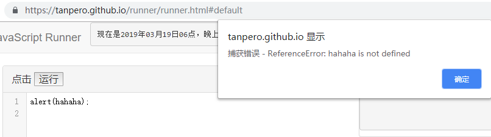
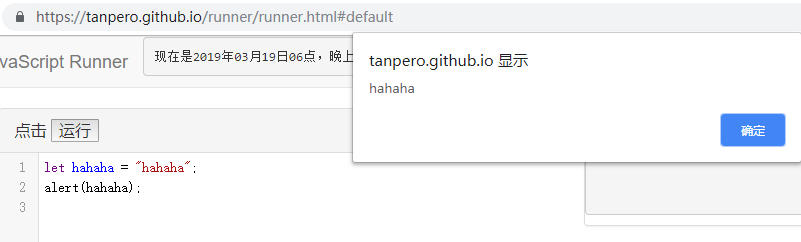
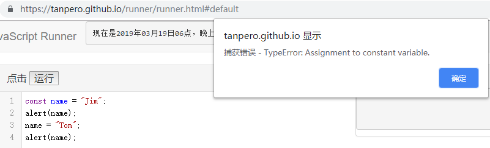

## 初探 JavaScript

---

### 表达式与值

从字面上解释，表达式就是一个形如 `1 + 2` ，`3 * 18 + 1`，`"hello" + "world"`，这样的东西，它是 JavaScript 语言中的基本结构。它会执行一些运算，包括四则运算、利用 `alert` 函数来弹出对话框之类。

表达式的基本特征是会得到一个**值**。这个值可以是数字，可以是字符串，可以是用于判断真假的逻辑值，也可以是表示“没有值”的 `null` 和 `undefined`（我们将在第三章详细讲到）。

当我们上小学数学课，在本子上写下一行算式的时候，我们便写下了表达式。从小就学到的表达式写法在 JavaScript 也是相同的。例如，当我们要计算 `1 + 3`，我们可以就这么写：`1 + 3;`

但是我们很快就意识到了一个问题。我们这么写了，在哪里可以看到它的值呢？毕竟前面说过**表达式会得到一个值**。我们可以这样查看：

`alert(1 + 3);`

就是这样！我们会看到一个对话框，上面显示的就是我们刚刚计算得出的 `1 + 3` 的值。

现在让我们来温习一下小学学过的简单数学吧。

| 符号 | 运算           |
| - | -- |
| `+`  | 加法 |
| `-`  | 减法或取相反数 |
| `*`  | 乘法         |
| `/`  | 除法        |
| `%` | 求整除后的余数 |
| `**` | 乘方 |

下面是一些示例。

`alert(18 + 14 * 5);`

`alert(24 - 112);`

`alert(1 / 3);`

`alert(-10 * 15);`

`alert(Math.PI);`

`alert(0xf + 1);`

`alert(20 % 8);`

`alert(20 ** 3);`

其中，`Math.PI` 是一个预定义的值，它表示圆周率 $π$ 近似值；最后一行代码中的 `0xf` 是一个*十六进制数*，它的值就是 `16`，我们会在第三章讲到它。

运行上面的代码试试，是否与你想的一致？

我们也可以用 `+` 符号来拼接两段文本，使它成为我们想要的形式。如：

`alert("Hello " + "world");`

`alert(" I am " + 120 + "years old.");`

`alert("十六进制数 0xefef 的值是" + 0xefef);`

另外，在 JavaScript 中，`alert(xxx)` 这样的*函数调用*也是表达式，像其它的一样，它也会得到一个值。`alert()` 得到的是 `undefined`，我们会在后面的章节中慢慢了解。

我们已经初步了解了 JavaScript 中的表达式，接下来的*变量*与*常量*能使我们灵活地干更多的事情。


### 变量与常量

**变量**

在 JavaScript 中，我们可以使用*变量*来存放一个值，这个值随时可以被改变。变量的定义像下面这样：

`let a;`
`a = 10;`

我们使用关键字 `let` 来表示一个变量声明的开始。`let a` 会产生一个名为 `a` 的变量，我们将这一步叫做**变量声明**，随后的 `a = 10;` 会把 10 这个值放进变量 `a` 中，这个过程叫**赋值**。

变量声明与赋值是两个过程，一个变量只能被声明一次，但是可以被多次赋值。正如它的名称所示，它的值是可以变的。第一次的声明与赋值可以被写到一行语句中：

`let a = 10;`

我们可以像这样改变它的值：

`a = 100;`

`a = "Hi";`

`a = 12 * 3;`

为变量赋值之后，我们可以像通常的表达式那样使用它：

```javascript
let a = 10;
alert(a);
a = a + 1;
alert(a);
alert(a + 2);
```

显示的结果分别为 10,11 和 13。

假如我们使用了一个从未出现的变量，会产生一个错误：



如果我们已经给 `hahaha` 赋值，那么可以使用它，不会产生错误，但是我们非常不推荐这种做法，使用变量前一定要记得声明。



你或许曾在别的地方见过另一种声明变量的方式：

`var a = 10;`

`var` 关键字是 JavaScript 曾经使用的变量声明方式，但是这种方式存在一些缺陷，在2015年发布的新标准中被 `let` 所取代，一些细节我们会在后面谈到。我们理解它的含义即可，不建议使用它。

**常量**

顾名思义，*常量*与变量类似，但是它的值是不可改变的。也就是说，只能赋值一次，之后如果尝试改变它的值，会产生一个错误。

第一次调

用 `alert` 会正常显示 `name` 的值 `"Jim"` 。随后的赋值语句会带来如图所示的错误，并中断代码的执行，因此最后一行语句不会被执行。

常量的使用场景一般是强制某些不应改变的值**不可改变**，可以避免失误造成原有值被覆盖的情况。为了带来明显的视觉效果以与通常的变量区分，我们一般会使用大写字母来书写常量名称，并使用下划线“_”来连接常量名中包含的单词。

```javascript
const MY_BIRTHDAY = "2005-2-6";
alert(MY_BIRTHDAY);
```

**标识符**

JavaScript 中的变量名或常量名必须是合法的*标识符*。一个合法的标识符应当以以下字符开头：

A B C D E F G H I J K L M N O P Q R S T U V W X Y Z

a b c d e f g h i j k l m n o p q r s t u v w x v z $ _

即二十六个英文大小写字母以及美元符号和下划线。

而其后跟随的字符可以是：

A B C D E F G H I J K L M N O P Q R S T U V W X Y Z

a b c d e f g h i j k l m n o p q r s t u v w x v z $ _

0 1 2 3 4 5 6 7 8 9

即二十六个英文大小写字母、美元符号、下划线和十个阿拉伯数字。

除此之外的字符一般是非法的，使用非法字符会造成不可预知的错误。

一个合法的标识符不能与已有的保留字发生冲突。保留字是一些单词，已经语言内定义以起到特殊目的，或者可能在将来被使用，因此被语言保留。如果你使用它们作为标识符，会发生语法错误。


**JavaScript 保留字**

|          |           |            |           |              |
| -------- | --------- | ---------- | --------- | ------------ |
| abstract | arguments | boolean    | break     | byte         |
| case     | catch     | char       | class     | const        |
| continue | debugger  | default    | delete    | do           |
| double   | else      | enum       | eval      | export       |
| extends  | false     | final      | finally   | float        |
| for      | function  | goto       | if        | implements   |
| import   | in        | instanceof | int       | interface    |
| let      | long      | native     | new       | null         |
| package  | private   | protected  | public    | return       |
| short    | static    | super      | switch    | synchronized |
| this     | throw     | throws     | transient | true         |
| try      | typeof    | var        | void      | volatile     |
| while    | with      | yield      |           |              |


除此之外，有一些 JavaScript 中预定义的函数、常量等也不应当被用作标识符，包括 `Object` `Ininity` `undefined` `isNaN` 等。


### 输入与输出

提供输入与输出数据的功能，是任何一种编程语言的基本设施。试想一下，假如我们的程序无法使用输入输出的功能——确切地说，无法与外界进行数据交换，那么它能做什么呢？什么也做不了！它也许可以静静地计算一个表达式的值，可以执行一个循环与条件判断，但是我们将始终无从得知它的最终工作，这个程序也就不会有存在的意义。输入与输出非常重要，也充满灵活性。

JavaScript 的语言标准（即 ECMAScript）并没有规定用于输入与输出的方式。浏览器为我们提供了两个简单的函数：`alert` 和 `prompt` ，以便进行基本的信息输出和输入。


**`alert` 和 `prompt`**

`alert` 我们已经见过很多次了。当我们简单地想要输出一条信息，比如显示一条表达式的计算结果，或者干其他的什么事情，我们可以使用它。在实际应用中我们有更复杂和标准的信息输出方式，但是现在我们使用 `alert` 就足以满足我们需要了。

`prompt` 这个函数我们已经在前面的代码示例中见过了，它可以弹出一个对话框，要求用户输入一点内容，然后得到这个内容，它的使用形式如下：

`let xxx = prompt();`

变量 `xxx` 中存放的就是我们获取到的内容。

但是它弹出的对话框什么提示也没有，只有一个简单的输入框。试想一下，假如别人使用你的程序，突然就看到这么一个框，什么也没有提示，会觉得丈二和尚摸不着头脑，对吧？更有可能，我们想要一个表示年龄的数字，用户却稀里糊涂地输入了一个手机号码。

我们可以给 `prompt` 的对话框加一条简单的提示语，来表明我们要干的事情，像这样：

`let xxx = prompt("请输入你的年龄：");`

这是使用 `prompt` 函数的另一种形式，变量 `xxx` 即是我们获取到的内容。


我们可以用一些简单的示例来尝试我们刚刚了解到的东西：

```javascript
alert("我们将收集您的身高数据以计算您的标准体重。");
let height = parseFloat(prompt("请输入您的身高（单位：厘米）："));
let weight = (height - 100) * 0.9;
alert("您的标准体重是：" + weight);
```

其中 `parseFloat` 函数会从文本中获取一个数字，将在第三章讲到。

你可以自己试着测测你的标准体重哦！


这是另一个实用性的例子，更好地练习我们刚刚所学内容：

```javascript
// 计算圆的面积与周长。
let r = parseFloat(prompt("请输入圆的半径："));
alert("圆的面积是：" + r * r * Math.PI);
alert("圆的周长是：" + r * 2 * Math.PI);
```


### 注释

在编写 JavaScript 代码时，你可以在代码周围插入一些说明性的文字，它们被称为*注释*。

以下是一个在代码中应用注释的例子：

```javascript
let a = +prompt(); // 获取第一个数字
let b = +prompt(); // 获取第二个数字
alert(a + b) // 计算并展示 a + b 的值
```

在代码中， `//` 标记被用于说明一个*单行注释*的开始。它意味着之后的整一行代码都会被忽略掉，因此你可以在里面写上任何东西，当然更多情况下我们只是用于说明该行代码的功能。

假如我们需要写很多行东西来解释和说明我们的代码，或者是充当一个临时备忘录，我们可以相应地使用*多行注释*，如下所示：

```javascript
/* 交换两个变量的值。
作者：杨雨露
日期：2019-3-19
备注：无
*/
let a = prompt();
let b = prompt();
let temp = a;
a = b;
b = temp;
alert("a = " + a + ", b = " + b);
```

在一对 `/*` 与 `*/` 之间的所有东西都会被忽略掉，同样，你可以在里面写上任何东西。从第一个 `/*` 开始，一旦遇到一个 `*/` ，就意味着注释内容已经结束了，其后如果再出现单独的 `*/` ，就会被认为是一个语法错误。

如下所示：

```
/* 第一行注释
第二行注释
/* 第三行注释（这行开头的 /* 同样会被忽略）
第四行注释
现在多行注释结束了： */ 

*/ // 嘿，多余的 */ 会被当成语法错误！
```


总结：**` //` 注释用于一行，`/* */` 注释用于一段。**