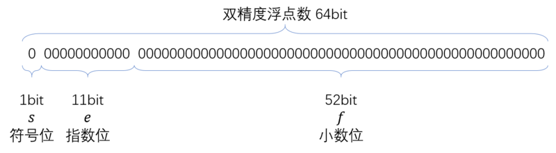

# 基本数据

---


## 万物原动力·逻辑

------

### 布尔值

小的时候，我们认为一张白纸只有两面，一个人只有好人坏人的区别，这个世界只有黑白两种颜色，说的话只有真假之分。现在，我们也可以说：逻辑——所有的逻辑，本质上都是一个靠真与假驱动的世界。真，则一往直前；假，则回归起点。JavaScript 提供了 `true` 来表示所有的“真”，`false` 来表示所有的“假”。他们便是一个真与假的二元世界。`true` 和 `false` 被称为布尔值，用以纪念 19 世纪为逻辑学做出杰出贡献的 George Boole。

在 JavaScript 中，布尔值属于 `boolean` 类型。你可以直接使用它们来明确地表示真假、是非，也时常会隐藏在一串逻辑表达式中，作为它背后的力量。

```javascript
alert(true);  // true
alert(false); // false
```


### undefined 和 null

先来看四个句子：

杨雨露有个姐姐，她叫杨雨晴。

杨雨露没有姐姐。

杨雨露不知道自己有没有姐姐。

杨雨露有姐姐，但是不知道姐姐在哪。


 JavaScript 为第二种情况提供了 `null`，为第三、四种情况提供了 `undefined`。


`null` 和 `undefined` 是 JavaScript 定义的两个特殊值，分别表示

1. 一个空值。

   这个可能需要一个值，但是明确地知道”这是空的“，用 `null` 来表示空值。

2. 未发现需要的值。

   这个地方不知道有没有值，用 `undefined` 来表示”未定义“。

`null` 是 JavaScript 的*关键字*，如果对它进行声明或赋值操作会产生错误。

```javascript
let null; // SyntaxError: Unexpected token null
null = 1; // ReferenceError: Invalid left-hand side in assignment
```

`undefined` 不是一个明确定义的保留字，如果尝试对它赋值不会产生错误，但它的值也不会改变。

```javascript
alert(undefined); // undefined
undefined = 0;    // 不会产生错误
alert(undefined); // undefined
```

由于 `undefined` 在使用前已经存在，如果对它进行重复声明或赋值，可能会产生错误，也可能不产生错误，可能会赋值成功也可能失败，这是一个语言缺陷。请避免重定义 `undefined`。


------

Note：

在全局上下文中 `undefined` 不允许被重复声明。如果重复赋值，`undefined`的行为是未定义的。而在局部作用域上下文中，`undefined` 可以被重新声明和赋值，它的表现像一个预定义但没有声明的变量，存在暂时性死区。

但很显然，这没什么用。

我们的运行器提供了一个特制的局部上下文，因此：

```javascript
alert(undefined);  // ReferenceError: Cannot access 'undefined' before initialization
let undefined = 0;
alert(undefined)； // 0
undefined = 3;
alert(undefined);  // 3
```

------


我们可以使用表达式 `void 0` 来得到最“纯粹”的 `undefined` 值。并且我们也推荐这种方法——它写起来更简短！

```javascript
alert(void 0);    // undefined
undefined = 0;
alert(undefined); // 0
alert(void 0);    // undefined
```

如果我们声明了一个变量却没有给它赋予任何值，那么它的默认值就是 `undefined` ——即“未定义”。

```javascript
let a;
alert(a);  // undefined
```


------

练习 3.1.1

1. 举出生活中可以分别用 `null` 和 `undefined` 描述的例子。
2. 尝试了解在 JavaScript 的创造过程中，`null` 和 `undefined` 分别是怎样出现的。

------


### 逻辑运算

很多人觉得逻辑冰冷而机械死板，正是如此。因此，它才有用。人类易被感情左右，但计算机不同。正是因为冰冷且机械死板，计算机才会一直稳定运行，为我们所用。

逻辑的本质是真与假的组合。在 JavaScript 中，以下值都会被视为“假”：

`false NaN 0 "" '' null undefined`

除了以上的“假”值，其他自然都是“真”值。关于 0 、特殊数值 NaN、字符串的概念将在下文中讲到。

真值都可以被看做 `true`，假值都可以被看做 `false`。这两个布尔值是逻辑的基本组成部分，简单的逻辑自然也可以组合成更复杂的逻辑，这个组合的过程我们称为*逻辑运算*。与、或、非是三个基本的逻辑运算，JavaScript 提供了它们的运算符  `&&`  `||`  和 `！`。这三个运算得到的值与参与运算的值有关，但是得到的还是参与运算的值本身，而不一定是布尔值。


1. **&& （与）**

- 如果两个条件都为 `true`，那么得到 `true`，否则得到 `false`。

它和我们平时说话时“如果……并且……”是类似的，即判断两个条件是否都*成立*，

```javascript
alert(true && false);    // false
alert(true && true);     // true
alert(false && false);   // false
```

很容易理解，对吧！但事实上，`&&` 不一定会得到一个布尔值。它得到的值与用来运算的值有关，如果运算的值不是布尔值，它也不一定得到一个布尔值，而是根据值本身被看做“真”或被看做“假”来决定得到什么值。

它的具体运算方式如下：

- 如果第一个条件被视为 `true`，而第二个条件被视为 `false` ，那么得到第二个条件的值。
- 如果两个条件都被视为 `true`，那么得到第二个条件的值。
- 如果第一个条件被视为 `false`，那么得到第一个条件的值。

示例：

```javascript
alert(0 && true);        // 0
alert(true && 0);        // 0
alert(0 && false);       // 0
alert(false && 0);       // false
alert(100 && 0);         // 0
alert("Hello" && "")     // ""
alert(null && undefined) // null
alert(100 && NaN)        // NaN
```


2. **||（或）**

- 两个条件中只要有一个为 `true`，那么得到 `true`，否则为 `false`。

它和我们平时所说的“如果……或者……”是等价的。

```javascript
alert(true || false);    // true（第一个条件的值）
alert(true || true);     // true（第一个条件的值）
alert(false || false);   // false（第二个条件的值）
```

和 `&&` 类似，`||` 也不一定得到一个布尔值，而是根据它所运算的值被看做“真”还是看做“假”来得到值。

它的具体运算方式如下：

- 如果第一个条件被视为 `true`，那么直接得到第一个条件的值。
- 如果第一个条件被视为`false`，那么得到第二个条件的值。

示例：

```javascript
alert(0 || true);        // true
alert(true || 0);        // true
alert(0 || false);       // false
alert(false || 0);       // 0
alert(100 || 0);         // 100
alert("Hello" || "")     // "Hello"
alert(null || undefined) // undefined
alert(100 || NaN)        // 100
```

换句话说，如果第一个条件为“真”，那么就符合“或”的条件了，不必再判断下一个。如果第一个条件为假，就需要将第二个条件作为整个运算得到的值。


3. **!（非）**

- 如果值为 `true`，那么得到 `false`，否则得到 `true`。

它确实得到一个布尔值，具体运算方式如下：

- 如果条件被视为 `true`，那么得到 `false`。
- 如果条件被视为 `false`，那么得到 `true`。

示例：

```javascript
alert(!true);       // false
alert(!false);      // true
alert(!0);          // true
alert(!100);        // false
alert(!NaN);        // true
alert(!"");         // true
alert(!undefined);  // true
alert(!!0);         // false
alert(!!null);      // true
```

因此，!! 两个非运算重复进行，得到的值就是条件本身的布尔值描述形式，即被看做“真”还是“假”。


**运算符优先级**

当 `&&` `||` `!` 三个运算符同时在一个表达式中，运算过程遵循**操作符优先级**。! 操作符具有最高的优先级，即在一个表达式中它所属的式子总是被最先计算，其次是 `&&`，`||` 的优先级最低。

```javascript
alert(10 && !5);           // false
alert(!5 && 10);           // false
alert(!5 || 6 && 7);       // 7
alert(5 || 6 && 7 || 8);   // 5
alert(5 && 6 || 7 && 8);   // 6
alert(!5 || !6 || 7 && 8); // 8
```

在第三行代码中：

1. `!5` 由于具有最高的优先级，被最先计算。由于它是 `false`，且是 `||` 的第一个条件，因此会继续计算位于 `||` 右侧的第二个条件。
2. 由于 `&&` 的优先级大于 `||` ，因此会计算 `6 && 7`，结果为 `7`，那么 `||` 的第二个条件就是 `7`。
3. 因此整个逻辑表达式的结果就是 7。

在第四行代码中：

1. 5 被视作 `true`, 因此 || 运算符不会查看第二个条件。
2. 结果为 5。

在第五行代码中，首先从左往右运算，`5 && 6` 的值为 6，则 `||` 的第一个条件为 6，最后结果为 6。

在第六行代码中：

1. !5 为 `false`，`||` 运算符会查看第二个条件。
2. 由于 ! 具有最高的优先级，!6 会先得到计算，结果为 `false`。
3. 那么 `!5 || !6` 的值为 `false`。
4. 第二个 `||` 操作符会查看右边的条件。
5. 由于 `&&` 的优先级大于 `||` ，会先计算 `7 && 8` 的值，值为 `8`。
6. 那么右边的条件为 8。
7. `false || 8` 的值为 8。

在实际应用中，我们可以使用括号 `(` `)` 来更改默认的运算符优先级。使用了括号的示例如下：

```javascript
alert((5 || 6) && (7 || 8));   // 8
alert(5 && (6 || 7) && 8);     // 8
alert(5 && 6 && (7 && 8));     // 8
```


一个操作符后使用括号括起来的内容是一个整体，会先计算括号中表达式的值，这个值作为该操作符的条件进行下一步计算。因此，在第一行代码中：

1. `(5 || 6)` 作为一个整体会被计算，值为 6。
2. 6 成为了 `&&` 的第一个条件。`&&` 会查看第二个条件。
3. 第二个条件是 `(7 || 8)`，值为 8，所以第二个条件是 8。
4. `6 && 8` 结果为 8。

你可以尝试演算另两行代码的运算过程。

------

练习 3.1.2

1. 计算如下代码的值：

   `(18 || 24) && (15 && 0) || 6 || !12`

2. 计算如下代码的值：

   `!(15 || 0) && !(12 && !12) `

3. 计算如下代码的值：

   `18 && (!(15 || 10) && (15 && 10))`

------


### 条件表达式

条件表达式是一种*三目运算符*，它需要三个操作数。格式如下：

`a ? b : c`

如果 `a` 被视作 `true`，则这个表达式的值为 `b` ，否则为 `c`。

示例：

```javascript
let a = 0;
alert(a ? "Hello" : "Hi"); // "Hi"
```

条件表达式的运算符具有最低的优先级。也就是说，如果 `a` `b` `c` 都是其它表达式，那么一定会先计算出 `a` `b` `c` 的值，再得到条件表达式的值。一般来说，如果 `a` `b` `c` 都是表达式，我们推荐给用括号进行包裹以避免混淆。

------

练习 3.1.3

1. 计算下列条件表达式的值：

   `(!(15 || 10) && (15 && 10))  ? "Hello" : "world"`

2. 计算下列条件表达式的值：

   `(15 || (true && NaN) || !Infinity && (!NaN || 12))) ? "Jim" : "Tom"`

------


## 宇宙谐和论·数值

---

人类生活开不开数值和数值运算。在 JavaScript 中，数值是一类非常基本的值。关于它的意义我们无需多言，这里，我们将逐步探索 JavaScript 中有关数值和数值运算的各类细节。


### 数值的表示

JavaScript 中数值的十进制表示法与我们平时所使用的基本相同，如 121，-623，91902.34688，等等。

除了十进制以外，JavaScript 还支持处理二进制、八进制、十六进制数字。这里简要介绍一下进制的概念。

十六进制（Hexadecimal）指逢16进1位的表示方法（通常的十进制是逢10进1），在十个阿拉伯数字之外，它还拓展了 a b c d e f 六个符号。0 ~ f 分别对应十进制的 0 ~ 15，十六进制的 10 就相当于十进制的 16 。十进制与十六进制的关系类似下面这样：

| 十六进制 | 十进制 | 十六进制 | 十进制     |
| -------- | ------ | -------- | ---------- |
| 0        | 0      | b        | 11         |
| 1        | 1      | c        | 12         |
| 2        | 2      | d        | 13         |
| 3        | 3      | e        | 14         |
| 4        | 4      | f        | 15         |
| 5        | 5      | 10       | 16         |
| 6        | 6      | 1f       | 31         |
| 7        | 7      | ff       | 255        |
| 8        | 8      | abc      | 2748       |
| 9        | 9      | feff     | 65279      |
| a        | 10     | ffffffff | 4294967295 |

在 JavaScript 中使用十六进制数时，为了避免与标识符混淆，我们需要在数字前面加上前缀 `0x`，如：

0xff 0xfeff 0x1800 0xabcdef 0xffeeffee 0xcccccccc 0x5cf423

你可以使用 `alert` 函数来显示它们对应的十进制形式。

八进制和二进制的原理与十六进制类似，所不同的是：

- 八进制数字前需加上前缀 `0` 或 `0o`
- 二进制数字前需加上前缀 `0b`


### 数值的精度

众所周知，计算机中任何数据都是以二进制形式被存储和识别，数值自然不例外。JavaScript 中的数值类型被称为 `number` ，它的实现遵循国际标准 IEEE 754，被称为*64位双精度浮点数*。

根据 IEEE 754 的规定，一个64位双精度浮点数的存储方式如下：



由上图可知，JavaScript 中任何数值类型都使用 64 个二进制位来存储和表示。其中左数第一位记录了这个数值的正负符号，其后 11 位代表了这个数值的*指数位*，其后 52 位为小数位。

64 位双精度浮点数可以提供一个相当大的可供使用的数字范围。这个范围的上限约是 1.7976931348623157E+308，若遇到大于这个值的数值会导致*溢出*，即超出了 64 位双精度浮点数的最大可表示范围，JavaScript 中使用一个特殊值 `Infinity` 来表示溢出了的值，即“无穷大”。可用数值范围的下限自然是 -1.7976931348623157E+308，小于这个值的溢出数字则会表示为 `-Infinity` 。`±Infinity` 与除 `NaN` 之外的任何数值进行运算，结果依然是 `±Infinity` 。在实际使用中，你当然不用直接写出 ±1.7976931348623157E+308 这对极限值，JavaScript 提供了特殊的名称 `Number.MAX_VALUE` 来表示最大可表示的正数，`-Number.MAX_VALUE` 则是负数的下限。

JavaScript 提供了一个函数 `isFinite` 来判断给定值是否为有限 。

```javascript
alert(isFinite(Infinity));         // false
alert(isFinite(Number.MAX_VALUE)); // true
alert(isFinite(123));              // true
```

同样地，JavaScript 中的数字不能极限逼近 0 。绝对值最小的可表示数值是 5E-324 ，它是能够表示的最接近 0 的数。JavaScript 提供了特殊名称 `Number.MIN_VALUE` 来保存这个极限值。如果进一步缩小这个值，会发生溢出，导致舍入为 0。

```javascript
alert(Infinity);                // Infinity
alert(Infinity + 1);            // Infinity
alert(-Infinity + 1);           // -Infinity

alert(Number.MAX_VALUE);        // 1.7976931348623157e+308
alert(Number.MAX_VALUE + 1);    // 1.7976931348623157e+308
alert(Number.MAX_VALUE * 1000); // Infinity
alert(Number.MAX_VALUE / 1000); // 1.7976931348623157e+305

alert(Number.MIN_VALUE);        // 5e-324
alert(Number.MIN_VALUE - 1);    // -1
alert(Number.MIN_VALUE * 1000); // 4.94e-321
alert(Number.MIN_VALUE / 1000); // 0
```


在 JavaScript 中，你可以随意使用 2<sup>-53</sup>+1 到 2<sup>53</sup>-1 之间的所有整数，它们本身都是能够精确表示的。介于 2<sup>53</sup>+1 和 `Number.MAX_VALUE` 之间也可以使用科学计数法表示一些整数。越接近 `Number.MAX_VALUE` ，能够精确表示的数越稀疏，其它的则会被近似处理。2<sup>53</sup>-1 和 2-<sup>53</sup>+1 是可精确表示整数的上下限，JavaScript 提供了一对名称 `Number.MAX_SAFE_INTEGER` 和 `Number.MIN_SAFE_INTEGER` 来保存这对上下限，我们将处于这对上下限中的整数称为“安全整数”。一般情况下我们只与安全整数打交道。

除了安全整数以外的数字，我们将在下文中称为*浮点数*。浮点数包括小数和其他不属于安全整数范围内的数字（不包括 `NaN` 和 `±Infinity`。

```javascript
alert(Number.MAX_SAFE_INTEGER); // 9007199254740991
alert(Number.MIN_SAFE_INTEGER); // -9007199254740991
```

在可精确表示的数值中，小数点后的位数最多可保存 16 位，如果实际位数多于 16 位，则会被舍弃。

```javascript
alert(1 / 3); // 0.3333333333333333
```

由于64位双精度浮点数在运算方式上的一些特性，有些小数运算会出现一些看起来有些诡异的误差。

```javascript
alert(0.1 + 0.2); // 0.30000000000000004
alert(0.2 + 0.4); // 0.6000000000000001
alert(0.3 + 0.6); // 0.8999999999999999
```

这类误差的产生涉及到浮点数的内部处理机制，限于篇幅不展开解释。在使用浮点数的时候注意到这种坑就行了。JavaScript 提供了一个*非常小*的特殊数值来表示这类误差，名为 `Number.EPSILON` 。如果计算结果减去目标值所得的值（可能为误差）小于 `Number.EPSILON`，即可确定计算结果与目标值实际上相等。

```javascript
alert(Number.EPSILON);                   // 2.220446049250313e-16
alert(0.1 + 0.2 - 0.3 < Number.EPSILON); // true（表示确认）
alert(0.2 + 0.4 - 0.6 < Number.EPSILON); // true
alert(0.3 + 0.6 - 0.9 < Number.EPSILON); // true
```


### 基本运算

JavaScript 中提供了一批运算符以供进行常见的数值运算。

加法运算： `+`

减法运算：`-`

乘法运算：`*`

除法运算：`/`

求余运算：`%`

乘方运算：`**`

正、负号：`+` `-`

如果一个值使用运算符进行运算，我们称它为*运算数*。通过运算得到结果的过程称为*求值*。JavaScript 会对任何表达式进行求值。

```javascript
let a = 10, b = 5;
alert(a + b);  // 15
alert(a - b);  // 5
alert(a * b);  // 50
alert(a / b);  // 2
alert(a % b);  // 0
alert(a ** b); // 100000
```

在 JavaScript 中，数值除以 0 会得到 `Infinity`。

```javascript
alert(3 / 0);  // Infinity
alert(-3 / 0); // -Infinity
```

你可以给一个数值自由地加上正负号，就像在草稿纸上做的那样。

你可以在一个非数值的值前加上 `+`，将它转换为一个数值。如果转换失败，就会得到 `NaN`。`NaN` 将在下文解释。

```javascript
let a = "123";
alert(+a)   // 123
alert(+"3a"); // NaN
```

但是！有件事情请务必记住：在 JavaScript 中，**你不能直接将负数当作乘方运算的底数**，否则会得到一个冗长的语法错误，这是为了避免*优先级冲突*，造成歧义。你可以用括号将负数包裹起来。

```javascript
alert(-10 ** 6); // SyntaxError: Unary operator used immediately before exponentiation expression. Parenthesis must be used to disambiguate operator precedence

// 浏览器认为你可能是想写出这样的表达式：-(10 ** 6)
alert((-10) ** 6); // 1000000
alert(-(10 ** 6)); // -1000000
```

JavaScript 提供了一批运算符来比较两个数值的关系。它们被称为*关系运算符*。

| 操作符 | 名称       |
| ------ | ---------- |
| ===    | 严格相等   |
| !==    | 严格不相等 |
| >      | 大于       |
| <      | 小于       |
| >=     | 大于等于   |
| <=     | 小于等于   |

这些操作会得到一个布尔值，用以决定下一步的逻辑。

```javascript
alert(10 === 20); // false
alert(10 !== 20); // true
alert(10 > 20);   // false
alert(10 < 20);   // true
alert(10 >= 20);  // false
alert(10 <= 20);  // true
```

有了关系运算符，结合条件表达式和逻辑运算，我们可以写出一些判断逻辑。

```javascript
// 判断两个输入数值的大小
const a = +prompt("请输入第一个值。");
const b = +prompt("请输入第二个值。");
let cond = a > b ? a : b;
alert(cond + "更大。");

// 判断两个输入数值是否相差 20 以上。
const a = +prompt("请输入第一个值。");
const b = +prompt("请输入第二个值。");
let c = a - b;            // 求两数之差。
let sub = c < 0 ? -c : c; // 如果 c < 0，那么差为 c 的绝对值，否则为 c 。
let cond = c > 20;       // 判断差值是否大于 20。
alert(cond ? "相差 20 以上。" : "相差 20 以内。");
```

其中，计算 `c` 的绝对值这一操作，我们会在后面 Math 对象一节中了解到更好的方法。


---

Note: `===` 和 `!==` 为何会有“严格”二字？

是的，JavaScript 中除了这两个之外还有（非严格的）相等操作符`==`和不相等操作符 `!=`，它们在设计上存在缺陷，容易带来陷阱，甚至引起一些令人费解的比较结果。我们不推荐使用它们，当做 JavaScript 中的设计鸡肋即可。请使用严格相等操作符和严格不相等操作符。

----


假如我们要将一个变量的值进行运算，得到的结果还给这个变量，我们可以这么写：

```javascript
let a = 10;
a = a * 10;
alert(a); // 100
a = a - 10;
alert(a); // 0
a = a + 10;
alert(a); // 10
a = a / 10;
alert(a); // 1
a = 50;
a = a % 40;
alert(a); // 10
```

但是 JavaScript 提供了几个特殊的赋值操作符，来更方便地做这些事情：

`+=` `-=` `*=` `/=` `**=` 

它们可以用更简便的办法来完成上述代码的任务。

```javascript
let a = 10;
a *= 10;
alert(a); // 100
a -= 10;
alert(a); // 0
a += 10;
alert(a); // 10
a /= 10;
alert(a); // 1
```

JavaScript 中还提供了一些只有一个操作数的运算符，它们是*自增运算符*和*自减运算符*。如名称所描述的那样，它们可以改变变量本身的值，将其 +1 或者 -1。如果位于操作数前面，那么它会先改变操作数的值，然后得到这个新的值。如果位于操作数后面，我们会先得到这个操作数本来的值，然后操作数发生改变。

```javascript
let a = 10;
alert(a++); // 10，然后 a 变为 11
alert(++a); // 12
alert(a--); // 12，然后 a 变为 11
alert(--a); // 10

let b = 20;
alert(b++ + ++b); // 42
let c = 20;
alert(--c + c--); // 38
alert(c);         // 18
```

它们存在于 JavaScript 中是因为历史遗留问题。我们建议尽量不要使用它们，以避免不必要的混淆。使用上面提到的赋值运算符吧。


### NaN

在 JavaScript 中有一个特殊的“数值”——`NaN`，它表示“不是一个数值（Not a Number)”。当我们期望一个值应该是数值，可是却无法采取手段将它转换为数值时，就会得到这个值。`NaN` 也会在某些没有意义的运算中也会作为结果出现。

```javascript
let a = "123a";
alert(+a);           // NaN
alert(Number(a));    // NaN
alert(Infinity % 0); // NaN
```

- `NaN` 与任何值进行运算都是 `NaN`，包括 `Infinty`。
- `NaN` 不等于任何值，**甚至不等于它自身**。换句话说：

```javascript
alert(NaN === NaN); // false
```

我们可以用这一特性来判断一个值是否为 `NaN`（即，是否不等于它自己）。如果我们不仅仅是检查 `NaN` 这个值，而是要排除掉一切不是数字的值，可以使用 JavaScript 中提供的函数 `isNaN` 。如果检查的值就是数字或者可以被转换为数字，那么它会得到 `false` ，反之为 `true`。

```javascript
alert(isNaN(NaN));            // true
alert(isNaN("Hello"))         // true
alert(isNaN(true));           // false
alert(isNaN(""));             // false
alert(isNaN(100));            // false
alert(isNaN(Infinity));       // false
alert(isNaN(Infinity * 10));  // false
alert(isNaN(Infinity % 0));   // true
alert(isNaN(NaN + 10));       // true
alert(isNaN(+"10"));          // false
alert(isNaN(+"10a"));         // true
```


### parseInt 和 parseFloat

我们已经在前面了解了 `+` 可以直接对非数字值进行转换，但是如果无法进行转换，就会得到一个令人失望的 `NaN` 值。所幸 JavaScript 提供了两个函数以供更好、更安全地将字符串转换为数字。

`parseInt` 从左往右读取字符串，如果读取到的内容可以被解析为安全整数，那么它就会进行转换，否则就会停止读取，并得到转换后的数字。

- 如果读取到的数字是一个整数而不是浮点数，但是太大无法处理，会得到 `±Infinity`。
- 如果根本无法读取到整数，会得到 `NaN`;

```javascript
let str = "12345.6789abc";
let number = parseInt(str);
alert(number); // 12345

let str2 = "0xabcdefghi";
let number2 = parseInt(str2);
alert(number2); // 11297375

let str3 = "123E+456ab";
let number3 = parseInt(str3);
alert(number3); // 123

let str4 = "abcdef";
let number4 = parseInt(str4);
alert(number4); // NaN

```

- 在第一个示例中，`parseInt` 遇到了小数点，因此停止读取，将 `"12345"` 转换为了数字 12345。
- 在第二个示例中，`parseInt` 首先遇到了 `"0x"`，知道后面的是十六进制数，读取到 `"f"` ，由于 `"g"` 不是十六进制数字，因此停止读取，得到的数字是 `0xabcdef`，`alert` 用十进制方式显示就是 `11297375`。
- 在第三个示例中，由于需要使用 `E` （即科学计数法）表示的数不是安全整数，只会读取到 `"123"`。
- 在第四个示例中，由于无法读取到整数，得到 `NaN`。


`parseFloat` 从左往右读取字符串：

- 如果读取到的内容可以被解析为整数或浮点数，那么它就会进行转换，否则就会停止读取，并得到转换后的数字。
- 如果读取到的小数位数太多，就会进行四舍五入。
- 如果读取到的整数超出了安全整数的范围，那么会将其处理成浮点数。
- 如果太大或太小，会得到 `±Infinity`。
- 如果无法读取到一个数字，会得到 `NaN`。
- 注意：`parseFloat` 只能处理十进制数，如果在读取时遇到 `0x` `0b` `0o` 这些标记，它只会得到 `0`。

```javascript
let str = "12345.6789abc";
let number = parseFloat(str);
alert(number); // 12345.6489

let str2 = "0xabcdefghi";
let number2 = parseFloat(str2);
alert(number2); // 0

let str3 = "123E+456ab";
let number3 = parseFloat(str3);
alert(number3); // Infinity

let str4 = "abcdef";
let number4 = parseFloat(str4);
alert(number4); // NaN
```

- 在第一个示例中，`12345.6789` 是一个浮点数，因此得到它。
- 在第二个示例中，`parseFloat` 读取到 `0`，由于 `x` 不属于浮点数标记，停止读取，得到 `0`。
- 在第三个示例中，读取到的浮点数为 `123E+456`，但是它太大无法处理，得到 `Infinity`。
- 在第四个示例中，根本无法读取到数字，得到 `NaN`。


### 数学函数

如果我们要计算一道小学的数学应用题，那么 JavaScript 中所提供的数学运算符是完全够用的。但当我们需要进行更加复杂的数学运算（例如开平方根和三角函数等），就需要求助于 JavaScript 中提供的一系列**数学函数**。

这些数学函数的名称遵循一个统一的形式：

`Math.<函数名>`

其中 `Math` 是一个*全局对象*，我们将会在后文中介绍这一概念。我们只需要记住：当我们需要进行加减乘除以外的四则运算时，就要写出它，然后用一个点号 `.` 分隔，然后写出我们所需的具体函数名称。

常用的数学函数例如：

- `Math.floor` 得到一个数字向下取整后的结果（小于等于这个数的最大整数）

- `Math.ceil` 得到一个数字向上取整后的结果（大于等于这个数的最小整数）

- `Math.round` 得到一个数字四舍五入后的结果

- `Math.pow` 接受两个值：`a` 和 `n`，得到 a<sup>n</sup>（已被 `**` 运算符代替）

- `Math.sqrt` 求一个数的平方根

- `Math.sin`  `Math.cos` `Math.tan` 等都是三角函数。

  它们所进行的运算就像它们的名字所提示的那样。

- `Math.random` 得到一个介于 `0` 和 `1` 之间的*随机数*。

数学函数的使用方式大致如下：

```javascript
let number = 1234.5678;
alert(Math.floor(number)); // 1234
alert(Math.ceil(number)); // 1235
alert(Math.round(number)); // 1235
alert(Math.pow(10, 5)); // 100000
alert(Math.sqrt(3)); // 1.7320508075688772
alert(Math.random()); // 0.6451182481258273
```

除了数学函数外，`Math` 对象中还提供一些*数学常量*，例如 $$π$$，$e$ 等，它存放了这些数学常量能够在 JavaScript 中数字存储的近似值，使我们免于每次使用都需要手动输入它们的值。

```javascript
alert(Math.PI); // 3.141592653589793
alert(Math.E);  // 2.718281828459045
```


---

Note:

JavaScript 中的三角函数得到的是弧度值。可以通过除法（`Math.PI / 180`）把弧度转换为角度。

---


### 随机数

随机数在一些诸如幸运开奖，或者掷骰子等地方发挥着重要作用。JavaScript 中的 `Math.random` 函数会在每次使用时得到一个介于 `0` 和 `1` 之间的随机数，它有可能（但是概率非常小）得到 `0`，而不会出现 `1`。随机数的大致出现频率遵循*均匀分布*。

```javascript
alert(Math.random()); // 0.7676430146750075
alert(Math.random()); // 0.14541252190516185
alert(Math.random()); // 0.5985808933645129
alert(Math.random()); // 0.20314278019751697
alert(Math.random()); // 0.26858695307604075
alert(Math.random()); // 0.7388373263409738
alert(Math.random()); // 0.3131427029040914
alert(Math.random()); // 0.3509369624385763
```

一个介于 `0` ~ `1` 的随机数能干什么呢？它的范围显然太小，无法满足我们的诸多需要。

我们可以将得到的原始随机数乘上一个值，使它可能存在的范围变大。

```javascript
let r = Math.random();
alert(r);      // 0.4994890897612041
alert(r * 2);  // 0.9989781795224082
alert(r * 10); // 4.994890897612041
alert(Math.random() * 100);  // 60.89928523091233
alert(Math.random() * 2000); // 528.3919941661499
```

我们设置了一个随机数生成的范围，但是得到的结果还有一个“又臭又长”的小数位。想想看，我们在掷骰子的时候，得到的随机结果会是一个模棱两可的小数吗？好在我们已经知道了 JavaScript 中的取整函数，可以直接运用到生成的随机数上：

```javascript
alert(Math.floor(Math.random() * 6)); // 4
alert(Math.floor(Math.random() * 6)); // 2
alert(Math.floor(Math.random() * 6)); // 5
alert(Math.floor(Math.random() * 6)); // 0
```

现在我们可以晃动这个随机数骰子，每次得到一个 `0` ~ `6` 之间的整数。

但是等等！如果我想微调一下这个范围，变为 `1` ~ `7` 呢？

并没有什么难的。想做什么，去做就行了。Go it now！

```javascript
alert(Math.floor(Math.random() * 6) + 1); // 5
alert(Math.floor(Math.random() * 6) + 1); // 1
alert(Math.floor(Math.random() * 6) + 1); // 3
alert(Math.floor(Math.random() * 6) + 1); // 7
```

如果我们所需的随机数范围不是 `0` ~ `n`，而需要我们自己来制定上限和下限 `m` ~ `n`，只需要稍微改变一下写法。

```javascript
let m = 10, n = 20;
alert(Math.random() * (n - m) + m);             // 14.453251269589478
alert(Math.floor(Math.random() * (n - m) + m)); // 16
```

事实上，你也可以使用另两个取整函数：`Math.ceil` 和 `Math.round`，但是大量的实践表明，使用 `Math.floor` 对随机数进行取整可以得到*出现频率更平均的整数*。


## 交流的载体·字符串

------

### 字符串的概念

字符串即我们通常所说的*文本*。它来自计算机深处，却拥有人类可读的形式。它是在人机之间传递信息的使者，一座字符堆垒起来的桥梁。它的定义形式是一对引号 `""` 或 `''` ，引号中的内容就是它的全部。我们可以使用 `+` 号来拼接两个字符串，使用 `length` 属性来获得它的长度，使用下标 `[]` 来获得它在某个位置上的字符。

```javascript
const s = "Hello ";
alert(s.length);         // 6
alert(s + "world");      // "Hello world"
alert(s + 'JavaScript'); // "Hello JavaScript"
```

一个字符串中的每一个字符都具有一个编号，这个编号从 `0` 开始，最后一个字符的编号就是它的长度减去 `1`。如果指定编号超出了限度，则会得到一个 `undefined`。

```javascript
const s = "Hello world";
alert(s[0]);            // "H";
alert(s.length);        // 11
alert(s[s.length]);     // undefined
alert(s[s.length - 1]); // "d"
alert(s[-1]);           // undefined
```


像数值一样，你可以使用 `===` 和 `!==` 来比较两个字符串是否完全相等。

```javascript
let a = "aaa", b = "bbb";
alert(a === b);     // false
alert(a !== b);     // true
alert(a === "aaa"); // true
```


------

练习 3.1.1

1. 编写一个程序，使用 `prompt` 函数得到用户输入的的名字，用 `alert` 对这个名字打招呼。
2. 编写一个程序，从用户输入的字符串中获得一个随机位置上的字符。（备注：你可能需要复习“数值”一节。）

------


### 转义字符

有时我们需要在字符串中使用一些特殊的字符，这些字符无法用通常的方式输入，例如换行符。我们可以使用一类称为*转义字符*的标记来表示这些字符。它们的原理是，通过在普通的字符前加上符号 `\` ，来改变这个字符本来的含义或者作用。JavaScript 规定了一些转义字符，如下表。

| 转义字符 | 含义         |
| -------- | ------------ |
| \\\      | 反斜杠本身   |
| \n       | 换行符       |
| \r       | 回车符       |
| \t       | 水平制表符   |
| \v       | 垂直制表符   |
| \b       | 退格符       |
| \f       | 换页符       |
| \u       | Unicode 码点 |

以下是一些使用示例：

```javascript
alert("Hello\\world!"); // Hello\world!
alert("Hello\nworld!"); // Hello
                        // world!
alert("Hello\rworld!"); // Hello
                        // world!
alert("Hello\tworld!"); // Hello	world!
// \v \b \f 三个字符在一般的文本编辑器中无法显示
alert("Hello\vworld!"); // Hello□world!
alert("Hello\bworld!"); // Hello□world!
alert("Hello\fworld!"); // Helloworld!
```

一般情况下我们只需要使用 `\\` 来得到 `\` 字符本身，或者 `\n` 作为换行符即可。`\u` 表示一个 Unicode 码点，关于它的详细内容见下文。

**转义引号**

假如你的字符串里面需要包含单引号和双引号，但是又不能与表示字符串开头结尾的引号冲突，可以用*转义引号*的办法来规避。你可以在字符串中出现的引号前加 `\` 以进行转义，如果不会发生冲突，则不需要转义。

```javascript
const s1 = "He said: \"Hello world!\""; // He said: "Hello world!"
const s2 = "He said: "Hello world!"";   // SyntaxError: Unexpected identifier
const s3 = "He said: \'Hello world!\'"; // He said: 'Hello world!'
const s4 = "He said: 'Hello world!'";   // He said: 'Hello world!'
```


### Unicode

在深入探讨 JavaScript 中的字符串之前，我们首先要了解一下 **Unicode**。

Unicode 是世界上最为通用的字符集，它可以看做一切其他字符集（如 ASCII，GBK 等）的合体，涵盖了目前世界上几乎所有已知的现存书写系统，从欧洲的拉丁和西里尔字母，到远东的汉字、日文、韩文，再到东南亚圆润的字母文字、印第安人的奇特符号，甚至盲文、emoji ，都在 Unicode 这一字符集的涵盖范围内。它的开发与实现遵循 ISO 的国际标准，有许多具体的方式来处理遵循 Unicode 标准的文本内容，包括 UTF-8、UTF-16、UTF-32 等。JavaSciript 中的字符串使用 Unicode 作为处理依据，以便充分融入国际化的 Web 环境中。

> Unicode 源于一个很简单的想法：将全世界所有的字符包含在一个集合里，计算机只要支持这一个字符集，就能显示所有的字符，再也不会有乱码了。
>
> ——阮一峰（2014年）

Unicode 的核心概念是，从 0 开始，为每一个包含在这个字符集中的字符分配一个独一无二的数字编号，称为“码点（code point）”，并将相应的字形和意义与这个编号一一对应。如：`U+0000`，`U+0FE3`，`U+CFFF` 等。

前缀 `U+` 表示紧跟在后面的十六进制数是一个 Unicode 码点，我们一般习惯使用十六进制数来表达 Unicode 码点。

例如，中文“好”的码点是：`U+597D`。

Unicode 中不同的符号不是一次性全部定义的，而是分成多个区域，每个区域可以存放 2<sup>16</sup> （65536）个字符，称为一个平面。目前一共有 17 个平面，也就是说，整个 Unicode 字符集的大小现在是 2<sup>21</sup>。

最前面的 65536 个字符位，称为*基本多文种平面*（缩写为 BMP），它的码点范围是从 0 一直到 2<sup>16</sup>-1 ，写成 16 进制就是从`U+0000` 到 `U+FFFF`。所有最常见的字符都放在这个平面，这是 Unicode 最先定义和公布的一个平面。剩下的字符都放在辅助平面（缩写为 SMP），码点范围从 `U+010000` 一直到 `U+10FFFF`。

**1. UTF-32**

Unicode 只规定了每个字符的码点作为统一标准，而在实际应用中基于 Unicode 标准有多种具体实现方式，它们统称为*编码方法*。最直观的编码方法是，每个码点使用八个十六进制数（即四个字节）表示，字节内容完全对应码点。这种编码方法称为 **UTF-32** 。比如，码点 `U+0000` 就用四个字节的 0 表示，码点597D就在前面加两个字节的0。

使用 UTF-32 方式编码的“好”和 `U+0000`（空字符）如下：

`U+0000 => 0x0000 0000`

`U+597D => 0x0000 597D`

UTF-32 的优点在于：

1. 转换规则简单直观
2. 查找效率高。

缺点在于：**浪费空间**，同样一份英语文本，用它进行编码所占用的空间是原始的 ASCII 编码的四倍。这是致命的缺点，因此实际上没有人使用这种编码方法，目前的互联网页面标准（HTML 5）就明文规定，网页不能以 UTF-32 方式进行编码。

**2. UTF-8**

人们需要的是一种节省空间的编码方法，于是 **UTF-8** 应运而生。UTF-8 是一种*变长*的编码方法，一个字符的编码长度，从 1 个字节到 4 个字节不等。常用的字符编码较短，而最前面的 128 个字符，只使用 1 个字节表示，与 ASCII 的方式完全相同。

如下表：

| 编码范围            | 占用字节数 |
| ------------------- | ---------- |
| 0x0000 - 0x007F     | 1          |
| 0x0080 - 0x07FF     | 2          |
| 0x0800 - 0xFFFF     | 3          |
| 0x010000 - 0x10FFFF | 4          |

UTF-8 对存储空间的节省使得它成为互联网上最常用的编码方式。

**3. UTF-16**

**UTF-16** 编码方式介于 UTF-32 与 UTF-8 之间，同时结合了*定长*和*变长*两种编码方法的特点。

它的编码规则很简单：基本多文种平面的字符占用 2 个字节，其余的（不那么常用）的字符占用 4 个字节。也就是说，UTF-16 的编码长度要么是 2 个字节（`U+0000` 到 `U+FFFF`），要么是 4 个字节（`U+010000` 到 `U+10FFFF`）。根据字符的 Unicode 码点进行相应的 UTF-16 编码的时候，首先区分这是基本多文种平面的字符（码点 `U+FFFF` 以内），还是辅助平面字符。如果是前者，直接将码点转为对应的十六进制形式，长度为 2 字节。

如： `U+597D => 0x597D`

而辅助平面字符的编码则根据 Unicode 3.0 标准给出的公式，用 JavaScript 代码编写如下：

```javascript
// 假设 c 是待编码的字符码点
const H = Math.floor((c - 0x10000) / 0x400) + 0xD800;
const L = (c - 0x10000) % 0x400 + 0xDC00;
```


其中 `H` 就是最终编码的左 4 位十六进制数，`L` 就是右 4 位。用一个码点为 `U+1D306` 的字符演示：

```javascript
// const c = 0x1D306;
const H = Math.floor((0x1D306 - 0x10000) / 0x400) + 0xD800;
const L = (0x1D306 - 0x10000) % 0x400 + 0xDC00;
// H = 0xD834, L = 0xDF06
// U+1D306 的 UTF-16 编码即 0xD834 DF06
```


**4. UCS-2**

JavaScript 所采用的编码方式称为 *UCS-2*，它的出现是基于历史原因，可以看做 UTF-16 的子集。因此，JavaScript 中字符串的每一个字符都至少占用 2 字节空间，BMP 以外的字符则通过两个 2 字节的字符来表示这个字符的编码。这种实现方式称为*代理对*，相关细节可参见本书附录。

2015 年的 ECMAScript 6 标准提供了另一种更加方便的表示非 BMP 字符，可以使用一对大括号将字符码点包裹起来，写在 `\u` 前缀后面：

`alert("\u{1316c}");  // "𓅬"（古埃及象形文字“鹅”）`


在 JavaScript 的字符串中，你可以直接打出一个字符并放在字符串中，也可以使用 *Unicode 转义标记*来输入 Unicode 中的其它字符。转义标记写作 `\u` ，后接字符码点的十六进制表示。如数字表示方式一样，JavaScript 中的十六进制数字不区分大小写。注意：**你至少要写 4 位十六进制数字**，否则会得到一个错误。如下：

```javascript
alert("\u0041");                         // "A"
alert("\u41");                           // SyntaxError: Invalid Unicode escape sequence
alert("\u597D");                         // "好" 
alert("\u4f60\u597d");                   // "你好"
alert("\u3053\u3093\u306b\u3061\u306f"); // "こんにちは"
alert("\uc5b4\ub5bb\uac8c 지내니");       // "어떻게 지내니"
alert("\u2600");                         // "☀"
alert("\u2614");                         // "☔"
alert("\u3a3\u222b\u221e");              // "Σ∫∞"
alert("我是\u5c0f\u53ef\u7231！");        // "我是小可爱"
```


### 字符串操作

JavaScript 提供了一组实用的字符串操作函数，以便于完成诸多常见的文本操作需求。

**大小写转换**

`toUpperCase` 和 `toLowerCase` 两个方法用于转换一个字符串中的大小写，并返回转换后的结果。

```javascript
const s = "Hello world";
alert(s.toUpperCase());                 // "HELLO WORLD"
alert(s.toLowerCase());                 // "hello world"
alert("Madam, I'm Adam.".toUpperCase()) // "MADAM, I'M ADAM."
```


**替换**

`trim`、`trimLeft` 和 `trimRight` 方法分别去除字符串左右的空格、左边的空格、右边的空格。

```javascript
alert("     精  罗  震  怒   ".trim());      // "精  罗  震  怒"
alert("     精  罗  震  怒   ".trimLeft());  // "精  罗  震  怒   "
alert("     精  罗  震  怒   ".trimRight()); // "     精  罗  震  怒"
```

`replace` 方法用于在给定字符串中替换第一个匹配的文本。

```javascript
const s = "Hello world";
const s2 = s.replace("world", "JavaScript");
alert(s2);                  // "Hello JavaScript"
alert(s.replace("l", "k")); // "Heklo world"
```

`replace` 函数的第一个参数也可以是一个*正则表达式*，用于描述更加复杂的模式或者进行全局性的替换。关于正则表达式的概念和细节我们将在第八章讨论。


**字符串检测**

有三种简单的方法可以用于判断字符串中是否包含另一个字符串的内容。

- `includes()`：返回布尔值，表示是否包含参数的字符串。
- `startsWith()`：返回布尔值，表示参数字符串是否在原字符串的头部。
- `endsWith()`：返回布尔值，表示参数字符串是否在原字符串的尾部。

```javascript
const string = "Hello world";
alert(string.startsWith("Hello")); // true
alert(string.endsWith("rld"));     // true
alert(string.includes("o"));       // true
```

这三个方法也可以接受第二个参数，表示开始查找的位置。

```javascript
const string = "Hello world";    
alert(string.startsWith("world", 6)); // true
alert(string.endsWith("Hello", 5));   // true
alert(string.includes("Hello", 6));   // false
```

如果接受了第二个参数，`endsWith` 方法的行为与其它两个有所不同。它针对前 `n` 个字符，而其它两个方法则是从第 `n` 个字符开始，直到字符串结束。


**提取字符串**

`slice` 方法从字符串中提取一个片段，第一个参数指定从第几个字符开始提取，如果是负数，则该参数规定的是从字符串的尾部开始算起的位置。也就是说，-1 指字符串的最后一个字符，-2 指倒数第二个字符，以此类推。

而第二个参数是可选的，决定到什么位置结束。如果没有第二个参数，那么截取到字符串末尾。如果它是负数，那么它规定的是从字符串的尾部开始算起的位置。

```javascript
const string = "君不见黄河之水天上来，奔流到海不复回。"
alert(string.slice(8));      // "上来，奔流到海不复回。"
alert(string.slice(4, 19));  // "河之水天上来，奔流到海不复回。"
alert(string.slice(-4));     // "不复回。"
alert(string.slice(-9, -5)); // "，奔流到"
```

`substr` 方法从指定位置开始，提取字符串中指定数目的字符。它的参数规则与 `slice` 类似，只不过如果指定第二个参数，则必须为正整数。

```javascript
const string = "君不见黄河之水天上来，奔流到海不复回。";
alert(string.substr(5, 10)); // 之水天上来，奔流到海
alert(string.substr(0, 5));  // 君不见黄河
alert(string.substr(10));    // ，奔流到海不复回。
```

另一个截取字符串的方法是 `substring`。与 `slice` 不同，`substring` 一定以两个参数中较小一个作为起始位置，较大的参数作为结束位置。当参数是负数时，`slice` 会以较大的一个作为起始位置，而 `substring` 则将负参数都看做 `0`。

```javascript
const string = "君不见黄河之水天上来，奔流到海不复回。"
alert(string.slice(-3));        // 复回。
alert(string.substring(-3));    // 君不见黄河之水天上来，奔流到海不复回。
alert(string.slice(3, -4));     // 黄河之水天上来，奔流到海
alert(string.substring(3, -4)); // 君不见
```


**字符位置**

`charAt` 方法都可以得到指定位置的字符，而 `charCodeAt` 得到指定位置字符的 Unicode 码点。一些字符使用了代理对，它们以多个字符的形式存储，`charCodeAt` 只会单纯获取指定位置上的字符，它可能是一个代理字符，并不是我们想要的。因此 `codePointAt` 方法会将使用了代理对的字符视作一个整体，获取其码点。

```javascript
const string = "Hello world";
alert(string.charAt(0));      // "H"
alert(string.charCodeAt(0));  // "72"
alert(string.codePointAt(0)); // "72"

const string2 = "\u{1f511}\u{1f512}"; // 钥匙和锁的 Emoji 字符
alert(string2.charAt(0));             // 🔑
alert(string2.charCodeAt(0));         // 55357（代理字符的码点）
alert(string2.codePointAt(0));        // 128273（这个 Emoji 字符的实际码点）

```


**构造字符串**

`repeat` 方法返回一个新字符串，表示将源字符串重复 $$n$$ 次。

- 如果参数是小数，会被向下取整。
- 如果参数是负数、`±Infinty` 或者超过 JavaScript 中字符串的最大长度限制，会报错。

```javascript
"QwQ".repeat(2);                       // "QwQQwQQwQ"
"QwQ".repeat(0);                       // ""
"QwQ".repeat(2.9)                      // "QwQQwQ"
"QwQ".repeat(Number.MAX_SAFE_INTEGER); // RangeError: Invalid string length
"QwQ".repeat(-666);                    // RangeError: Invalid count value

```

ECMAScript 8 标准引入了字符串补全长度的功能。如果某个字符串的长度没有达到指定长度，会在头部或尾部补全。其中 `padStart`会将用于补全的字符串填充在源字符串头部，而 `padEnd` 则会在尾部填充。

- 如果原字符串的长度，等于或大于指定的最小长度，则返回原字符串。
- 如果省略第二个参数，默认使用空格补全长度。

```javascript
alert("奶茶".padStart(5, "哈嚯"));          // 哈嚯哈奶茶
alert("奶茶".padStart(4, "哈嚯"));          // 哈嚯奶茶
alert("奶茶".padEnd(5, "哈嚯"));            // 奶茶哈嚯哈
alert("奶茶".padEnd(4, "哈嚯"));            // 奶茶哈嚯
alert("奶茶奶茶奶茶".padStart(2, "哈嚯"));   // 奶茶奶茶奶茶
alert("奶茶奶茶奶茶".padEnd(2, "哈嚯"));     // 奶茶奶茶奶茶
alert("哈嚯嚯".padStart(10, "0123456789")); // 0123456哈嚯嚯
alert("奶茶".padStart(4));                  //   奶茶
alert("奶茶".padEnd(4));                    // 奶茶  

```

`padStart`的常见用途是为数值补全指定位数。

```javascript
"1".padStart(10, "0") // "0000000001"
"12".padStart(10, "0") // "0000000012"
"123456".padStart(10, "0") // "0000123456"

```

另一种用法是将数据填充进格式字符串里。

```javascript
"06".padStart(10, "YYYY-MM-DD");         // "YYYY-MM-06"
"02-06".padStart(10, "YYYY-MM-DD");      // "YYYY-02-06"
"2005-02-06".padStart(10, "YYYY-MM-DD"); // "2005-02-06"

```

JavaScript 的字符串方法中，有一些根据正则表达式，对文本进行处理，包括 `replace` 、`search`、`match` 等。正则表达式是一类非常强大也非常复杂的技术，可以使文本处理变得如虎添翼，关于正则表达式的概念和内容我们暂时不需要了解，只需知道它们是一类处理文本的辅助工具。此外，JavaScript 还提供了一些与*本地化*相关的字符串方法，它们为适用于不同地区、文化、语言习惯的应用程序提供帮助。关于正则表达式与本地化的细节我们会在后面的章节中了解到。


### 转换规则

- 数字和字符串相加，会将数字转换为十进制形式，与字符串拼接，得到拼接后的结果。

  ```javascript
  alert(1 + "1");                    // "11"
  alert("My number is " + 15 + "2"); // "My number is 152"
  alert("My number is " + 15 + 2);   // "My number is 152"
  
  ```

- 数字与字符串相减，会先尝试将字符串转换为数值，然后进行相减。

  ```javascript
  alert(100 - "10");   // 90
  alert("100" - 10);   // 90
  alert("100" - "10"); // 90
  
  ```

- 布尔值在参与数字运算的时候,  `true` 会被转换为 1，`false` 会被转换为 0，然后进行运算。

  ```javascript
  alert(1 + true);  // 2
  alert(1 + false); // 1
  
  ```

- 布尔值与字符串相加，会将布尔值直接转换为字符串。

  ```javascript
  alert("I think it is " + true); // "I think it is true"
  alert("Oh, it's " + false);     // "Oh, it's false"
  
  ```

- 布尔值与字符串相减，则会依据上述转换规则，将布尔值和字符串分别转换为数字，然后进行运算。

  ```javascript
  alert(true - "1");   // 0
  alert(false - "10"); // -10
  
  ```


### 模板字符串

假如我们需要在一个字符串里写长长的一段话：

```
Lorem ipsum dolor sit amet, consectetur adipiscing elit.
Sed eleifend vitae massa sed porttitor. Aliquam erat volutpat.
Maecenas feugiat, urna sit amet feugiat gravida,
felis ante lobortis tortor, vel dictum enim sem vitae eros.
Vivamus mi eros, feugiat ut ex laoreet,
commodo mattis nisi. Praesent mollis augue eu ligula scelerisque,
et accumsan mauris pretium. Cras efficitur vel elit eu varius.
Integer luctus facilisis dignissim.
Duis pretium lorem nec risus posuere euismod.
Quisque leo erat, suscipit eget metus vitae,
accumsan accumsan ex. Curabitur mattis non neque at hendrerit.
Praesent sollicitudin, nibh quis maximus vestibulum,
risus ipsum tempus leo, nec imperdiet quam purus eget sem.
Proin lectus nibh, viverra et vestibulum sed, lacinia ut ipsum.

```

这段话很长，中间夹杂着许多换行。而 JavaScript 中本来的字符串定义方式是不支持直接换行的，连成一段就失去了美感，该怎样解决呢？

一个最直观的办法是这样：

```javascript
const s = "Lorem ipsum dolor sit amet, consectetur adipiscing elit." +
"Sed eleifend vitae massa sed porttitor. Aliquam erat volutpat.\n" +
"Maecenas feugiat, urna sit amet feugiat gravida,\n" +
"felis ante lobortis tortor, vel dictum enim sem vitae eros.\n" +
"Vivamus mi eros, feugiat ut ex laoreet,\n" +
"commodo mattis nisi. Praesent mollis augue eu ligula scelerisque,\n" +
"et accumsan mauris pretium. Cras efficitur vel elit eu varius,\n" +
"Integer luctus facilisis dignissim.\n" +
"Duis pretium lorem nec risus posuere euismod.\n" +
"Quisque leo erat, suscipit eget metus vitae,\n" +
"accumsan accumsan ex. Curabitur mattis non neque at hendrerit.\n" +
"Praesent sollicitudin, nibh quis maximus vestibulum,\n" +
"risus ipsum tempus leo, nec imperdiet quam purus eget sem.\n" +
"Proin lectus nibh, viverra et vestibulum sed, lacinia ut ipsum.\n";

```

将字符串根据换行拆成许多小的字符串，每个字符串末尾使用 `\n` 标记换行，使用 `+` 一个一个进行拼接。很长时间里人们用的就是这种办法。

如果不考虑文本呈现出来的模样，只是在代码里美观一些，也有一种简便点的解决办法：

```javascript
const s = "Lorem ipsum dolor sit amet, consectetur adipiscing elit.\
Sed eleifend vitae massa sed porttitor. Aliquam erat volutpat.\
Maecenas feugiat, urna sit amet feugiat gravida,\
felis ante lobortis tortor, vel dictum enim sem vitae eros.\
Vivamus mi eros, feugiat ut ex laoreet,\
commodo mattis nisi. Praesent mollis augue eu ligula scelerisque,\
et accumsan mauris pretium. Cras efficitur vel elit eu varius.\
Integer luctus facilisis dignissim.\
Duis pretium lorem nec risus posuere euismod.\
Quisque leo erat, suscipit eget metus vitae,\
accumsan accumsan ex. Curabitur mattis non neque at hendrerit.\
Praesent sollicitudin, nibh quis maximus vestibulum,\
risus ipsum tempus leo, nec imperdiet quam purus eget sem.\
Proin lectus nibh, viverra et vestibulum sed, lacinia ut ipsum.";

```

通过在每一行末尾加上 `\` 来将换行*转义*，使其不被认为是语法上一行的截止，连成一整个字符串。

假如我们需要在字符串中插入其它一些运行时才确定的内容，比如一个表达式的运算结果，我们可以使用字符串拼接，将表达式的值拼接在两个字符串中，像这样：

```javascript
alert("1 + 13 - 32 + 11 + 53 - 29 的结果是" + (1 + 13 - 32 + 11 + 53 - 29) + "。");

```

如果要拼接的表达式不多还好，多了写起来可就麻烦了。同时考虑到多行字符串写起来的种种不便，在 ECMAScript 6 的标准中规定了一种新的字符串定义法——**模板字符串**。

模板字符串能够扫除已有的问题，它使用 ` （反引号）来标记字符串的开始和结束。一个模板字符串可以像这样使用：

```javascript
const s = `Lorem ipsum dolor sit amet, consectetur adipiscing elit.
Sed eleifend vitae massa sed porttitor. Aliquam erat volutpat.
Maecenas feugiat, urna sit amet feugiat gravida,
felis ante lobortis tortor, vel dictum enim sem vitae eros.
Vivamus mi eros, feugiat ut ex laoreet,
commodo mattis nisi. Praesent mollis augue eu ligula scelerisque,
et accumsan mauris pretium. Cras efficitur vel elit eu varius.
Integer luctus facilisis dignissim.
Duis pretium lorem nec risus posuere euismod.
Quisque leo erat, suscipit eget metus vitae,
accumsan accumsan ex. Curabitur mattis non neque at hendrerit.
Praesent sollicitudin, nibh quis maximus vestibulum,
risus ipsum tempus leo, nec imperdiet quam purus eget sem.
Proin lectus nibh, viverra et vestibulum sed, lacinia ut ipsum.`;

```

如果你将 `s` 显示出来，就会发现它完全记录了*原文*。不但字符串中间可以直接换行，换行还可以被直接记录下来，不需要再使用单独的 `\n` 来标记换行。

但是模板字符串的方便之处不仅仅止于此。请看：

```javascript
const a = 3, b = 2;
const s = `I had ${a} apples, and Lily gave me ${b} apples.
Now I have ${a + b} apples.`
alert(s); // I had 3 apples, and Lily gave me 2 apples.
          // Now I have 5 apples.

```

在模板字符串中，你可以使用 `${}` 标记来插入一个表达式，这个表达式的值可以直接被插入最终的字符串中，省去了反复拼接的麻烦。如果你在字符串中需要使用 `${}` 这三个字符本身，直接使用`\`进行转义即可：

```javascript
const a = 3, b = 2;
const s = `I had \${a} apples, and Lily gave me \${b} apples.
Now I have \${a + b} apples.`
alert(s); // I had ${a} apples, and Lily gave me ${b} apples.
          // Now I have ${a + b} apples.

```

一个模板字符串和普通字符串在意义和使用上是基本一致的。


**标签模板**

模板字符串的功能不止于此。它可以紧跟在一个函数名后面，该函数将被调用来处理这个模板字符串。这被称为 “ *标签模板* ” 功能（ tagged template ）。

```javascript
alert`123` // 123
//  等同于
alert(123) // 123
```


前面说过模板字符串和普通字符串在使用上基本一致，因此普通字符串中的转义字符在模板字符串中依然会被转义。如：

```javascript
alert`Hello\nworld`; // Hello
                     // world
```

我们可以使用 `String.raw` 函数，来使模板字符串真正“如实”记录我们写下的内容。

```javascript
alert(String.raw`Hello\nworld`); // Hello\nworld
```

`String.raw` 虽然是一个函数，但是不能使用括号进行调用，自然也不能用于普通字符串。

```javascript
alert(String.raw(`Hello\nworld`)); // TypeError: Cannot convert undefined or null to object
alert(String.raw("Hello\nworld")); // TypeError: Cannot convert undefined or null to object
alert(String.raw"Hello\nworld"); // SyntaxError: missing ) after argument list
```

