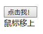
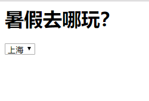
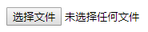
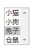
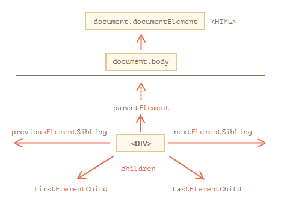
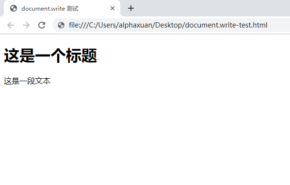
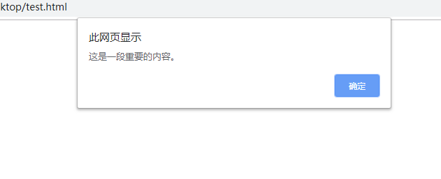

# 文档对象模型

------


## 山川相缪·文档对象模型

------

### 基本概念

当我们在浏览器中打开一个 Web 页面时，浏览器会读取并解析 HTML 源代码，根据预定的规则建立一个模型，再根据这个模型在屏幕上绘制页面。这个过程就像设计建筑物，根据原始图纸到模型再到实际的建筑。不过，根据 HTML 源代码构建出的模型是一个树状结构，`<html>` 标签是树根（即“根元素”），`<head>`和`<body>`构成了树干的主要分支，接着是它们的子元素，分别成为了各级枝叶和花朵。

我们在使用 Microsoft Office Word 等文字编辑软件编写一份文档时，它会包含标题、图片、表格、段落等内容，内容通过一定的层级结构相联系。而 HTML 页面的主要构成与此类似，因此一份 HTML 文件也被视作一种*文档*。文档中包含的内容属于不同的对象，它们拥有自己的属性，是绘制页面的模型的组件。模型表现为一种树状结构，它的每一部分与页面呈现出的效果是息息相关的，这种结构更正式的叫法是*文档对象模型*（Document Object Model，DOM）。

DOM 就像一棵从上往下生长的树，因此又叫 *DOM 树*，它就像一本家谱。家谱本身就是树状结构的一种例子，用于表示一个人类家族的谱系，并使用 `parent`（父辈）、`child` （子代）、`sibling`（兄弟）等记号来表明家族成员的关系。家谱可以把一些相当复杂的关系简明地表示出来：一位特定的家族成员，既是其他一些成员的父辈，又是另一位成员的子代，同时还是另一位成员的兄弟。我们可以通过家族关系中某个成员所处的位置来找到这个成员本身，当然，由于每个成员都会拥有一个名字，我们也可以通过名字来找到指定的成员。

下面是一份非常简单的 Web 页面，展示了一个普通小学生的暑假日常安排。


HTML 源代码如下：

```html
<!DOCTYPE html>
<html>
    <head>
        <meta charset="utf-8" />
        <title>备忘录</title>
    </head>
    <body>
        <h1>今天的任务安排</h1>
        <p title="motto" class="poem">及时当勉励，岁月不待人。</p>
        <ul id="notes">
            <li class="first wonderful">做《红楼梦》的摘抄</li>
            <li class="first">背诵《春江花月夜》</li>
            <li class="second">临摹三页字帖</li>
            <li class="second">练习D大调音阶</li>
        </ul>
    </body>
</html>
```

这份文档可以用一个基本的模型表示：


现在我们来分析一下它的结构。在 `<!DOCTYPE html>` 这行特殊的声明之后，一个打开的 `<html>` 标签代表整个文档的开始，这个页面里所有其他元素都在这个元素里面，换句话说，`<html>` 是所有其他元素的父辈，同时这个 `<html>` 元素既没有父辈，也没有兄弟。假设这是一棵真正的树，那么 `<html>` 标签就是树根，它同时*代表*了整个文档。

接下来，我们发现 `<head>` 和 `<body>` 这两个分支，它们位于同一层次且互不包含，所以它们是兄弟关系。它们是 `<html>` 的子代元素（或简称*子元素*），又有着各自的子元素，因此，它们同时也是其它一些元素的父辈元素（或简称*父元素*）。

`<head>` 元素有两个子元素：`<meta>` 和 `<title>` ，这两个元素时兄弟关系。`<body>` 元素也有着三个子元素，：`<h1>`、`<p>` 和 `<ul>`，它们也是兄弟关系，其中 `<ul>` 拥有属性 `id` ，其值为 `"notes"`，也就是用 `"notes"`这个名称来作为这个元素的唯一标识。它也有三个子元素，都是 `<li>` 元素，拥有各自的 `class` 属性。

我们可以把一个文档中的各个元素对应为一本家谱中的一个个成员，可以用类似的术语来描述 DOM。但这份“家谱”中记录的可不仅仅是元素，确切地说，DOM 这本“家谱”记载的是一个个*节点*。


### 节点

*节点*（node）这个词描述一张网络上的一个连接点，抑或是树上的一截枝条或一朵花苞。在现实世界里，一切事务都由原子构成，原子便是现实世界的节点。但原子本身还可以被进一步分解为电子和原子核，原子核可以分解为质子和中子，而质子和中子都由更小的夸克组成，这些基本粒子同样也是节点，也是构成更大的节点的一部分。DOM 也是如此：文档由一个个节点构成，文档就是像树一样连接起来的节点，节点就是文档这棵树上的树枝和树叶。

在 DOM 里有许多不同类型的节点，就像原子由不同的基本粒子组成一样，许多 DOM 节点同时包含着其它类型的节点。一共有十二种节点类型，如下表所示。其中*节点值*是用于标识节点类型的一个特殊属性，我们将在后面了解到。

| 名称             | 原名                        | 节点值                              |
| ---------------- | --------------------------- | ----------------------------------- |
| 元素节点         | element node                | Node.ELEMENT_NODE(1)                |
| 属性节点         | attribute node              | Node.ATTRIBUTE_NODE(2)              |
| 文本节点         | text node                   | Node.TEXT_NODE(3)                   |
| CDATA节点        | CDATA section node          | Node.CDATA_SECTION_NODE(4)          |
| 实体引用名称节点 | entry reference node        | Node.ENTRY_REFERENCE_NODE(5)        |
| 实体名称节点     | entity node                 | Node.ENTITY_NODE(6)                 |
| 处理指令节点     | processing instruction node | Node.PROCESSING_INSTRUCTION_NODE(7) |
| 注释节点         | comment node                | Node.COMMENT_NODE(8)                |
| 文档节点         | document node               | Node.DOCUMENT_NODE(9)               |
| 文档类型节点     | document type node          | Node.DOCUMENT_TYPE_NODE(10)         |
| 文档片段节点     | document fragment node      | Node.DOCUMENT_FRAGMENT_NODE(11)     |
| DTD声明节点      | notation node               | Node.NOTATION_NODE(12)              |

不要被这份表吓到，许多节点类型我们实际上并不会用到，也不需要关心。接下来我们先看看其中三种：*元素节点*、*文本节点*和*属性节点*。


**元素节点**

构成 DOM 的原子是*元素节点*（element node）。如果把一份文档比作大厦，那么元素就是建造这座大厦的砖块，砖块犬牙交错层层堆垒，筑成大厦的骨架，而这些元素在文档中的布局形成了文档的结构。

HTML 源代码中的一个个标签，对应到 DOM 中，就成为了元素，标签的名字就是元素的名字。文本段落元素的名字是 `"p"`，无序清单元素的名字是 `"ul"`，列表项元素的名字是 `"li"`。元素可以包含其它元素，在我们的小学生备忘录里，所有的列表项元素都包含在一个无序列表元素的内部。唯一不能被包含在其它元素里的只有 `<html>` 元素，它充当着 DOM 大厦奠基石的作用。


**文本节点**

元素节点只是节点类型的一种。如果一份文档完全由一些空白元素组成，它依然具有结构，但是不会包含什么实际内容。而在互联网上，绝大多数内容都是文本和图片提供的。

在小学生备忘录里，`<p>` 元素包含着文本 `"及时当勉励，岁月不待人"`。它是一个*文本节点*（text node）。

文本节点总是被包含在元素节点的内部。如果一份 HTML 源代码没有任何可被解析为元素节点的有效标签，那么浏览器在解析时会自动添加 `<html>` 、`<head>` 和 `<body>` 以提供基本的 DOM 结构。并非所有的元素节点都包含文本节点，例如上面的例子中，`<ul>` 元素没有直接包含任何文本节点，它包含着其它的元素节点（一些 `<li>` 元素），后者包含着文本节点。


**属性节点**

属性节点用来对元素做出更具体的描述。假设有一个元素“猫”，那么性别、年龄和品种都可以看做它的属性。在文档中，几乎所有的元素都有一个 `title` 属性，我们可以利用这个属性对包含在元素里的东西作出准确的描述（这样，当光标移到元素上的时候，就会显示这个描述）。

`<p title="motto">及时当勉励，岁月不待人。</p>`

在 DOM 中，`title="motto"` 是一个*属性节点*（attribute node）。因为属性总是被放在开放标签或孤立标签里，所以属性节点总是被包含在元素节点中，同时，并非所有的元素都包含着属性。


在小学生备忘录里，我们可以看到 `<ul>` 有个 `id` 属性，而 `<li>` 则有个 `class` 属性。这两个属性是用于标识一个或一组元素的，它们将在后文中为我们获取元素提供帮助。


### 获取元素

DOM 的规范提供了三种方法来获取指定的元素节点，分别是通过元素 `id`、标签名称（tag name）和*类名称*（class name）来获取。

**getElementById**

`document.getElementById` 方法接受一个指定 `id` 的字符串，并得到 DOM 中具有这个 `id` 的元素节点，其返回值是一个对象，这个对象对应着 DOM 里一个独一无二的元素。如果 DOM 中没有 `id` 符合要求的元素，那么它会返回 `null`。

下面是在小学生备忘录中尝试获取元素的一个示例。顺带一提，虽然把 JavaScript 写在 HTML 不是一个好习惯，但这里只是一个简单的例子。

```html
<!DOCTYPE html>
<html>
    <head>
        <meta charset="utf-8" />
        <title>备忘录</title>
    </head>
    <body>
        <h1>今天的任务安排</h1>
        <p title="motto">及时当勉励，岁月不待人。</p>
        <ul id="notes">
            <li class="first">做《红楼梦》的摘抄</li>
            <li class="first">背诵《春江花月夜》</li>
            <li class="second">临摹三页字帖</li>
            <li class="second">练习D大调音阶</li>
        </ul>
    </body>
    <script>
        alert(typeof document.getElementById("notes")); // "object"
    </script>
</html>
```

文档中的每一个元素都是一个对象，我们能得到任何一个对象，却不需要为每个对象都定义一个独一无二的 `id`。DOM 提供了另一个方法来获取那些没有 `id` 属性的对象。

**getElementsByTagName**

`document.getElementsByTagName` 得到一个类似数组的结构，其中每一项都是都对应文档里一个给定标签的对象，我们使用时传入标签的名字，并返回一个*伪数组*，可以在遍历它、查看元素个数，或将其转换为真正的数组。

上面的示例中，`alert` 函数的调用可以替换为如下内容：

```javascript
alert(document.getElementsByTagName("li").length); // 4
```

我们会看到小学生备忘录里的列表项个数为 3。我们获取到的数组里每个元素都是一个对象，可以利用循环语句和 `typeof` 操作符去遍历这个数组来验证这一点。

```javascript
const items = document.getElementsByTagName("li");
for (let i = 0; i < items.length; i += 1) {
    alert(typeof items[i]);
}
```

即使整份文档里只有这样一个标签符合要求的元素，`document.getElementsByTagName` 仍然返回一个长度为 1 的伪数组。这个方法还允许把一个*通配符*作为它的参数，通配符指字符串 `"*"`，将意味着整个文档中所有的元素都会被获取到。如果我们想知道一份文档中有多少元素节点，像下面这样使用通配符就可以啦。

```javascript
alert(document.getElementsByTagName("*").length); // 视情况而定
```

还可以把 `getElementById` 和 `getElementsByTagName` 结合起来使用，这是一个小窍门，因为 `getElementById` 获取到的元素节点对象自身也具有一个 `getElementsByTagName` 方法，它与 `document.getElementsByTagName` 作用类似，只不过是从自身的子元素中查找并获取指定元素。

例如，假如我们想知道 `id` 为 `notes` 的元素包含多少子元素，可以这样写：

```javascript
const notes = document.getElementById("notes");
const items = document.getElementsByTagName("*");
```

这时，`items` 将只包含 `id` 为 `notes` 的无序列表里的子元素。在这个示例中，`items`的长度恰好等于这份文档里列表项的总数。

```javascript
alert(items.length); // 4
```


------

Note：

我们说`getElementsByTagName` 方法返回的是伪数组，伪数组实际上是一类对象，它为每个元素都编排了序号，使我们可以像通常的数组那样用数字下标访问元素，也可以通过 `length` 属性获取长度。但是与 JavaScript 语言中真正的数组不同，伪数组没有任何其它的数组方法，如 `push`、`slice` 等等，伪数组也不是 `Array` 类的实例。由于外观类似而实质不同，这种对象得名伪数组。

有个很简单的办法将伪数组对象转换为标准数组：

```javascript
// 假设 DOM 中有许多 li 元素
const fakeArray = document.getElementsByTagName("li");
fakeArray.push("hello");          // TypeError: fakeArray.push is not a function
const realArray = [...fakeArray]; // 将伪数组重构为标准数组
realArray.push("hello");          // 成功
```

之所以能使用 `...` 运算符将伪数组转换为标准数组，是因为伪数组也是一类可迭代对象。在 JavaScript 中，任何可迭代对象都被视为一种*序列*，而标准数组就是序列的表现形式。

------


**getElementsByClassName**

我们在第五章中接触过类的概念，关键字 `class` 意味着“类”或者说是“类别”。同样，DOM 中的元素也可以拥有一个 `class` 属性，代表了这个元素的“类别”，`class` 属性的值就是元素的*类名称*。

DOM 规范提供了 `document.getElementsByClassName` 方法，这个方法让我们可以根据类名称选取特定的元素，或者说是**访问某一类别的元素**。与 `getElementsByTagName`类似，`getElementsByClassName` 接受一个表示类名称的字符串，并返回一个伪数组，里面包含了所有获取到的、具有相同类名称的元素。

下面这行代码得到的就是一个伪数组，包含所有类名称为`"first"` 的元素。

```javascript
document.getElementsByClassName("first");
```

这个方法还可以获取那些带有多个类名的元素，多个类名只需要在查找时用空格分隔即可。

```javascript
alert(document.getElementsByClassName("first wonderful").length); // 1
```

由于只有一个元素同时带有 `"first"` 和 `"wonderful"` 两个类名，所以得到的伪数组长度为 1。同时，类名的顺序是不固定的，查找的依据是“是否包含条件中的每个类名”，就算元素同时拥有更多类名也没关系。

与 `getElementsByTagName` 一样，我们也可以组合使用 `getElementById` 和 `getElementsByClassName`。例如，我们要得到 `id` 为 `"notes"` 的元素中所有类名为 `"second"` 的子元素，只需要这样写：

```javascript
const notes = document.getElementById("notes");
const secondItems = document.getElementsByClassName("second");
alert(secondItems.length); // 2
```


**getElementsByName**

获取 DOM 元素的方式很多，这里我们只需再了解一个方法：`getElementsByName`。它与 `getElementsByTagName` 和 `getElementsByClassName` 用起来几乎是一样的，不同之处在于，这个方法是根据指定的 `name` 属性（即“名称”）来获得元素。我们暂时还没有接触到这个属性。

```html
<h1 name="hi">Hi</h1>
<input type="text/email" name="email" />
<script>
    alert(document.getElementsByName("email").length); // 2
</script>
```


### 获取和设置属性

我们已经了解了四种获取特定元素的方法：分别是 `getElementById`、`getElementsByTagName`、`getElementsByClassName` 和 `getElementsByName`。得到元素对象之后，我们就可以获取它的各个属性。DOM 提供了 `getAttribute` 方法来获取元素属性，而 `setAttribute` 方法则可以更改元素属性的值。


------

Note：

虽然元素节点对象也是 JavaScript 对象的一种，但 DOM 上的属性（节点）称为 *attribute*，而普通对象的属性称为 *property*，前者侧重于*特征*，而后者侧重于*包含*。

------


**getAttribute**

每个元素节点对象都拥有 `getAttribute` 方法，它接受一个参数，也就是需要获取的属性的名称，如 `id`，`class` 等。与我们此前介绍过的方法不同，`getAttribute` 方法不属于 `document` 对象，因此不能写成 `document.getAttribute`，而只能通过元素节点对象调用。这里，我们可以将它与 `getElementsByTagName` 合用，获得每个 `<li>` 元素的 `class` 属性。由于 `getElementsByTagName` 等方法获取到的不是单个元素节点对象而是一个伪数组，所以我们需要遍历其中的每个元素对象，并调用它的 `getAttribute` 方法。

```javascript
const items = document.getElementsByTagName("li");
for (let i = 0; i < items.length; i += 1) {
    alert(items[i].getAttribute("class"));
}
// "first wonderful" -> "first" -> "second" -> "second"
```

或者我们也可以结合第五章中学过的高阶函数思想，将代码改写得更加优雅：

```javascript
const items = [...document.getElementsByTagName("li")]; // 先转换为标准数组
items.forEach((item) => alert(item.getAttribute("class")));
// "first wonderful" -> "first" -> "second" -> "second"
```

假设这份文档里的 `<li>` 元素都没有 `class` 属性，那么 `getAttribute("class")` 将返回空字符串 `""` 或 `null`，取决于具体使用的浏览器。

显然，如果我们并没有获取到我们想要的属性值，那么就没必要将结果显示出来。我们可以修改代码，让它在 `class` 属性存在值时才显示取到的值。我们只需要在代码里添加一条用于判断的 `if` 语句。

```javascript
const items = document.getElementsByTagName("*"); // 把范围扩大
for (let i = 0; i < items.length; i += 1) {
    let value = items[i].getAttribute("class");
    if (value) {
        // "" 或 null 都会被当做条件不成立
        alert(value);
    }
}
// "first wonderful" -> "first" -> "second" -> "second"
```


**setAttribute**

我们已经了解了五个获取节点的方法，而 `setAttribue` 有所不同，它允许我们修改属性节点的值。与 `getAttribute` 一样，`setAttribute` 也只能适用于元素节点对象。它接受两个参数，第一个是要修改的属性名称，第二个则是修改后的值。第二个参数应该为字符串、数字或布尔值。

```javascript
const notes = document.getElementById("notes");
notes.setAttribute("id", "list");
```

由于我们暂时还没接触到 `id` 属性除获取元素以外的实际用途，因此上面的代码不会产生肉眼可见的效果。不过，我们可以使用相应的 `getAttribute` 方法来查看修改后的属性——就像一个普通的对象那样。

```javascript
const notes = document.getElementById("notes");
alert(notes.getAttribute("id"));     // "notes"
notes.setAttribute("id", "list");
alert(notes.getAttribute("id"));     // "list"

```

在上面的代码中，我们先获取了 `id` 为 `"notes"` 的元素，查看了它的 `id` 值，再修改了它的 `id` 值。修改后的元素节点可以用新 `id` 来重新获取，它与先前的获取到的对象是完全一致的。如果某个元素先前没有某个属性，也可以使用 `setAttribute` 方法直接为它添加需要的属性节点，如果属性已经存在，则会覆盖之前的值。

我们还可以使用 `getElementsByTagName` 的通配符形式来获取所有元素，并依次改变每个元素节点的类名称。为了准确性考虑，我们还应假如一点条件判断：如果一个元素节点本来就没有设置 `class` 属性，则略过此元素。

```javascript
const elements = document.getElementsByTagName("*");
for (let i = 0; i < elements.length; i += 1) {
    let element = elements[i];
    let className = element.getAttibute("class");
    if (className) {
        element.setAttribute("class", "happy");
        alert(element.getAttribute("class"));
    }
}
// "happy" x5

```

上面的代码先获取文档中所有元素，由于总共有五个元素具有 `class` 属性，所以我们会看到 `"happy"` 重复显示了五次，同时五个元素的类名称都被覆盖为 `"happy"`。


------

本章中所讲述的六个 DOM 方法仅是众多魔法中的冰山一角，DOM 还提供了许多其他的属性和方法，如我们在后文会了解到的 `nodeName`、`nodeValue`、`childNodes`、`nextSibling` 和 `parentNode` 等。我们将逐渐领略到更加复杂的 DOM 操作方式和更加奇妙的效果。在下一节中，暂时搁置 DOM 操作本身，我们会认识一批重要的 *HTML 控件*，是它们共同组成了无比强大的 Web 应用程序，它们是趣味无穷的 Web 世界的基石。


## 高屋建瓴·HTML 控件

---

### 控件的概念

*控件*（widget）是一个很广泛的概念，它的字面含义是“可以由用户控制的组件”，包括你在使用桌面和 Web 应用时看到的那些按钮、文本框、滑动条、图片、菜单等。它们为用户和应用程序提供了一个便捷的交流途径，合适的控件使应用程序的意图得以良好传达，给用户以良好的使用体验。所有页面上的元素，只要能对用户进行的一定操作进行响应，改变状态或做出其它反馈，或专门负责传达某一类信息，都可以被称为控件。

开发者在使用控件时，应当考虑两大因素，一是**语义清晰**，而是**用户友好**。按钮就是一类语义非常清楚的控件，当用户看见它时，就会知道应该点击它来达到一定目的。所有的按钮都是基于这种固有经验。在此基础上，承担不同任务的按钮可能会被赋予不同的样式或提示信息。按钮中间可以显示点说明作用的文本。

```html
<button>
    点击我！
</button>
```

在大多数 Web 浏览器上，一个默认的按钮都会呈现为灰色的矩形方块，静止状态、鼠标移上、点击时、点击后对应的效果都会发生改变，体现了按钮操作时的质感。（在作者所使用的的浏览器上只会发生光影变化）



另一对例子是*单选按钮*和*下拉菜单*。单选按钮与普通的按钮有所不同，相信你一定见过它：


如果要让用户在三四个选项里做出唯一选择，显然单选按钮是很合适的。当用户改变要改变选择时，只需要点击另一个选项前的圆框。但是选项和内容一多，全部平铺堆积在页面上，看上去显得杂乱无章。当用户不需要做出选择时，还会带给用户冗余的视觉信息。



而下拉菜单默认状态下只会显示一行文本，当我们单击它时，就会弹出所有的选项——我们知道它弹出的内容不是通知或别的什么东西，而是供我们做出选择的选项。显示选项让用户做出选择，是单选按钮和下拉带单共有的语义。但当用户不需要做出选择时，下拉菜单会隐藏大部分内容，等到时机合适时再显示，不会给用户做出视觉上的困扰，这时下拉菜单就比单选按钮更加用户友好。而只有少量选项时，单选按钮要求用户做的事情更加一目了然，省去了单击才能显示所有选项的步骤，这时单选按钮比下拉菜单更加用户友好。

编写 HTML 是显示控件的一种基本方式。HTML 页面上可以使用的控件有十几种，我们将在下文中了解到大部分控件的具体使用。


### 生成控件的元素

**1. input**

HTML 中有许多元素和属性可以生成特定的控件。其中一个重要的元素是 `<input>`，它本身在默认情况下会显示为一个空白的单行纯文本输入框（简称*文本输入框*），我们通常将它的 `type` 属性设置为 `"text"` 来强调它是一个“输入纯文本”的控件。通过将 `type` 属性设置为不同的值，`<input>` 元素所产生的控件外观与作用也各不相同。在前面的温度转换器示例中，我们使用了文本输入框与数字输入框两类控件用于接收用户输入。其中，数字输入框在点击后，右侧会显示一对上下箭头，我们可以借助于此对输入的数值进行微调。


文本输入框的一种变体专门用于输入密码，它是 `<input type="password">`，称为*密码输入框*。它和文本输入框一样接受文本输入，同时将停留在框内的文本显示为遮盖黑点。

另一个我们见过的控件是按钮。它也可以被视为输入控件的一种，因此

```html
<input type="button" value="点击我" />
```

 会被渲染为：


不过更方便的写法还是直接使用 `<button>` 元素：

```html
<button>点击我</button>
```

在互联网中用户交互对控件的需求远不止触发按钮与文本和数字输入。通过*颜色选取控件*，我们可以在游戏中选择今天穿的衣服的颜色，抑或是给个人主页换个背景色。

```html
今天用什么颜色的口红呢？当然是 <input type="color" />
```

它在我的 Chrome 浏览器上呈现为一个颜色按钮，单击它后会打开一个对话框来让我们选择颜色。


控件获取到的颜色以*HTML颜色格式*存放，关于颜色与颜色格式的相关知识我们会在第十章详细了解。

日期和时间输入同样是一类非常常见的需求。以前，页面只能提供给用户一个简陋的文本输入框，让用户自己来输入日期和时间，再根据规定的格式进行解析，如果格式写错了还会遇到意想不到的麻烦。现在 HTML 提供了一类日期和时间输入控件，它们外观上呈现为一个文本框，其中包含了预定的日期或时间格式。为了适应具体的需要，它们还分为不同的类型。

```html
我的生日：<input type="date" />
```

还可以用 `min` 和 `max` 属性为日期范围添加限制。

```html
请输入一个建国以前的日期：<input type="date" max="1949-9-30">
请输入一个21世纪的日期：<input type="date" min="2001-01-01">
```

我们可以用类似于数字输入框的上下箭头，对年月日等每一项进行微调，也可以在控件里找到一个图标，触发浏览器提供的简单日历以自由选择。


还有几种日期和时间控件，可以根据需要进行使用。

- ` <input type="datetime-local">` 提供一个类似上面的控件，不过它会忽略时区，只考虑本地时间。

- `<input type="time">` 可以用上下箭头选择一个时刻。

  （它也可能会提供一个时刻选择器，不过我的浏览器上没有 D-:）

- `<input type="month">` 精确到具体月份。

- `<input type="week">` 要求用户选择某一周。

`<input type="range">` 提供了一个滑块，可以让我们在规定范围内选择一个值，`min` 和 `max` 属性分别确定了这个范围的最小值和最大值，而 `step` 属性还可以控制每次递增或递减的程度。

```html
对 TFBoys 的好感度（0-100）：<input type="range" min="0" max="100" step="2">
```

我们对 TFboys 的好感度默认从 `50` 开始，每次至少增加或减少 `2` ，上限为 `100`，下限为 `0`。


如果我们的数据很多，写在文件里，怎么告诉页面呢？打开文件复制内容并粘贴到输入框里吗？

当然不用！我们有*文件选择控件*：`<input type="file">`

默认状态下，控件的外观是这样的：



标有“选择文件”的按钮和其后的文本都包含在控件里，单击一下，浏览器会唤起一个文件选择对话框，就像我们在 Office Word 等文档编辑软件里做的那样，选择文件并确定，控件便会显示出刚才读取到的文件的文件名。读取文件后进行的处理过程超出了本章范畴，我们将在后续有关数据处理的章节中详细了解。

以上控件能大致满足我们的基本需求，但是 Web 标准的制定者们在人性化方面做得更好，一些控件使原本需要用户“输入”的内容，变为只需“选择”，为 Web 应用程序的交互提供了莫大方便。我们在上一小节中见过的单选按钮、复选框和下拉菜单就是例子，它们已经在无数应用程序中得到了历久弥新的实践，也让网络投票与问卷这类特定需求变得轻松快捷。

单选按钮不是通常所说的按钮（专用于触发特定操作），而是列出数据以供用户进行唯一选择，它是 `type` 类型为 `"radio"` 的 `<input>` 元素。一组单选按钮的 `name` 属性相同，也就是说，如果一些单选按钮的 `name` 属性相同，那么它们会被划分为同一组，一组单选按钮中最多有一项被选中。不同 `name` 属性的单选按钮互不影响。

```html
<h1>你喜欢吃哪种水果？</h1>
<input type="radio" name="first">苹果
<input type="radio" name="first">西瓜
<input type="radio" name="first">柑橘
<input type="radio" name="first">葡萄
<h1>你喜欢吃哪种干果？</h1>
<input type="radio" name="second">核桃
<input type="radio" name="second">杏仁
<input type="radio" name="second">榛子
```

效果如图所示。


这样，选择被区分在水果与干果之间。假如把它们的 `name` 属性都变成同一个，或者原本要分成两组却用了三个 `name` ，意义就截然不同了。

另一种常见的选择控件是*复选框*，它也可以像单选按钮那样在逻辑上划分为一个个组，只不过做出的选择彼此互不干扰，我们可以单击这个复选框来*激活*它，也可以*取消激活*另一个已经激活了的复选框。复选框是 `type` 属性为 `"checkbox"` 的 `<input>` 元素。

```html
<h1>今日份计划</h1>
<input type="checkbox">打游戏
<input type="checkbox">逛街
<input type="checkbox">学习
<input type="checkbox">看电影
<input type="checkbox">画画

```

你的选择是什么呢？


------

Note：

单选按钮是 `type` 属性为 `"radio"` 的 `<input>` 元素，因为它们的外观和操作方式与老式无线电收音机（radio）上的按钮类似，如下图所示。


------


**2. select**

HTML `<select>` 标签用于创建下拉菜单控件，在单选按钮的基础上更进一步，将一组选项（option）视为一个整体，包含在一对 `<select>` 标签中。每个选项用一对 `<option>` 标签标记。下拉菜单控件被单击后，会显示所有选项，可以在其中进行选择。


一个普通的 `<select>` 标签看起来是下面这样：

```html
<select>
    <option>小猫</option>
    <option>小狗</option>
    <option>兔子</option>
    <option>仓鼠</option>
</select>

```

默认状态下下拉菜单只会显示第一个选项的内容，选中其他选项后则会显示其他选项。如果需要预先指定某个选项已经选中，那么就需要设置那个 `<option>` 标签的 `selected` 属性。

```html
<select>
    <option>小猫</option>
    <option>小狗</option>
    <option selected="selected">兔子</option>
    <option>仓鼠</option>
</select>

```

在 HTML 标签中，如果属性的名称与值一模一样，那么只需写出属性名称即可，因此 `<option selected="selected">` 也可以写成 `<option selected>`。如果需要同时选择多个选项，只需要开启 `<select>` 标签的 `multiple` 属性，这时按住 `Ctrl` 键即可进行多选。多选模式下，下拉菜单一直保持“打开”状态，因此应用以上特性后的效果如下：



如果一个下拉菜单中的选项需要按照不同类别进一步分组，使用户得以更加清晰、高效地进行选择，可以用 `<optgroup>` 将选项分隔开，`<optgroup>` 的 `label` 属性记录每一组的名称。如果一组选项暂时要禁用，可以设置 `<optgroup>` 的 `disabled` 属性，而 `<option>` 也有这个属性，用于禁用某个特定的选项。

```html
<select>
  <optgroup label="亚洲">
    <option>中国</option>
    <option>日本</option>
    <option disabled>印度</option>
  </optgroup> 
  <optgroup label="欧洲">
    <option>英国</option>
    <option>法国</option>
    <option>意大利</option>
    <option>葡萄牙</option>
  </optgroup>
  <optgroup label="美洲" disabled>
    <option>巴西</option>
    <option>阿根廷</option>
    <option>墨西哥</option>
  </optgroup>
</select>

```

这时虽然选项较多，却没有直接堆砌，而是按照所属类别（大洲）进行分组，其中亚洲类的印度选项和美洲类被暂时禁用，不能进行选择。


**3. textarea**

当我们只是在登录网站时输入一下用户名和密码，或者填写手机号码和邮箱，那么 `<input>` 元素提供的单行文本输入框足以满足需求。但是，如果我们正在线编辑一篇新闻稿，或者给某人发一封邮件，就不会想在一个小小的文本输入框里塞进所有东西。术业有专攻，编辑长文本应当使用*文本编辑框*，顾名思义是一个专用于专门用来写字的区域，拥有足够的视觉空间并可以方便地进行浏览。`<textarea>` 元素提供了文本编辑框控件，与 `<input>` 不同，它必须具有开始标签和结束标签，中间可以预先填充一些文本，在用户编辑前显示。

`<textarea>` 直接带来的编辑框可以写一小段留言，但是对于写文章和报告还是力不从心。我们可以在 `cols` 属性中设置它显示的列数，在 `rows` 属性中设置显示的行数，扩大编辑文本和浏览文本时显示区域的面积。

```html
<textarea cols="100" rows="20"><button>这是纯文本</button></textarea>

```

这里我们做了一个 100 列宽、20 行高的文本编辑框，其中包含的内容不会被当做 HTML 进行渲染，而是直接以纯文本显示，我们可以在编辑框中对原有内容进行编辑。


如果需要显示一点文本提示用户这里需要输入什么，可以使用 `placeholder` 属性。当文本编辑框中包含文本的时候，提示文本会藏起来。微博和 Twitter 等软件对于输入文本有字数限制，这时就可以用 `placeholder` 属性发挥出提醒用户又不在编辑时影响美观的作用，同时用 `maxlength` 属性规定文本框所容纳的最大字符数量。

```html
<textarea cols="100" rows="20" maxlength="300" placeholder="写一写今天的心情吧,最多只能写300字哦~" ></textarea>

```

我们可以尝试着往文本框里写字或复制一首诗歌、一篇文章，会发现字数确实被限制在了 300。


------

Note：

`placeholder` 和 `maxlength` 属性对于 `<input>` 元素同样适用。

------


## 硕果可采撷·DOM 操作

------

### 处理节点

在上一节中，我们浅显接触了一些 HTML 控件，Web 应用带来的精彩纷呈的体验就源于它们的灵活使用。而在我们自如调遣 Web 所提供的强大交互能力之前，还需要进一步了解一些 DOM 操作，它们比前述的内容更加深入，也是更加强大功能的基石。这一小节向我们描述了几种对 DOM 节点进行处理的常规方法。

**计算子节点**

目前我们有以下 HTML 片段。

```html
<body>
  <ul id="books">
    <li>《平凡的世界》</li>
    <li>《活着》</li>
    <li>《文化苦旅》</li>
    <li>《许三观卖血记》</li>
    <li>《悲惨世界》</li>
    <li>《复活》</li>
  </ul>
</body>
```

如果我们要计算 `<ul>` 中有多少子元素（即 `<li>`），DOM 提供了两种方法。

```javascript
const books = document.getElementById('books');
alert(books.children.length);   // 6
alert(books.childElementCount); // 6
```

两种方法产生相同的结果，但它们的意义有所区别。

- 第一种方法中，我通过 `children` 属性获得一个伪数组，里面存放着 `books` 的所有子元素，这个伪数组的 `length` 属性便是它包含的所有元素的数量。
- 第二种方法直接通过 `childElementCount` 获取子元素的数量，我认为这是一种意图更清晰和更易于维护的方式。过后查看代码时，它的字面含义“子元素的数量”一目了然。

我们也可以使用 `childNodes.length` ，但是结果却截然不同。

```javascript
const books = document.getElementById('books');
alert(books.childNodes.length); // 13
```

与 `children` 属性不同，`childNodes` 属性代表所有子节点的集合，包括*空白节点*。换句话说，当我们需要**所有元素节点**时，DOM  对象的 `children` 属性能做到这一点，并用 `childElementCount` 获取数量。当我们需要**所有子节点**时，则使用 `childNodes`。

**检查子节点的存在性**

DOM 对象提供了 `hasChildNodes` 方法来检查一个元素是否具有子节点，它返回一个布尔值。

```javascript
const books = document.getElementById('books');
alert(books.hasChildNodes()); // true
const aBook = document.getElementsByTagName('li')[0];
alert(aBook.hasChildNodes()); // true（有文本子节点）
```

如果把 `<ul id="books"></ul>` 中的 HTML 标签全部删除，但是留下空白，它就会拥有空白子节点，那么 `books.hasChildNodes()` 还会得到 `true`。为了确保`hasChildNodes`返回`false`，HTML 片段必须如下所示：

```html
<body>
  <ul id="books"></ul>  
</body>
```

现在得到的就是预期结果。

更多时候，我们会希望精准地知道一个元素是否拥有有效的子元素，那么我们可以先检查它是否存在子节点，然后查看子节点的 `nodeType` 属性来确定它是否为元素节点。

**访问特定节点**

有几种不同的方法可以针对位置关系访问特定节点。除了使用 `children` 或 `childNodes` 获得“一堆”子节点之外，还有其它一些选择。

- `firstElementChild`：访问第一个子元素
- `lastElementChild`：访问最后一个子元素

让我们再来看看这个例子。

```html
<body>
  <ul id="books">
    <li>《平凡的世界》</li>
    <li>《活着》</li>
    <li>《文化苦旅》</li>
    <li>《许三观卖血记》</li>
    <li>《悲惨世界》</li>
    <li>《复活》</li>
  </ul>
</body>
```

现在让我们分别定位第一个和最后一个元素。

```javascript
// 这里的 innerHTML 属性可供查看元素的内容
const books = document.getElementById("books");
alert(books.firstElementChild.innerHTML); // "《平凡的世界》"
alert(books.lastElementChild.innerHTML);  // "《复活》"
```

如果我们想获取别的子元素，可以**先得到一个子元素**，然后**访问它的兄弟元素（sibling element）**。这里分别借助 `firstElementChild` 和 `lastElementChild` 确定首尾子元素，再使用 `previousElementSibling`和`nextElementSibling`属性获取“下一个兄弟元素”和“上一个兄弟元素”。

```javascript
const books = document.getElementById("books");
alert(books.firstElementChild.nextElementSibling.innerHTML);    // "《平凡的世界》"
alert(books.lastElementChild.previousElementSibling.innerHTML); // "《悲惨世界》"
```

`document.head` 和 `document.body` 两个对象分别对应页面中唯一的 `<head>` 与 `<body>` 元素，它们之间的关系也显而易见。

```javascript
// <head> 后面跟着 <body>
alert(document.head.nextSibling);     // HTMLBodyElement（<body> 元素对象的名称）
// <body> 前是 <head>
alert(document.body.previousSibling); // HTMLHeadElement（<head> 元素对象的名称）
```

DOM 提供了对子元素、兄弟元素的访问操作，是否还为父元素预留了位置呢？当然！`parentElement` 得到的就是一个元素的父元素的对象。

```javascript
const books = document.getElementById("books");
// <ul id="books"> 外面是 <body>
alert(books.parentElement);      // HTMLBodyElement
alert(document.body.parentNode); // HTMLHtmlElement（<html> 元素对象的名称）

// document.documentElement 对象代表“整个文档”，也就是整个 <html> 元素及其所有子元素
alert(document.body.parentNode === document.documentElement); // true
```

综上所述，一个位于 `<body>` 中的普通元素，它的层次关系大致如下图所示。



根据普通节点与元素节点相关方法的对应关系，DOM 也提供了类似的`firstChild`，`lastChild`，`previousSibling`，`nextSibling`和`parentNode`属性。这些属性获取所有类型的节点，而不仅仅是元素节点。在实践中，我们一般只关注对元素节点的处理。


### 动态创建内容的原始方法

我们此前见过的绝大多数 DOM 方法与属性都只能用来查找元素。`getElement(s)By(xxx)` 类方法可以方便快捷地找到文档中某个或某些特定的元素节点，这些节点随后又可以通过 `setAttribute` 设置属性。元素或节点对象的一些属性又可以获得另一些相关的元素或节点对象。在这些示例中，Web 页面的结构由 HTML 负责创建，由 JavaScript 负责操作某些细节，其中最为重要的就是用 JavaScript 来操控 DOM ，改变页面的结构和内容。这一小节里我们将学习一些 DOM 方法，通过创建新元素和修改现有元素来更新文档。

在正式开始利用 DOM 方法来操作文档前，我们先回顾两个在前面章节中使用到的技术：`document.write` 和 `innerHTML`。

**document.write**

`document.write` 方法可以快捷地把字符串插入到文档里。

我们建立一份 HTML 文件，里面保存如下内容，文件名可以定为 `test.html`。

```html
<!DOCTYPE html>
<html>
    <head>
        <meta charser="utf-8" />
        <title>测试</title>
    </head>
    <body>
        <script>
            document.write("<h1>这是一个标题</h1><p>这是一段文本</p>");
        </script>
    </body>
</html>
```

在 Web 浏览器里加载这个页面，我们会看到如下的内容。



`document.write` 最大的问题是，它混淆了“内容呈现”与“逻辑”的界限，违背了“行为与表现分离”的原则，把原本应该由 HTML 本身做的事情硬生生搬进了 JavaScript 代码，在这种情况下写出的 HTML 往往会产生格式混乱，难以维护。使用 `document.write` 除了初学时用于打印输出的一点方便之外，实在带来不了什么好处，请尽量避免使用它。

**innerHTML 属性**

DOM 元素对象的 `innerHTML` 属性始于微软的 Internet Explorer 4 浏览器，此后逐渐被其他浏览器所接受，最终纳入了 HTML5 标准。`innerHTML` 可以读、写给定元素的 HTML 内容。为了查看它所发挥的效用，我们把这段代码插入 `test.html` 的 `<body>` 部分。

```html
<div id="test">
    <p>这是一段<b>重要的</b>内容。</p>
</div>
```

根据 DOM 分析一下这个 `<div>` 的结构，


`<div>` 元素的 `id` 是 `test`，它包含一个元素节点（`<p>` 元素），这个 `<p>` 元素又有一些子节点。其中有两个文本节点，值分别是 `"这是一段"` 和 `"内容"`。还有一个元素节点（`<b>` 元素），`<b>` 元素本身包含一个文本节点，这个文本节点的值是 `"重要的"`。

DOM 为这个元素提供了一幅包含大量细节的图画，使用 DOM 提供的方法和属性可以对任何一个节点进行单独的访问，而 `innerHTML` 属性不需要考虑太多节点之间的关系，直接把元素的内容作为一段字符串交给我们，同时也可以把新的 HTML 源文本填充进去，作为元素的内容。这里，`<div id="test">` 中包含着 `"<p>这是一段<b>重要的</b>内容。</p>"` 这样一段 HTML 字符串。


在 HTML 源文件的 `<script>` 标签里加入下面的内容。

```javascript
window.onload = () => {
    const test = document.getElementById("test");
    alert(test.innerHTML);
};
```

刷新浏览器页面，可以看到 `innerHTML` 中包含的内容被以字符串的形式显示出来。


显然，`innerHTML` 属性不会考虑多少 DOM 的细节，它把 DOM 内容当做字符串，而不是具有精巧结构的模型。它就像一把大锤一样粗放，而标准的 DOM 操作，则像在层层叠加的结构中，小心穿行的手术刀。`innerHTML` 的用武之地在于它的高效率：要考虑的细节少了，将 DOM 以文本这一最本质的存在形式直接搬运。

如果要把一大段 `HTML` 文本插入页面中，`innerHTML` 是一个值得考虑的选择。它既支持读取，又支持写入，我们不仅可以读出元素包含的 HTML 内容，还可以像拼贴画一样把新的 HTML 粘进去。

现在，我们清空 `<div id="test">` 元素内包含的内容，变成一个空元素，再把下面这段 JavaScript 代码放入 `<script>` 标签中，取代之前的代码。

```javascript
window.onload = () => {
    const test = document.getElementById("test");
    test.innerHTML = "<p>这是一段<b>重要的</b>内容。</p>";
}
```

页面刷新后，我们便可以看到如下的效果。


对 `innerHTML` 属性进行赋值会使得元素中所有 HTML 内容都被替换为新的字符串。如果我们不是为了更改元素中所有的内容，而是附加几行说明文字或一个控件，可以将赋值操作符更改为 `+=` 。

```javascript
window.onload = () => {
    const test = document.getElementById("test");
    test.innerHTML = "<p>这是一段<b>重要的</b>内容。</p>";
    test.innerHTML += "<br />";
    test.innerHTML += "<p>这段内容是<i>附加的</i>。</p>";
}
```

在需要往 DOM 中插入一大段内容时，`innerHTML` 可以帮助我们又快又简单地完成这一任务。如果需要对插入的内容进行进一步处理，我们就需要使用 DOM 提供的更加精确的方法与属性。`innerHTML` 属性并没有发挥出 DOM 作为一个模型的优雅，而在任何时候，标准的 DOM 操作都可以用来替代 `innerHTML` 属性。虽说这往往要多编写一些代码才能获得相同的效果，但其所拥有的、更高的精准性和更强大的功能不容小觑。

**innerText**

另一个和 `innerHTML` 有些类似的属性是 `innerText`，不同的是，访问它只会获得元素中所有纯文本内容，忽略所有尖括号标签。将文本写入 `innerText` ，即使里面包含了合法的 HTML 标签，也依然会被视作纯文本，原样呈现。

```javascript
window.onload = () => {
    const test = document.getElementById("test");
    alert(test.innerText);
    test.innerText = "<p><b>点击这个</b><button>按钮</button></p>";
}
```

上述代码会带来如下的效果。




### 动态创建内容的高级方法

作为一份文档的逻辑表示，DOM 所包含的信息与文档里的信息一一对应，DOM 树上任何一个节点的细节，都可供我们随时取用。

DOM 就像一条双向车道，不仅可以获取文档的内容，也可以更新文档的内容。改变了 DOM 树之后，文档呈现出的页面效果也会随之发生改变。例如 `setAttribute` 方法可以改变 DOM 节点树上的某个属性节点，页面就有了相应的变化。不过 `setAttribute` 方法并没有改变文档的*物理内容*，也就是我们用文本编辑器而不是浏览器打开一份 HTML 源文件所看到的。磁盘上排列的数据并没有发生改变，一切都是在浏览器运行时加载页面后执行脚本做出我们想要的更改。浏览器把 HTML 从磁盘或网络上读取出来，根据它读到的内容生成 DOM 树，在此之后一切操作都围绕着这课 DOM 树进行，它是一份文档在内存中的抽象结构，在浏览器看来，DOM 树才意味着文档本身。

所以，以动态方式在文档加载后（即生成 DOM 树后）创建文档内容也就很好理解。我们并不是在“往 HTML 源文件中塞新标签”，而是在改变代表此刻页面一切内容的 DOM 树。我们思考的角度就是 DOM 的结构本身。

在 DOM 看来，一份文档是一棵由节点构成的 DOM 树在屏幕上的映射。如果想往 DOM 这棵节点树上添加内容，就必须插入新的节点。如果想插入一些标签，对应在 DOM 树上就是插入元素节点。

**createElement 方法**

我想把一段文本插入 `<div id="test">` 元素。对应到 DOM 的思考方式中，就是添加一个 `<p>` 元素的节点，把这个节点作为 `<div id="test">` 元素的一个子节点。这项任务需要分成两个步骤完成。

1. 创建一个新的元素。
2. 把这个新元素插入 DOM 树。

第一个步骤要用 DOM 方法 `createElement` 来完成，它的使用方法如下：

```javascript
document.createElement(元素名称);

```

因此，创建一个 `<p>` 元素，只需要像这样调用它。

```javascript
document.createElement("p");

```

这个方法不会改变页面效果，它只是在内存中创建了一个元素对象，在它成为 DOM 树的一份子之前，我们还需要把它插入到文档中。因此，我们应该有一个标识符来标记这个新创建出来的元素对象。

```javascript
const paragraph = document.createElement("p");

```

由于 `paragraph` 这个标识符被确定为**一个元素对象的名称**，它就不应该被改变，以防因为疏忽而造成意想不到的后果，我们把它声明为一个常量。常量 `paragraph` 现在代表刚刚创建出的 `<p>` 元素的对象，此时它还不是 DOM 树的组成部分，而是游荡在 JavaScript 的世界里的一个孤儿。这个 `<p>` 元素的对象被称为*文档碎片*（document fragement），此时它不会对文档的“现实世界”产生任何影响，不过它已经像任何其他的节点那样拥有了自己的 DOM 属性。

这个无家可归的 `<p>` 元素现在已经有一个 `nodeType` 属性和 `nodeName` 属性，我们可以用一段代码来查看。

```javascript
window.onload = () => {
    const paragraph = document.createElement("p");
    let info = `nodeName: ${paragraph.nodeName}  nodeType: ${paragraph.nodeType}`;
    alert(info);
}

```

新节点已经被创造出来了，它有一个值为 `"P"` 的 `nodeName` 属性和值为 `1` 是 `nodeType` 属性，这两个值说明它是一个 `<p>` 元素节点。接下来，我们要把它嫁接到文档上去了。

**appendChild 方法**

把新创建的节点插入到某个文档的 DOM 树上最简单的办法是，让它成为这个文档某个现有文档的一个子节点。在这里，我们要在 `<div id="test">` 中插入一个段落（`<p>` 元素），`appendChild` 方法可以完成这一任务。

```javascript
const div = document.getElementById("test");
div.appendChild(paragraph);
```

我们先获取了需要的 `<div>` 元素，然后调用它的 `appendChild` 方法，把刚才创建的 `<p>` 元素*追加*（append）到 `div` 上面。现在，新创建的 `<p>` 元素就已经成为了 `<div id="test">` 的一个子节点了！它不再无家可归，而是成为 DOM 树上的一段枝丫。

在创建节点和拼接子节点时，也可以不使用任何标识符来临时存放节点对象。上面的代码也可以改写成下面这样。

```javascript
document.getElementById("test").appendChild(document.createElement("p"));
```

不过，这样的代码并不好看，也不方便理解。将每个需要用到的对象都单独绑定一个标识符，是正确的选择。

**createTextNode 方法**

我们现在已经创建出了一个 `<p>` 元素，并把它嫁接到了 DOM 树上，它是一个空白的段落。现在，我们要把一段真正的文字放进这个 `<p>` 元素，使它呈现出来。显然，用 DOM 的话说，我们要创建一个文本节点，并使它成为 `<p>` 的子节点。这个过程和刚才有些像，不过这回 `createElement` 帮不上忙——它负责的是元素节点。我们可以使用 `createTextNode` 方法来创建文本节点。

下面这行代码会创建一个内容为“我命由我不由天”的文本节点，并将这个节点对象命名为 `text` 。

```javascript
const text = document.createTextNode("我命由我不由天");
```

`text` 现在也是 JavaScript 世界里的一个孤儿，在正式成为 DOM 树的一部分之前，它只是一个普通的 JavaScript 对象。现在，我们可以把它插入到文档里去了，这回我们调用的是 `paragraph` 的 `appendChild` 对象。

```javascript
paragraph.appendChild(text);
```

现在我们的 `<p>` 元素中就包含了“我命由我不由天”这样一段文本。我们来看一下完整的 JavaScript 代码。

```javascript
window.onload = () => {
    const div = document.getElementById("test");
    const paragraph = document.createElement("p");
    test.appendChild(paragraph);
    const text = document.createTextNode("我命由我不由天");
    paragraph.appendChild(text);
}
```

刷新浏览器的页面，我们成功了！


这里我们是按照如下顺序来更新文档的。

1. 创建一个 `<p>` 元素节点。
2. 把这个 `<p>` 元素节点追加到文档已有的 `<div id="test">` 节点上。
3. 创建一个文本节点。
4. 把这个文本节点追加到刚才创建的 `<p>` 元素节点上。`<p>`。

`appendChild` 方法还可以在一个节点尚未成为 DOM 树的一部分之前，为它追加子节点。这样，我们的顺序就可以更改得更优雅一些。

1. 创建一个 `<p>` 元素节点。
2. 创建一个文本节点。
3. 把这个文本节点追加到刚才创建的 `<p>` 元素节点上。`<p>`。
4. 把这个 `<p>` 元素节点追加到文档已有的 `<div id="test">` 节点上。

我们的代码可以写成这样。

```javascript
window.onload = () => {
    const paragraph = document.createElement("p");
    const text = document.createTextNode("我命由我不由天");
    paragraph.appendChild(text);
    const div = document.getElementById("test");    
    test.appendChild(paragraph);    
}
```

**一个组合的实践**


### 将 DOM 进行到底

在这里，我们将利用 DOM 技术，为页面添加一些实用的小部件。

- 得到隐藏在属性里的信息。
- 创建标签以封装信息。
- 将这些标签插入到文档。

这与我们先前所了解、用 DOM 简单地去建立一些新内容有所区别。在这一节，我们要做的是把预先准备好的信息，以巧妙的方式，成为满足用户需要的信息。我们要利用 JavaScript 结合 DOM 像搭积木一样组装这些内容。


