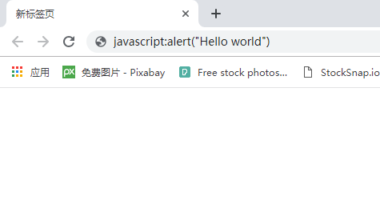
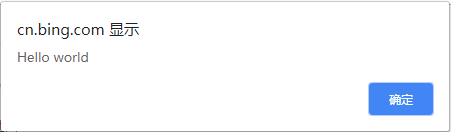
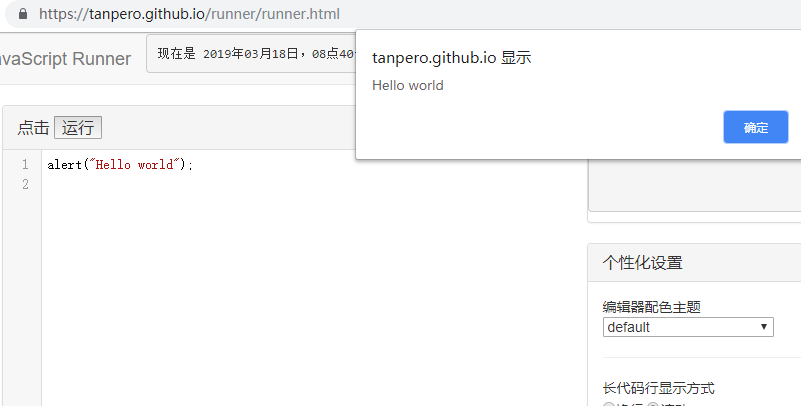

## Hello world

---

你可能曾有过学习编程语言的打算，但是最艰难的恐怕就是那关键的第一步吧——如何上手？要做什么，才能做好写下第一行代码的准备，又该怎样让它成为一个精巧的“程序”呢？事实上，当你读完本章后，你恐怕就不会再有这样的迷惑了。

因为，我们将要学习的是这种可以在**任何地方**运行的编程语言——JavaScript！从每一台桌面或移动设备的浏览器，到服务器和多媒体领域，甚至嵌入式和正逐步成为现实的物联网。事实上，JavaScript 是如此地容易上手和学习，因为踏出第一步便如此简单：如我所说，JavaScript 是一种可以在浏览器上运行的编程语言。你只需要准备一个好用的现代浏览器，诸如 Google Chrome ，Mozilla Firefox 或 Microsoft Edge 等。我们将会用非常多的时间与浏览器打交道，因此，选择一个适合的浏览器，将会使我们的学习之路变得得心应手且愉快顺利。

编写和运行 JavaScript 代码最简单的方式是在浏览器地址栏中。是的，就是那个用于输入网址以便你去到因特网的任何地方的地址栏。如图所示：

****

我所使用的是运行在 Microsoft Windows 10 上的 Google Chrome 浏览器，如果你的浏览器类型或版本与我不同，可能会呈现出不一样的外观。这是没关系的。当然，为了我们接下来的愉快旅程考虑——使用一些 Chrome 或 Firefox 之类的**流行**浏览器会得到更一致的操作体验，更好的兼容性（关于兼容性的问题我们会在第八章详细谈到）。最重要的是，我们所学习的 JavaScript 语言遵循一个2015年正式发布的国际标准：ECMAScript 6。如果您的浏览器版本较低或“*没有跟上时代的步伐*”，将不能很好地运行我们所写的代码。这非常令人不愉快。无论如何，**请不要使用 Internet Explorer**。

回到正题。我们在浏览器地址栏中这样一句代码： ```javascript:alert("Hello world")```，接下来按下 Enter 键，会发生什么有趣的事情呢？

看！一个弹出来的窗口！上面写着 Hello world 。我们已经成功运行了第一个 JavaScript 程序。



Hello world 上方的“cn.bing.com”指我输入这行代码时页面所处的域名，你的应该会和我不一样。不必在意这个。

现在来分析一下这一行最简单的 JavaScript 代码：

```javascript:alert("Hello world")```

前面的 ```javascript: ```标记是告诉浏览器把随后的文本当做 JavaScript 代码来执行，而不是一个网址或搜索内容。它只是一个说明性的标记，不是 JavaScript 语言所规定的。

其后的 ```alert``` 代表一个名为 ```alert``` 的函数。函数可以用来做一些事情，你只需要用它们的名字来召唤它。例如， ```alert``` 这个函数的作用是使浏览器弹出一个对话框，在上面显示一些信息。我们将会在第五章中详细讨论函数。

```(``` 和 ```)``` 两个括号表示使用 ```alert``` 这个函数，它们被称为*函数调用运算符*，就像一个大嘴巴，里面装着喂给函数的东西。其中包含的 ```"Hello world"``` 是一个*字符串*，因为处于函数调用运算符中，它会被喂给 ```alert``` 函数。```alert``` 函数得到了 ```"Hello world"``` 这个字符串值，便会使浏览器弹出一个对话框，对话框的信息内容便是我们传入的 ```"Hello world"``` 这个字符串。包裹```Hello world```的双引号是一对*字符串标记*，这个字符串的实际内容是双引号之间的内容。

输入之后，按一下 Enter，这行代码便被浏览器运行了。就是这样！

现在我们已经了解了这行最简单的 JavaScript 代码的结构与作用，现在我们可以做一点小练习，复习我们刚才所讨论的东西。

---

**练习 2.1**

1. 在浏览器地址栏中输入并运行以下代码：

   ```javascript:alert(1 + 1 + 1 + 1)```

2. 在浏览器地址栏中输入并运行以下代码：

    ```javascript:alert("1" + "1" + "1" + "1")```

3. 观察运行结果，试猜想为什么会这样。

---


显然，我们不可能一直呆在浏览器地址栏中。我们总不可能在浏览器地址栏中写出一个“愤怒的小鸟”游戏，也不可能写出一个 QQ 或者微信。有个地方可以让我们更加方便地编写和运行 JavaScript 代码，它的链接如下：

https://tanpero.github.io/runner/runner.html


在这个代码输入框里，你可以这样输入 Hello world 代码：

```alert("Hello world");```

点击运行按钮，会得到与刚才相同的效果。



嘿，你注意到了吗：我们写的是 ```alert("Hello world");```，后面多了一个分号！

分号表示一个语句的结尾，刚才我们写下的 ```alert("Hello world");``` 是一个独立的语句，需要用分号来结束。

你已经了解了编写 JavaScript 代码的基本感觉，现在让我们来尝试一些简单有趣的代码片段，在这个 JavaScript 运行器中好好玩耍！

```alert("你的骰子点数是" + Math.ceil(Math.random() * 6));```

1）这行代码每次运行都会得到一个位于 1 和 6 之间的不一样的骰子点数。

```alert(new Date());```

2）这行代码会以 ISO 标准格式显示当前时间。

```alert(+prompt() % 2 ? "奇数" : "偶数");```

3）这行代码会弹出一个输入框，并判断你所输入的数字是奇数还是偶数。它过于简单了，如果不是数字，它也会显示“偶数”。

```document.body.style.backgroundColor = "pink";```

4）这行代码会把运行器页面背景调成粉色。

```document.getElementById("head").innerHTML = "Hello World";```

5）这行代码会把标题栏的内容改成 “Hello World”。

```document.getElementById("run").onclick = () => alert("Hi");```

6）这行代码会更改运行按钮的行为。当你再次点击运行按钮时，它不会再执行其它代码，而是弹出一个 “Hi” 的对话框。刷新浏览器页面即可恢复原来的样子。·

---

**练习 2.2**

1. 尝试将运行器的页面背景改为其他颜色。总共成功尝试了几种颜色？
2. 尝试把代码 1 进行扩展，把点数可能的范围扩大到1-30 。
3. 结合代码 3 和 代码 5，尝试把运行器按钮的背景颜色调成绿色。

---

