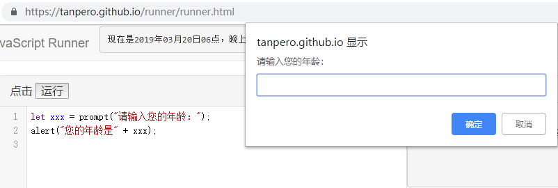

## 输入与输出

---

提供输入与输出数据的功能，是任何一种编程语言的基本设施。试想一下，假如我们的程序无法使用输入输出的功能——确切地说，无法与外界进行数据交换，那么它能做什么呢？什么也做不了！它也许可以静静地计算一个表达式的值，可以执行一个循环与条件判断，但是我们将始终无从得知它的最终工作，这个程序也就不会有存在的意义。输入与输出非常重要，也充满灵活性。

JavaScript 的语言标准（即 ECMAScript）并没有规定用于输入与输出的方式。浏览器为我们提供了两个简单的函数：`alert` 和 `prompt` ，以便进行基本的信息输出和输入。


**`alert` 和 `prompt`**

`alert` 我们已经见过很多次了。当我们简单地想要输出一条信息，比如显示一条表达式的计算结果，或者干其他的什么事情，我们可以使用它。在实际应用中我们有更复杂和标准的信息输出方式，但是现在我们使用 `alert` 就足以满足我们需要了。

`prompt` 这个函数我们已经在前面的代码示例中见过了，它可以弹出一个对话框，要求用户输入一点内容，然后得到这个内容，它的使用形式如下：

`let xxx = prompt();`

变量 `xxx` 中存放的就是我们获取到的内容。

但是它弹出的对话框什么提示也没有，只有一个简单的输入框。试想一下，假如别人使用你的程序，突然就看到这么一个框，什么也没有提示，会觉得丈二和尚摸不着头脑，对吧？更有可能，我们想要一个表示年龄的数字，用户却稀里糊涂地输入了一个手机号码。

我们可以给 `prompt` 的对话框加一条简单的提示语，来表明我们要干的事情，像这样：

`let xxx = prompt("请输入你的年龄：");`

这是使用 `prompt` 函数的另一种形式，变量 `xxx` 即是我们获取到的内容。



---

我们可以用一些简单的示例来尝试我们刚刚了解到的东西：

```javascript
alert("我们将收集您的身高数据以计算您的标准体重。");
let height = parseFloat(prompt("请输入您的身高（单位：厘米）："));
let weight = (height - 100) * 0.9;
alert("您的标准体重是：" + weight);
```

其中 `parseFloat` 函数用于将得到的字符串值转换为可以用于计算的数值，将在第三章讲到。

你可以自己试着测测你的标准体重哦！


这是另一个实用性的例子，更好地练习我们刚刚所学内容：

```javascript
// 计算圆的面积与周长。
let r = parseFloat(prompt("请输入圆的半径："));
alert("圆的面积是：" + r * r * Math.PI);
alert("圆的周长是：" + r * 2 * Math.PI);
```

