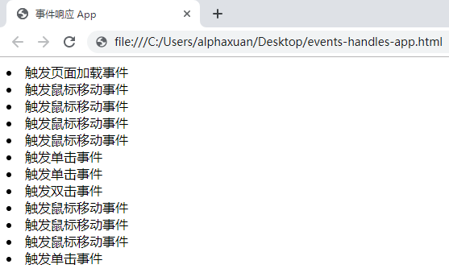

##     事件初探

---

### 事件的概念

我们已经在学习初期接触到了 HTML 的概念，如前文所述，HTML 是 Web 页面的基本组成，接下来我们的任务将变得新奇有趣：抛开运行器窗口的拘束吧！让我们在自己的 HTML 页面中展现出 JavaScript 的力量。

在前面的一些示例中，我们简单了解了温度转换的算法，现在可以结合 HTML 写出一个温度转换器的小程序。


还记得怎样使用 HTML 文件吗？我们在 HTML 文件中输入以下代码：

```html
<!DOCTYPE html>
<html>
    <head>
        <meta charset="utf-8" />
        <title>温度转换器</title>
    </head>
    <body>
        <h1>温度转换器</h1>
		摄氏度：<input type="text" id="c" />
		华氏度：<input type="text" id="f" />
		<button id="c-to-f">℃ to ℉</button>
		<p id="result"></p>
    </body>
</html>
```

接下来保存并在浏览器中打开它，一个简单的温度转换器就呈现在了我们眼前。

这个 HTML 页面比我们在前面所看到的要复杂一些，因为我们将在这一章中了解到更多实用的概念。这里我们务必认识几个新的 HTML 标签：

- `<h1>温度转换器</h1>` 这是一个 `<h1>` 标签，它的作用是在页面上产生一个*一级标题*——就像我们在文档处理软件中所用到的那样。
- `<input type="text" id="c" /> ` 这是一个 `<input>` 标签，它的*类型*是 `text`，这会在页面上显示一个*文本输入框*。这里我们将它的 `id` 属性设置为 `"c"` ，说明它将会用来输入摄氏度的值。后面的华氏度输入框与此类似。
- `<button id="try">转换</button>` 是一个*按钮*，就像它的外观所呈现的那样，用于传达用户的操作要求。

可以看到，上面的 HTML 元素组成了一个温度转换器的页面，我们可以在输入框中输入数字。但是，我们点击“转换”的按钮时，却不会产生任何效果。显然，我们还需要添加相应的 JavaScript 代码，才能使这个简单的**应用程序**运行起来。加入  JavaScript 后的代码如下：

```html
<!DOCTYPE html>
<html>
    <head>
        <meta charset="utf-8" />
        <title>温度转换器</title>
    </head>
    <body>
        <h1>温度转换器</h1>
		摄氏度：<input type="text" id="c" />
		华氏度：<input type="text" id="f" />
		<button id="c-to-f">℃ to ℉</button>
		<p id="result"></p>
        <script>
        	const c = document.getElementById("c");
            const button = document.getElementById("c-to-f");
            const result = document.getElementById("result");
            
            const c2f = (value) => value * 1.8 + 32;
            
            button.onclick = () => {
                result.innerHTML = c2f(parseFloat(c.value)).toFixed(2);
            };
        </script>
    </body>
</html>
```

看起来有许多新的东西！不要着急，它们的含义都十分简单 ;-)

在 HTML 中，我们已经有了一个 `id` 为 `c` 的输入框，但是 JavaScript 并不知道这件事情！所以我们要在 JavaScript 代码中呼唤它的名字（`id`），召唤它闪亮登场。这个召唤的法术交给 `document.getElementById` 这个方法来做。`getElementById` 就是 “get element by id” 的*驼峰式*拼写形式，意为“通过 `id` 来获取元素。这样，我们就通过元素的 `id` 得到了这个元素。其后的 `button` 和 `result` 也是同理。

在第三章中，我们见过了摄氏度转换为华氏度的公式：

$$ F = C \times1.8 +32 ​$$

函数 `c2f` 根据这个公式完成计算。

---

Note：

英语中，把 A “转换” 为 B 可以写作 “A to B”。由于英语单词 "two" 和 "to" 发音相同，因此数字 2 是单词 to 的常见替代形式，“c2f” 即 “c to f”。

---

接下来是这个小程序最核心的部分：

```javascript
button.onclick = () => { 
     result.innerHTML = c2f(parseFloat(c.value)).toFixed(2);
};
```

我们可以从用途猜测它的含义：当我们*点击*（click）一个按钮时，会期望按钮做一些事情。需要做的事情写在一个函数里，当这个按钮被单击时（`onclick`），就执行这个函数。函数所做的事情自然也不足为奇：首先获取到摄氏度输入框的里的值（`c.value`），由于它是一个字符串，所以把它转换为数字方便进行计算，再用 `c2f` 转换为相应的华氏度值并取两位小数。最后，让它在 `result` 上显示出结果。像这样**当按钮被点击后执行对应操作**的技术，称为*事件*，我们可以给事件*绑定*一个函数，也就是*事件处理函数*。

在这里，`id` 为 `"c-to-f"` 的按钮被触发*单击事件*时，会调用我们绑定的事件处理函数，执行相应操作。这个过程称为*响应*。

显然，这个小程序还未达到我们预期的效果，还需要相应的把摄氏度转化为华氏度的功能。我们已经了解了原理，非常容易办到。我们先给页面添加一个对应的操作按钮：

```html
<button id="f-to-c">℉ to ℃</button>
```

`<script>` 标签中的 JavaScript 代码改写如下：

```javascript
const c = document.getElementById("c");
const f = document.getElementById("f");
const buttonC2F = document.getElementById("c-to-f");
const buttonF2C = document.getElementById("f-to-c");
const result = document.getElementById("result");
            
const c2f = (value) => value * 1.8 + 32;
const f2c = (value) => (value - 32) / 1.8;

buttonC2F.onclick = () => {
    // 显示的内容加上说明以区分
	result.innerHTML = `${c.value} ℃ = ${c2f(parseFloat(c.value)).toFixed(2)} ℉`;
};

buttonF2C.onclick = () => {
	result.innerHTML = `${f.value} ℉ = ${f2c(parseFloat(f.value)).toFixed(2)} ℃`;
};
```

接下来看一下我们的作品：


成功！


### 增强灵活性

在第二章中，我们已经看到了怎样在页面里插入外部的 JavaScript 文件，这是一种更合乎规范的策略。那么，让我们把 JavaScript 代码抽离出来，存放在一个命名为 temperature.js 的文件里。

```html
<!--
temperature.html
-->
<!DOCTYPE html>
<html>
    <head>
        <meta charset="utf-8" />
        <title>温度转换器</title>
        <script src="temprature.js"></script>
    </head>
    <body>
        <h1>温度转换器</h1>
		摄氏度：<input type="text" id="c" />
		华氏度：<input type="text" id="f" />
		<button id="c-to-f">℃ to ℉</button>
        <button id="f-to-c">℉ to ℃</button>
		<p id="result"></p>
    </body>
</html>
```

现在保存并刷新页面。咦？这个小程序似乎不像原来那样正常工作了！

原因出在浏览器解析 HTML 的机制上：`<head>` 元素包含 HTML 文件的基本信息，因此它会比 `<body>` 更早解析。在解析 JavaScript 脚本时，由于还没有解析 `<body>` 中的内容，浏览器不知道 `<body>` 有哪些需要的东西，JavaScript 中无法获取到相应的元素，自然无法正常运行。

那么解决的办法是什么呢？让我们的思路随浏览器一起往下走：

`<head>` 和 `<body>` 中的内容先后解析完毕后（即“加载完毕”），将会触发当前窗口对象的*加载事件*，加载事件标志着页面中所需要的一切已经准备完毕。那么，我们就可以在加载事件的处理函数中做我们需要做的事情！

```javascript
/*
* temperature.js
*/
// 这两个函数不需要页面加载成功  
const c2f = (value) => value * 1.8 + 32;
const f2c = (value) => (value - 32) / 1.8;

window.onload = () => {
    const c = document.getElementById("c");
    const f = document.getElementById("f");
    const buttonC2F = document.getElementById("c-to-f");
    const buttonF2C = document.getElementById("f-to-c");
    const result = document.getElementById("result");
    
    buttonC2F.onclick = () => {
        result.innerHTML = `${c.value} ℃ = ${c2f(parseFloat(c.value)).toFixed(2)} ℉`;
    };

    buttonF2C.onclick = () => {
    	result.innerHTML = `${f.value} ℉ = ${f2c(parseFloat(f.value)).toFixed(2)} ℃`;
    };
};
```

虽然也可以把 JavaScript 直接写在所有页面元素的下面，但这样做不太优雅。出于关注点分离的思想，把 JavaScript 写在单独的文件里并在页面中引用的方式更为推荐，具有更好的灵活性。加载事件使我们可以在合适的时间做合适的事情，不必关注 JavaScript 文件被引入的具体位置。


### 一切皆事件

页面中可以被触发的事件实际上非常多，每个都代表了一种可能的操作状态。有些事件是特定于对象的，如只属于当前窗口的 `load` 事件，而 HTML 元素则拥有许多与用户相关的事件。现在让我们一起来看一个简单的应用程序：每当用户移动鼠标、单击或双击页面时，就会显示一条消息。

```html
<!--
events-handler-app.html
-->
<!DOCTYPE html>
<html>
    <head>
        <meta charset="utf-8" />
        <title>事件响应 App</title>
        <script src="app.js"></script>
    </head>
    <body></body>
</html>
	    <
```

```javascript
/*
* app.js
*/
const addMessage = (message) => {
	document.write(`<li>${message}</li>`);
}

window.onload = () => {
	addMessage("触发页面加载事件");
	document.body.onmousemove = () => addMessage("触发鼠标移动事件");
	document.body.onclick = () => addMessage("触发单击事件");
	document.body.ondblclick = () => addMessage("触发双击事件");
};
```

我们定义了一个 `addMessage` 函数，每当调用该函数都会在页面上打印一个新的列表项，显示所需的信息。

然后应当响应窗口的 `load` 事件：

```javascript
window.onload = () => addMessage("触发页面加载事件");
```

窗口加载后，还要一并为页面添加 `mousemove`、`click` 和 ·`dblclick` 事件的处理函数。每当用户移动鼠标，就会触发 `mousemove` 事件，双击则是 `dblclick` 事件。这个应用的运行结果和交互如图所示：



