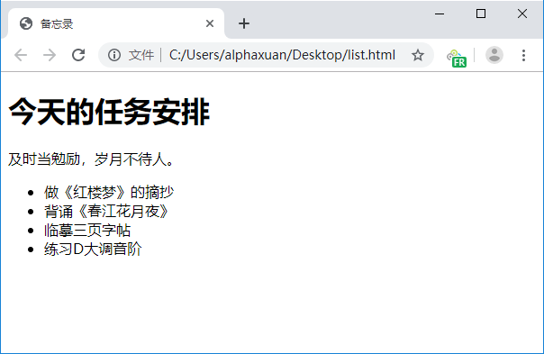
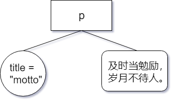

## 文档对象模型

---

### 基本概念

当我们在浏览器中打开一个 Web 页面时，浏览器会读取并解析 HTML 源代码，根据预定的规则建立一个模型，再根据这个模型在屏幕上绘制页面。这个过程就像设计建筑物，根据原始图纸到模型再到实际的建筑。不过，根据 HTML 源代码构建出的模型是一个树状结构，`<html>` 标签是树根（即“根元素”），`<head>`和`<body>`构成了树干的主要分支，接着是它们的子元素，分别成为了各级枝叶和花朵。

我们在使用 Microsoft Office Word 等文字编辑软件编写一份文档时，它会包含标题、图片、表格、段落等内容，内容通过一定的层级结构相联系。而 HTML 页面的主要构成与此类似，因此一份 HTML 文件也被视作一种*文档*。文档中包含的内容属于不同的对象，它们拥有自己的属性，是绘制页面的模型的组件。模型表现为一种树状结构，它的每一部分与页面呈现出的效果是息息相关的，这种结构更正式的叫法是*文档对象模型*（Document Object Model，DOM）。

DOM 就像一棵从上往下生长的树，因此又叫 *DOM 树*，它就像一本家谱。家谱本身就是树状结构的一种例子，用于表示一个人类家族的谱系，并使用 `parent`（父辈）、`child` （子代）、`sibling`（兄弟）等记号来表明家族成员的关系。家谱可以把一些相当复杂的关系简明地表示出来：一位特定的家族成员，既是其他一些成员的父辈，又是另一位成员的子代，同时还是另一位成员的兄弟。我们可以通过家族关系中某个成员所处的位置来找到这个成员本身，当然，由于每个成员都会拥有一个名字，我们也可以通过名字来找到指定的成员。

下面是一份非常简单的 Web 页面，展示了一个普通小学生的暑假日常安排。



HTML 源代码如下：

```html
<!DOCTYPE html>
<html>
	<head>
		<meta charset="utf-8" />
		<title>备忘录</title>
	</head>
	<body>
		<h1>今天的任务安排</h1>
		<p title="motto">及时当勉励，岁月不待人。</p>
		<ul id="notes">
			<li class="first">做《红楼梦》的摘抄</li>
			<li class="first">背诵《春江花月夜》</li>
			<li class="second">临摹三页字帖</li>
			<li class="second">练习D大调音阶</li>
		</ul>
	</body>
</html>
```

这份文档可以用一个基本的模型表示：


现在我们来分析一下它的结构。在 `<!DOCTYPE html>` 这行特殊的声明之后，一个打开的 `<html>` 标签代表整个文档的开始，这个页面里所有其他元素都在这个元素里面，换句话说，`<html>` 是所有其他元素的父辈，同时这个 `<html>` 元素既没有父辈，也没有兄弟。假设这是一棵真正的树，那么 `<html>` 标签就是树根，它同时*代表*了整个文档。

接下来，我们发现 `<head>` 和 `<body>` 这两个分支，它们位于同一层次且互不包含，所以它们是兄弟关系。它们是 `<html>` 的子代元素（或简称*子元素*），又有着各自的子元素，因此，它们同时也是其它一些元素的父辈元素（或简称*父元素*）。

`<head>` 元素有两个子元素：`<meta>` 和 `<title>` ，这两个元素时兄弟关系。`<body>` 元素也有着三个子元素，：`<h1>`、`<p>` 和 `<ul>`，它们也是兄弟关系，其中 `<ul>` 拥有属性 `id` ，其值为 `"notes"`，也就是用 `"notes"`这个名称来作为这个元素的唯一标识。它也有三个子元素，都是 `<li>` 元素，拥有各自的 `class` 属性。

我们可以把一个文档中的各个元素对应为一本家谱中的一个个成员，可以用类似的术语来描述 DOM。但这份“家谱”中记录的可不仅仅是元素，确切地说，DOM 这本“家谱”记载的是一个个*节点*。


### 节点

*节点*（node）这个词描述一张网络上的一个连接点，抑或是树上的一截枝条或一朵花苞。在现实世界里，一切事务都由原子构成，原子便是现实世界的节点。但原子本身还可以被进一步分解为电子和原子核，原子核可以分解为质子和中子，而质子和中子都由更小的夸克组成，这些基本粒子同样也是节点，也是构成更大的节点的一部分。DOM 也是如此：文档由一个个节点构成，文档就是像树一样连接起来的节点，节点就是文档这棵树上的树枝和树叶。

在 DOM 里有许多不同类型的节点，就像原子由不同的基本粒子组成一样，许多 DOM 节点同时包含着其它类型的节点。一共有十二种节点类型，如下表所示。其中*节点值*是用于标识节点类型的一个特殊属性，我们将在后面了解到。

| 名称             | 原名                        | 节点值                              |
| ---------------- | --------------------------- | ----------------------------------- |
| 元素节点         | element node                | Node.ELEMENT_NODE(1)                |
| 属性节点         | attribute node              | Node.ATTRIBUTE_NODE(2)              |
| 文本节点         | text node                   | Node.TEXT_NODE(3)                   |
| CDATA节点        | CDATA section node          | Node.CDATA_SECTION_NODE(4)          |
| 实体引用名称节点 | entry reference node        | Node.ENTRY_REFERENCE_NODE(5)        |
| 实体名称节点     | entity node                 | Node.ENTITY_NODE(6)                 |
| 处理指令节点     | processing instruction node | Node.PROCESSING_INSTRUCTION_NODE(7) |
| 注释节点         | comment node                | Node.COMMENT_NODE(8)                |
| 文档节点         | document node               | Node.DOCUMENT_NODE(9)               |
| 文档类型节点     | document type node          | Node.DOCUMENT_TYPE_NODE(10)         |
| 文档片段节点     | document fragment node      | Node.DOCUMENT_FRAGMENT_NODE(11)     |
| DTD声明节点      | notation node               | Node.NOTATION_NODE(12)              |

不要被这份表吓到，许多节点类型我们实际上并不会用到，也不需要关心。接下来我们先看看其中三种：*元素节点*、*文本节点*和*属性节点*。


**元素节点**

构成 DOM 的原子是*元素节点*（element node）。如果把一份文档比作大厦，那么元素就是建造这座大厦的砖块，砖块犬牙交错层层堆垒，筑成大厦的骨架，而这些元素在文档中的布局形成了文档的结构。

HTML 源代码中的一个个标签，对应到 DOM 中，就成为了元素，标签的名字就是元素的名字。文本段落元素的名字是 `"p"`，无序清单元素的名字是 `"ul"`，列表项元素的名字是 `"li"`。元素可以包含其它元素，在我们的小学生备忘录里，所有的列表项元素都包含在一个无序列表元素的内部。唯一不能被包含在其它元素里的只有 `<html>` 元素，它充当着 DOM 大厦奠基石的作用。


**文本节点**

元素节点只是节点类型的一种。如果一份文档完全由一些空白元素组成，它依然具有结构，但是不会包含什么实际内容。而在互联网上，绝大多数内容都是文本和图片提供的。

在小学生备忘录里，`<p>` 元素包含着文本 `"及时当勉励，岁月不待人"`。它是一个*文本节点*（text node）。

文本节点总是被包含在元素节点的内部。如果一份 HTML 源代码没有任何可被解析为元素节点的有效标签，那么浏览器在解析时会自动添加 `<html>` 、`<head>` 和 `<body>` 以提供基本的 DOM 结构。并非所有的元素节点都包含文本节点，例如上面的例子中，`<ul>` 元素没有直接包含任何文本节点，它包含着其它的元素节点（一些 `<li>` 元素），后者包含着文本节点。


**属性节点**

属性节点用来对元素做出更具体的描述。假设有一个元素“猫”，那么性别、年龄和品种都可以看做它的属性。在文档中，几乎所有的元素都有一个 `title` 属性，我们可以利用这个属性对包含在元素里的东西作出准确的描述（这样，当光标移到元素上的时候，就会显示这个描述）。

`<p title="motto">及时当勉励，岁月不待人。</p>`

在 DOM 中，`title="motto"` 是一个*属性节点*（attribute node）。因为属性总是被放在开放标签或孤立标签里，所以属性节点总是被包含在元素节点中，同时，并非所有的元素都包含着属性。



在小学生备忘录里，我们可以看到 `<ul>` 有个 `id` 属性，而 `<li>` 则有个 `class` 属性。这两个属性是用于标识一个或一组元素的，它们将在后文中为我们获取元素提供帮助。


### 获取元素

DOM 的规范提供了三种方法来获取指定的元素节点，分别是通过元素 `id`、标签名称（tag name）和*类名称*（class name）来获取。

**getElementById**

`document.getElementById` 方法接受一个指定 `id` 的字符串，并得到 DOM 中具有这个 `id` 的元素节点，其返回值是一个对象，这个对象对应着 DOM 里一个独一无二的元素。如果 DOM 中没有 `id` 符合要求的元素，那么它会返回 `null`。

下面是在小学生备忘录中尝试获取元素的一个示例。顺带一提，虽然把 JavaScript 写在 HTML 不是一个好习惯，但这里只是一个简单的例子。

```html
<!DOCTYPE html>
<html>
	<head>
		<meta charset="utf-8" />
		<title>备忘录</title>
	</head>
	<body>
		<h1>今天的任务安排</h1>
		<p title="motto">及时当勉励，岁月不待人。</p>
		<ul id="notes">
			<li class="first">做《红楼梦》的摘抄</li>
			<li class="first">背诵《春江花月夜》</li>
			<li class="second">临摹三页字帖</li>
			<li class="second">练习D大调音阶</li>
		</ul>
	</body>
    <script>
    	alert(typeof document.getElementById("notes")); // "object"
    </script>
</html>
```

文档中的每一个元素都是一个对象，我们能得到任何一个对象，却不需要为每个对象都定义一个独一无二的 `id`。DOM 提供了另一个方法来获取那些没有 `id` 属性的对象。

**getElementsByTagName**

`document.getElementsByTagName` 得到一个类似数组的结构，其中每一项都是都对应文档里一个给定标签的对象，我们使用时传入标签的名字，并返回一个*伪数组*，可以在遍历它、查看元素个数，或将其转换为真正的数组。

上面的示例中，`alert` 函数的调用可以替换为如下内容：

```javascript
alert(document.getElementsByTagName("li").length); // 4
```

我们会看到小学生备忘录里的列表项个数为 3。我们获取到的数组里每个元素都是一个对象，可以利用循环语句和 `typeof` 操作符去遍历这个数组来验证这一点。

```javascript
const items = document.getElementsByTagName("li");
for (let i = 0; i < items.length; i += 1) {
    alert(typeof items[i]);
}
```

即使整份文档里只有这样一个标签符合要求的元素，`document.getElementsByTagName` 仍然返回一个长度为 1 的伪数组。这个方法还允许把一个*通配符*作为它的参数，通配符指字符串 `"*"`，将意味着整个文档中所有的元素都会被获取到。如果我们想知道一份文档中有多少元素节点，像下面这样使用通配符就可以啦。

```javascript
alert(document.getElementsByTagName("*").length); // 视情况而定
```

还可以把 `getElementById` 和 `getElementsByTagName` 结合起来使用，这是一个小窍门，因为 `getElementById` 获取到的元素节点对象自身也具有一个 `getElementsByTagName` 方法，它与 `document.getElementsByTagName` 作用类似，只不过是从自身的子元素中查找并获取指定元素。

例如，假如我们想知道 `id` 为 `notes` 的元素包含多少子元素，可以这样写：

```javascript
const notes = document.getElementById("notes");
const items = document.getElementsByTagName("*");
```

这时，`items` 将只包含 `id` 为 `notes` 的无序列表里的子元素。在这个示例中，`items`的长度恰好等于这份文档里列表项的总数。

```javascript
alert(items.length); // 4
```


