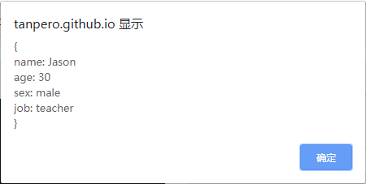

## for-in 和 for-of 语句

---

JavaScript 提供了 for 语句的两种变体用于更加灵活地实现遍历，不但能遍历数组的索引和值，也能遍历对象的成员，并将得到的值赋给一个变量。

### 属性遍历

我们可以使用 *for-in 语句*来遍历一个对象中的所有属性名称。for-in 语句的形式如下：

```javascript
for (let 变量 in 对象) {
    处理语句
}
```

for-in 语句会依次访问对象中的每个属性的名称，并将得到的字符串存放在指定的变量中，这个过程会对每一个*可遍历*的属性都执行一次。

```javascript
const person = {
    name: "Jason",
    age:  30,
    sex: "male",
    job: "teacher"
};

for (let i in person) {
    alert(i);
}
// "name"
// "age"
// "sex"
// "job"
```

有了属性名，我们也就能同时得到它的值：

```javascript
for (let i in person) {
    alert(person[i]);
}
// "Jason"
// 30
// "male"
// "teacher"
```

于是，我们可以简单地打印出一个对象的内容：

```javascript
let s = "{\n";
for (let i in person) {
    s += `${i}: ${person[i]}\n`;
}
s += "}";
alert(s);
```

结果如图所示：




for-in 语句提供了对对象内容进行操作的快捷方式。在这个遍历的过程中，我们可以干许多事情。比如——给每个属性都重新起一个名字，抛弃原来的：

```javascript
for (let i in person) {
    person["属性-" + i] = person[i];
    delete person[i];
}
```

这时再用之前的方式查看对象内容，就会看到每个属性的名字都被改变了。

```
{
属性-name: Jason
属性-age: 30
属性-sex: male
属性-job: teacher
}
```

我们还可以更进一步：为每个属性都进行编号，毕竟， for-in 语句的本质还是循环，可以做一些适合循环做的事情。

```javascript
let count = 1;
for (let i in person) {
    person[`第${count}个属性-${i}`] = person[i];
    delete person[i];
    count += 1;
}
// {
// 第1个属性-name: Jason
// 第2个属性-age: 30
// 第3个属性-sex: male
// 第4个属性-job: teacher
// }
```

要知道 for-in 语句赋予了我们随意与属性和值打交道的权力——是的，我们甚至可以*交换*属性的名称与值的位置。**当然，如果原本的值就不是一个*基本类型*，我们还是不要这样做，否则会发生奇怪的事情。**

```javascript
const object = {
    name: "Andy",
    checked: true,
    anotherObj: {
        a: 1,
        b: 2
    }
};

for (let i in object) {
    let newName = object[i]; // 将原本的值存放起来
    if (typeof newName !== "object") { 
        // 它不是一个对象，目测是基本类型
        
        object[newName] = i;     // 值的内容来命名一个新的属性，它的值就是原本的属性名
        delete object[i];        // 原来的属性还在，但我们不需要它了
    }    
}
// 再用之前的方式查看一下对象里的情况
// {
// anotherObj: [object Object]
// Andy: name
// true: checked
// }
```

又是 `"[object Object]"` ！恐怕你已经猜测到了我们所要避免的问题所在了。这个奇怪的东西我们将会在第七章详细讨论到，现在我们只需简单了解这一情况。

使用 for-in 语句，我们可以自由地查看、操作一个对象的内容。它是否使我们与对象更亲近了？

---

Note：我们只能遍历一个*可迭代对象*中的*可枚举属性*，我们将在下文了解这些概念。

---


### 可迭代对象

不单单是对象，我们也可以使用 for-in 语句来遍历数组，它提供了比前一节所介绍的更为简便的方法。在第三章中我们已经知道，**数组也是一种特殊的对象，它的索引都是属性，元素就是属性的值**，我们可以使用类似的方式来遍历它。

```javascript
let array = ["aa", "bb", "cc", "dd", "ee", "ff"];
for (let i in array) {
    alert(`${i}: ${array[i]}`);
}
// 0: aa
// 1: bb
// 2: cc
// 3: dd
// 4: ee
// 5: ff
```

数组与我们通常所写的对象的本质区别在于，它是*可迭代的*，也就是说每个成员的排列方式都遵循固定的顺序，我们可以通过固定的方式来依次访问每个成员。还有什么东西也是这样的呢？字符串！

```javascript
let s = "Hello world";
for (let i in s) {
    alert(`第${i}个字符是 "${s[i]}"`);
}
// 第0个字符是 "H"
// 第1个字符是 "e"
// 第2个字符是 "l"
// 第3个字符是 "l"
// 第4个字符是 "o"
// 第5个字符是 " "
// 第6个字符是 "w"
// 第7个字符是 "o"
// 第8个字符是 "r"
// 第9个字符是 "l"
// 第10个字符是 "d"
```

字符串可以看做“字符的数组”，也就可以通过通常的方式遍历其中包含的每一个字符。


---

Note: 

每一个可迭代对象都包含一个**迭代器**。迭代器涉及 JavaScript 中一些非常高级的概念，我们将在第七章中详细了解。

---


for 语句的另一种变体—— *for-of 语句*更关注对值的操作，当我们只需要遍历一些值时，我们就可以使用它。

for-of 语句的形式与 for-in 语句类似：

```javascript
for (let 变量 in 对象) {
    执行操作
}
```

用 for-of 语句来遍历数组中的每个值会格外方便。

```javascript
const arr = ["aa", "bb", "cc", "dd", "ee", "ff"];
for (let i of arr) {
    alert(i);
}

// "aa"
// "bb"
// "cc"
// "dd"
// "ee"
// "ff"
```


与 for-in 语句的显著不同之处在于，for-of 语句只能对**可遍历对象**进行遍历。如果你对一个普通对象使用 for-of 语句，会得到一个错误。

```javascript
// person 对象就是先前的那个
for (let i of person) {
    alert(i);
} //  TypeError: person is not iterable
```

但是不必就此打住：还记得第三章中见到的 `Object.keys` `Object.values` `Object.entries` 三个函数吗？它们得到的是数组！换句话说，我们可以借助于它们来迭代普通对象！

```javascript
for (let [name, value] of Object.entries(person)) {
    alert(`${name}: ${value}`);
};
// name: Jason
// age: 30
// sex: male
// job: teacher
```

或者使用 `Object.values` 作为跳板，直接对值进行遍历。

```javascript
for (let value of Object.values(person)) {
    alert(value);
}
// "Jason"
// 30
// "male"
// "teacher"
```


