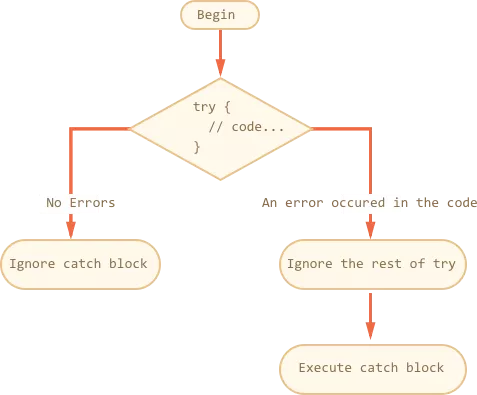

# 第四章 语句

---


## if 语句

------

我们已经在第三章中了解了 JavaScript 中数据的使用，掌握到的预备知识是我们具备了随心所欲操控数据的能力，在这一章中我们将学习 JavaScript 中的*语句*，以编写出“真正的”程序，并逐步将我们头脑中的逻辑，转化为程序真切的运行过程。

在前面的运行示例中，我们接触到的都是顺序结构，即程序从第一条语句，逐行执行到结尾，而在这一章中我们将了解到*分支结构*和*循环结构*。

我们首先要学习的是 *`if` 语句*。它用于实现分支结构。

想象一下，当我们要去买芹菜的时候，我们会执行这样的过程：

1. 出门，找到菜市场
2. 挑选芹菜
3. 付钱，将菜带回家。

这就是我们所说的顺序结构。但实际上，我们买菜可能会经历这样的过程：

1. 出门，找到菜市场

2. 寻找卖芹菜的摊位

   如果有卖芹菜的

   1. 买一斤芹菜

   2. 称重，付款，回家


    如果没有卖芹菜的

   1. 看看有没有其他适合的蔬菜
   2. 称重，付款，回家

以上过程的结构称为*分支结构*，我们可以用 `if` 语句来在程序中实现分支结构，它的*语法*是这样的：

```javascript
if (条件) {
    执行语句
}
```

一条 `if` 语句以关键字  `if` 开头，其后跟随一对括号，括号中是一个逻辑表达式，用于表示执行语句的条件。

例如：

```javascript
let a = 4;
if (a > 3) {
    alert("a 大于 3");
}
```

这段代码中的 `if` 语句的条件是 `a > 3`，所执行的语句是 `alert("a 大于 3");` 。显然，`a` 大于 `3`，因此条件成立（逻辑表达式得到 `true`），那么执行大括号中的语句——显示出 `"a 大于 3"` 这行内容。

`if` 语句只管理它大括号中的内容，其他部分不受条件影响。

倘若我们要考虑两种情况（如示例中的“有卖芹菜的摊位”与“没有卖芹菜的摊位”），那么我们可以使用 `if` 语句的另一种形式。

```javascript
if (条件) {
    语句1
} else {
    语句2 
}
```

这种形式的作用是：如果条件成立，那么执行代码1中的内容，否则，执行代码2。

`else` 关键字所*引导*的内容称为 *else 子句*，它用于说明“条件不成立”这一情况。

示例：

```javascript
let a = 4;
if (a > 5) {
    alert("a 大于 5");
} else {
    alert("a 小于等于 5");
}
```

在示例中，由于 `a` 的值为 `4`，`if` 语句的判断条件不成立（得到 `false`），所以不会显示 `"a 大于 5"`，而是执行 `else` 子句中的语句，显示 `"a 小于等于 5"`。如果 `a` 的值大于 `5`，符合判断条件的话，那么就会显示 `"a 大于 5"`。

我们似乎已经能够处理条件成立和不成立两种情况了。但现实生活比这复杂的多，我们可能会遇到许多其他情况，需要对每种情况一一加以判断并分别作出相应决定。在 JavaScript 中，我们可以使用 `if` 语句的高级形式，像这样：

```javascript
let score = 85;
if (score >= 90) {
    alert("优秀");
} else if (score >= 80) {
    alert("良好");
} else if (score >= 60) {
    alert("及格");
} else {
    alert("不及格");
}
```

上述代码模拟了一种常见情景：将成绩分为不同层次，并作出对应通知。

它的执行过程会先从第一个条件开始，如果条件成立，那么执行其后的语句；如果条件不成立，那么尝试判断第二个条件，若成立则执行相应语句，否则判断第三个条件……直到最后一条 `else` 子句，即当所有可能条件都不成立时，执行其中的语句。在上述代码中，分数大于等于 `80`，我们便得到了“良好”。

我们在第三章已经阐述过，JavaScript 会将一些值视为“真”，另一些视为“假”，以此进行逻辑运算，而不仅仅是局限于布尔值。同样，在 `if` 语句的条件并不要求得到一个布尔值，只要得到的值被视作“真”，就会执行相应语句。

因此，假如我们有如下代码：

```javascript
// 判断一个数字是奇数还是偶数。
// 如果它除以 2 的余数为 0，即能被 2 整除，那么是偶数。
// 否则为奇数。
let number = 100;
if (number % 2 === 0) {
    alert("偶数");
} else {
    alert("奇数")
}    
```

当条件的值为 0 时，它会被当做假，那么我们可以用更方便的形式书写条件：

```javascript
let number = 100;
if (number % 2) { // 余数不为 0，会当做“真”
    alert("奇数");
} else {          // 余数为 0，会当做“假”
    alert("偶数")
}    
```

`if` 语句是我们接触到的第一个 JavaScript 控制语句。我们可以用它来描述真实世界中的各类选择。

一条简洁明快的 `if` 语句，将一切分成了真假两个世界，中间隔着逻辑这条天河，它向何处流动，取决于你的思考。逻辑的伟力在于泾渭分明，逻辑的生命在于它所带来的不容逾越的秩序。


---

练习 4.1.1

1. 写一个幸运转盘的程序，每次根据一个随机数字的范围来决定颁发什么奖品。
2. 写一个程序，让用户输入出生年份，判断用户的生肖属相。如果不是一个合理的年份，就显示一个错误。

---


我们可以用 `if` 语句来处理一些生活中常见的、需要进行繁琐的分类讨论的问题，例如个人所得税的计算。

假设我们的父母（成年人也可以假设为自己）是工薪阶层，每个月都可能需要根据月收入缴纳一笔个人所得税，数额会被划分为不同的层级，面临的税率和所要缴纳的相应税款也不一样。根据中国法律规定，个人所得税的起征点是 3500 元。

> 在实际工作中，对于某些个人所得收入采用税后收入的概念，比如支付税后多少多少金额。这时，需要将税后的收入按一定公式换算为应税所得，然后再按照一般方法计算应交的税款。否则，将导致税款的少征。这里，在换算为应税所得过程中需要适用的税率及速算扣除数不能按照含税级距的税率表来套用，必须使用不含税级距的税率表。这就是不含税级距税率表产生的原因。这里的不含税级距指的是“税后收入”级距。

截止到 2011 年，中国的个人所得税税率如下表所示：

| 级数 | 含税级距                     | 不含税级距                   | 税率(%) | 速算扣除数 |
| ---- | ---------------------------- | ---------------------------- | ------- | ---------- |
| 1    | 不超过1500元                 | 不超过1455元的               | 3       | 0          |
| 2    | 超过1500元至4,500元的部分    | 超过1455元至4,155元的部分    | 10      | 105        |
| 3    | 超过4,500元至9,000元的部分   | 超过4,155元至7,755元的部分   | 20      | 555        |
| 4    | 超过9,000元至35,000元的部分  | 超过7,755元至27,255元的部分  | 25      | 1,005      |
| 5    | 超过35,000元至55,000元的部分 | 超过27,255元至41,255元的部分 | 30      | 2,755      |
| 6    | 超过55,000元至80,000元的部分 | 超过31,375元至45,375元的部分 | 35      | 5,505      |
| 7    | 超过80,000元的部分           | 超过57,505的部分             | 45      | 13,505     |

备注：

- 本表含税级距指以每月收入额减除费用 **3500 元**后的余额或者减除附加减除费用后的余额。
- 含税级距适用于由纳税人负担税款的工资、薪金所得。
- 不含税级距适用于由他人（单位）代付税款的工资、薪金所得。

我们可以根据税率的级数进行分类讨论，有点像中学数学课上学过的分段函数。

```javascript
let income = parseFloat(prompt("请输入原始收入"));

let basic = 3500;           // 个人所得税起征点
let gap   = income - basic; // 税前收入与起征点之差
let tax   = 0;              // 应付税额
if (gap <= 0) {
    tax = 0;
} else if (gap > 0 && gap <= 1500) {
    tax = gap * 0.03;        
} else if (gap > 1500 && gap <= 4500) {
    tax = gap * 0.1 - 105;
} else if (gap > 4500 && gap <= 9000) {
    tax = gap * 0.2 - 555;    
} else if (gap > 9000 && gap <= 35000) {
    tax = gap * 0.25 - 1005;
} else if (gap > 35000 && gap <= 55000) {
    tax = gap * 0.3 - 2775;
} else if (gap > 55000 && gap <= 80000) {
    tax = gap * 0.35 - 5505;
} else {
    tax = gap * 0.45 - 13505;
}

alert(Math.floor(tax));
```

这个例子具有相当的实用性，要不要考虑将自己或家人的收入通过这个程序计算一下，看看是否与实际情况吻合呢？


## switch 语句

---

### 初识 switch 语句

在前文中，我们已经学习并尝试了**分支结构**。我们将在几个示例中进一步了解它的使用。

设想一下，我们有一个有奖猜数活动，参与者可以随机输入一个 1 和 3 之间的整数，我们告诉参与者是否猜中，或与答案相差多少。利用 `if` 语句，我们可以这样写：

```javascript
let number = +prompt("请输入 1 和 3 之间的整数");

if (number === 1) {
    alert("太小了！");
} else if (number === 2) {
    alert("刚刚好！");
} else if (number === 3) {
    alert("太大了！");
} else {
    alert("哦，数字超出范围！");
}
```

我们共需依次比较三种情况，根据每种情况作出相应回应。而不在我们考虑范围内的“其他情况”则放入 else 子句中处理。在需考虑的情况较少时，使用 `if` 语句以此判断尚可应付需求，但当我们需要考虑到情况变得多，使用 `if` 语句就会显得力不从心。此外，如果我们要用相同的方式分别处理不同的情况，使用 `if` 语句会相当麻烦。

为此，JavaScript 中提供了另一种实现分支结构的语句：*`switch` 语句*。

`switch` 语句的一般格式如下：

```javascript
switch (表达式) {
    case 情况1: 处理语句1; break;
    case 情况2: 处理语句2; break;
    case 情况3: 处理语句3; break;
    //...
    default: 默认处理语句;
}
```

`switch` 语句遵循这样的执行顺序：

- 每个 `case` 关键字都用于标明一个情况。
- JavaScript 依次查看每种情况，然后对表达式求值，查看表达式的值是否能够与这种情况匹配。
- 如果匹配（严格相等），就执行冒号后的处理语句。如果以 `break;` 结尾，那么终止 `switch` 语句。
- 否则，继续查看下一个情况，以此类推。
- 当所有列举的情况都查看完之后，如果有一个 `default` 标志，就执行它的处理语句，作为默认情况。

前面的例子可以使用 `switch` 语句改写如下：

```javascript
let number = +prompt("请输入 1 和 3 之间的整数");

switch (number) {
    case 1:
        alert("太小了！");
        break;
    case 2:
        alert("刚刚好！");
        break;
    case 3:
        alert("太大了！");
        break;
    default: alert("哦，数字超出范围！");
}
```


---

练习 4.2.1

1. 找到一个可以使用 switch 进行处理的生活中的例子，并编写程序实现它。

---


### 使用 break

让我们回忆一下 `if` 语句的机制：

> 对每个条件进行查看，如果成立，就执行相应处理语句，然后结束 `if` 语句。

当我们使用 `switch` 语句的时候，我们并不一定希望在找到匹配情况后，仍然继续匹配其余情况。但是，`switch` 语句有个特点：**当它匹配到一种情况之后，会继续执行之后其他情况的处理语句，**甚至包括 `default` 。

为了模仿 `if` 语句“干完事就走人”，不拖泥带水，我们需要在每一个 `case` 的处理语句后添加一行 `break;` 。

```javascript
let fruit = prompt("请输入一种水果的名字：");

switch (fruit) {
  case "橙子":
    alert("橙子卖 0.59 美元。");
    break;
  case "苹果":
    alert("苹果卖 0.32 美元。");
    break;
  case "香蕉":
    alert("香蕉卖 0.48 美元。");
    break;
  case "车厘子":
    alert("车厘子卖 3 美元");
    break;
  case "芒果":
  case "桑葚":
    alert("芒果和桑葚卖 2.79 美元。");
    break;
  default:
    alert("抱歉，本店没有水果" + fruit + "。");
}

```

`switch` 语句每当遇到匹配的情况，执行相应处理语句后，就会终止。

如果 `break;` 后面还有处理语句，那么它不会被执行，因为 `break;` 已经起到了终止 `switch` 语句的作用。

我们使用 `switch` 语句时一般都会添加 `break;` ，这是一种良好习惯。没有添加 `break;` 以至于所有 `case` 都会被查看一遍的 `switch` 语句被称为 *switch 穿越*，可能会引发一些问题，我们将在下文中看到 switch 穿越所展现出的效果。。


### 关联操作

这个例子阐述了利用 `switch` 语句进行的关联操作。如前文所述，当我们输入一个数字并匹配之后，它会执行其后，一直第一个到 `break;` 之前的所有处理语句。

```js
let value = 1;
let output = "输出： "
switch (value) {
  case 10:
    output += "所以";
  case 1:
    output += "你的";
    output += "名字";
  case 2:
    output += "是";
  case 3:
    output += "什么";
  case 4:
    output += "？";
    alert(output)
    break;
  case 5:
    output += "！";
    alert(output);
    break;
  default:
    alert("请选择一个 1 到 6 之间的数字！");
}
```

尝试改变 `value` 的值，相信你会对 switch 的机制有更深的体会。如果你不是特意为了制造出这种效果，请记得：务必在每种情况的相应处理语句末尾添加 `break;`。


---

练习 4.2.3

1. 使用 `switch` 语句的穿越特性，写一个程序，模拟一个会根据指令来问好的机器人。

---


### 分组

生活中有什么事情会像在 1 ~ 3 之间猜一个数字这样简单而乏味呢——让我们将目光投向更“实际”的问题。

现在我们摇身一变成了动物保护专家，向好奇的小朋友普及动物保护的知识，告诉他们哪些动物已经灭绝而湮没在历史中，哪些动物在悬崖边上苦苦挣扎，哪些动物暂时毫无危险。

```javascript
let animal = prompt("请输入一种动物的名字：");
switch (animal) {
    case "猫":
    case "金鱼":
    case "鸵鸟":
    case "企鹅":
    case "火鸡":
    case "马":
        alert(animal + "没有危险！");
        break;
    case "大象":
    case "熊猫":
    case "江豚":
        alert(animal + "处于危险之中，我们要一起保护它们。");
        break;
    case "渡渡鸟":
    case "恐龙":
    case "象鸟":
        alert(animal + "已经灭绝。");
        break;
    default:
        alert("我没听过这种动物的名字。");
}
```

我们对小朋友提出的问题进行了分类，只用一行处理代码，统一回应相同性质的提问。

------

练习 4.2.4

1. 思考生活中有哪些实际问题可以使用 `switch` 进行分组处理。

------


### 使用动态条件

我们用一个小示例来结束本节。

```js
let i = Math.floor(Math.random() * 7)
switch (i) {
    case ((i >= 0 && i <= 5) ? i : -1): // 如果 0 ≤ i ≤ 5，那么待匹配的值为 i ，否则为 -1。
        alert("0 ~ 5"); 
        break;
    case 6:
        alert("6");
        break;
}
```

如上所示，你可以在 `switch` 语句的 `case` 中进行一些运算，以此呈现出“动态”的匹配效果。


## while 和 do-while 语句

---

### 循环结构

我们将开始接触 JavaScript 中的**循环结构**。顾名思义，循环结构能够在一定条件下循环执行同一段代码，这个过程称之为*迭代*。我们可以使用 *`while` 语句*来实现循环结构。

`while` 语句看起来像这样：

```javascript
while (条件) {
    执行语句
}
```

像 if 语句的条件一样， `while` 语句的条件是一个表达式，称为*条件*，写在一对小括号中。大括号连同其中的执行语句被称为*循环体*。如果执行语句只有一行，也可以省略包裹它的大括号。

- 对条件进行求值。
- 如果得到的值被看做 `true`（条件成立），那么执行一次循环。否则不执行。
- 循环体执行完毕后，再次对条件进行求值，如果成立则再次循环执行，否则停止。

用一个简单的示例来演示 `while` 语句的用法：

```javascript
let n = 0;
let x = 0;

while (n < 3) {
  n += 1;
  x += n;
}

alert(n); // 3
alert(x); // 6
```

在每次循环中，`n` 都会自增 `1`，然后再把 `n` 加到 `x` 上。因此，在每轮循环结束后，`x` 和 `n` 的值分别是：

- 第一轮后：`n` = 1，`x` = 1
- 第二轮后：`n` = 2，`x` = 3
- 第三轮后：`n` = 3，`x` = 6

当完成第三轮循环后，条件 `n`< 3 的值不再为真，因此循环终止。

现在我们要考虑用 `while` 语句进行一些实际应用。我们首先回忆一下高斯小时候那个著名的故事——你一定耳熟能详，对吧？

>  高斯上小学时，有一天老师出了一道算术难题：计算 1＋2＋3＋……＋100 。这下可难倒了刚学数学的小朋友们，他们按照题目的要求，正把数字一个一个地相加．可这时，却传来了高斯的声音：“老师，我已经算好了！”老师很吃惊，高斯解释道：因为1＋100＝101，2＋99＝101，3＋98＝101，……，49＋52＝101，50＋51＝101，而像这样的等于101的组合一共有50组，所以答案很快就可以求出：101×50＝5050  

哦，我们不是高斯，所以我们可以使用 `while` 语句来进行循环计算，这样就解决了其他小朋友们的痛点。我们要干的事情就像任何一个不懂计算技巧的普通的小朋友那样：

1. 使用一个变量 `n`，存放初始值 `0` 。现在什么也没有，计算还没开始。
2. 使用另一个变量 i，用来计算每次应该被加上的值。`i` 每增加 `1`，`n`  就加上 `i`，直到 `i` 等于 `100`。
3. 现在 `n` 就包含了我们累加的值。

累加的过程使用 `while` 语句来处理，写成这样：

```javascript
let n = 0;
let i = 0;
while (i < 100) {
    i += 1;
    n += i;
}

alert(n); // 5050
```

上述代码演示了 `while` 语句的基本应用。使用循环结构，可以解决我们手工计算的一些常见痛点，避免带来冗余。

实际上，你也可以将这样简单有效的运算推广到更大的范围，例如从 `1` 加到 `10000`，或 `i` 增加的值换成其他。当然，计算量越大，等待计算完成的时间也就越长，如果数字大小超过了 `Number.MAX_VALUE`，就会溢出。（还记得第三章中的相关知识吗？:-D）

一个更常见的需求是*阶乘*。在数学上，`n` 的阶乘是指 1 × 2 × 3 × ... × n 这样的计算过程，其符号是 `n!` 。

我们已经有了从 1 累加到 100 的经验，而实现阶乘，看起来只是把加法运算改为乘法运算。

```javascript
let n = 1;
let i = 1;
while (i < 5) {
    i += 1;
    n *= i;
}

alert(n); // 120
```

这段代码实现了 5 的阶乘。`i` 作为*计数器*，依然是每次加上 1 ，而作为结果的 n 每次循环中乘以 i ，并作为新值。我们可以将它的步骤展开，以更清楚地观察运行过程：

1. n = 1, i = 1
2. i = 2, n = n * i  = 1 * 2 = 2
3. i = 3, n = n * i = 2 * 3 = 6
4. i = 4, n = n * i = 6 * 4 = 24
5. i = 5, n = n * i = 24 * 5 = 120

我们可以从用户那里得到一个数字，并求出它的阶乘值。

```javascript
let n = 1;
let i = 1;
let value = parseInt(prompt("请输入一个整数："));
while (i < value) {
    i += 1;
    n *= i;
}

if (!isFinite(n)) {
    alert("数字太大了！");
} else {
    alert(value + "的阶乘是：" + n);
}
```

我们可以输入一些数字来进行测试。如果我们输入的数字的阶乘值太大，超出了 JavaScript 的表示范围（得到 `Infinity`），那么我们会得到一个贴心的提示。或者，得到这个阶乘值（或其约数）。看起来一切正常。

但是！当我们输入负数呢？如果我们输入的内容无法解析为整数以至于得到 `NaN` 呢？我们会得出错误的结果。

```javascript
value = 0; // 1，正确
value = -1; // 1，错误
value = -2; // 1，错误
value = "Hello"; // 1，错误
```

关于“负数是否具有阶乘”等数学概念不在这里讨论范围内，我们应当设立明确的界限，对得到的值进行检查。如果它不符合要求，就通知用户，并不进行后续计算。

```javascript
let n = 1;
let i = 1;
let value = parseInt(prompt("请输入一个正整数："));

if (isNaN(value) || value < 0) {
    alert("无法进行计算！")
} else {
    
    while (i < value) {
        i += 1;
        n *= i;
    }

    if (!isFinite(n)) {
        alert("数字太大了！");
    } else {
        alert(value + "的阶乘是：" + n);
    }
}
```

这样，我们可以保证：只有当得到一个正确的值的时候，才会进行计算。

我们还可以开动脑筋，将这个程序赋予更多创意：

```javascript
let n = 1;
let i = 1;
let value = parseInt(prompt("请输入一个正整数："));

while (!isNaN(value) && value >= 0) {    
    while (i < value) {
        i += 1;
        n *= i;
    }

    if (!isFinite(n)) {
        alert("数字太大了！");
    } else {
        alert(value + "的阶乘是：" + n);
    }
    value = parseInt(prompt("请输入一个正整数："));
}
```

这个程序将我们已经学习的诸多概念融合在了一起，如果你一时没看明白这个程序究竟在做什么，可以多花点时间仔细看一看。这里解释一下这个程序所干的事情：

1. 得到一个用户输入的值（`value`）。
2. 如果这个值符合我们的要求，就开始执行后续过程。
3. 进行常规阶乘计算。
4. 通知用户关于阶乘计算的情况。
5. 再次要求用户输入一个值。
6. 回到步骤 2。

这个程序演示了 `while` 语句作为控制结构的一般应用。它控制了整个程序的运行流程，这类流程被称为*控制流*。我们将在本章后续了解到如何进一步完善控制流。在这个程序中，当你输入一个不符合要求的值时，控制流便会终止。当我们学习*异常处理*的概念之后，我们可以使用更加优雅的方式来处理异常和终止的情况。


### do-while 语句

`while` 语句有一种变体，称为 *`do-while` 语句*。它的形式如下：

```javascript
do {
    执行语句
} while (条件)
```

与通常的 `while` 语句不同的是，它的循环体写在了 `do` 关键字后面，而循环条件则放在了循环体的后面。

在第一次查看条件之前，`do-while` 语句无论如何都会先执行循环体，然后再查看条件，判断是否进行下一次循环。除此以外与通常的 `while` 语句是完全等价的。

```javascript
let n = 1;
let i = 1;
do {
    i += 1;
    n *= i;
} while (n < 5)

alert(n); // 120
```

`do-while` 语句适用于需要先执行一遍，再进行条件判断的情况。


## for 语句

---

### 基本概念

while 和 do-while 语句可以用于实现循环结构，除此以外，JavaScript 中提供了另一种更加灵活快捷的方式来进行循环（或者叫迭代）：*`for` 语句*。

一个 `for` 语句看起来像这样：

```javascript
for (初始化表达式; 条件; 增量表达式) {
    执行语句
}
```

等等，`for` 语句的小括号中包含了三个东西！它们都是什么？

首先是*初始化表达式*。它用于说明哪些值会被用在循环中。例如，在上一节的阶乘示例中，我们在进行计算之前要先设置变量 `i` 和 `n` 的值为 `1`，这类操作就是*初始化*。你可以将初始化的操作直接放在 `for` 语句里，称为初始化表达式。

初始化表达式的分号后面是*条件*，它表示控制循环进行的条件，与 while 语句是一致的。

而*增量表达式*用于在每次循环后，改变控制循环的变量的值，以此达到控制循环次数的作用。

事不宜迟，用一个简单的示例来看一下 `for` 语句的使用：

```javascript
for (let i = 0; i < 5; i += 1) {
    alert(i);
}
// 0
// 1
// 2
// 3
// 4
```

1. 首先设置控制循环的变量 `i` 的值为 `0`。
2. 查看 `i` 的值是否满足条件。
3. 满足，那么执行循环体的语句，显示出 `i` 的值。
4. 循环体结束，根据增量表达式，改变 `i` 的值，为下一次循环做准备。
5. 回到步骤 2。

如果 `i` 的值一开始就不满足条件，那么循环体一次也不会被执行，像 while 语句一样。

上一节中的计算 1 + 2 + 3 + ... + 100 的示例，使用 `for` 语句可以改写如下：

```javascript
let n = 0;
for (let i = 1; i < 100; i += 1) {
    n += i;
}
alert(n); // 5050
```

我们使用 `i` 作为控制循环的变量，每次循环后它的值便会 +1 ，同时 `i` 也起到了从 1 增长到 100 ，用于使 `n` 进行累加的作用。

事实上，为了充分利用 `for` 语句，我们还可以更进一步：

```javascript
for (let i = 1, n = 0; i < 100; i += 1, n += i) {

}
alert(n); // 5050
```

我们可以在初始化表达式的位置上写几个用于进行初始化的表达式，只需使用逗号隔开。

同样，增量表达式也可以对不同的变量进行增量处理。它的求值顺序是从左到右的，也就是说，先计算了 `i += 1` ，然后再处理 `n += 1`。

如果我们的循环体没有语句，我们根本就不用写大括号，直接省略就好了！。

```javascript
for (let i = 1, n = 0; i < 100; i += 1, n += i)

alert(n);
```

但是运行这段代码，就会发现，`alert` 不会在循环结束后执行，而是每进行一次循环都会显示一次当前 `n` 的值。因此，你一共要点一百次“确认”，直到循环结束。

现在，刷新页面，一切恢复正常。

为什么会这样？因为 `for` 语句和 while 语句一样，如果没有写大括号，会将循环头部（即一对小括号包裹的内容）的后面遇到的第一个语句当做是循环体，因此 `alert(n)` 被循环执行了。解决这个问题的办法是在循环头部后面写一个分号 `;` ，用一个*空语句*来代替循环体。

```javascript
for (let i = 1, n = 0; i < 100; i += 1, n += i) ;
//  ; （更推荐写在第二行）
alert(n); // 5050
```


---

练习 4.4.1

1. 创建一个 1 ~ 100 的循环，当数字 `n` 是奇数时，打印 “ `n`是奇数”，否则打印“`n`是偶数”。

   提示：使用运行器提供的 `document.write` 函数来进行“打印”操作。

2. 显示一个九九乘法表，使用 `document.writeln` 函数来打印每一行。

   提示：你需要将一个 `for` 语句写在另一个内部，使用它们的控制变量来输出因数。


### 迭代算法

我们在这里第一次接触*算法*一词。Wikipedia 对此的定义如下：

> 在数学和计算机科学中，**算法**是一个明确的、关于如何解决一类问题的规范。算法可以执行计算，数据处理、自动推理和其他任务。算法可以在有限的空间和时间内表达。从初始状态和初始输入开始，描述了一系列计算，当执行时，通过有限个明确定义的连续状态，最终产生“输出” ，并终止于最终结束状态。

当我们要实现某种功能时，我们将会用精确的语言，描述我们所要实施的步骤。例如在上文中对于循环过程的描述就叫算法。迭代算法则是用迭代等方式实现的算法，通俗来讲，使用循环和条件控制来进行一系列运算，以得到我们需要的结果。上文中的累加和阶乘等运算就属于迭代算法。

我们将会在本节深入了解迭代算法，一个常见的实际应用就是检测一个数是否为质数。

如果你忘记了什么叫质数，我们可以先复习一下小学数学书上对于质数的描述：

> 如果一个大于 1 的整数只有 1 和它本身两个因数，那么它就是一个质数，否则就是合数。
>
> 2 是最小的质数，1 既不是质数也不是合数。

换句话说，一个整数如果大于 1，并且不能整除除 1 以外的所有比它小的整数，那么它就是一个质数。

我们很快就可以得到判断一个数 n 是否为质数的思路：

1. 如果这个数不大于 1 或不为整数，那么它必定不是质数。
2. 从 2 开始，列举从 2 到 n-1 的所有整数，用 n 除以列举的数。
3. 如果得到的余数为 0，说明 n 可以整除它，那么 n 不是质数。
4. 如果列举完后也没有找到一个数可以被 n 整除，那么 n 是质数。

我们可以根据这个思路尝试写出代码，列举数字的工作自然就交给 `for` 语句。

```javascript
let n = 100;
let isPrime = true; // 假设它是一个质数
for (let i = 2; i < n; i += 1) {
    if (n % i === 0) {
        isPrime = false;
    }
}
alert(isPrime ? "质数" : "合数"); // "合数"
```

通过列举它可能的因数，尝试进行整除，这种策略称为*试除法*。

这个代码可以正常工作，但我们很快就发现了它的问题：当我们发现 `n` 不是一个质数的时候，应该终止计算并告知结果。但是这里，即使我们发现了 `n` 是合数，`for` 语句也不会停下来，又白白将剩下的循环运行完。

因此，我们应当采取策略：当我们知道它不是一个质数的时候，我们就不再进行试除了，而是报告结果。

```javascript
let n = 100;
let isPrime = true; // 假设它是一个质数
`for` (let i = 2; i < n; i += 1) {
    if (n % i === 0) {
        isPrime = false;
        break;
    }
}
alert(isPrime ? "质数" : "合数"); // "合数"
```

这里再次出现了 `break;` 语句。它在这里的作用是**直接终止循环**。


我们知道，一个合数最大的因数不会超过它的平方根，例如 100 最大的因数就是 10 ，判断一个整数是否为质数，只需列举到它的平方根进行试除就足够了：

```javascript
let n = 100;
let isPrime = true; // 假设它是一个质数
for (let i = 2, last = Math.sqrt(n); i <= last; i += 1) {
    if (n % i === 0) {
        isPrime = false;
        break;
    }
}
alert(isPrime ? "质数" : "合数"); // "合数"
```

由于除了 2 以外的所有质数都是奇数，因此我们可以进行一个简单的判断：

- 如果输入的数字是 2 ，那么它是一个质数。
- 如果输入的数字不是 2，但能被 2 整除，那么它是一个合数。
- 从 3 开始列举它的因数，每次 +2，使列举的值始终是奇数。

```javascript
let n = 100;
let isPrime = (n === 2) || (n % 2 !== 0);
for (let i = 3, last = Math.sqrt(n); i <= last; i += 2) {
    if (n % i === 0) {
        isPrime = false;
        break;
    }
}
alert(isPrime ? "质数" : "合数"); // "合数"
```


我们的程序可以用于处理用户输入并得到结果了，不过务必记得进行输入检查。

```javascript
let n = parseInt(prompt("请输入一个大于 1 的正整数。"));
while (true) { // 循环接受输入。
    if (isNaN(n) || !isFinite(n) || n <= 1) {
        alert("输入不符合要求，程序停止");
        break; // 如果输入不符合要求，就停止循环接受输入。
    }
    
    let isPrime = (n === 2) || (n % 2 !== 0);
    for (let i = 3, last = Math.sqrt(n); i <= last; i += 2) {
        if (n % i === 0) {
            isPrime = false;
            break; // 这个 break 语句只退出当前所在的循环。
        }
    }
    alert(`${n}是一个${isPrime ? "质数" : "合数"}`); // 使用模板字符串来拼凑信息
    n = parseInt(prompt("请输入一个大于 1 的正整数。"));
}
```

我们的质数判断程序遵循的基本流程是“输入-处理-输出”。为了避免每次输出后都要重新运行才能开始新的流程，我们可以用一个循环将流程包进去。由于我们已经认识了 break 语句，因此可以自由决定 while 循环何时终止。循环头的条件用 `true` 来表示“条件始终成立”，表示它不再管条件判断，只需不断进行循环以重复相同的流程。这样的程序称为“Read-Eval-Print Loop”（输入-处理-输出循环），缩写为 **REPL**。


---

练习 4.4.2

1. 本节提供了一个完整的用于判断质数的 REPL 示例程序，请在此基础上对它进行修改：如果 `n` 是一个合数，那么同时显示发现的第一个因数。

2. 对本节的示例程序进行扩充，接受一个用户输入的整数 n，查找 2 ~ n 范围内的所有质数并显示。

   （提示：将找到的质数放在数组中）

---


### 数组遍历

假如我们有一列排列整齐的课桌，每张课桌上都写着使用它的学生的姓名，现在我们要依次浏览并记录每张课桌上的姓名，最直观的的办法显然是：从第一张课桌开始，记录课桌上的信息，然后走到下一个课桌，以此类推。

这个过程用精确的语言描述一下：

1. 走到第一张课桌的位置，记录信息
2. 走到下一张课桌的位置，如果这里确实还有课桌，就继续记录。
3. 如果没有课桌了，就停止这个过程。
4. 否则，回到步骤 2。

我们应该怎样用 JavaScript 来实现这个过程呢？相信答案已经呼之欲出了——循环！使用循环来解决这个问题。

```javascript
let queue = ["Sonam", "Susanna Kliment", "Unnr Radmila", "Davide", "Rebekah "];

for (let i = 0; i < queue.length; i += 1) {
    alert(`第${i}个学生的姓名是：${queue[i]}`);
}
// Sonam
// Susanna Kliment
// Unnr Radmila
// Davide
// Rebekah 
```

我们使用 `for` 语句依次访问了数组中的每一个元素，变量 `i` 表示数组元素的*索引*，它是一个约定俗成的名称。如果这个索引值小于数组长度，说明还没有到数组尽头，那么就继续进行处理，否则就停止循环。依次访问数组每一个元素的过程称为*遍历*。


## for-in 和 for-of 语句

---

JavaScript 提供了 for 语句的两种变体用于更加灵活地实现遍历，不但能遍历数组的索引和值，也能遍历对象的成员，并将得到的值赋给一个变量。

### 属性遍历

我们可以使用 *`for-in` 语句*来遍历一个对象中的所有属性名称。`for-in` 语句的形式如下：

```javascript
for (let 变量 in 对象) {
    处理语句
}
```

`for-in` 语句会依次访问对象中的每个属性的名称，并将得到的字符串存放在指定的变量中，这个过程会对每一个*可遍历*的属性都执行一次。

```javascript
const person = {
    name: "Jason",
    age:  30,
    sex: "male",
    job: "teacher"
};

for (let i in person) {
    alert(i);
}
// "name"
// "age"
// "sex"
// "job"
```

有了属性名，我们也就能同时得到它的值：

```javascript
for (let i in person) {
    alert(person[i]);
}
// "Jason"
// 30
// "male"
// "teacher"
```

于是，我们可以简单地打印出一个对象的内容：

```javascript
let s = "{\n";
for (let i in person) {
    s += `${i}: ${person[i]}\n`;
}
s += "}";
alert(s);
```

结果如图所示：


`for-in` 语句提供了对对象内容进行操作的快捷方式。在这个遍历的过程中，我们可以干许多事情。比如——给每个属性都重新起一个名字，抛弃原来的：

```javascript
for (let i in person) {
    person["属性-" + i] = person[i];
    delete person[i];
}
```

这时再用之前的方式查看对象内容，就会看到每个属性的名字都被改变了。

```
{
属性-name: Jason
属性-age: 30
属性-sex: male
属性-job: teacher
}
```

我们还可以更进一步：为每个属性都进行编号，毕竟， `for-in` 语句的本质还是循环，可以做一些适合循环做的事情。

```javascript
let count = 1;
for (let i in person) {
    person[`第${count}个属性-${i}`] = person[i];
    delete person[i];
    count += 1;
}
// {
// 第1个属性-name: Jason
// 第2个属性-age: 30
// 第3个属性-sex: male
// 第4个属性-job: teacher
// }
```

要知道 `for-in` 语句赋予了我们随意与属性和值打交道的权力——是的，我们甚至可以*交换*属性的名称与值的位置。**当然，如果原本的值就不是一个*基本类型*，我们还是不要这样做，否则会发生奇怪的事情。**

```javascript
const object = {
    name: "Andy",
    checked: true,
    anotherObj: {
        a: 1,
        b: 2
    }
};

for (let i in object) {
    let newName = object[i]; // 将原本的值存放起来
    if (typeof newName !== "object") { 
        // 它不是一个对象，目测是基本类型
        
        object[newName] = i;     // 值的内容来命名一个新的属性，它的值就是原本的属性名
        delete object[i];        // 原来的属性还在，但我们不需要它了
    }    
}
// 再用之前的方式查看一下对象里的情况
// {
// anotherObj: [object Object]
// Andy: name
// true: checked
// }
```

又是 `"[object Object]"` ！恐怕你已经猜测到了我们所要避免的问题所在了。这个奇怪的东西我们将会在第七章详细讨论到，现在我们只需简单了解这一情况。

使用 `for-in` 语句，我们可以自由地查看、操作一个对象的内容。它是否使我们与对象更亲近了？

---

Note：我们只能遍历一个*可迭代对象*中的*可枚举属性*，我们将在下文了解这些概念。

---


### 可迭代对象

不单单是对象，我们也可以使用 `for-in` 语句来遍历数组，它提供了比前一节所介绍的更为简便的方法。在第三章中我们已经知道，**数组也是一种特殊的对象，它的索引都是属性，元素就是属性的值**，我们可以使用类似的方式来遍历它。

```javascript
let array = ["aa", "bb", "cc", "dd", "ee", "ff"];
for (let i in array) {
    alert(`${i}: ${array[i]}`);
}
// 0: aa
// 1: bb
// 2: cc
// 3: dd
// 4: ee
// 5: ff
```

数组与我们通常所写的对象的本质区别在于，它是*可迭代的*，也就是说每个成员的排列方式都遵循固定的顺序，我们可以通过固定的方式来依次访问每个成员。还有什么东西也是这样的呢？字符串！

```javascript
let s = "Hello world";
for (let i in s) {
    alert(`第${i}个字符是 "${s[i]}"`);
}
// 第0个字符是 "H"
// 第1个字符是 "e"
// 第2个字符是 "l"
// 第3个字符是 "l"
// 第4个字符是 "o"
// 第5个字符是 " "
// 第6个字符是 "w"
// 第7个字符是 "o"
// 第8个字符是 "r"
// 第9个字符是 "l"
// 第10个字符是 "d"
```

字符串可以看做“字符的数组”，也就可以通过通常的方式遍历其中包含的每一个字符。


---

Note: 

每一个可迭代对象都包含一个**迭代器**。迭代器涉及 JavaScript 中一些非常高级的概念，我们将在第七章中详细了解。

---


for 语句的另一种变体—— *`for-of` 语句*更关注对值的操作，当我们只需要遍历一些值时，我们就可以使用它。

`for-of` 语句的形式与 `for-in` 语句类似：

```javascript
for (let 变量 in 对象) {
    执行操作
}
```

用 `for-of` 语句来遍历数组中的每个值会格外方便。

```javascript
const arr = ["aa", "bb", "cc", "dd", "ee", "ff"];
for (let i of arr) {
    alert(i);
}

// "aa"
// "bb"
// "cc"
// "dd"
// "ee"
// "ff"
```


与 `for-in` 语句的显著不同之处在于，`for-of` 语句只能对**可遍历对象**进行遍历。如果你对一个普通对象使用 `for-of` 语句，会得到一个错误。

```javascript
// person 对象就是先前的那个
for (let i of person) {
    alert(i);
} //  TypeError: person is not iterable
```

但是不必就此打住：还记得第三章中见到的 `Object.keys` `Object.values` `Object.entries` 三个函数吗？它们得到的是数组！换句话说，我们可以借助于它们来迭代普通对象！

```javascript
for (let [name, value] of Object.entries(person)) {
    alert(`${name}: ${value}`);
};
// name: Jason
// age: 30
// sex: male
// job: teacher
```

或者使用 `Object.values` 作为跳板，直接对值进行遍历。

```javascript
for (let value of Object.values(person)) {
    alert(value);
}
// "Jason"
// 30
// "male"
// "teacher"
```

假如我们有一个数组，里面的元素都是对象，利用前一章中了解到的解构赋值，我们可以根据对象的属性来进行处理。

```js
const peoples = [
  {
    name: 'Mike Smith',
    family: {
      mother: 'Jane Smith',
      father: 'Harry Smith',
      sister: 'Samantha Smith'
    },
    age: 35
  },
  {
    name: 'Tom Jones',
    family: {
      mother: 'Norah Jones',
      father: 'Richard Jones',
      brother: 'Howard Jones'
    },
    age: 25
  }
];

for (let {name: n, family: {father: f}} of peoples) {
  alert('Name: ' + n + ', Father: ' + f);
}
// "Name: Mike Smith, Father: Harry Smith"
// "Name: Tom Jones, Father: Richard Jones"
```


## 异常处理

------

无论我们多么精通编程，有时我们的程序仍会不可避免的遭遇到一些错误，可能单纯是我们的程序编写出错，或是接收到了与我们预期不符的用户输入，或者是其它什么原因。通常，一段代码会在出错的时候停止执行，如果只是一个用于练习的小程序可能及时排查出问题倒没什么，但如果实在一个监测生命健康，或是多人网络游戏中，程序一旦因为遇到异常而停止执行，会造成难以预料的不良后果。JavaScript 提供了一种*`try...catch` 语句*，它会在捕捉到异常的同时不会使代码停止执行，还能根据得到的异常信息做一些更为合理的操作。


### 语法

`try...catch` 结构由两部分组成：`try` 和 `catch`：

```javascript
try {
    // 代码...
} catch (e) {
    // 处理异常
}
```

它按照以下步骤执行：

- 首先，执行 `try` 子句中包含的代码。
- 如果执行过程中没有异常，那么忽略 `catch` 子句里面的代码，try 子句执行完之后离开这个 `try...catch` 语句去做其他事情。
- 如果执行过程中发生异常，控制流就转移到了 `catch` 子句的开头。变量` e`是一个包含了异常信息的对象，也可以取其它名称，但是 `e` 可以看做 `error`（错误）或`exception`（异常）的缩写。




> 图片来源：https://mmbiz.qpic.cn/

所以，发生在 `try`子句的异常不会使代码停止执行：我们可以在 `catch` 子句里处理异常。


### try...catch 语句的使用

让我们来看更多的例子。

没有异常的例子：

```javascript
try {
    alert("开始运行 try 子句");
    // ...这里没有异常
    alert("try 子句运行完毕");
} catch (err) {
    alert("没有任何异常，catch 子句被忽略了");
}
alert("现在继续执行");
```

包含异常的例子：

```javascript
try {
    alert("开始执行 try 子句");
    lalala; // 异常，变量未定义！
    alert("try 子句执行完了");  // (2)
} catch(err) {
    alert("捕捉一只异常！");
}
alert("现在继续执行");
```

要使得 `try...catch `能工作，代码必须是可执行的，换句话说，它必须是有效的 JavaScript 代码。

如果代码包含语法错误，那么` try...catch` 不能正常工作，例如含有未闭合的大括号：

```javascript
try {
    {{{{{{{{{{{{
} catch(e) {
    alert("这不是合法的代码，这段 catch 子句也不会被执行");
}
```

浏览器读取然后执行代码，发生在读取代码阶段的异常被称为*解析时错误*（parse-time），`try...catch` 也对它们无可奈何，因为这样的代码浏览器就读不懂，也就无法理解 `try...catch` 语句。`try...catch` 只能处理有效代码之中的异常。这类异常被称为*运行时错误*（runtime errors），有时候也称为 “`exceptions`”。

当一个异常发生之后，JavaScript 生成一个包含异常细节的对象。这个对象会作为一个参数传递给 `catch`：

```javascript
try {
    // ...
} catch(e) {
    // “异常对象”，可以用其他参数名代替
    // ...
}
```

对于所有内置的异常，`catch` 子句捕捉到的相应的异常的对象都有两个属性：

`name` ：异常名称，对于一个未定义的变量，名称是 “ReferenceError”

`message` ：关于异常的文字描述。

还有很多非标准的属性在绝大多数环境中可用。其中使用最广泛并且被广泛支持的是：

`stack` ：当前的调用栈。它是用于调试的，一个包含引发异常的嵌套调用序列的字符串。

例如：

```javascript
try {
    lalala; // 异常，变量未定义！
} catch(err) {
    alert(err.name);    // ReferenceError
    alert(err.message); // lalala 未定义
    alert(err.stack);   // 异常捕获过程的细节
    alert(err);         // ReferenceError: lalala 未定义
}
```


### 异常处理的应用

让我们一起探究一下真实使用场景中 `try...catch` 的使用。

在前面的章节中，我们了解过质数判断算法，并编写了一个循环接收用户输入并给出判断结果的程序。我们对用户输入进行了检查，如果符合要求，那么往后执行；否则的话，会给出一个错误信息并终止程序。由于是在一个 `while` 语句的循环体内，直接使用 `break` 语句就能达到终止程序的目的。但是`break`语句的本意是“停止循环“，而非“中止程序”，如果不是在循环内运行，就不能使用 `break` 语句，此外，在 `break` 语句之前还需要告知用户遇到的问题。

遇到不合法输入的问题本质是“处理异常”，而非“结束程序”，因此我们的程序应该拥有一个处理异常的机制，同时将“遇到异常，暂停程序”和“告知用户遇到的异常”优雅地结合在一起。前一个需求我们已经有了 `try...catch` 语句，而对于后一个，另一种语句可以做到：*`throw` 语句*。它可以*标记*一个异常信息，称为*抛出异常*。它的语法如下所示：

```javascript
throw 表达式;
```

当遇到 `throw` 语句的时候，程序暂停执行后面的内容，带着表达式的值一层一层地退出控制流，直到遇到外层的 `try` 子句。如果没有 `try` 子句包裹可能会抛出异常的语句，那么异常信息就会被直接告知浏览器，整个程序也就真正停止运行了。我们用一个示例来观察一下 `throw` 语句与 `try..catch` 语句的搭配使用。

```javascript
try {
    alert("一二三四五，上山打老虎");
    throw "老虎来了";
    alert("老虎没打到，打到小松鼠");
} catch (e) {
    alert(e);
}
```

这段代码在输出 `"一二三四五，上山打老虎"`之后，遇到了 `throw` 语句，就暂停执行后面的内容。程序带着 `"老虎来了"` 的信息逃离现场，遇到 `try` 子句，就相当于吃了一记定心丸，带着强大的武器去捕捉老虎，便开始执行 `catch` 语句，同时捕获了`"老虎来了"`的异常信息，并输出它。如果 `throw` 语句的处于其它语句内部，也会使程序执行到这里就带着异常信息撤退，倘若遇到了 `try` 语句，就说明这个异常被捕获了，异常信息作为异常对象被传递给 `catch` 子句的括号里绑定的变量。

有了 `throw` 语句和 `try...catch` 语句搭配使用，程序便有了强大的异常处理机制，即便遇到“未知的危险”也可临危不惧，异常已经被抓在了 `catch` 子句的手心里，正常执行程序时也不会因可能遇到的异常而手忙脚乱。利用异常处理机制，我们来改写一下前面的质数判断程序。

```javascript
let n = parseInt(prompt("请输入一个大于 1 的正整数。"));
while (true) { // 循环接受输入。
    try {
        if (isNaN(n) || !isFinite(n) || n <= 1) {
            throw "输入不符合要求，程序停止";
        }    
        let isPrime = (n === 2) || (n % 2 !== 0);
        for (let i = 3, last = Math.sqrt(n); i <= last; i += 2) {
            if (n % i === 0) {
                isPrime = false;
                break; // 这个 break 语句只退出当前所在的循环。
            }
        }
        alert(`${n}是一个${isPrime ? "质数" : "合数"}`); // 使用模板字符串来拼凑信息
        n = parseInt(prompt("请输入一个大于 1 的正整数。"));
    } catch (e) {
        alert(e);
    }
}
```

原先的版本中，程序一旦接受到了不符合要求的用户输入，就会退出循环，也就停止了程序；而这里用异常处理机制改写之后，即使遇到异常，程序只会跳过这一轮的正常处理，直接告知用户，程序依然保持运行，同时“抛出”——“捕获”异常的语义性也远比原先的“输出信息”“跳出循环”要清晰得多。充分利用异常处理机制，我们能够写出更加优雅和*健壮*的代码。对于不可预知的异常输入而仍然能保持正常运行，并将信息及时展现给用户，这种性质被称为程序的*鲁棒性*。


### 异常对象

技术上讲，我们可以使用任何东西来作为一个异常对象。甚至可以是基础类型，比如数字或者字符串。但是更好的方式是用对象，尤其是有 `name` 和 `message` 属性的对象（某种程度上和内置的异常有可比性）。

JavaScript 有很多内置的标准异常构造器，我们也可以用它们来构造标准的异常对象。

| JavaScript 标准异常构造器 | 描述                                                |
| ------------------------- | --------------------------------------------------- |
| `Error`                   | 默认的错误。                                        |
| `EvalError`               | 调用 `eval` 函数时出现错误。                        |
| `InternalError`           | JavaScript 引擎遇到的内部错误，如：“递归嵌套太多”。 |
| `RangeError`              | 数值变量或参数超出其有效范围。                      |
| `ReferenceError`          | 无效的引用、求值过程。                              |
| `SyntaxError`             | JavaScript 引擎在解析代码时遇到的语法错误。         |
| `TypeError`               | 变量或参数不属于有效类型。                          |
| `URIError`                | 给 `encodeURI` 或 `decodeURI` 传递的参数无效。      |

使用异常构造器的方式如下：

```javascript
let error = new Error(message);
// 或者
let error = new SyntaxError(message);
let error = new ReferenceError(message);
// ...
```

对于内置的异常对象（不是对于其他的对象，而是对于异常对象），`name` 属性刚好是构造器的名字。`message` 则来自于参数所提供的异常信息。例如：

```javascript
let error = new Error("不知道发生了什么 (O_o)??");
alert(error.name);    // "Error"
alert(error.message); // "不知道发生了什么 (O_o)??"
```

我们可以使用任何东西来作为一个异常对象。甚至可以是基础类型，比如数字或者字符串。但是更好的方式是用对象，尤其是有 `name` 和 `message` 属性的对象。而内置的异常构造器同时为我们设定好了异常所属的类型，因此尽量使用具体的异常构造器。如果异常不是特定的，那么可以直接用 `Error` 构造器。

异常构造器可以通过 `new` 运算符建立新的异常对象，包含下列属性：

- `message` —— 我们能阅读的异常提示信息。
- `name` —— 异常名称（异常对象的构造函数的名称）。
- `stack` —— 异常发生时的调用栈。